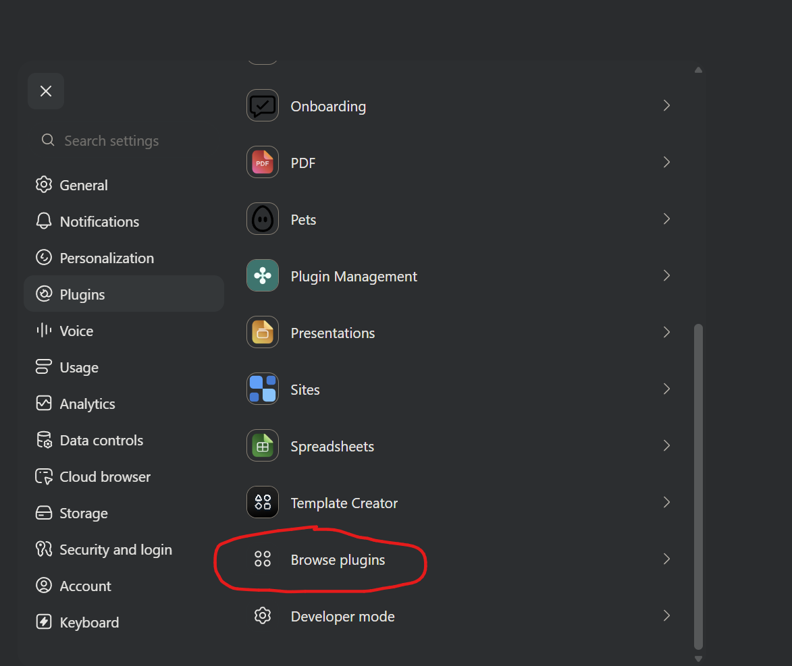
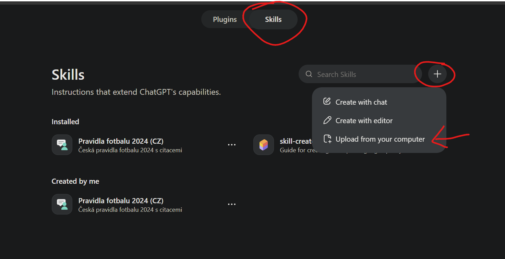
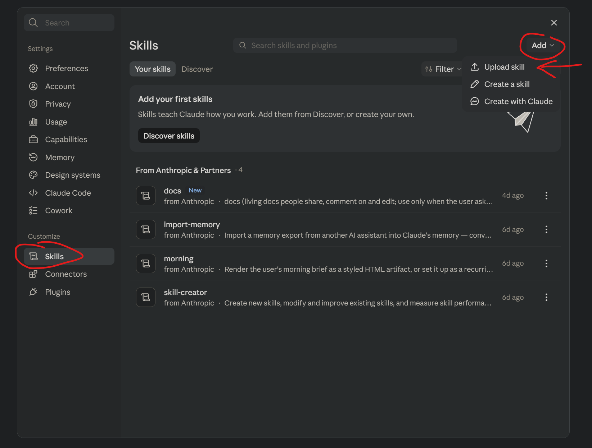

# Pravidla fotbalu v češtině

Tento skill umožňuje ptát se AI asistenta, například ChatGPT nebo Claude, na pravidla fotbalu. Asistent vyhledá odpověď v přiložených pravidlech, prověří související ustanovení a výjimky a uvede, kde ji najdeš: konkrétní pravidlo, oddíl a stránku.

Vychází z českých pravidel FAČR platných od **1. 7. 2024**; změny z let 2025 a 2026 nejsou zapracovány.

## Instalace skillu

Pro ChatGPT i Claude se používá stejný ZIP se skillem, pravidly a obrázky. Není potřeba plugin, marketplace, konektor ani MCP server.

Stáhni **skill ZIP** z [nejnovějšího vydání](https://github.com/KaliCZ/football-rules-cz/releases/latest): soubor pojmenovaný `football-rules-cz-skill-` s číslem verze a příponou `.zip`. Nevybírej automatické archivy **Source code** a ZIP před nahráním nerozbaluj.

### ChatGPT — ověřeno i na Androidu

Na počítači se přihlas ke stejnému účtu, který používáš v telefonu:

1. Otevři **Settings → Plugins → Browse plugins**.
2. Přepni na záložku **Skills**.
3. Klikni na **+ → Upload from your computer** a vyber stažený skill ZIP.
4. Ověř, že je **Pravidla fotbalu 2024 (CZ)** mezi nainstalovanými skilly, a začni nový chat s tímto skillem.
5. V Android aplikaci používej stejný účet. Dostupnost skillu po tomto nahrání byla potvrzena autorem projektu dne 20. 9. 2026; nejde o test všech účtů a verzí aplikace.





Pro první otázku zkus:

> Použij skill Pravidla fotbalu 2024 (CZ). Může být hráč v ofsajdu přímo z vhazování? Uveď pravidlo a stránku.

Odpověď má začínat upozorněním, že vychází z vydání FAČR 2024. V tomto projektu je ověřena instalace a dostupnost na Androidu; úplné načtení pravidel a správnost všech odpovědí nejsou tímto potvrzeny.

### Claude

1. Otevři **Settings → Skills** (v části **Customize**).
2. Klikni na **Add → Upload skill** a vyber stejný stažený skill ZIP.
3. Skill zapni a začni nový chat, ve kterém jej požádáš o odpověď podle pravidel FAČR 2024.



Postup odpovídá přiloženému screenshotu. Dostupnost nahraného skillu v Claude na Androidu zatím čeká na potvrzení.

### Aktualizace a soubory v odpovědi

Novou verzi stáhni z GitHub Releases a nahraj ji přes správu skillů. Ruční import ZIPu není automatická synchronizace s repozitářem; po změně začni nový chat.

Skill má přednostně zpřístupnit původní PDF nebo potřebný diagram přímo jako přílohu v chatu, pokud to daná aplikace umožňuje. Samotné uložení souboru ve skillu nezaručuje, že na něj uživatel může kliknout. Pokud příloha není možná, může odpověď obsahovat označený externí odkaz.

Citace „PDF, strana 162“ musí odkazovat na PDF a označuje pořadí stránky v PDF. Odkaz na Markdown má být označen jako textový přepis. Prohlížeč v aplikaci nemusí podporovat automatické otevření konkrétní stránky.

## Obsah

- [Pravidla v Markdownu](skills/football-rules-cz/references/rules.md)
- [Původní PDF](skills/football-rules-cz/references/sources/pravidla-fotbalu-facr-2024.pdf)
- [Samostatné obrázky](skills/football-rules-cz/references/assets/)


Soubor `rules.md` obsahuje všech 17 pravidel, rozhodnutí FAČR, výklady, slovníčky a praktické pokyny pro rozhodčí. Zachovává odkazy na jednotlivé stránky původního PDF. Tištěné číslování je oproti pořadí stránky v PDF posunuté o 2.

Obrazové části jsou uložené jako samostatné PNG soubory a vložené pomocí relativních Markdown odkazů. Více diagramů ze stejné stránky může být zachováno společně, aby neztratily vzájemné souvislosti a popisky. Souhrnná tabulka k pokutovým kopům je převedena do Markdown tabulky, s odkazem na její původní podobu.

Pro práci s textem stačí `rules.md`. Při otázkách závislých na konkrétním diagramu je potřeba otevřít také odkazovaný obrázek; text uvnitř rastrových obrázků není přepsán do Markdownu.

## Původ a převod

- Dokument: **Pravidla fotbalu platná od 1. 7. 2024**.
- Zpracovala Pravidlová komise FAČR; vydalo Nakladatelství Olympia, s.r.o.
- ISBN: **978-80-7376-695-5**.
- PDF: **171 stránek**, včetně obálky a závěrečných stran.
- Staženo 20. 9. 2026 z [OFS Jičín](https://ofs-jicin.cz/wp-content/uploads/2024/08/pravidla-fotbalu-facr-2024.pdf).
- [Dokument na webu FAČR](https://www.fotbal.cz/facr/document/download/136707).
- SHA-256 PDF: `deca4c192c10ba0a5b70882eb6fbb26cdf2b011d3b5fc81aa5de95acb3ae7306`.

Převod byl proveden pomocí pdfplumber 0.11.9 z textové vrstvy PDF. Byla odstraněna opakovaná záhlaví a zápatí, spojena slova rozdělená na konci řádků, obnoveny mezery a struktura nadpisů a opraveno chybné kódování tiráže. Obrázky zachovávají původní grafický obsah; nejde o nově vytvořené ilustrace.

Jde o pracovní převod, nikoli nové oficiální vydání. Pro kontrolu znění slouží přiložené PDF. Autorská práva k převzatému textu a ilustracím zůstávají původním nositelům práv; tento repozitář jim nepřiděluje novou licenci.

## Údržba a vydání

Jediná sada pravidel, PDF a diagramů je v `skills/football-rules-cz/references/`. Instrukce jsou v `skills/football-rules-cz/SKILL.md`. Distribuční ZIP obsahuje tuto složku skillu včetně referencí, nikoli soubory dokumentace repozitáře.

S Pythonem 3.10 nebo novějším spusť z kořene repozitáře:

```sh
python scripts/build_skill.py --check
python scripts/build_skill.py
```

První příkaz kontroluje odkazy a strukturu, druhý navíc sestaví reprodukovatelný ZIP a kontrolní součet do `dist/`. Číslo vydání se odvozuje z Git tagu ve tvaru `v0.2.1` na aktuálním commitu. V čistém checkoutu tohoto tagu vznikne verzovaný ZIP; bez tagu nebo s necommitnutými změnami vznikne vývojový ZIP označený `dev-` a identifikátorem commitu (případně `-dirty`). Pro sestavení je potřeba Git checkout s dostupnými tagy; `--check` Git ani tag nevyžaduje. Generované soubory jsou ignorované Gitem a přikládají se k vydání na GitHub Releases; necommitují se. Před vydáním proveď [kontroly a scénáře](docs/publishing-and-testing.md).
