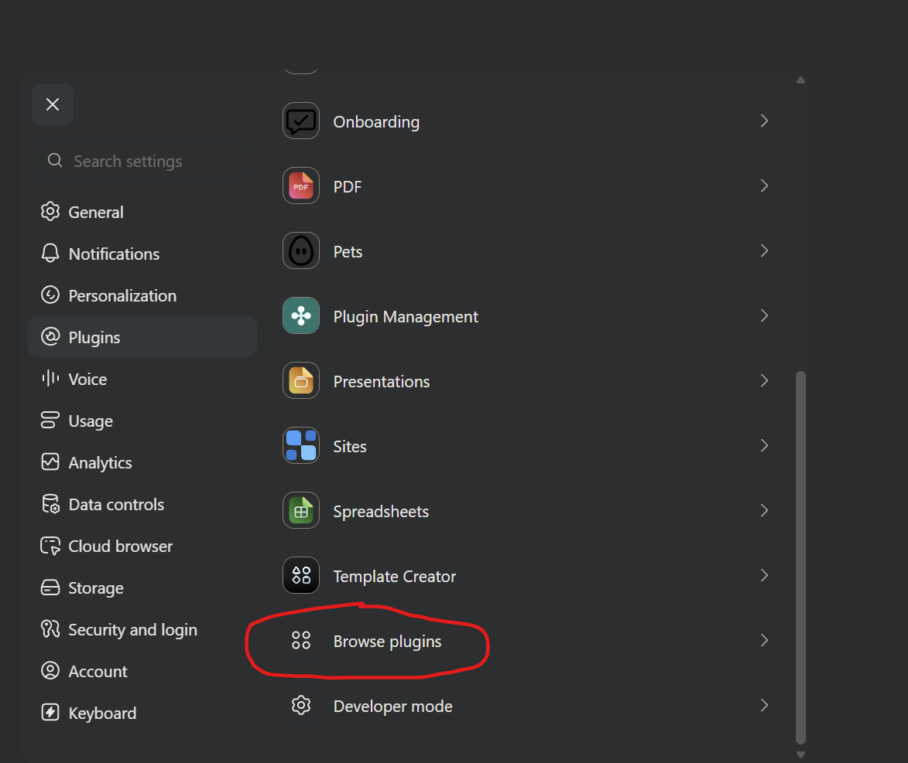
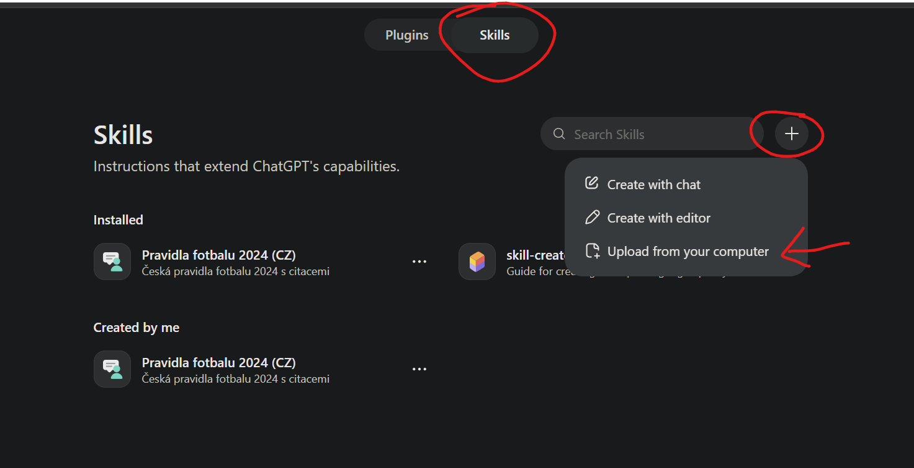
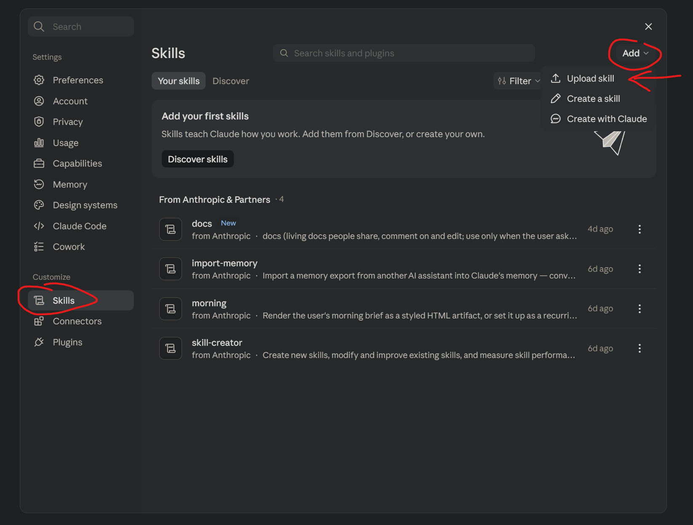

# Pravidla fotbalu a Soutěžní řád v češtině

Tento skill umožňuje ptát se ChatGPT nebo Claude na pravidla fotbalu a organizaci soutěží. Obsahuje **Pravidla fotbalu FAČR 2024** a **Soutěžní řád FAČR (vydání označené účinností od 26. 6. 2026)**; odpovědi uvádějí konkrétní ustanovení a stránku zdroje.

Pravidla fotbalu nezahrnují změny z let 2025 a 2026; pozdější změny Soutěžního řádu nejsou ověřené.

## Instalace skillu

Pro ChatGPT i Claude se používá stejný ZIP se skillem, oběma dokumenty a obrázky.

Stáhni **skill ZIP** z [nejnovějšího vydání](https://github.com/KaliCZ/football-rules-cz/releases/latest): soubor pojmenovaný `football-rules-cz-skill-` s číslem verze a příponou `.zip`. Nevybírej automatické archivy **Source code** a ZIP před nahráním nerozbaluj.

### ChatGPT — web, desktopová aplikace a Android

**Instalaci proveď přes web.** Po nahrání skill funguje také v desktopové aplikaci ChatGPT a na Androidu, pokud používáš stejný účet; autor projektu obě aplikace ověřil.

1. V prohlížeči otevři [ChatGPT — Plugins](https://chatgpt.com/plugins) a přihlas se. Na tuto stránku se dostaneš také přes **Settings → Plugins → Browse plugins**.
2. Přepni na záložku **Skills**.
3. Klikni na **+ → Upload from your computer** a vyber stažený skill ZIP.
4. Ověř, že je **Pravidla fotbalu a Soutěžní řád (CZ)** mezi nainstalovanými skilly, a začni nový chat s tímto skillem.
5. V desktopové nebo Android aplikaci se přihlas ke stejnému účtu a začni nový chat se skillem. Další instalace v aplikaci není potřeba.





Pro první otázku zkus:

> Použij skill Pravidla fotbalu a Soutěžní řád (CZ). Může být hráč v ofsajdu přímo z vhazování? Uveď pravidlo a stránku.

Odpověď má začínat upozorněním, že vychází z vydání FAČR 2024.

### Claude — web a desktopová aplikace

**Instalaci proveď přes web.** Po nahrání skill funguje také v desktopové aplikaci Claude pod stejným účtem; autor projektu tuto funkčnost ověřil.

1. V prohlížeči otevři [Claude — Skills](https://claude.ai/customize/skills) a přihlas se. Na tuto stránku se dostaneš také přes **Settings → Skills** (v části **Customize**).
2. Klikni na **Add → Upload skill** a vyber stejný stažený skill ZIP.
3. Skill zapni a začni nový chat, ve kterém jej požádáš o odpověď podle pravidel FAČR 2024.
4. V desktopové aplikaci se přihlas ke stejnému účtu a začni nový chat se skillem. Další instalace v aplikaci není potřeba.



### Claude — mobilní aplikace: nefunguje

**V aplikaci Claude na Androidu tento skill nefunguje.** Autor ověřil, že mobilní aplikace nahraný skill nepoužívá ani po instalaci ve webové verzi Claude.

Pro použití na telefonu použij aplikaci ChatGPT, kde je funkčnost potvrzená. Na iOS zatím tento skill nebyl otestován.

### Aktualizace

Novou verzi stáhni z GitHub Releases a nahraj ji přes správu skillů. Ruční import ZIPu není automatická synchronizace s repozitářem; po změně začni nový chat.

## Obsah

- Pravidla fotbalu FAČR 2024: [text](skills/football-rules-cz/references/rules.md) · [PDF](skills/football-rules-cz/references/sources/pravidla-fotbalu-facr-2024.pdf)
- Soutěžní řád FAČR 2026: [text](skills/football-rules-cz/references/competition-regulations-text.md) · [PDF](skills/football-rules-cz/references/sources/soutezni-rad-facr-2026-06-26.pdf)
- [Samostatné obrázky](skills/football-rules-cz/references/assets/)

Jde o neoficiální pomůcku; pro kontrolu znění slouží původní PDF. Autorská práva k textům a ilustracím zůstávají původním nositelům práv.

## Údržba a vydání

S Pythonem 3.10 nebo novějším spusť z kořene repozitáře:

```sh
python -m unittest discover -s tests -v
python scripts/build_skill.py --check
python scripts/build_skill.py --version 0.3.0
```

Sestavení vytvoří ZIP a kontrolní součet do `dist/`; tyto soubory se necommitují. Postup vydání, testovací scénáře a údržbu převodu najdeš v [průvodci pro správce](docs/publishing-and-testing.md).
