# Pravidla fotbalu FAČR 2024

> Vydání platné od 1. 7. 2024. Tento převod nezahrnuje změny z let 2025 a 2026.

Zdroj: [původní PDF](sources/pravidla-fotbalu-facr-2024.pdf). Čísla stran níže odkazují na tištěné číslování i pořadí stránky v PDF. Obrázky jsou samostatné soubory; jejich obsah není přepsán do textu.

## Obsah převodu

- [ÚVOD](#pdf-007)
- [POJMY V PRAVIDLECH FIFA](#pdf-010)
- [Pravidlo 1 – HRACÍ PLOCHA](#pdf-020)
- [Pravidlo 2 – MÍČ](#pdf-030)
- [Pravidlo 3 – HRÁČI](#pdf-032)
- [Pravidlo 4 – VÝSTROJ HRÁČŮ](#pdf-044)
- [Pravidlo 5 – ROZHODČÍ](#pdf-051)
- [Pravidlo 6 – OSTATNÍ ROZHODČÍ](#pdf-067)
- [Pravidlo 7 – DOBA HRY](#pdf-078)
- [Pravidlo 8 – ZAHÁJENÍ A NAVAZOVÁNÍ HRY](#pdf-082)
- [Pravidlo 9 – MÍČ VE HŘE A MÍČ ZE HRY](#pdf-086)
- [Pravidlo 10 – URČENÍ VÝSLEDKU UTKÁNÍ](#pdf-088)
- [Pravidlo 11 – OFSAJD](#pdf-094)
- [Pravidlo 12 – PŘESTUPKY A PROVINĚNÍ](#pdf-108)
- [Pravidlo 13 – VOLNÉ KOPY](#pdf-131)
- [Pravidlo 14 – POKUTOVÝ KOP](#pdf-135)
- [Pravidlo 15 – VHAZOVÁNÍ](#pdf-141)
- [Pravidlo 16 – KOP OD BRANKY](#pdf-144)
- [Pravidlo 17 – KOP Z ROHU](#pdf-146)
- [PRAKTICKÉ POKYNY PRO ROZHODČÍ](#pdf-148)

[PDF 1](sources/pravidla-fotbalu-facr-2024.pdf#page=1)

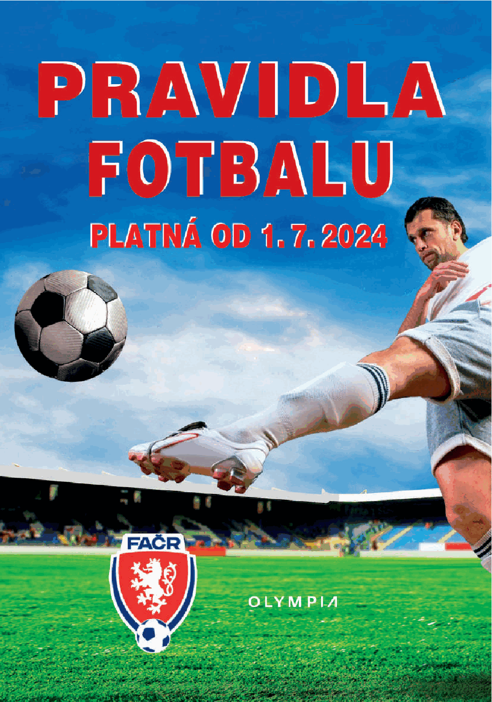

[PDF 2](sources/pravidla-fotbalu-facr-2024.pdf#page=2)

[PDF 3](sources/pravidla-fotbalu-facr-2024.pdf#page=3)

### FOTBALOVÁ ASOCIACE ČESKÉ REPUBLIKY

## PRAVIDLA FOTBALU

## PLATNÁ OD 1. 7. 2024

### Zpracovala Pravidlová komise FAČR Kureš Jiří Hora Jan Skočovský Milan Zahradníček Jan

OLYMPIA PRAHA

[Tištěná strana 2 · PDF 4](sources/pravidla-fotbalu-facr-2024.pdf#page=4)

[Tištěná strana 3 · PDF 5](sources/pravidla-fotbalu-facr-2024.pdf#page=5)

## OBSAH

- Úvod 5

- Pojmy v Pravidlech fotbalu FIFA 8

- Pojmy v Pravidlech fotbalu FAČR 14

- Zkratky použité v Pravidlech fotbalu FAČR 17

- Modifikace pravidel fotbalu 17

- Pravidlo 1 Hrací plocha 18

- Pravidlo 2 Míč 28

- Pravidlo 3 Hráči 30

- Pravidlo 4 Výstroj hráčů 42

- Pravidlo 5 Rozhodčí 49

- Pravidlo 6 Ostatní rozhodčí 65

- Oddíloví rozhodčí 72

- Pravidlo 7 Doba hry 76

- Pravidlo 8 Zahájení a navazování hry 80

- Pravidlo 9 Míč ve hře a míč ze hry 84

- Pravidlo 10 Určení výsledku utkání 86

- Pravidlo 11 Ofsajd 92

- Diagramy k ofsajdovým situacím 99

- Pravidlo 12 Přestupky a provinění 106

- Pravidlo 13 Volné kopy 129

- Pravidlo 14 Pokutový kop 133

- Pravidlo 15 Vhazování 139

- Pravidlo 16 Kop od branky 142

- Pravidlo 17 Kop z rohu 144

- Praktické pokyny pro rozhodčí 146

[Tištěná strana 4 · PDF 6](sources/pravidla-fotbalu-facr-2024.pdf#page=6)

[Tištěná strana 5 · PDF 7](sources/pravidla-fotbalu-facr-2024.pdf#page=7)

## ÚVOD

Jistě se mnou budete souhlasit, že fotbal je nejkrásnější kolektivní hrou a současně i nejmasovějším sportem naší planety. Díky jeho přitažlivosti pro hráče i diváky se hraje prakticky na celém světě a snad žádný z jiných sportů nedoznal takové popularity a rozmachu, jako právě on. Je jedním ze sportů, jímž se poměřuje sportovní vyspělost jednotlivých zemí, jedním ze sportů, který smazává hranice mezi státy i rozdíly mezi lidskými rasami. Fotbal je však nejen krásná hra dovolující hráčům předvádět jemné technické kousky, ale i mužná bitva, která v osobních soubojích přináší nasazení, tvrdost a sílu. Je proto důležité, aby všichni hráči pravidla fotbalu dobře ovládali, protože jen tak mohou plně využít všech možností k předvedení svého fotbalového umu, tvůrčí invence i fyzických dispozic, aniž by přitom ohrozili zdraví a bezpečnost jiných hráčů. Dobrá znalost pravidel fotbalu je neméně důležitá i pro trenéry a funkcionáře, neboť ti jsou povinni vést hráče ke slušné hře a k tomu, aby i ve vypjatých situacích, které fotbal zákonitě přináší, nezapomínali na vlastní poslání sportu, totiž na úctu k soupeři a naplnění významu slov fair-play. Neopominutelnými účastníky hry jsou i diváci, bez nichž by fotbal nebyl fotbalem. Proto je nezbytné, aby i oni v potřebné míře pravidla znali a pochopili, neboť jen tak budou moci z fotbalových stadiónů odcházet s pocitem uspokojení nad předvedenou hrou. Neznalost pravidel nebo nepochopení jejich správného výkladu může být příčinou nesportovních projevů vůči hráčům, rozhodčím a fanouškům soupeřova týmu, což v důsledcích často vede k dalším negativním jevům, které s sebou současná doba nese. Z uvedených důvodů je proto přiměřená znalost pravidel fotbalu důležitá i pro pracovníky sdělovacích prostředků, protože právě oni v dnešním světě rozvinutých informačních technologií nejvíce ovlivňují a formují sportovní myšlení a postoje diváků. Nejlepšími znalci pravidel fotbalu však musí být rozhodčí, od kterých se za všech okolností očekává naprostá objektivita, řízení hry v duchu pravidel, ponechání její maximální plynulosti a spádu, dále důraz na zachování sportovního charakteru a krásy této hry, včetně potlačení přehnané tvrdosti. K tomu musí být rozhodčí nejen připraven teoreticky, ale dostatečně vybaven i fyzicky, vždy musí být maximálně koncentrovaný a psychicky odolný. Přitom postavení rozhodčího v současném fotbale je stále náročnější a jeho odpovědnost značná, neboť jediným chybným verdiktem může zmařit výsledek snažení družstev i celých týmů odborníků, kteří o dnešní špičkové výběry pečují (nebo jediným špatným rozhodnutím může odradit sponzory, z jejichž příspěvků profituje zejména fotbalová mládež). Hovořím-li však na tomto místě a v těchto souvislostech o rozhodčích, považuji za potřebné zdůraznit, že jejich úloha je

[Tištěná strana 6 · PDF 8](sources/pravidla-fotbalu-facr-2024.pdf#page=8)

v moderním fotbale nezastupitelná, a proto je povinností nás všech, kteří o rozvoj fotbalu pečujeme, všestranně podporovat i další profesní rozvoj rozhodčích. Krása a půvab fotbalu spočívají mimo jiné i v tom, že tato pravidla jsou shodná všude na celém světě, ať již jde o finálové utkání mistrovství světa či utkání soupeřů nejnižší soutěže okresů. Je však samozřejmé, že s neustálým vývojem hry, se zdokonalováním herních stylů a hledáním nových taktických variant nastane čas od času situace, kdy je nutno úpravami pravidel nebo jejich odlišným výkladem na vývoj hry reagovat. A to je jeden z hlavních důvodů, proč Fotbalová asociace České republiky pravidelně vždy po dvou letech Pravidla fotbalu vydává. Fotbalová pravidla jsou do značné míry proslulá svou konzervativností a zdánlivou neměnností. Je to dáno jak tradicí, tak i pevně zavedenými zvyklostmi uplatňovanými při jejich změnách. Výroční Valná hromada IFAB ale v roce 2016 schválila komplexní revizi pravidel fotbalu provedenou technickým podvýborem IFAB. Byla to nejrozsáhlejší revize Pravidel fotbalu ve 130ti-leté historii IFAB. Hlavním důvodem pro provedené revize pravidel fotbalu bylo, aby PF byla srozumitelnější a přístupnější pro každého ve fotbale a aby se zvýšila jednotnost výkladu, interpretace a aplikace PF a výklad pravidel tím více reagoval i na vývoj samotné hry a více tak přizpůsobil literu zákona živé skutečnosti. FIFA usuzuje, že provedené revize PF také zlepší činnost rozhodčích a posílí fotbal na všech úrovních po celém světě. FIFA vydává Pravidla fotbalu ve čtyřech oficiálních jazycích, angličtině, němčině, francouzštině a španělštině. Při překladech dbá nejen na přesné převedení odborných termínů, ale snaží se v těchto jazycích vyjádřit i všechny významové odstíny. Proto i my jsme se při překladu do češtiny snažili postupovat podobně, a překlad jsme přizpůsobili zavedené a tradiční fotbalové terminologii. Toto vydání Pravidel fotbalu obsahuje 17 kapitol s jednotlivými pravidly a praktické pokyny pro rozhodčí. Základem každé kapitoly je text vlastního pravidla, u většiny následuje rozhodnutí FAČR a každá kapitola má ještě samotný výklad k pravidlu. Texty jsou přeloženy tak, aby co nejpřesněji vystihovaly úmysl zákonodárce; připomínáme, že tím je výlučně IFAB, a žádná z členských zemí FIFA nemá právo, kromě pevně určených výjimek, texty pravidel měnit nebo upravovat. Rozhodnutími FAČR se stanovují či upravují další podmínky pro utkání hraná v rámci FAČR, a sice pro ty případy, které vlastní pravidlo neřeší nebo řeší pouze rámcově. Doporučujeme, abyste věnovali pozornost i těmto Rozhodnutím FAČR, protože pro utkání hraná v ČR mají rovněž platnost zákonné normy. Výklad k pravidlu má pomoci praktické aplikaci pravidel na hrací ploše; vychází vždy ze znění pravidla a v žádném případě s ním nesmí být v rozporu. Je zaměřen na typické herní situace a podrobněji popisuje řešení problémů, s nimiž se při hře můžete nejčastěji setkat. Málokdo z běžných fotbalových příznivců si uvědomuje jednu velice závažnou skutečnost. Pravidla fotbalu, podobně jako pravidla některých dalších kolektivních sportů, jsou postavena na dvou principech. Pro některé herní

[Tištěná strana 7 · PDF 9](sources/pravidla-fotbalu-facr-2024.pdf#page=9)

situace je rozhodčímu již předem dán pravidly přesný postup, a rozhodčí v dané situaci nesmí jednat jinak. Jestliže například míč přejde pomezní čáru, musí rozhodčí nařídit vhazování ve prospěch některého družstva, a jinou alternativu k tomuto postupu nemá. Pro řadu dalších případů však pravidla opravňují rozhodčího k tomu, aby tyto situace řešil podle svého vlastního – subjektivního – uvážení, a pro tyto případy je v pravidlech použita formulace „podle názoru rozhodčího“. Z toho vyplývají dvě podstatné skutečnosti: rozhodčí má plné právo řešit tyto situace tak, jak je viděl on sám, a hráči mají povinnost jeho rozhodnutí respektovat. Typickým příkladem je pravidlo 11 o ofsajdu: útočník může být v okamžiku, kdy jeho spoluhráč vystřelí na branku, sám v prostoru mezi brankářem a posledním obráncem soupeřova družstva, ale v ofsajdu bude jedině v případě, jestliže v okamžiku střely na branku

– podle názoru rozhodčího – aktivně ovlivňoval hru. K posouzení této situace je tedy přímo pravidlem dáno rozhodčímu právo uplatnit k situaci svůj subjektivní názor, který se nedá vždy, pro všechny případy, sjednotit. Pravidla fotbalu jsou základní normou, kterou se řídí všechny soutěže v celém fotbalovém světě, a tedy i v České republice. Dovoluji si proto touto cestou vyjádřit jménem Pravidlové komise FAČR naději, že tato publikace se stane účinnou pomůckou rozhodčích, hráčů, trenérů i funkcionářů, stejně jako sportovní veřejnosti při prohlubování vědomostí o správné aplikaci pravidel fotbalu na hracích plochách. Závěrem dovolte už jen připomenutí: Pravidla fotbalu nejsou jedinou normou, podle které se fotbal hraje. Abyste byli opravdu dobrými znalci této hry, nezapomeňte, že existují také další fotbalové normy, řády a předpisy, které jsou také pravidelně aktualizovány.

Ing. Jiří KUREŠ předseda Pravidlové komise FAČR

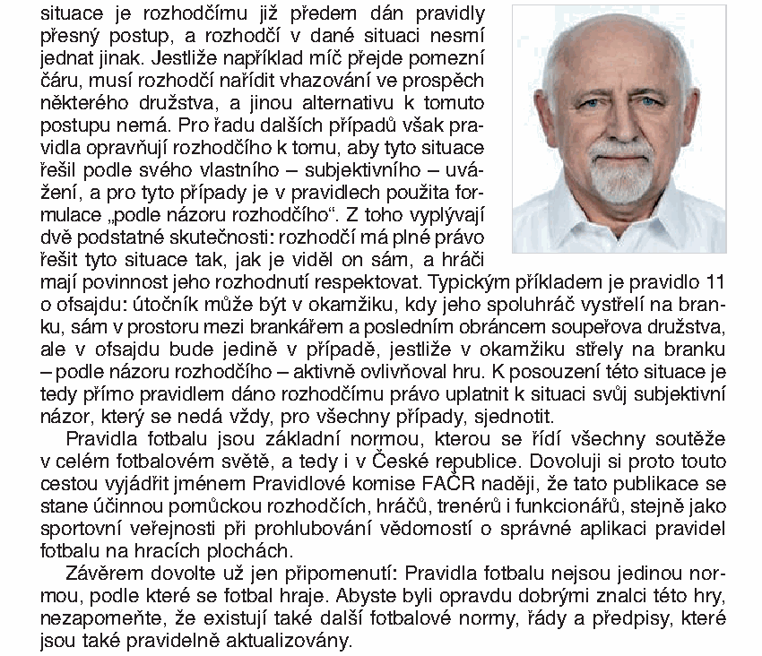

[Tištěná strana 8 · PDF 10](sources/pravidla-fotbalu-facr-2024.pdf#page=10)

## POJMY V PRAVIDLECH FIFA

Glosář obsahuje slova nebo fráze, které vyžadují objasnění nebo vysvětlení některých pojmů uváděných v Pravidlech fotbalu a které nejsou vždy snadno přeložitelné do jiných jazyků.

### FOTBALOVÉ ORGÁNY

IFAB – (The International Football Association Board) Mezinárodní výbor pro Pravidla je orgán celosvětově zodpovědný za Pravidla fotbalu, je tvořen čtyřmi zástupci Britských fotbalových asociací (Anglie, Skotska, Severního Irska a Walesu) a FIFA. V principu mohou být jakékoliv změny Pravidel schváleny pouze na výroční valné hromadě, která se obvykle koná v únoru nebo březnu.

FIFA – (Fédération Internationale de Football Association) Mezinárodní federace fotbalových asociací je řídící orgán odpovědný za fotbal po celém světě

Konfederace – Subjekty odpovědné za fotbal na kontinentech: AFC (Asia), CAF (Afrika), CONCACAF (Severní, Střední Amerika a Karibik), CONMEBOL (Jižní Amerika), OFC (Oceánie) a UEFA (Evropa)

Národní fotbalové asociace – Subjekty odpovědné za fotbal v jednotlivých členských zemích

### FOTBALOVÉ POJMY

#### Abandon = předčasné ukončení utkání

Skončení utkání před uplynutím řádné doby hry

#### Advantage = výhoda (ve hře)

Rozhodčí umožní pokračování hry, pokud došlo k přestupku a družstvo, které se neprovinilo, tím získá prospěch

#### Additional time = nastavení doby hry

Čas nastavený na konci poločasu z důvodů střídání, ošetřování, udělování osobních trestů, oslav při dosažení branky apod.

#### Assessment of injured player = ošetřování zraněného hráče

Rychlé vyšetření zraněného hráče, obvykle zdravotníkem (lékařem nebo masérem), aby zjistil, zda hráč vyžaduje ošetření

#### Away goals rule = pravidlo o počtu branek dosažených na hřišti soupeře

Způsob určení vítěze utkání v případě, kdy se hraje systémem doma/venku a obě družstva vstřelila stejný počet branek; branky vstřelené na hřišti soupeře se počítají dvakrát

#### Brutality = brutalita

Přestupek, který je nebezpečný, prudký nebo úmyslně násilný

[Tištěná strana 9 · PDF 11](sources/pravidla-fotbalu-facr-2024.pdf#page=11)

#### Caution = napomenutí

Oficiální sankce (osobní trest), o kterém je informována příslušná disciplinární komise; uděluje se prostřednictvím žluté karty; po dvou napomenutích v témže utkání je hráč vyloučen (sent-off)

#### Challenge = souboj

Akce, kdy hráč svádí se soupeřem souboj o míč

#### „Cooling“ break = přestávka na ochlazení

V zájmu bezpečnosti může být hráčům poskytnuta přestávka na ochlazení (90 sekund až 3 minuty)

#### Charge (an opponent) = vražení (do soupeře)

Jeden z přestupků uvedených v části 1 Pravidla 12

#### Deceive = klamání (rozhodčího)

Takové chování hráče, jehož cílem je oklamat rozhodčího, aby učinil takové herní nebo disciplinární rozhodnutí, ze kterého bude mít klamající hráč nebo jeho družstvo prospěch

#### Deliberate = vědomě/úmyslně

Akce, kterou hráč provedl úmyslně/vědomě; nejedná se o „reflex“ nebo o nezamýšlenou reakci

#### Direct free kick = přímý volný kop

Volný kop, po jehož provedení může být dosaženo branky (pokud byl míč kopnut do soupeřovy branky)

#### Discretion = diskrétnost, diskrétní signál

Rozhodnutí nebo signál určený pouze jinému rozhodčímu

#### Dissent = projevy nesouhlasu

Veřejný projev nesouhlasu (slovy, gesty, pohybem) s rozhodnutími rozhodčích; trestá se napomenutím (žlutá karta)

#### Distract = rozptylovat (rušit)

Rušit, mást nebo rozptylovat pozornost (obvykle neférově)

#### „Drinks“ break = přestávka na pití

V zájmu bezpečnosti a zdraví může být hráčům poskytnuta přestávka na pití (ne delší než 1 minuta)

#### Dropped ball = míč rozhodčího

„Neutrální“ způsob navázání hry. Rozhodčí upustí míč na zem jednomu hráči družstva, které se naposledy dotklo míče (s výjimkou pokutového území, kde je míč puštěn na zem brankáři) – míč je ve hře, když se dotkne země.

#### Electronic player tracking system (EPTS) = elektronický systém

#### sledování výkonu

Systém, který zaznamenává a analyzuje (vyhodnocuje) údaje o fyzickém a psychologickém výkonu hráče

[Tištěná strana 10 · PDF 12](sources/pravidla-fotbalu-facr-2024.pdf#page=12)

#### Endanger the safety of an opponent = ohrožení bezpečnosti

#### protihráče (soupeře)

Vystavit soupeře hrozbě nebo riziku (zranění)

#### Excessive force = nepřiměřená síla

Použití více síly nebo energie, než je potřebné

#### Extra time = prodloužení doby hry (k určení vítěze utkání)

Metoda stanovení výsledku utkání, která zahrnuje dva dodatečné poločasy utkání

#### Feinting = oklamání (trik)

Pokus o oklamání protihráče. Pravidla zmiňují dovolené a nedovolené triky (finty)

#### Field of play (pitch) = hrací plocha

Hrací plocha ohraničená pomezními čárami, brankovými čárami a brankovými sítěmi

#### Goal line technologie (GLT) = technologie sledování brankových čar (TBČ)

Elektronický systém, který bezprostředně informuje rozhodčího, že bylo dosaženo branky, tj. že míč přešel celým objemem přes brankovou čáru do prostoru branky

#### Holding offence = držení

K přestupku držení dojde, když hráč fyzickým kontaktem brání soupeři v pohybu

#### Hybrid system = hybridní systém

Kombinace umělých i přírodních materiálů vytvářející hrací plochu

#### Indirect free kick = nepřímý volný kop

Volný kop, ze kterého nemůže být přímo dosaženo branky

#### Impede = překážet (bránit)

Zpomalení nebo zablokování soupeře nebo bránění soupeři v pohybu

#### Intercept = zachycení (míče)

Akce, která má zabránit,aby míč dosáhl zamýšleného cíle

#### Kick = kopnutí

Míč je kopnut, když se ho hráč dotkne nohou

#### Negligible = nepatrný

Bezvýznamný, zanedbatelný, minimální

#### Offence = přestupek (provinění)

Akce je v rozporu s Pravidly fotbalu; týká se zejména akcí spáchaných vůči soupeři

#### Offensive, insulting or abusive language/action(s) = pohoršující, urážlivé,

#### ponižující výroky nebo posunky a gesta

Slovní výrazy nebo posunky, gesta nebo chování, které jsou hanlivé, urážející, neslušné, či neuctivé; trestají se vyloučením ze hry

[Tištěná strana 11 · PDF 13](sources/pravidla-fotbalu-facr-2024.pdf#page=13)

#### On Field Review (OFR)

Přezkoumání záznamu rozhodčím v prostoru hřiště

#### Outside agent = cizí osoba nebo vnější vliv

Každá osoba, která není rozhodčím nebo příslušníkem družstva (hráči, náhradníci, členové realizačního týmu), uvedeným v ZoU (s výjimkou hlavního pořadatele), nebo zvíře nebo předmět

#### Penalise = potrestat

Trestat, obvykle přerušením hry a nařízením volného kopu nebo pokutového kopu ve prospěch soupeřova družstva

#### Penalty shoot – out = penaltový rozstřel

Dříve „Kopy z pokutové značky“. Jedna z metod pro určení vítěze utkání; obě družstva provádějí střídavě kopy na branku až do okamžiku, kdy obě družstva provedla stejný počet kopů a jedno z nich vstřelilo o jednu branku více (vyjma případů, kdy v průběhu prvních pěti kopů každého družstva nemůže jedno z družstev srovnat skóre, ani kdyby proměnilo všechny své zbývající kopy)

#### Play = zahrát míčem

Akce hráče, který se dotkne míče

#### Playing distance = hratelná vzdálenost

Vzdálenost k míči, která umožňuje hráči dotknout se míče natažením nohy nebo poskočením nebo brankáři skočením s nataženými pažemi. Vzdálenost závisí na fyzické velikosti hráče

#### Quick free kick = rychle rozehraný volný kop

Volný kop, který byl po přerušení hry (se souhlasem rozhodčího) proveden tak, že hráč provádějící tento kop nečekal, až se hráči soupeřova družstva odeberou na předepsanou vzdálenost

#### Reckless = bezohledně

Přestupek, při němž hráč nebere ohled na možné následky tohoto zákroku pro soupeře

#### Referee Review Area (RRA)

Místo v prostoru hřiště, kde rozhodčí provádí přezkoumání opakovaných záběrů

#### Restart = navázání (hry)

Opětovné navázání hry poté, co byla přerušena

#### Restart position = postavení hráče při navazování hry

Je určeno polohou jeho nohou nebo jakékoli části jeho těla, která se dotýká země, s výjimkou případu uvedených v Pravidle 11 – Ofsajd

#### Sanction = sankce

Disciplinární opatření přijaté rozhodčím

[Tištěná strana 12 · PDF 14](sources/pravidla-fotbalu-facr-2024.pdf#page=14)

#### Save = obranný odkop

Akce hráče k zastavení míče, který směřuje do branky nebo velmi blízko brance, za použití kterékoliv části těla, (vyjma rukou, kromě brankáře v jeho pokutovém území)

#### Sending off (dismissal) = vyloučení

Disciplinární opatření, při kterém je příslušník družstva povinen opustit hrací plochu, protože se provinil přestupkem, za který se vylučuje

#### Serious foul play = surová hra

Přestupek, kterým byla ohrožena bezpečnost soupeře, nebo přestupek, při jehož použití hráč použil nepřiměřené síly (brutalita); trestá se vyloučením ze hry

#### Shinguard = chránič holeně

Součást výstroje, která chrání holeně hráče před zraněním. Hráči jsou zodpovědni za nošení chráničů vyrobených z vhodného materiálu a odpovídající velikosti, aby poskytly dostatečnou ochranu, a musí být zakryty stulpnami

#### Signal = signalizace

Fyzická (non-verbální) signalizace ze strany rozhodčího nebo ostatních rozhodčích; obvykle zahrnuje gesto rukou nebo paží nebo praporkem, nebo použití píšťalky (pouze rozhodčí)

#### Simulation = simulování

Akce, která chce vyvolat falešný dojem, že se odehrálo něco, k čemu nedošlo; dopouští se ho hráč, který chce získat neférovou výhodu

#### Shirt = dres

Součást výstroje, která zakrývá horní část těla hráče. Kromě délky rukávů musí být dresy všech hráčů družstva stejné, s výjimkou brankáře, jehož dres ho odlišuje od všech ostatních hráčů a rozhodčích

#### Spirit of the game = duch hry

Takový způsob řízení utkání, který respektuje principy fair-play této hry

#### Suspend = (dočasné) přerušení hry

Přerušení utkání na určitou dobu se záměrem možného následného navázání (pokračování) hry, např. kvůli mlze, silnému dešti, bouřce apod.

#### Tackle = nedovolené zastavení soupeře

Snaha zahrát míč nohou (na zemi nebo ve vzduchu), která vyústí v přestupek hráče

#### Team official = funkcionář družstva (člen realizačního týmu)

Osoby uvedené v ZoU kromě hráčů a náhradníků

#### Team list = zápis o utkání

Oficiální listina, na níž jsou obvykle uvedeni hráči, náhradníci a příslušníci družstva

#### Technical staff = technický pracovník

Nehrající příslušník družstva uvedený v zápise o utkání (vedoucí, trenér, masér, lékař atd.)

[Tištěná strana 13 · PDF 15](sources/pravidla-fotbalu-facr-2024.pdf#page=15)

#### Technical area = technická zóna

Definovaný prostor v blízkosti hrací plochy, ve kterém mají právo (a povinnost) přebývat v průběhu utkání příslušníci družstva

#### Temporary dismissal = dočasné vyloučení

Dočasné vyloučení napomenutého hráče, pokud to řád soutěže stanovuje

#### Undue interference = přílišné (nevhodné) zasahování

Akce některého z „ostatních“ rozhodčích (viz Pravidlo 6), která zasahuje do kompetence rozhodčího

#### Unsporting behaviour = nesportovní chování

Chování, které nerespektuje ostatní účastníky utkání, nebo bezohledný způsob boje o míč; trestá se napomenutím

#### Violent conduct = hrubé nesportovní chování

Zákrok mimo souboj o míč, při němž hráč použije nebo se pokusí použít nepřiměřenou sílu nebo brutalitu proti jakékoli osobě

#### Video Operation Room (VOR)

Pracoviště videoasistenta rozhodčího a jeho asistenta

### ROZHODCOVSKÉ POJMY

#### Match official(s) = rozhodčí

Obecný termín pro osobu nebo osoby odpovědné za řízení utkání jménem fotbalového svazu a/nebo řídícího orgánu soutěže, pod jehož kontrolou se utkání hraje

#### Referee = rozhodčí

„Hlavní“ rozhodčí utkání, který působí na hrací ploše. Ostatní rozhodčí vykonávají svou činnost pod kontrolou a řízením rozhodčího. Pouze rozhodčí je oprávněn činit konečná rozhodnutí

#### Other match officials = ostatní rozhodčí

Řídící orgán soutěže k utkání nominuje (deleguje) ostatní rozhodčí, aby pomáhali (asistovali) rozhodčímu

#### Assistant referee = asistent rozhodčího

Rozhodčí s praporkem, který se pohybuje na jedné polovině hrací plochy za pomezní čárou; pomáhá rozhodčímu zejména s rozhodnutími v ofsajdových situacích a při kopech od branky, kopech z rohu nebo vhazování

#### Fourth referee = čtvrtý rozhodčí

Rozhodčí zodpovědný za pomoc rozhodčímu v situacích jak na hrací ploše, tak mimo hrací plochu, včetně dohlížení nad správným průběhem střídání a nad chováním osob v technické zóně

#### Additional assistant referee = brankový rozhodčí

Rozhodčí působící za brankovou čárou, který pomáhá rozhodčímu zejména s rozhodnutími při situacích uvnitř a v blízkosti pokutového území, a při rozhodnutích o dosažení/nedosažení branky

[Tištěná strana 14 · PDF 16](sources/pravidla-fotbalu-facr-2024.pdf#page=16)

#### Reserve assistant referee = náhradní (rezervní) asistent rozhodčího

Asistent rozhodčího, který v souladu se Soutěžním řádem nebo Rozpisem příslušné soutěže nahradí asistenta rozhodčího nebo jiného rozhodčího, pokud ten není schopen vykonávat svoji funkci

#### Video match officials (VMOs) = videorozhodčí

VAR a AVAR, kteří pomáhají rozhodčímu v souladu s pravidly fotbalu a protokolem VAR

#### Video assistant referee (VAR) = video asistent rozhodčího.

Současný nebo bývalý rozhodčí, který pomáhá rozhodčímu sdělováním informací na základě opakovaných záběrů v případě jeho "jasných a zjevných chyb" nebo "přehlédnutí závažných situací" v jedné z kontrolovatelných situací

#### Assistant video assistant referee (AVAR) = asistent VAR

Současný nebo bývalý rozhodčí (asistent rozhodčího), který pomáhá videoasistentovi rozhodčího (VAR)

### POJMY V PRAVIDLECH FOTBALU FAČR

#### Asistent rozhodčího

Rozhodčí, který je držitelem Licence rozhodčího a který je delegován k utkání ve funkci prvního asistenta rozhodčího (AR1) nebo ve funkci druhého asistenta rozhodčího (AR2). V některých regionech slangově nazývaný jako „vlaječkář“.

#### Brankový rozhodčí

Rozhodčí působící na každé brankové čáře, kde pomáhá rozhodčímu zejména s rozhodnutími při situacích uvnitř a v blízkosti pokutového území a při rozhodnutí o dosažení branky

#### Čekací doba

Pro rozhodčího a družstva činí 20 minut, pokud není Pravidly fotbalu nebo Soutěžním řádem stanoveno jinak

#### Členové družstva

Hráči, náhradníci a hráči vystřídaní, nebo hráči a náhradníci, kteří byli rozhodčím vyloučeni

#### Čtvrtý rozhodčí

Rozhodčí delegovaný k utkání jako čtvrtý rozhodčí (jeho úkoly jsou specifikovány v Pravidle 6)

#### Delegát utkání

Zástupce řídícího orgánu, který byl delegován k utkání, aby kontroloval a podal zprávu o plnění povinností stanovených Pravidly fotbalu, řády a směrnicemi, a zprávu o výkonu rozhodčího a jeho asistentů

[Tištěná strana 15 · PDF 17](sources/pravidla-fotbalu-facr-2024.pdf#page=17)

#### Delegovaný rozhodčí

Rozhodčí s platnou licencí rozhodčího delegovaný k řízení utkání příslušnou komisí rozhodčích

#### Delegovaný asistent rozhodčího

Rozhodčí s platnou licencí rozhodčího delegovaný k utkání příslušnou komisí rozhodčích do funkce asistenta rozhodčího

#### Dodatečné střídání při otřesu mozku

Řídící orgán soutěže může povolit možnost jednoho střídání navíc při otřesu nebo podezření na otřes mozku s tím, že tato možnost bude uvedena v Rozpisu příslušné soutěže.

#### Další střídání

Možnost dodatečného střídání bez uvedení důvodu v případě, kdy družstvo soupeře využilo možnost dodatečného střídání při otřesu mozku

#### Družstvo

Pod pojmem družstvo se rozumí hráči příslušných věkových kategorií, kteří jsou uvedeni v zápise o utkání

#### Herní tre s t

Volný kop nebo pokutový kop

#### Hlediště

Část stadiónu určená pro diváky

#### Hrací plocha

Část hřiště vyznačená v souladu s Pravidly fotbalu

#### Hřiště

Uzavřená a zpravidla oplocená vnitřní část stadiónu, na níž je vyznačena hrací plocha; do prostoru hřiště mají přístup pouze přesně určené osoby

#### Kvalifikovaný rozhodčí

Rozhodčí, který je držitelem platné Licence rozhodčího

#### Lavičky pro příslušníky družstev

Lavičky pro náhradníky, vystřídané hráče a funkcionáře družstev; v dalším textu je používán pouze výraz „lavičky“

#### Oddílový rozhodčí

Rozhodčí bez platné Licence rozhodčího, řídící utkání na základě dohody družstev v případě, že se rozhodčí nedostaví, nebo v případě, že rozhodčí není k řízení utkání delegován

#### Oddílový AR

Člen oddílu nebo oddílem vybraná osoba, která vykonává funkci asistenta rozhodčího v případě, že k utkání nebyl delegován nebo se nedostavil AR

#### Osobní tre s t

Napomenutí nebo vyloučení

[Tištěná strana 16 · PDF 18](sources/pravidla-fotbalu-facr-2024.pdf#page=18)

#### Osoby cizí

Všechny osoby, které nejsou uvedeny v ZoU (např. pořadatelé, členové správy stadiónu, příslušníci Policie ČR a bezpečnostních agentur, pracovníci sdělovacích prostředků, diváci apod.); výjimkou je hlavní pořadatel, který je sice uveden v ZoU, ale je také osoba cizí.

#### Příslušenství hrací plochy

Předměty, které tvoří součást hrací plochy nebo s ní přímo souvisejí a podle Pravidla 1 bez nich nesmí být utkání sehráno; tvoří je branky, brankové sítě, konstrukce upevňující a podepírající brankové sítě, tyče rohových praporků, rohové praporky

#### Příslušníci družstva

Členové družstva a realizační tým družstva (funkcionáři družstva)

#### Realizační tým (funkcionáři družstva)

Osoby uvedené v zápise o utkání, které vykonávají funkci vedoucího družstva, trenéra, asistentů trenéra, lékaře nebo zdravotníka a maséra (povinnosti jednotlivých funkcionářů uvádí Soutěžní řád)

#### Rozhodčí

Rozhodčí, který je držitelem platné licence rozhodčího a který řídí utkání

#### Soutěžní utkání

Utkání mistrovské nebo utkání Poháru FAČR

#### Stadion

Objekt vymezený k provozování sportovní činnosti; člení se na hlediště a hřiště

#### Utkání

Utkání začíná správně provedeným výkopem a končí závěrečným signálem rozhodčího píšťalkou k ukončení hry

#### Úřední začátek utkání

Hodina začátku utkání nařízená řídícím orgánem

#### V n ě j š í v l i v

Osoba cizí, cizí těleso nebo zvíře; za projev vnějšího vlivu se považuje i písknutí na píšťalku v hledišti

#### Vybavení hřiště

Předměty, které pravidla dovolují umístit do prostoru hřiště, např. zábradlí, lavičky pro členy a funkcionáře družstev, tyče středových praporků a středové praporky a apod.

[Tištěná strana 17 · PDF 19](sources/pravidla-fotbalu-facr-2024.pdf#page=19)

### ZKRATKY POUŽITÉ V PRAVIDLECH FOTBALU

- **ČR**: Česká republika

- **PF**: Pravidla fotbalu

- **FIFA**: Fédération Internationale de Football Association

- **UEFA**: Union des Associations Européennes de Football

- **IFAB**: International Football Association Board

- **FAČR**: Fotbalová asociace české republiky

- **R**: Rozhodčí

- **AAR**: Brankový rozhodčí

- **AR1**: První AR

- **AR2**: Druhý AR

- **4R**: Čtvrtý rozhodčí

- **VAR**: Videoasistent rozhodčího

- **VOR**: Pracoviště videoasistenta rozhodčího a jeho asistenta

- **AVAR**: Asistent videoasistent rozhodčího

- **NAR**: Náhradní AR

- **SŘ**: Soutěžní řád

- **ZoU**: Zápis o utkání

### MODIFIKACE PRAVIDEL FOTBALU

Národní fotbalové asociace jsou povinny respektovat ustanovení těchto pravidel fotbalu s tou výjimkou, že v utkáních mládeže do osmnácti roků, veteránů, soutěží pro zdravotně postižené a na nejnižších úrovních amatérského fotbalu lze modifikovat:

- velikost hrací plochy (Pravidlo 1)

- rozměry branky (Pravidlo 1)

- velikost, váhu a materiál míče (Pravidlo 2)

- použití opakovaného střídání hráčů (Pravidlo 3)

- trvání doby hry (Pravidlo 7)

- použití dočasného vyloučení (Pravidlo 12)

Podrobnější pokyny k přípustným modifikacím jsou uvedeny v Pravidlech fotbalu FIFA.

#### Ženský a mužský rod

Ve všech případech, kde se v pravidlech používá mužský rod, ať již se jedná o hráče, rozhodčí, asistenty rozhodčího nebo funkcionáře, platí stejná ustanovení i pro ženy působící v těchto funkcích.

[Tištěná strana 18 · PDF 20](sources/pravidla-fotbalu-facr-2024.pdf#page=20)

## Pravidlo 1 – HRACÍ PLOCHA

### 1. Povrch hrací plochy

Hrací plocha musí být zcela přírodní nebo, je-li pravidly soutěže povoleno, celá z umělého hracího povrchu, kromě případů, kdy pravidla povolují integrovanou kombinaci umělých a přírodních materiálů (hybridní systém).

Barva umělých povrchů musí být zelená.

Pokud je využit umělý povrch v soutěžních utkáních mezi reprezentačními družstvy členských asociací sdružených ve FIFA nebo v mezinárodních soutěžních utkáních klubů, musí povrch odpovídat požadavkům FIFA – podle „Koncepce kvality pro fotbalové trávníky“, pokud není udělena výjimka FIFA.

### 2. Vyznačení hrací plochy

Hrací plocha musí být obdélníková a vyznačena nepřerušenými čárami, které nesmí být nebezpečné; na přírodních hracích plochách může být k vyznačení hrací plochy použit materiál používaný na umělé hrací plochy, pokud to není nebezpečné.

Čáry patří k tomu území, které ohraničují.

Na hrací ploše mohou být vyznačeny pouze ty čáry, které jsou uvedeny v Pravidle 1.

Dvě delší ohraničující čáry se nazývají pomezní čáry, dvě kratší se nazývají brankové čáry.

Hrací plocha je rozdělena na dvě poloviny středovou čárou, která spojuje středy obou pomezních čar.

Uprostřed středové čáry je vyznačena středová značka. Kolem středové značky je vyznačen středový kruh o poloměru 9,15 m (10 yardů).

Mimo hrací plochu mají být ve vzdálenosti 9,15 m (10 yardů) od rohového čtvrtkruhu kolmo k brankové čáře a k pomezní čáře vyznačeny čáry.

Všechny čáry musí být stejně široké a mohou mít šířku nejvýše 12 cm (5 palců). Branková čára musí být stejně široká jako brankové tyče a brankové břevno.

Vzdálenosti se měří od vnějších stran čar, které patří k území, které ohraničují.

Na hracích plochách s umělým povrchem mohou být vyznačeny i jiné čáry, pokud budou jiné barvy a pokud se nebudou plést s čárami vyznačující hrací plochu pro fotbal.

Hráč, který na hrací ploše vyznačuje nepovolené čáry (značky), musí být napomenut za nesportovní chování. Pokud uvedenou skutečnost zaznamená rozhodčí v průběhu hry, musí být hráč napomenut při nejbližším přerušení hry.

[Tištěná strana 19 · PDF 21](sources/pravidla-fotbalu-facr-2024.pdf#page=21)

#### Vyznačení hrací plochy

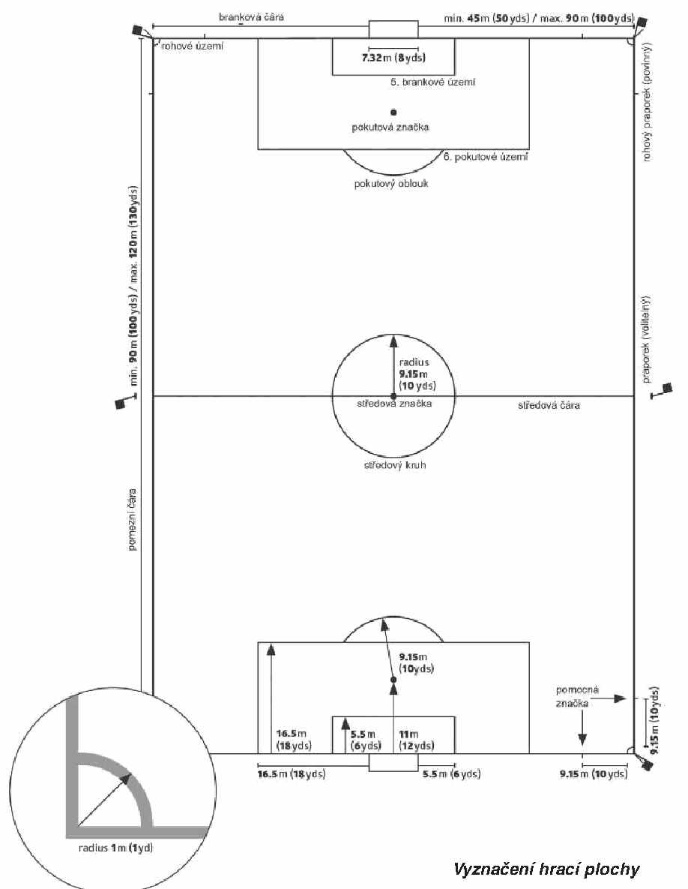

[Tištěná strana 20 · PDF 22](sources/pravidla-fotbalu-facr-2024.pdf#page=22)

### 3. Rozměry

Pomezní čára musí být vždy delší, než čára branková. Délka pomezní čáry: minimum 90 m (100 yardů) maximum 120 m (130 yardů) Délka brankové čáry: minimum 45 m (50 yardů) maximum 90 m (100 yardů)

### 4. Rozměry pro mezinárodní utkání

Délka pomezní čáry: minimum 100 m (110 yardů) maximum 110 m (120 yardů) Délka brankové čáry: minimum 64 m (70 yardů) maximum 75 m (80 yardů)

Řídící orgán soutěže může stanovit délku brankové čáry a délku pomezní čáry v rámci uvedených rozpětí.

### 5. Brankové území

Kolmo ke každé brankové čáře se ve vzdálenosti 5,50 m (6 yardů) od vnitřní strany brankových tyčí vyznačí směrem do hrací plochy čáry 5,50 m (6 yardů) dlouhé a jejich koncové body se spojí čárou rovnoběžnou s brankovou čárou. Prostor, který ohraničují tyto čáry a branková čára, se nazývá brankové území.

### 6. Pokutové území

Kolmo ke každé brankové čáře se ve vzdálenosti 16,50 m (18 yardů) od vnitřní strany brankových tyčí vyznačí směrem do hrací plochy čáry 16,50 m (18 yardů) dlouhé a jejich koncové body se spojí čárou rovnoběžnou s brankovou čárou. Prostor ohraničený těmito čárami a brankovou čárou se nazývá pokutové území.

V každém pokutovém území se na pomyslné kolmici k brankové čáře, vedené ze středu brankové čáry, vyznačí ve vzdálenosti 11 m (12 yardů) od brankové čáry pokutová značka. Vzdálenost se měří od vnějšího okraje brankové čáry do středu pokutové značky.

Od středu každé pokutové značky se mimo pokutové území vyznačí oblouk o poloměru 9,15 m (10 yardů), který se nazývá pokutový oblouk.

### 7. Rohové území

Kolem každého rohového praporku se na hrací ploše vyznačí čtvrtkruh o poloměru 1 m (1 yard).

### 8. Praporky

V každém rohu hrací plochy musí být umístěna nejméně 1,50 m (5 stop) vysoká a nahoře zaoblená tyč, na níž je připevněn praporek.

Stejná tyč s praporkem se může umístit na každé straně hrací plochy proti středové čáře ve vzdálenosti nejméně 1 m vně od pomezní čáry.

[Tištěná strana 21 · PDF 23](sources/pravidla-fotbalu-facr-2024.pdf#page=23)

Povinný rohový praporek musí být vysoký Rohové území 1,5 m (5 ft), nesmí mít ostré zakončení

Rohové území poloměr 1 m (1yd) Čára nesmí být širší než 12 cm (5 ins)

### 9. Technická zóna

Technická zóna se vyznačuje v utkáních odehraných na stadionech, kde jsou vyhrazena místa k sezení pro náhradníky a funkcionáře družstva a vystřídané hráče, jak je uvedeno níže:

- technická zóna se vyznačuje 1 m na obě strany od laviček a 1 m od pomezní čáry

- technická zóna má být vyznačena

- počet osob, které se smí v technické zóně zdržovat v průběhu hry, musí být stanoven řádem příslušné soutěže

- všechny osoby, které se budou v průběhu utkání zdržovat v technické zóně

– musí být v souladu se soutěžním řádem identifikovatelné před začátkem utkání a v jeho celém průběhu

– musí se chovat vždy korektně

– jsou povinny zdržovat se v technické zóně; technickou zónu smějí opustit pouze ve výjimečných případech a se souhlasem rozhodčího (např. jestliže rozhodčí dovolí lékaři nebo masérovi družstva ošetřit na hrací ploše zraněného hráče)

– současně vždy pouze jedna osoba z osob zdržujících se v technické zóně je oprávněna udělovat hráčům v průběhu utkání pokyny

### 10. Branky

Branka musí být umístěna uprostřed každé brankové čáry.

Každou branku tvoří dvě svislé brankové tyče postavené ve stejné vzdálenosti od rohových praporků, které jsou nahoře spojeny vodorovným břevnem. Brankové tyče a břevna musí být vyrobena ze schváleného materiálu a nesmí být pro hráče nebezpečné. Brankové tyče a břevno obou branek musí mít stejný tvar, který musí být čtvercový, obdélníkový, kruhový nebo oválný nebo kombinace těchto možností.

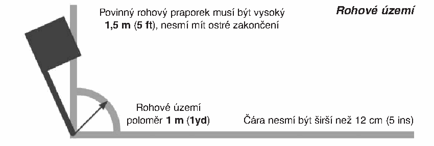

[Tištěná strana 22 · PDF 24](sources/pravidla-fotbalu-facr-2024.pdf#page=24)

Doporučuje se, aby všechny branky použité v oficiálních soutěžích, organizovaných v rámci FIFA nebo konfederací, splňovaly požadavky programu kvality FIFA pro fotbalové branky.

Vzdálenost mezi brankovými tyčemi je 7,32 m (8 yardů), vzdálenost spodního okraje břevna od země je 2,44 m (8 stop).

Postavení brankových tyčí ve vztahu k brankové čáře musí být v souladu s obrázkem Branka na straně 22.

Obě brankové tyče a břevno musí být bílé a musí mít stejnou šířku a hloubku, ne větší než 12 cm (5 palců).

#### Branka

poloha brankových tyčí ve vztahu k brankové čáře musí být v souladu s níže uvedenými grafy

7,32 m

7,32 m

7,32 m

7,32 m

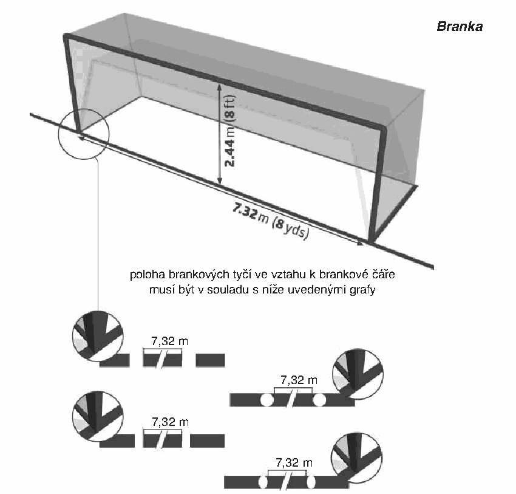

[Tištěná strana 23 · PDF 25](sources/pravidla-fotbalu-facr-2024.pdf#page=25)

Dojde-li (při utkání) k posunutí nebo zlomení břevna, je hra přerušena až do okamžiku, kdy dojde k opravení nebo výměně. Nelze-li břevno opravit, musí být utkání předčasně ukončeno. Břevno nemůže být nahrazeno lanem nebo jakýmkoliv pružným nebo nebezpečným materiálem. Hra je navázána míčem rozhodčího.

Sítě mají být upevněny na brankových tyčích, na břevně a na zemi za brankou; přitom musí být vhodně vypnuty tak, aby neomezovaly pohyb brankáře.

#### Bezpečnost

Branky (včetně přenosných) musejí být pevně ukotveny k zemi.

### 11. Technologie (sledování) brankových čar (TBČ)

Systém TBČ může být použit jako podpora k rozhodnutí rozhodčího o tom, zda bylo dosaženo branky.

Použití TBČ musí být stanoveno v Soutěžním řádu.

#### Principy TBČ

TBČ se používá pouze k sledování brankové čáry a je používána pouze k tomu, zda bylo dosaženo branky.

Informace o tom, zda došlo k dosažení branky, musí být okamžitě, automaticky a během jedné sekundy potvrzena pouze rozhodčím cestou technologie TBČ prostřednictvím hodinek rozhodčího vibrací a vizuálním signálem a/nebo prostřednictvím sluchátek komunikačního zařízení rozhodčích; může být rovněž odeslána do videooperační místnosti (VOR)..

#### Požadavky a specifikace TBČ

Pokud je TBČ používána v soutěžních utkáních, musí pořadatel (organizátor) soutěže zajistit, že systém (včetně všech potenciálně povolených změn brankové konstrukce nebo technologie v míči) splňuje požadavky kvality FIFA pro TBČ. Je-li použitá TBČ, musí rozhodčí otestovat funkčnost technologie před utkáním, jak je stanoveno v testovací příručce. V případě, že technologie nefunguje v souladu s testovacím manuálem, nesmí rozhodčí TBČ používat a musí tuto skutečnost ohlásit příslušnému orgánu.

### 12. Komerční reklamy

Od okamžiku, kdy týmy vstoupí na hrací plochu do okamžiku, kdy hrací plochu opustí v poločasové přestávce, a od okamžiku, kdy se týmy znovu vrátí na hrací plochu a až do konce utkání, není povolena žádná forma komerčních reklam, ať už skutečných nebo virtuálních,

- na hrací ploše

- na zemi v oblasti vymezené brankovou sítí

- v technické zóně

- v prostoru hřiště, kde rozhodčí provádí přezkoumání opakovaných záběrů (RRA)

- na zemi ve vzdálenosti 1 m (1 yard) od pomezních nebo brankových čar

[Tištěná strana 24 · PDF 26](sources/pravidla-fotbalu-facr-2024.pdf#page=26)

Svislé reklamy kromě toho musí být alespoň

- 1 m (1 yard) od pomezní čáry

- ve stejné vzdálenosti od brankové čáry jako je hloubka brankové sítě

- 1 m (1 yard) od brankové sítě

Není povoleno umisťovat reklamu na branku, na sítě, na tyče rohových praporků nebo na rohové praporky ani na žádná externí zařízení (kamery, mikrofony atd.), která mohou být připevněná k uvedeným předmětům.

### 13. Loga a emblémy

Reprodukce reprezentačních log nebo emblémů FIFA, konfederací, národní fotbalových svazů, soutěží, klubů nebo jiných subjektů, ať už skutečné nebo virtuální, nesmí být umístěny na hrací ploše, brankových sítích, v prostoru branky, na brankových konstrukcích a tyčích rohových praporků v průběhu hrací doby. Je povoleno umístit je na rohové praporky.

### 14. Videoasistent rozhodčího

V utkáních, ke kterým byl delegován VAR, musí být k dispozici videooperační místnost (VOR) a nejméně jeden prostor pro videokontrolu v prostoru hřiště (RRA).

#### Videooperační místnost

Pracoviště videoasistenta rozhodčího (VAR), asistenta videoasistenta rozhodčího (AVAR) a operátora opakovaných záběrů. Pouze oprávněné osoby mohou v průběhu utkání vstoupit do VAR a komunikovat s VAR, AVAR nebo s operátorem opakovaných záběrů.

Hráč, náhradník nebo vystřídaný hráč, který vstoupí do VOR, bude vyloučen; funkcionář družstva, který vstoupí do VOR, bude vykázán z technické zóny.

#### Prostor hřiště, kde rozhodčí provádí přezkum opakovaných záběrů (RRA)

V utkáních, ke kterým byl delegován VAR, musí být minimálně jedno místo pro přezkoumání záznamu rozhodčím v prostoru hřiště.

Místo pro přezkoumání záznamu rozhodčím musí být:

- na viditelném místě mimo hrací plochu

- jasně vyznačeno

Hráč, náhradník, vystřídaný hráč nebo funkcionář družstva, který vstoupí do RRA, bude napomenut.

### ROZHODNUTÍ FAČR

1\. V případě, že hrací plocha není způsobilá ke hře a utkání z tohoto důvodu nelze sehrát, jsou rozhodčí i družstva povinna postupovat podle SŘ.

2\. Šířka a tloušťka brankových tyčí a břevna nesmí být menší než 10 cm a větší než 12 cm. Hrany brankových tyčí a břevna musí být směrem do hrací plochy zaobleny.

[Tištěná strana 25 · PDF 27](sources/pravidla-fotbalu-facr-2024.pdf#page=27)

3\. Branková čára musí být stejně široká, jako je tloušťka brankových tyčí a vyznačena tak, aby se vnitřní a vnější obrysy čáry kryly s předními a zadními stranami brankových tyčí. Šířka všech ostatních čar na hrací ploše musí být stejná, jako je šířka brankové čáry. Čáry nesmějí být přerušované a musí být vyznačeny tak, aby netvořily žlábek nebo rýhu. Středová značka a pokutové značky mají mít průměr 22 cm. Na hracích plochách s umělým povrchem mohou být vyznačeny i jiné čáry, pokud budou jiné barvy a pokud se nebudou plést s čárami vyznačující hrací plochu pro fotbal.

4\. Hrát soutěžní utkání s poškozenou brankou není dovoleno. Dojde-li při soutěžním utkání k poškození branky, musí ji pořadatel utkání nejpozději do 30 minut uvést do předepsaného stavu. Není-li branka v této lhůtě opravena, rozhodčí soutěžní utkání ukončí a v zápise o utkání podá podrobnou zprávu. Každé jiné utkání lze zahájit nebo dohrát s poškozenou brankou za předpokladu, že hráčům nehrozí nebezpečí zranění.

5.Sítě musí být vypnuty, aby umožňovaly volný pohyb brankáře. Upevnění sítí k brankám (k zemi) nesmí ohrožovat bezpečnost hráčů..

Hrát soutěžní utkání bez sítě nebo s poškozenou brankovou sítí není povoleno. Dojde-li při soutěžním utkání k poškození sítě, musí ji pořadatel utkání nejpozději do 15 minut uvést do předepsaného stavu. Není-li síť v této lhůtě opravena, rozhodčí soutěžní utkání ukončí. Pro opravu poškozené sítě je zakázáno použití drátu nebo jiného podobného materiálu.

6\. Rohové a středové praporky musí být zhotoveny z látky výrazné barvy. Doporučené rozměry jsou 60 x 40 cm.

7\. Hrát utkání bez rohových praporků není dovoleno, vyjma případu uvedeného v Praktických pokynech pro rozhodčí.

8\. Na pomyslném prodloužení středové čáry se ve vzdálenosti nejméně 1 m od pomezních čar mohou umístit středové praporky. Středové praporky slouží pouze pro lepší orientaci hráčů na hrací ploše a nejsou povinnou součástí příslušenství hrací plochy, proto se bez nich utkání může sehrát.

9\. Příslušný řídící orgán je oprávněn povolit hrát utkání mládeže na hracích plochách, jejichž rozměry jsou menší, než je stanoveno pravidlem.

10\. Brankové tyče a břevno musí být bílé; za povolenou barvu se považuje i barva stříbřitá.

11\. Mimo hrací plochu lze kolmo na brankovou čáru vyznačit ve vzdálenosti 9,15 m (10 yardů) od rohového čtvrtkruhu pomocnou značku, která při provádění kopu z rohu pomáhá zabezpečit dodržení předepsané vzdálenosti bránících hráčů. Stejnou pomocnou značku lze vyznačit ve vzdálenosti 9,15 m od rohového čtvrtkruhu vně hrací plochy i kolmo na pomezní čáru.

12\. Řídící orgán může Rozpisem soutěže definovat pohyb a situování pracovníků veřejných sdělovacích prostředků uvnitř stadionu a v prostoru hřiště.

13\. Pouze jedna osoba zdržující se v technické zóně je oprávněna udělovat hráčům v průběhu utkání pokyny, ale Rozpis příslušné soutěže může definovat, která osoba to bude.

[Tištěná strana 26 · PDF 28](sources/pravidla-fotbalu-facr-2024.pdf#page=28)

### VÝKLAD K PRAVIDLU

#### Všeobecná ustanovení

1.1 Vybavení hřiště a příslušenství hrací plochy určují Pravidla fotbalu a upřesňuje Soutěžní řád, případně i Rozpis příslušné soutěže.

1.2 Je zakázáno, aby na přírodní hrací ploše byly vyznačeny jakékoli další čáry nebo pomocné značky než ty, které jsou schváleny pravidly.

1.3 Soutěžní utkání nelze hrát bez sítí. Před utkáním se rozhodčí přesvědčí, zda brankové sítě jsou řádně upevněny a zda nejsou poškozeny. Sítě musí být vypnuty a upevněny tak, aby nemohly vzniknout nejasnosti při dosažení branky, a jejich umístění musí brankářům poskytovat bezpečný a dostatečný prostor pro volný pohyb. Zjistí-li rozhodčí závady, postupuje stejně, jako v případě rozhodování o způsobilosti hrací plochy. Nelze-li závady odstranit, utkání nezahájí.

1.4 Zjistí-li rozhodčí při přátelském utkání, že na sítích jsou neodstranitelné závady nebo sítě nejsou k dispozici, bude utkání řídit. Upozorní však kapitány družstev, že při rozhodování o dosažení branky bude spoléhat jen na svůj postřeh, a protože nemůže vyloučit omyl, předem odmítne případné námitky.

1.5 Čáry ohraničující příslušná území jsou jejich součástí. Pro hru to znamená, že:

- přestupek na pomezní nebo na brankové čáře je přestupkem na hrací ploše,

- přestupek na čáře pokutového území je přestupkem v pokutovém území,

- je-li míč na pomezní nebo na brankové čáře nebo ve vzduchu nad některou z těchto čar, byť i jen malou částí, je stále na hrací ploše, a tedy i ve hře.

1.6 Středová čára je součástí obou polovin hrací plochy. Proto hráč na středové čáře je na vlastní polovině hrací plochy, pokud žádnou částí svého těla, hlavy nebo nohy nepřesahuje do soupeřovy poloviny hrací plochy.

1.7 Kolem hrací plochy se zpravidla zřizuje pevné zábradlí nebo ohrazení, jehož umístění a tvar podléhá schválení řídícího orgánu. Pro zajištění bezpečnosti hráčů se má umístit ve vzdálenosti nejméně 4 m od brankových a 2 m od pomezních čar. Pokud není okolo hrací plochy zábradlí nebo ohrazení, je „prostor hřiště“ vymezen vzdáleností 2 m od pomezních a 4 m od brankových čar.

1.8 Prostor, kterým rozhodčí a hráči procházejí z kabin na hrací plochu, musí být oddělen od hlediště a zabezpečen proti vniknutí diváků.

1.9 K vybavení hřiště patří i lavičky. Lavičky musí být kryté, oddělené od hlediště, mají být umístěné poblíž středové čáry za pomezní čárou, musí být zabezpečené proti vhazování předmětů z hlediště a mají umožňovat sezení pro 14 osob (pokud není Soutěžním řádem nebo Rozpisem soutěže stanoveno jinak). Z hlediska bezpečnosti musí splňovat kritéria stanovená Komisí pro stadiony a hrací plochy.

1.10  Zjistí-li rozhodčí na hrací ploše nebo v její bezprostřední blízkosti závady, např. předměty, které by mohly ohrozit bezpečnost hráčů, požádá hlavního pořadatele o jejich odstranění; přitom postupuje stejně, jako v případě rozhodování o způsobilosti hrací plochy. Nelze-li závady odstranit, utkání nezahájí.

[Tištěná strana 27 · PDF 29](sources/pravidla-fotbalu-facr-2024.pdf#page=29)

#### Způsobilost hrací plochy

1.11  O způsobilosti hrací plochy rozhoduje jedině a s konečnou platností rozhodčí. Při rozhodování o způsobilosti hrací plochy musí rozhodčí dbát, aby sport zbytečně nepoškodil.

1.12  Před zahájením hry se rozhodčí přesvědčí, zda hrací plocha je způsobilá pro hru. Rozhodčí hru nezahájí, zjistí-li, že stav hrací plochy:

  - neumožňuje regulérní průběh utkání nebo

  - mohl by přivodit zranění hráčů.

1.13  Zjistí-li rozhodčí, že hrací plocha je nezpůsobilá ke hře, ale že podle jeho názoru ji lze do způsobilého stavu uvést, požádá hlavního pořadatele o odstranění zjištěných závad. V případě, že se hrací plochu nepodaří uvést do způsobilého stavu do úředně stanoveného začátku utkání, ale je oprávněný předpoklad, že pořadatel utkání je schopen závady odstranit, vyčká rozhodčí dále, nejdéle však předepsanou čekací dobu, tj. nejvýše do 20 minut po úředně stanoveném začátku utkání a potom s konečnou platností rozhodne. Skutečnost, že pořadatel ve smyslu tohoto článku odstraňuje zjištěné závady, nezbavuje družstva povinnosti splnit předepsané formality, tj. zejména řádně vyplnit ZoU a zajistit převléknutí hráčů do sportovní výstroje.

1.14  Je-li hrací plocha podle názoru rozhodčího nezpůsobilá ke hře a je zřejmé, že zjištěné závady nebude možno odstranit ani v čekací době, oznámí rozhodčí rozhodnutí o nezpůsobilosti hrací plochy kapitánům a vedoucím družstev ihned poté, jakmile to zjistí. Vedoucí družstev vyplní ZoU a zabezpečí splnění všech předepsaných náležitostí včetně případné kontroly totožnosti hráčů; ti se však nemusejí převlékat do sportovní výstroje.

1.15  Neuzná-li rozhodčí hrací plochu za způsobilou k soutěžnímu utkání, nesmí se na této hrací ploše hrát ani přátelské utkání. Na této hrací ploše nesmí žádné utkání řídit ani jiný kvalifikovaný rozhodčí do doby, než se hrací plocha opět stane způsobilou ke hře.

[Tištěná strana 28 · PDF 30](sources/pravidla-fotbalu-facr-2024.pdf#page=30)

## Pravidlo 2 – MÍČ

### 1. Vlastnosti a rozměry

Všechny míče musí

- být kulaté,

- být zhotoveny z vhodného materiálu,

- mít obvod mezi 68 cm až 70 cm,

- mít na začátku utkání hmotnost mezi 410 g až 450 g,

- mít tlak roven 0,6 – 1,1 atm (600 – 1100 g/cm2) měřeno na úrovni moře.

Všechny míče používané v soutěžních utkáních konaných pod záštitou FIFA nebo konfederací musí splňovat požadavky a být opatřeny jednou ze značek programu kvality FIFA pro fotbal.

Každé takové označení ukazuje, že míč byl oficiálně testován a splňuje specifické technické požadavky pro ochranné známky, které jdou nad rámec minimálních požadavků, uvedených v Pravidle 2, a které musí být schváleny IFAB.

V soutěžích národních fotbalových asociací může být požadováno používání míčů nesoucích jedno z těchto označení.

V soutěžních utkáních FIFA a v soutěžních utkáních hraných pod záštitou konfederací a národních svazů nesmějí být na míči žádné reklamy s výjimkou symbolů soutěže, symbolů organizátora soutěže a s výjimkou oficiální značky výrobce míče. Řídící orgán soutěže může omezit počet a velikost takových symbolů a značek.

### 2. Výměna poškozeného míče

Jestliže dojde k poškození míče

- hra je přerušena

- hra se naváže míčem rozhodčího

Jestliže dojde k poškození míče v okamžiku provedení výkopu, kopu od branky, kopu z rohu, volného kopu, pokutového kopu nebo vhazování, navázání hry se opakuje.

Jestliže dojde k poškození míče v průběhu provádění pokutového kopu nebo při provádění penaltového rozstřelu, poté co se míč pohnul dopředu, ale dříve, než se míč dotknul jiného hráče, brankové tyče nebo břevna, je pokutový kop opakován.

Míč nesmí být v průběhu utkání vyměněn bez souhlasu rozhodčího.

### 3. Náhradní míče

Náhradní míče, které odpovídají požadavkům Pravidla 2, mají být umístěny okolo hrací plochy a jejich použití podléhá kontrole rozhodčího.

[Tištěná strana 29 · PDF 31](sources/pravidla-fotbalu-facr-2024.pdf#page=31)

### ROZHODNUTÍ FAČR

1\. Utkání přípravek a žáků se hrají míči, jejichž parametry jsou specifikovány Soutěžním řádem popř. Pravidly malých forem fotbalu nebo Rozpisem příslušné soutěže.

2\. P2. oužije-li se v soutěžním utkání ke hře jiného míče, než některého z míčů z programu kvality FIFA pro fotbal, nesmí na něm být s výjimkou značky výrobce umístěna žádná jiná reklamní značka nebo symbol.

3\. Náhradní míč musí pořadatel utkání na pokyn rozhodčího dodat ihned. Nedodá-li pořadatel náhradní míč ihned, stanoví rozhodčí k jeho dodání přiměřenou lhůtu, nejvýše však 5 minut. Není-li náhradní míč ani po uplynutí stanovené lhůty k dispozici, rozhodčí utkání předčasně ukončí, a v zápise o utkání podá podrobnou zprávu.

### VÝKLAD K PRAVIDLU

2.1 Nejpozději 20 minut před úředním začátkem utkání je pořadatel utkání povinen předat rozhodčímu míč a náhradní míče. Počet náhradních míčů stanoví Soutěžní řád, popřípadě Rozpis soutěže. Všechny míče musí odpovídat ustanovení pravidla.

2.2 Před zahájením utkání se rozhodčí přesvědčí, zda míč a náhradní míče mají správný tvar, rozměry a hmotnost, a zda jejich obal odpovídá ustanovením pravidla. Není-li po ruce přístroj na měření tlaku, posoudí rozhodčí správné nahuštění míče podle vlastního uvážení.

2.3 O způsobilosti míče rozhoduje výhradně rozhodčí. Předepsaná hmotnost míče platí pouze pro začátek utkání a za sychravého nebo deštivého počasí se jeho hmotnost může v průběhu utkání poněkud zvýšit, tím se však míč ještě nestává nezpůsobilým ke hře. Zjistí-li rozhodčí v průběhu utkání, že míč se stal nezpůsobilým ke hře, nebo že se z důvodu značného zvýšení hmotnosti stal nebezpečným pro hráče, zajistí jeho výměnu. Přeruší-li z tohoto důvodu hru, měl by tak učinit v okamžiku, kdy tím nebude zvýhodněno nebo poškozeno žádné družstvo.

2.4 Na upozornění kapitána družstva je rozhodčí povinen provést kontrolu míče. Kontrolu míče provede v přerušené hře a zjistí-li na míči závadu, zajistí jeho výměnu.

2.5 Jestliže míč praskne nebo se stane nezpůsobilým ke hře v době, kdy je hra přerušena, vymění se míč a ve hře se pokračuje způsobem odpovídajícím důvodu přerušení hry. To platí i pro případ, že měla být hra navázána míčem rozhodčího.

2.6 Stane-li se míč nezpůsobilým ke hře nebo praskne-li míč poté, co je správně proveden některý kop, vhazování nebo míč rozhodčího, nechá rozhodčí po výměně míče příslušný kop, vhazování nebo míč rozhodčího opakovat.

2.7 Octne-li se v době, kdy je míč ve hře, na hrací ploše další míč, a je-li tím ovlivněna hra, rozhodčí hru přeruší a po odstranění dalšího míče z hrací plochy naváže hru míčem rozhodčího.

2.8 Míč schválený rozhodčím ke hře zůstává pod dohledem rozhodčího až do konce utkání, tedy i o poločasové přestávce. Schválené náhradní míče jsou pod dohledem pořadatele utkání.

[Tištěná strana 30 · PDF 32](sources/pravidla-fotbalu-facr-2024.pdf#page=32)

## Pravidlo 3 – HRÁČI

### 1. Počet hráčů

Utkání hrají dvě družstva, každé družstvo má nejvýše jedenáct hráčů, z nichž jeden musí být brankář. Utkání nesmí být zahájeno nebo pokračovat, jestliže některé z družstev má méně než sedm hráčů.

Má-li družstvo méně než sedm hráčů, neboť jeden nebo více hráčů úmyslně opustilo hrací plochu, není rozhodčí povinen přerušit hru a může ponechat výhodu ve hře, ale hra nesmí pokračovat, pokud míč opustil hrací plochu a družstvo nemá minimálně sedm hráčů.

Je-li soutěžním řádem nebo rozpisem soutěže stanoveno, že všichni hráči a náhradníci musí být uvedeni v ZoU před zahájením utkání a družstvo zahájí utkání s méně než jedenácti hráči, mohou se poté, co se dostavili, utkání účastnit pouze ti hráči a náhradníci, jejichž jména byla v ZoU uvedena před utkáním.

### 2. Počet střídání

#### Soutěžní utkání

Počet náhradníků, nejvýše však pět, kteří mohou být nasazeni v kterémkoli utkání hraném v oficiální soutěži, určuje FIFA, konfederace nebo národní fotbalový svaz.

V soutěžích utkání mužů a žen, týkajících se prvních družstev klubů v nejvyšších úrovních soutěží nebo A družstev dospělých na mezinárodní úrovni, kde soutěžní řád povoluje nasazení nejvýše pěti náhradníků, každé družstvo:

- má maximálně tři možnosti střídání*

- může dodatečně střídat v poločase

* Pokud obě družstva provádějí střídání ve stejnou dobu, počítá se to jako využitá možnost střídání u obou družstev. Vícenásobné střídání družstva během stejného přerušení hry se počítá jako jedna využitá možnost střídání.

#### Prodloužená doba hry

- pokud družstvo nepoužilo maximální počet náhradníků nebo maximální počet možností střídání, mohou být nenasazení náhradníci nebo nevyužité možnosti střídání použity v prodloužené době hry

- tam, kde pravidla soutěže povolují družstvu použít jednoho dalšího náhradníka v prodloužené době hry, má družstvo také dodatečnou možnost střídání

- střídání mohou být také provedena v přestávce mezi základní dobou hry a zahájením prodloužené doby hry a mezi poločasy prodloužené doby hry. Tato střídání se také nepočítají jako využité možnosti střídání.

[Tištěná strana 31 · PDF 33](sources/pravidla-fotbalu-facr-2024.pdf#page=33)

V soutěžním řádu musí být stanoveno:

- kolik náhradníků smí být uvedeno v ZoU (od tří do nejvýše patnácti)

- zda v utkání, které se bude rozhodovat v prodloužené době hry, může být nasazen jeden další náhradník nad stanovený počet náhradníků bez ohledu na to, zda družstvo již vyčerpalo povolený počet střídání.

#### Ostatní utkání

V utkáních národních A družstev dospělých smí být v ZoU uvedeno až patnáct náhradníků, z nichž do hry jich může být nasazeno nejvýše šest.

Ve všech ostatních utkáních smí být nasazen větší počet náhradníků, jestliže

- družstva se na maximálním počtu náhradníků dohodnou,

- rozhodčí je před zahájením utkání o dohodě družstev informován.

Pokud se družstva před utkáním na počtu náhradníků nedohodnou, nebo pokud není rozhodčí o dohodě družstev před utkáním informován, smějí družstva do hry nasadit nejvýše šest náhradníků.

#### Opakovaná střídání

Použití opakovaných střídání je se souhlasem příslušné asociace, konfederace nebo FIFA, povoleno pouze v utkáních mládeže, veteránů, postižených a v nejnižších úrovních amatérského fotbalu.

#### Dodatečné trvalé střídání při otřesu mozku

Řídící orgán soutěže může povolit dodatečné střídání při otřesu mozku nebo při podezření na otřes mozku; tato skutečnost musí být uvedena v Rozpisu příslušné soutěže. Střídání musí být provedeno v souladu s příslušným protokolem, který je uveden v Pravidle 3 Pravidel fotbalu na str.40.

### 3. Procedura střídání

Jména náhradníků musí být rozhodčímu oznámena před zahájením utkání. Náhradník, jehož jméno nebylo v daném čase rozhodčímu sděleno, se nesmí účastnit utkání.

Při střídání hráče náhradníkem

- rozhodčí musí být o střídání předem informován

- střídaný hráč:

– obdrží souhlas rozhodčího k opuštění hrací plochy, pokud již není mimo hrací plochu, a musí ji opustit na nejbližším místě ohraničující čáry HP vyjma případů, kdy rozhodčí ukáže, že hráč musí hrací plochu opustit přímo a ihned na středové čáře nebo na jiném místě (např. z bezpečnostních nebo zdravotních důvodů)

– musí jít ihned do technické zóny nebo do šatny a dále se hry neúčastní, vyjma případů, kdy je povoleno opakované střídání

[Tištěná strana 32 · PDF 34](sources/pravidla-fotbalu-facr-2024.pdf#page=34)

- pokud střídaný hráč odmítne opustit hrací plochu, hra pokračuje

Náhradník smí na hrací plochu vstoupit jenom:

- v přerušené hře

- od středové čáry

- poté, co střídaný hráč opustil hrací plochu

- poté, co obdržel souhlas od rozhodčího

Vstupem náhradníka na hrací plochu je střídání ukončeno; od té chvíle se nahrazený hráč stává vystřídaným hráčem a náhradník se stává hráčem a smí provést jakékoli navázání hry.

Všichni vystřídaní hráči a náhradníci podléhají autoritě rozhodčího.

### 4. Výměna brankáře

Kterýkoli hráč si smí vyměnit místo s brankářem, jestliže

- rozhodčí bude o výměně předem informován

- výměna se provede v době, kdy hra bude přerušena

### 5. Porušení pravidla a sankce

Jestliže náhradník nastoupí v utkání místo nahlášeného hráče a rozhodčí není o této výměně informován:

- rozhodčí umožní nahlášenému náhradníkovi pokračovat ve hře

- disciplinární opatření vůči nahlášenému náhradníkovi není přijato

- nahlášený hráč se může stát nahlášeným náhradníkem

- povolený počet střídání se nemění

- rozhodčí podá zprávu příslušnému řídícímu orgánu

Je-li střídání prováděno o poločasové přestávce nebo před prodloužením doby hry k určení vítěze utkání, musí být procedura ukončena před zahájením hry. Nebyl-li rozhodčí o takovém střídání informován, může nahlášený náhradník pokračovat ve hře, není přijato žádné disciplinární opatření a důvod této skutečnosti oznámí rozhodčí řídícímu orgánu.

Jestliže si hráč vymění místo s brankářem bez souhlasu rozhodčího, rozhodčí:

- nechá pokračovat ve hře bez přerušení

- napomene oba hráče při nejbližším přerušení hry ale ne v případě, když k výměně dojde o poločasové přestávce nebo v době mezi ukončením utkání a začátkem prodloužené doby hry, nebo o přestávce v prodloužené době hry a/nebo před prováděním penaltového rozstřelu

Při každém jiném porušení tohoto pravidla:

- hráči jsou napomenuti

- hra je navázána nepřímým volným kopem v místě, kde byl míč v okamžiku přerušení hry

[Tištěná strana 33 · PDF 35](sources/pravidla-fotbalu-facr-2024.pdf#page=35)

### 6. Vyloučení hráče a náhradníka

Hráč, který byl vyloučen:

- před předáním ZoU rozhodčímu nesmí být uveden v ZoU v jakékoli funkci

- po předání ZoU rozhodčímu, ale před zahájením utkání, může být nahrazen náhradníkem; počet náhradníků z tohoto důvodu nemůže být doplněn; počet povolených střídání se nesnižuje

- po zahájení utkání, nesmí být nahrazen náhradníkem

Náhradník, který byl vyloučen před začátkem nebo po zahájení utkání, nesmí být nahrazen jiným náhradníkem.

### 7. Jiné osoby na hrací ploše

Členové realizačního týmu, uvedení v ZoU, jsou příslušníky družstva. Kdokoliv neuvedený v ZoU jako hráč, náhradník nebo jiný příslušník družstva je považován za osobu cizí.

Jestliže člen realizačního týmu, náhradník, vystřídaný nebo vyloučený hráč nebo osoba cizí vstoupí na hrací plochu a ovlivní hru, musí rozhodčí

- přerušit hru

- zajistit odchod této osoby z hrací plochy

- přijmout příslušné disciplinární opatření

Jestliže hru ovlivní

- člen realizačního týmu, náhradník, vystřídaný nebo vyloučený hráč, nařídí rozhodčí přímý volný kop nebo pokutový kop

- osoba cizí, naváže rozhodčí hru míčem rozhodčího

Jestliže ale míč směřuje do branky a ovlivnění hry nezabránilo bránícímu hráči v možnosti hrát míčem, je branka uznána, pokud se míč dostane do branky (i když došlo ke kontaktu cizí osoby s míčem), vyjma případu, když míč skončil v soupeřově brance (dále viz čl.9).

### 8. Hráč mimo hrací plochu

Pokud se hráč , který k návratu na hrací plochu potřebuje souhlas rozhodčího, vrátí na hrací plochu bez souhlasu rozhodčího, rozhodčí musí:

- přerušit hru (nikoliv ihned, pokud hráč neovlivní hru nebo rozhodčího nebo pokud rozhodčí uplatní výhodu ve hře)

- napomenout hráče za vstup na hrací plochu bez souhlasu rozhodčího

Jestliže rozhodčí hru přeruší, musí ji navázat:

- přímým volným kopem z místa, kde došlo k ovlivnění hry

- nepřímým volným kopem v místě, kde byl míč v okamžiku přerušení hry, pokud nedošlo k ovlivnění hry

Hráč, který opustí hrací plochu přes pomezní nebo brankovou čáru v rámci obranné nebo útočné akce, se nedopouští přestupku.

[Tištěná strana 34 · PDF 36](sources/pravidla-fotbalu-facr-2024.pdf#page=36)

### 9. Branka dosažená v okamžiku, kdy je na hrací ploše další osoba

Pokud po dosažení branky před navázáním hry rozhodčí zjistí, že v okamžiku vstřelení branky se na hrací ploše nacházela další osoba a tato osoba ovlivnila hru:

- rozhodčí branku neuzná, pokud další osobou byl

– hráč, náhradník, vystřídaný nebo vyloučený hráč nebo člen realizačního týmu, které dosáhlo branky; hra je navázána přímým volným kopem z místa, kde se další osoba nacházela

– cizí osoba, která ovlivnila hru, hra je navázána míčem rozhodčího (s výjimkou posledního odstavce bodu 7)

- rozhodčí branku uzná, pokud další osobou byl

– hráč, náhradník, vystřídaný nebo vyloučený hráč nebo člen realizačního týmu, které branku obdrželo

– cizí osoba, která neovlivnila hru

Ve všech případech musí rozhodčí zajistit odchod cizí osoby z hrací plochy.

Pokud po dosažení branky a po zahájení nebo navázání hry rozhodčí zjistí, že v okamžiku dosažení branky se na hrací ploše nacházela další osoba, nemůže být branka odvolána.

Pokud se další osoba stále nachází na hrací ploše, musí rozhodčí

- přerušit hru

- zajistit odchod cizí osoby z hrací plochy

- navázat hru míčem rozhodčího nebo nepřímým volným kopem

Rozhodčí musí o incidentu podat zprávu příslušnému řídícímu orgánu.

### 10. Kapitán družstva

Každé družstvo musí mít na hrací ploše kapitána, který nosí na paži identifikační pásku. Kapitán družstva nemá žádné zvláštní postavení nebo výsady, ale má určitou míru odpovědnosti za chování jeho družstva.

### ROZHODNUTÍ FAČR

1\. Minimální počet hráčů v družstvu je sedm.

2\. Každé družstvo je oprávněno vystřídat kdykoli v průběhu utkání kteréhokoli hráče, ale jen v době, kdy je míč ze hry. Kapitán družstva informuje rozhodčího o tom, že jeho družstvo hodlá střídat hráče.

Dále platí:

a) V soutěžních utkáních musí před utkáním každé družstvo uvést do ZoU náhradníky družstva v počtu nejvýše sedmi osob (v 1. lize jedenácti osob), ze kterých smí v průběhu utkání v profesionálních soutěžích vystřídat nejvýše pět hráčů

[Tištěná strana 35 · PDF 37](sources/pravidla-fotbalu-facr-2024.pdf#page=37)

a v neprofesionálních soutěžích také až pět hráčů, pokud není Soutěžním řádem nebo Rozpisem příslušné soutěže stanoveno jinak. Náhradníci, jejichž jména nebyla zapsána do ZoU před uzavřením zápisu před utkáním, mohou být nasazeni do hry a do ZoU doplněni dodatečně, jen jestliže to výslovně umožňuje Rozpis příslušné soutěže.

b) V nesoutěžních utkáních, s výjimkou utkání národních Adružstev, smí být do hry nasazen libovolný počet náhradníků. Na počtu náhradníků, které nasadí do hry, se družstva musí dohodnout před utkáním a o dohodě jsou povinna před utkáním informovat rozhodčího. V případě, že se družstva na počtu náhradníků nedohodnou, nebo v případě, že výsledek vzájemné dohody nesdělí před utkáním rozhodčímu, smí každé družstvo nasadit do hry nejvýše 6 náhradníků.

c) V turnajových utkáních se počet náhradníků, jež je družstvo oprávněno nahlásit k utkání, a počet střídajících hráčů, řídí herním řádem (propozicemi) turnaje.

3\. Hráčům je povoleno osvěžit se nápojem, ale pouze v době, kdy je míč ze hry. Láhve s nápoji musí být z plastické hmoty a v průběhu utkání musí být umístěny v technické zóně příslušného družstva; hráčům musí být podávány, je zakázáno je na hrací plochu vhazovat. Brankář se smí osvěžit také u své brankové čáry; láhve s nápoji může mít v prostoru své branky mimo hrací plochu umístěné tak, aby nemohly ovlivnit hru nebo ohrozit bezpečnost jeho nebo bezpečnost ostatních hráčů.

4\. Na lavičce pro příslušníky družstev se mohou při utkání zdržovat pouze příslušníci družstva.Vyloučení příslušníci družstva se nesmějí zdržovat na lavičce pro příslušníky družstev ani v prostoru hřiště.Výjimku může rozhodčí udělit pouze v případě lékaře nebo zdravotníka družstva.

5\. V utkáních nejnižších amatérských soutěží dospělých, mládeže, ženského fotbalu, seniorů nad 35 roků a soutěží pro zdravotně postižené lze provádět i „opakované“ střídání (opětovné nastoupení téhož hráče po předchozím vystřídání), pokud je to povoleno Soutěžním řádem nebo Rozpisem příslušné soutěže.

### Procedura opakovaného střídání

Střídat lze pouze v přerušené hře. Hráč, který byl vystřídán, se smí v témže utkání znovu vrátit na hrací plochu a zúčastnit se další hry. Střídání se týká všech hráčů uvedených v zápisu o utkání. Všichni hráči (i ti uvedeni v ZoU jako náhradníci) se automaticky posuzují jako hráči nastoupivší do utkání. Střídání hráčů musí být oznámeno rozhodčímu a při přerušení hry se provede co nejrychleji, aby nedocházelo k promarňování doby hry. Hráči, kteří jdou na hrací plochu, musí být připraveni u lavičky pro příslušníky družstva v prostoru technické zóny a na hrací plochu mohou vstoupit až poté, co ji střídaný hráč opustí. Hráči, kteří z hrací plochy odcházejí, ji mohou opustit kdekoliv, tedy i na opačné straně hrací plochy, za brankou apod., ale poté se musí co nejdříve přesunout na lavičku do technické zóny, nesmí se po vystřídání zdržovat nikde okolo hrací plochy mimo technické zóny.

Není omezen celkový počet střídání, ani počet střídání jednoho hráče, vystřídaný hráč se může zapojit do hry kdykoliv výše uvedeným způsobem. V posledních

[Tištěná strana 36 · PDF 38](sources/pravidla-fotbalu-facr-2024.pdf#page=38)

deseti minutách utkání dospělých, dorostu a starších žáků již nelze provádět opakované střídání, kdy lze střídat pouze standardním způsobem, nejvýše však 2 hráče, vystřídat spoluhráče mohou i ti, kteří se již předtím utkání zúčastnili. V utkání přípravek a mladších žáků lze střídat opakovaným způsobem až do konce utkání (pokud není Soutěžním řádem a Rozpisem soutěže stanoveno jinak).

Za správně provedené střídání a správný počet hráčů na hrací ploše odpovídá kapitán, vedoucí družstva a trenér. V případě, že rozhodčí zjistí vyšší počet hráčů z jednoho týmu na hrací ploše, hru přeruší (pokud neuplatní výhodu ve hře) a hráče, který přišel jako poslední, napomene za neoprávněný vstup na hrací plochu (vyjma utkání přípravek a mladších žáků ) a vykáže ho z hrací plochy. Hru naváže NVK za neoprávněný vstup na HP, případně PVK (PK) při dalším porušení Pravidla 12.

Rozhodčí nezaznamenává střídání hráčů do zápisu o utkání.

Rozhodčí posoudí, zda při střídání nebyla takticky záměrně zdržována doba hry a případně záměrně promarněnou dobu hry zdržováním při střídání patřičně nastaví.

### VÝKLAD K PRAVIDLU

#### Všeobecná ustanovení

3.1 Za řádný nástup družstva k utkání se považuje, jestliže v době úředně stanoveného začátku utkání je na hrací ploše alespoň sedm hráčů družstva ustrojených v souladu s pravidly a rozhodčí má k dispozici řádně vyplněný ZoU. Skutečnost, že družstvo nemá v době úředně stanoveného začátku utkání na hrací ploše plný počet hráčů, není důvodem k posunutí začátku utkání.

Jestliže družstvo nemá v době úředně stanoveného začátku utkání na hrací ploše alespoň sedm hráčů a z toho důvodu bude začátek utkání posunut, čerpá družstvo čekací dobu.

3.2 Z hráčů nastupujících k utkání musí jeden být brankář a jeden musí být označen jako kapitán. Jestliže je kapitán vystřídán, vyloučen ze hry nebo z jiného důvodu odstoupí ze hry, převezme jeho funkci se všemi právy i povinnostmi zástupce kapitána družstva.

Pouze kapitán družstva má v průběhu hry právo obracet se vhodným způsobem na rozhodčího a to pouze v záležitostech týkajících se hry. Jeho jednání musí být vždy stručné, věcné a korektní, jinak se vystavuje nebezpečí, že ho rozhodčí napomene za nesportovní chování, případně vyloučí za hrubé nesportovní chování.

3.3 Zraní-li s e ještě před utkáním hráč družstva, doplní družstvo počet hráčů některým z nahlášených náhradníků a současně družstvo smí doplnit počet náhradníků o dalšího náhradníka. Zraněný hráč, odstraněný (vyjmutý) ze základní sestavy, nemůže již v utkání nastoupit, ani nemůže být uveden v ZoU jako náhradník. Zraní-li se ještě před utkáním některý z náhradníků, může družstvo doplnit počet náhradníků o dalšího náhradníka. Provedené změny je nutno zaznamenat v ZoU ještě před zahájením hry, případně o poločasové přestávce.

[Tištěná strana 37 · PDF 39](sources/pravidla-fotbalu-facr-2024.pdf#page=39)

#### Doklady hráčů

3.4 Družstvo musí mít k dispozici Listinu hráčů, kterou předloží v případě písemného vyplňování ZoU nebo pro provedení kontroly totožnosti startujících hráčů. Postup provádění kontroly totožnosti je uveden v SŘ.

V případě nepředložení listiny hráčů pro provedení kontroly totožnosti bude utkání sehráno a o jeho výsledku rozhodne řídící orgán příslušné soutěže.

V případě, že ZoU se vyplňuje písemně a družstvo nepředloží Listinu hráčů, utkání bude sehráno a vedoucí svým podpisem stvrdí, že Listinu hráčů neměl k dispozici.

#### Doplňování družstva

3.5 Jestliže družstvo zahájí utkání s menším počtem hráčů než 11, má právo kdykoli v průběhu utkání doplnit počet hráčů na 11.

3.6 Hráč, který doplňuje družstvo a není uveden v ZoU, je povinen prokázat svoji totožnost v souladu se SŘ. Tohoto hráče doplní rozhodčí do ZoU o poločasové přestávce nebo nejpozději ihned po ukončení utkání.

3.7 Hráč, který doplňuje družstvo, smí nastoupit do hry jen v době, kdy je míč ze hry. V přerušené hře se od středové čáry ohlásí rozhodčímu a vyčká, až rozhodčí zkontroluje jeho výstroj. Na hrací plochu vstoupí až poté, co mu rozhodčí udělí ke vstupu na hrací plochu souhlas.

3.8 Vstoupí-li hráč, který doplňuje družstvo, na hrací plochu bez svolení rozhodčího, jedná se o neoprávněný vstup na hrací plochu (jestliže hráč z místa za pomezní nebo brankovou čárou vysune do hrací plochy část těla, považuje to rozhodčí rovněž za vstup hráče na hrací plochu).

  - Vstoupí-li hráč na hrací plochu v době, kdy míč byl ze hry, rozhodčí hráče napomene a hru naváže způsobem, pro který byla přerušena

  - Vstoupí-li hráč na hrací plochu v době, kdy míč byl ve hře a hru neovlivní, rozhodčí hru nepřerušuje; přeruší-li přesto rozhodčí hru, hráče napomene a nařídí ve prospěch soupeřova družstva nepřímý volný kop z místa, kde byl míč v okamžiku přerušení hry.

  - Vstoupí-li hráč na hrací plochu v době, kdy míč byl ve hře a hru ovlivní, přeruší rozhodčí hru, hráče napomene za neoprávněný vstup na hrací plochu, nařídí volný kop nebo pokutový kop a případně udělí i další osobní trest

Rozhodčí přitom může uplatnit výhodu ve hře.

V případě, že rozhodčí vyloučí hráče, který doplňuje družstvo, pokračuje jeho družstvo ve hře s menším počtem hráčů.

#### Náhradníci a střídání hráčů

3.9 Každé družstvo smí v době, kdy je míč ze hry, vystřídat kteréhokoli hráče náhradníkem, a to kdykoli během utkání, tedy i o poločasové přestávce nebo v nastavené či v prodloužené době hry. Při provádění penaltového rozstřelu však může být vystřídán pouze zraněný brankář, pokud ovšem jeho družstvo již předtím nevyčerpalo povolený počet střídání.

[Tištěná strana 38 · PDF 40](sources/pravidla-fotbalu-facr-2024.pdf#page=40)

3.10  Střídání se provádí výhradně v době, kdy je míč ze hry. Vlastní procedura střídání se provádí takto:

a) kapitán družstva oznámí rozhodčímu, že jeho družstvo hodlá střídat,

b) náhradník se připraví u středové čáry v prostoru mezi lavičkami ke vstupu na hrací plochu,

c) obsluha „střídací tabule“ ukáže číslo hráče, který bude stažen ze hry a číslo náhradníka, který do hry nastoupí,

d) střídaný hráč opustí hrací plochu,

e) rozhodčí (popřípadě některý z ostatních rozhodčích) zkontroluje výstroj náhradníka,

f) náhradník na pokyn rozhodčího vstoupí na hrací plochu.

Vstupem náhradníka na hrací plochu je střídání ukončeno, tímto okamžikem se z náhradníka stává hráč.

Pokud střídání nebylo z jakéhokoli důvodu ukončeno, smí se odstupující hráč znovu do hry vrátit. To se vztahuje i na střídání provedené o poločasové přestávce.

3.11  V případě neoprávněného vstupu náhradníka na hrací plochu postupuje rozhodčí stejně jako v případě, když na hrací plochu bez souhlasu rozhodčího vstoupí hráč, který doplňuje družstvo.

3.12  Kapitán družstva je povinen informovat rozhodčího o tom, že jeho družstvo v průběhu poločasové přestávky vystřídalo hráče náhradníkem, aby rozhodčí mohl zkontrolovat jeho výstroj. V utkáních mládeže informuje rozhodčího o chystaném střídání společně s kapitánem i vedoucí družstva. Procedura pro střídání uskutečněné během poločasové přestávky musí být dodržena a provede se před zahájením druhého poločasu s tou výjimkou, že se jí nemusí zúčastnit hráč, který má být střídán.

3.13  Vystřídaný hráč smí zůstat na lavičce svého družstva; i nadále však podléhá pravomoci rozhodčího a musí být v souladu se ZoU označen svým číslem.

3.14  V případě neoprávněného vstupu vystřídaného hráče na hrací plochu, postupuje rozhodčí stejně jako v případě, když na hrací plochu bez souhlasu rozhodčího vstoupí hráč, který doplňuje družstvo.

3.15  V případě neoprávněného vstupu vyloučeného hráče na hrací plochu postupuje rozhodčí stejně jako v případě, když na hrací plochu bez souhlasu rozhodčího vstoupí hráč, který doplňuje družstvo s tím, že vyloučenému hráči již další trest neudělí, ale vše popíše v ZoU.

#### Výměna hráčů

3.16  Kterýkoli hráč z pole si může kdykoli v průběhu utkání, ale jen v době, když je míč ze hry, vyměnit své místo s brankářem; tato výměna se nepovažuje za střídání hráčů. Každá výměna, a tedy i ta, která se provede v poločasové nebo jiné přestávce, se však musí vždy předem ohlásit rozhodčímu. Dresy obou hráčů musejí odpovídat příslušným ustanovením Pravidla 4.

Zjistí-li dodatečně rozhodčí, že si brankář a jeho spoluhráč z pole vyměnili

[Tištěná strana 39 · PDF 41](sources/pravidla-fotbalu-facr-2024.pdf#page=41)

svá místa bez jeho vědomí, nepřerušuje z toho důvodu hru, ale brankáře i jeho spoluhráče napomene při nejbližším přerušení hry, s výjimkou případu uvedeného v bodě 5 pravidla 3.

Jestliže však rozhodčí z tohoto důvodu přece jen hru přeruší, naváže ji míčem rozhodčího.

#### Opuštění hrací plochy

3.17  Hráč může bez předchozího svolení rozhodčího úmyslně opustit hrací plochu, jestliže např.:

a) je zraněn,

b) v útočné nebo obranné akci překročí pomezní nebo brankovou čáru a ihned se na hrací plochu vrátí,

c) opustí hrací plochu, aby nebyl v ofsajdové pozici nebo v ofsajdu,

d) opustí hrací plochu, aby provedl volný kop, kop od branky, kop z rohu nebo vhazování,

e) opustí hrací plochu, aby přinesl míč, který se dostal mimo hrací plochu,

f) opustí hrací plochu, aby uvedl svou výstroj do pořádku nebo aby doplnil její chybějící části.

3.18  Kromě případů uvedených v čl. 3.17 si musí každý hráč, který chce opustit hrací plochu, vyžádat svolení rozhodčího; se svolením rozhodčího smí opustit hrací plochu i v době, kdy je míč ve hře. Opustí-li hráč úmyslně hrací plochu bez souhlasu rozhodčího (s výjimkou situací uvedených v čl. 3.17), jedná se o neoprávněné opuštění hrací plochy a rozhodčí jej při jeho návratu na hrací plochu napomene. Jestliže rozhodčí z tohoto důvodu přeruší hru, naváže ji nepřímým volným kopem v místě, kde se nacházel míč v okamžiku přerušení hry.

Jestliže se hráč poté, co opustil hrací plochu bez svolení rozhodčího, dopustí v místě mimo hrací plochu dalšího přestupku, udělí mu rozhodčí osobní trest jak za neoprávněné opuštění hrací plochy, tak případně i za následný přestupek. Přeruší-li rozhodčí z uvedeného důvodu hru, naváže ji volným kopem podle povahy přestupku, který provede hráč soupeřova družstva na brankové nebo na pomezní čáře v místě, které je nejblíže k místu přestupku.

3.19  Dostane-li hráč od rozhodčího svolení k opuštění hrací plochy a zmocní-li se při odchodu z hrací plochy míče nebo ovlivní-li jiným způsobem hru, chová se nesportovně. Rozhodčí přeruší hru, napomene provinivšího se hráče a nařídí ve prospěch soupeřova družstva nepřímý volný kop z místa, kde se přestupek stal. Rozhodčí může uplatnit výhodu ve hře; jestliže ji uplatní, napomene provinivšího se hráče až při nejbližším přerušení hry.

3.20  Chce-li se hráč, který se svolením rozhodčího opustil hrací plochu, vrátit zpět do hry, ohlásí se vhodným způsobem rozhodčímu. Se svolením rozhodčího smí vstoupit na hrací plochu kdykoli; v době, kdy je míč ve hře, se však smí vrátit pouze z místa za pomezní čárou.

[Tištěná strana 40 · PDF 42](sources/pravidla-fotbalu-facr-2024.pdf#page=42)

Vrátí-li se hráč na hrací plochu bez svolení rozhodčího v době, kdy je míč ve hře, rozhodčí postupuje stejně jako v čl. 3.8.

Jestliže hráč opustí neoprávněně hrací plochu a znovu se na hrací plochu bez souhlasu rozhodčího vrátí, a nedopustí se přitom jiného přestupku, za který musí být udělen osobní trest, považuje to rozhodčí pouze za jeden přestupek a potrestá hráče jedním napomenutím. Ve všech ostatních případech ale rozhodčí udělí osobní tresty za všechna provinění, která toho vyžadují.

#### Menší počet hráčů

3.21  Klesne-li v průběhu utkání počet hráčů jednoho družstva definitivně pod sedm, rozhodčí utkání předčasně ukončí a podá o tom zprávu v zápise o utkání. Má-li některé družstvo na hrací ploše sedm hráčů a jeden nebo více z nich v době, kdy je míč ve hře, opustí hrací plochu, nepřerušuje rozhodčí ihned hru, ale při nejbližším přerušení hry dotazem u vedoucího družstva zjistí, zda družstvo v souladu s pravidly může počet hráčů doplnit; hru znovu naváže až po doplnění na minimální počet hráčů. Stejně postupuje rozhodčí také v případě, jestliže počet hráčů v družstvu klesne definitivně pod sedm v důsledku vyloučení hráče.

#### Protokol dodatečného trvalého střídání při otřesu mozku

Dodatečné trvalé střídání se použije, pokud hráč, který má otřes mozku nebo podezření na otřes mozku, je vystřídán a dále se hry neúčastní. Toto střídání není považováno za jedno z „normálních“ povolených střídání.

#### Principy

- každé družstvo má povoleno použít v jednom utkání maximálně jednoho „dodatečného náhradníka“

- „dodatečné střídání“ smí být provedeno bez ohledu na počet již provedených střídání

- v soutěžích, kde počet náhradníků uvedených v zápise o utkání je nižší nebo stejný jako maximální počet povolených „normálních“ střídání, může být jako náhradník při „dodatečném střídání“ použit již vystřídaný hráč a může střídat kdykoliv, bez ohledu na počet již provedených střídání

- je-li při otřesu mozku využito „dodatečné střídání“, má družstvo soupeře možnost provést jedno „další střídání“ z jakéhokoliv důvodů

#### Procedura

- procedura střídání probíhá v souladu s Pravidlem 3 – Hráči (s níže uvedenými výjimkami)

- „dodatečné střídání“ má být provedeno:

– ihned poté, kdy došlo ke (otřesu mozku) nebo existuje podezření na otřes mozku;

– po posouzení zdravotního stavu hráče (ošetření) na hrací ploše nebo mimo hrací plochu; nebo

[Tištěná strana 41 · PDF 43](sources/pravidla-fotbalu-facr-2024.pdf#page=43)

– kdykoliv jindy, pokud došlo k otřesu mozku nebo existuje podezření na otřes mozku, včetně případů, kdy hráč byl ošetřen a vrátil se na hrací plochu.

- pokud se družstvo rozhodne použít „dodatečné střídání“, má být rozhodčí nebo čtvrtý rozhodčí o této skutečnosti informován, nejlépe použitím střídacích kartiček jiné barvy

- hráč s otřesem mozku, nebo s podezřením na otřes mozku se nesmí dále účastnit utkání ani penaltového rozstřelu, a tam, kde je to možné, má být odveden do šatny nebo zdravotnického zařízení

- družstvo soupeře je rozhodčím nebo čtvrtým rozhodčím informováno, že má možnost použít dalšího náhradníka a možnost „dalšího střídání“, které může být provedeno současně s „dodatečným střídáním“ soupeřova družstva, nebo kdykoliv později (není-li v PF stanoveno jinak).

#### Možnosti střídání

- provedení „dodatečného střídání“ nezávisí na povoleném počtu možností „normálních střídání“

- pokud však družstvo provede „normální střídání“ současně s „dodatečným střídáním“, počítá se to jako jedna využitá možnost „normálního střídání“

- pokud družstvo využilo všechna „normální střídání“, nemůže použít „dodatečné střídání“ k provedení normálního střídání

- pokud družstvo provedlo „dodatečné střídání“, může soupeřovo družstvo nasadit „dalšího náhradníka“ a získává možnost provést „další střídání“.

- Tato další možnost může být použita pouze pro „dalšího náhradníka“, nikoliv pro „normálního náhradníka“

#### Rozhodčí

Rozhodčí a ostatní rozhodčí, obzvláště pak čtvrtý rozhodčí:

- nejsou součástí rozhodovacího procesu družstva o tom, zda má být hráč vystřídán nebo ne, ani zda má být vystřídán „normálním náhradníkem“ nebo „dodatečným náhradníkem“

- nesmí rozhodovat o tom, zda otřes mozku nebo podezření na otřes mozku splňuje podmínky pro použití „dodatečného střídání“

- by měli poskytnout vhodnou podporu, pokud má hráč otřes mozku nebo existuje podezření na otřes mozku, včetně informování kapitána, trenéra a/nebo zdravotníka (lékaře družstva) pokud mají podezření, že hráč potřebuje ošetření nebo alespoň posouzení zdravotního stavu;

- by měli podporovat rozhodnutí kapitána, trenéra a/nebo zdravotnického personálu, že zraněný hráč by neměl v utkání pokračovat, což může vyžadovat, aby rozhodčí pozdržel navázání hry do doby, než hráč opustí hrací plochu;

- musí informovat příslušné orgány, jestliže existují obavy, že „dodatečné střídání“ bylo provedeno neoprávněně

[Tištěná strana 42 · PDF 44](sources/pravidla-fotbalu-facr-2024.pdf#page=44)

## Pravidlo 4 – VÝSTROJ HRÁČŮ

### 1. Bezpečnost

Hráč nesmí používat výstroj nebo nosit cokoliv, co je nebezpečné.

Všechny typy šperků (náhrdelníky, prsteny), náramky (ani kožené nebo gumové), náušnice, atd. jsou zakázané a musí být odstraněny. Použití pásky k zakrytí šperků není dovoleno.

Hráči musí být zkontrolováni před začátkem utkání a náhradníci před tím, než vstoupí na hrací plochu. Pokud hráč nosí nebo používá nepovolenou nebo nebezpečnou výstroj nebo šperky, rozhodčí musí hráči nařídit, aby:

- takovou výstroj odložil

- při nejbližším přerušení hry opustil hrací plochu, pokud nemůže nebo nechce uposlechnout

Hráč, který odmítne uposlechnout nebo použije tuto výstroj znovu, musí být napomenut.

### 2. Povinná výstroj

Povinnou výstroj hráče tvoří níže uvedené samostatné součásti:

- dres s rukávy

- trenýrky

- stulpny; páska nebo jakýkoliv materiál použitý nebo nošený vně stulpen musí mít stejnou barvu jako ta část stulpen, kterou zakrývá

- chrániče holení musí být vyrobeny z vhodného materiálu a musí mít vhodnou velikost, aby poskytly dostatečnou ochranu a musí být zakryty stulpnami. Hráči jsou zodpovědní za velikost a vhodnost svých chráničů holení.

- obuv (kopačky popřípadě jiná sportovní obuv)

Hráč, který náhodně ztratí kopačku nebo chránič, musí výstroj uvést do pořádku co nejdříve, avšak nejpozději při nejbližším přerušení hry; pokud dříve, než tak učiní, zahraje hráč míčem nebo vstřelí branku, rozhodčí branku uzná.

Kapitán družstva musí nosit pásku schválenou příslušným řídícím orgánem soutěže, nebo jednobarevnou pásku, na které může být slovo „captain“ nebo písmeno „C“ nebo jejich překlad, kdy slovo nebo písmeno musí být také jednobarevné.

### 3. Barvy

- obě družstva musí použít takové barvy (oblečení), které se liší vzájemně i od oblečení rozhodčích

[Tištěná strana 43 · PDF 45](sources/pravidla-fotbalu-facr-2024.pdf#page=45)

- každý brankář musí nosit barvy, které jej odlišují od ostatních hráčů a rozhodčích

- pokud dresy obou brankářů mají stejnou barvu a žádný z nich nemá jiný dres, umožní rozhodčí utkání sehrát

Spodní tričko musí mít:

- jednu barvu, která je stejná jako hlavní barva rukávu nebo

- vzor či více barev, které přesně kopírují (odpovídají) barvám rukávu

Spodní kalhoty nebo punčochy musí mít jstejnou barvu jako je hlavní barva trenýrek nebo jako spodní část trenýrek. Hráči stejného družstva musí nosit stejnou barvu.

### 4. Ostatní výstroj

Bezpečné ochranné pomůcky, například rukavice, pokrývky hlavy, obličejové masky a chrániče kolen a ramen vyrobené z měkkého lehkého polstrovaného materiálu jsou povoleny, stejně jako brankářské čepice a sportovní brýle. Brankáři mohou nosit tepláky.

#### Pokrývka hlavy

Jsou-li používány pokrývky hlavy (s výjimkou brankářské čepice), pak tyto musí

- mít černou barvu nebo barvu stejnou jako dres nebo která na dresu převládá (hráči stejného družstva musí mít pokrývku stejné barvy)

- musí být v souladu s profesionálním vzhledem hráčské výstroje

- nesmí být spojeny s dresem

- nesmí představovat nebezpečí pro hráče, který je nosí, ani pro ostatní hráče (např. zapínací mechanismus u krku)

- nesmí mít žádné z povrchu vyčnívající části (např. bambule apod.)

#### Elektronická komunikace

Hráči (vč. náhradníků, vystřídaných nebo vyloučených hráčů) nemají povoleno nosit nebo používat jakoukoliv formu elektronického nebo komunikačního vybavení (vyjma ESSV, je-li povolen).

Použití jakékoliv formy elektronické komunikace funkcionáři družstva je povoleno v případě, kdy se to přímo vztahuje k prospěchu nebo bezpečnosti hráče nebo pro udělování taktických pokynů. K tomu mohou používat pouze schválené malé, mobilní, příruční zařízení (např. mikrofony, ušní sluchátka, mobilní telefony, chytré telefony, chytré hodinky, tablety apod.). Funkcionář, který použije neschválené zařízení a který se v této souvislosti chová nevhodně, bude vyloučen.

#### Elektronické systémy sledování výkonů (ESSV)

Tam, kde jsou používány přenosné technologie jako součást elektronického systému sledování výkonů v oficiálních soutěžích organizovaných pod dohledem FIFA, konfederací nebo národních fotbalových asociací, musí organizátor

[Tištěná strana 44 · PDF 46](sources/pravidla-fotbalu-facr-2024.pdf#page=46)

soutěže zajistit, aby technologie připojená k výstroji hráče nebyla nebezpečná a aby splňovala požadavky na přenosné ESSV v rámci programu kvality FIFA pro ESSV.

Pokud organizátor soutěže zajistí používání ESSV, je jeho odpovědností, aby informace a data vysílaná z ESSV v průběhu utkání do technické zóny byla spolehlivá a přesná.

Pokud organizátor utkání nebo soutěže zajistí používání ESSV, je jeho odpovědností, aby informace a data vysílaná z ESSV v průběhu utkání do technické zóny byla spolehlivá a přesná.

Program kvality FIFA pro ESSV poskytuje organizátorům soutěží podporu při procesu prověřování přesnosti a spolehlivosti ESSV.

### 5. Slogany, sdělení, obrázky a reklamy

Na výstroji nesmí být žádné politické, náboženské nebo osobní slogany, sdělení nebo obrázky. Hráč nesmí odhalit spodní prádlo, které zobrazuje politické, náboženské, osobní slogany, sdělení nebo obrázky, nebo jiné reklamy než je logo výrobce. Za každé provinění bude hráč nebo hráč a družstvo potrestáno organizátorem soutěže, národní fotbalovou asociací nebo FIFA.

#### Zásady

- Ustanovení pravidla 4 platí na každou výstroj (včetně oblečení) nošenou hráči, náhradníky a vystřídanými hráči; tyto zásady se vztahují také na všechny funkcionáře družstva v technické zóně

- Na výstroji je obvykle povoleno mít:

– hráčovo číslo, jeho jméno, znak nebo logo družstva, slogany propagují cí fotbal, respekt a integritu a všechny reklamy povolené pravidly soutěže nebo národními asociacemi, konfederacemi nebo nařízeními FIFA,

– údaje o utkání: družstva, datum, soutěž a/nebo událost, místo konání

- umístění povolených sloganů, sdělení nebo obrázků by mělo být omezeno na přední stranu dresu, rukávy a/nebo na pásku na rukávě

- v některých případech mohou být slogany, sdělení nebo obrázky zobrazeny pouze na kapitánské pásce

#### Výklad pravidla

Při výkladu, zda jsou slogany, sdělení nebo obrázky povoleny, je třeba vzít v úvahu Pravidlo 12 Přestupky a provinění, které vyžaduje, aby rozhodčí přijal opatření proti hráči, který se provinil tím, že:

- použije pohoršující, urážlivé nebo ponižující výroky, gesta nebo chování

- gestikuluje nebo jedná provokativním, zesměšňujícím nebo pobuřujícím způsobem

Všechny slogany, prohlášení nebo obrázky, které spadají do některé z uvedených kategorií, nejsou povoleny.

[Tištěná strana 45 · PDF 47](sources/pravidla-fotbalu-facr-2024.pdf#page=47)

Zatímco „náboženské“ nebo „osobní“ sdělení je relativně snadno definovatelné, „politické“ je méně jasné, ale nejsou povoleny slogany, sdělení a obrázky, které se vztahují k následujícímu:

- jakékoliv osobě nebo osobám, žijícím nebo mrtvým, pokud není součástí oficiálního názvu soutěže

- jakékoliv lokální, regionální, národní nebo mezinárodní politické straně, organizaci nebo skupině atd.

- jakékoliv lokální, regionální nebo národní vládě, nebo některým z jejich oddělení, úřadů nebo funkcí

- jakékoliv organizaci, která je diskriminační

- jakékoliv organizaci, jejíž cíle nebo jednání by mohlo urazit značné množství lidí

- jakémukoliv specifickému politickému jednání nebo události

Při připomínání významných národních nebo mezinárodních událostí má být opatrně zvážena citlivost pro družstvo soupeře (vč. jeho fanoušků) a pro veřejnost obecně.

Pravidla soutěže mohou obsahovat další omezení nebo limity, zejména ve vztahu k velikosti, počtu a umístění povolených sloganů, sdělení, obrázků nebo reklamy. Doporučuje se, aby případné spory týkající se sloganů, sdělení nebo obrázků byly vyřešeny před zahájením utkání nebo soutěží.

### 6. Porušení pravidla a sankce

V případě jakéhokoliv porušení tohoto pravidla není nutné přerušovat hru a hráč:

- je rozhodčím vyzván, aby opustil hrací plochu a uvedl výstroj do pořádku

- opustí hrací plochu při nejbližším přerušení hry, nebyla-li výstroj již uvedena do pořádku

Hráč, který opustil hrací plochu, aby si opravil nebo vyměnil výstroj, musí:

- nechat svou výstroj zkontrolovat rozhodčím dříve, než se vrátí na hrací plochu

- vstoupit zpět na hrací plochu se souhlasem rozhodčího (který může být udělen i v nepřerušené hře)

Hráč, který vstoupí na hrací plochu bez souhlasu rozhodčího, musí být napomenut. Pokud rozhodčí přeruší hru k udělení napomenutí, naváže ji nepřímým volným kopem z místa, kde se míč nacházel v okamžiku přerušení hry. Pokud tím došlo k ovlivnění hry, je nařízen přímý volný kop z místa, kde došlo k jejímu ovlivnění, nebo pokutový kop, pokud došlo k jejímu ovlivnění v pokutovém území.

[Tištěná strana 46 · PDF 48](sources/pravidla-fotbalu-facr-2024.pdf#page=48)

### ROZHODNUTÍ FAČR

1\. Hrát bez obuvi je zakázáno. Hráči mohou mít jakoukoli rovnocennou sportovní obuv odpovídající ustanovení pravidla 4.

2\. Používání kopaček s vyměnitelnými kolíky není omezeno, pokud není Soutěžním řádem nebo Rozpisem soutěže stanoveno jinak.

3\. Rozhodčí nedovolí nastoupit hráči v takových kopačkách, jejichž kolíky mají ostré hrany, z jejichž kolíků vystupují kovové upevňovací části nebo jejichž kolíky jsou zlomené, dále pak v kopačkách s kolíky, jejichž délka a průměr by podle názoru rozhodčího mohly být nebezpečné pro ostatní hráče.

4\. V utkáních hraných na umělých hracích plochách se nesmějí používat kopačky s vyměnitelnými kolíky.

5\. Používání chráničů holení je povinné pro všechny kategorie. Hráči nesmějí místo chráničů používat bezpečnostně nerovnocenné náhrady..

6\. Každý hráč odpovídá za svoji výstroj. V utkáních mládeže odpovídají za správnou výstroj hráčů rodiče (zákonní zástupci) i vedoucí družstva..

### VÝKLAD K PRAVIDLU

4.1 Před zahájením utkání je rozhodčí povinen zkontrolovat výstroj hráčů, především kolíky na kopačkách a chrániče holení. Pravidlo nestanovuje, jak mají vypadat a jaké rozměry mají mít kolíky na kopačkách hráčů. Rozhodčí nepřipustí ke hře hráče, jejichž obuv by pro zdraví hráčů mohla být nebezpečná, nebo hráče, jehož chrániče holení neposkytují požadovanou ochranu.

4.2 Neliší-li se podle názoru rozhodčího dostatečně barva oblečení hráčů a brankářů obou družstev, je na pokyn rozhodčího povinen oblečení změnit pořádající oddíl (pokud není Soutěžním řádem nebo Rozpisem soutěže stanoveno jinak). Ke změně oblečení může se souhlasem rozhodčího nebo na jeho pokyn dojít i o poločasové přestávce.

Rozhodčí musí dbát, aby se barva oblečení jeho i jeho asistentů zřetelně lišila od barev oblečení hráčů obou družstev. V případě potřeby je proto pořádající oddíl povinen zapůjčit rozhodčímu (asistentům rozhodčího) vhodný sportovní úbor odlišné barvy.

4.3 4.3 Výstroj hráčů musí být přinejmenším na zadní straně dresů opatřena zřetelnými, nejméně 25 cm vysokými čísly. Čísla na výstroji hráčů musí souhlasit s čísly uvedenými u jejich jmen v zápise o utkání. Dres s číslem 1 smí použít pouze brankář, hráči a náhradníci použijí čísla 2 až 99.

Při použití „náhradního“ ZoU potvrzuje správnost očíslování hráčů svým podpisem vedoucí družstva.

4.4 Kapitán družstva musí být na rukávě označen zřetelnou, nejméně 5 cm širokou páskou z látky barvy výrazně odlišné od barvy jeho dresu. To platí i pro hráče, který v průběhu hry převezme funkci kapitána družstva.

[Tištěná strana 47 · PDF 49](sources/pravidla-fotbalu-facr-2024.pdf#page=49)

4.5 Za nepříznivého nebo chladného počasí si může hráč (hráči) obléci punčochové nebo teplákové kalhoty, které u hráčů téhož družstva musí být stejné barvy, Oblečení punčochových nebo teplákových kalhot nezbavuje hráče povinnosti použít trenýrky, stulpny a chrániče holení. Brankář si punčochové nebo teplákové kalhoty může obléci kdykoli.

4.6 Spodní kalhoty nebo punčochy mohou kdykoli použít hráči i jednotlivě za předpokladu, že mají stejnou barvu jako trenýrky. Jsou-li trenýrky vícebarevné, musí mít spodní kalhoty nebo punčochy tu barvu, která na trenýrkách převládá.

Brankář může jako ochranu proti oslnění použit čepici s kšiltem, ale jen s měkkým látkovým štítkem.

4.7 Hráč, který nosí brýle, případně jinou nestandardní ochrannou výstroj, smí v utkání nastoupit, pokud jeho výstroj zkontroluje rozhodčí a nebude ji považovat za nebezpečnou pro zdraví hráčů. O přípustnosti nestandardní výstroje rozhoduje výhradně rozhodčí utkání.

Rozhodčí nedovolí nastoupit hráči s předměty, které podle názoru rozhodčího mohou být nebezpečné pro ostatní hráče nebo i pro hráče samotného. Takovým předmětem může být např. prsten, čelenka s tvrdými součástmi, protéza, sádrový obvaz, kovová přezka, jakýkoli náramek (třeba i pryžový nebo kožený), náramkové hodinky, řetízek, náušnice nebo jiný šperk. Rovněž je zakázáno použití jakýchkoli nákrčníků.

Hráč nebo jeho zákonný zástupce či opatrovník odpovídá za škodu způsobenou výstrojí, kterou ve smyslu Pravidla 4 nelze označit jako výstroj základní. Pokud hráč nějakou nepovolenou výstroj při kontrole zatají, nebo nebude mít kompletní povinnou základní výstroj a rozhodčí to zjistí až v průběhu hry, jedná se o zřejmé „neuposlechnutí pokynů rozhodčího“, případně o „pokus o oklamání rozhodčího“, proto rozhodčí takového hráče napomene za nesportovní chování.

4.8 Procedura při výměně hráčů

a) hráč nastupující trvale z pole do branky se musí převléknout do dresu, jehož barva je odlišná od barev dresů hráčů obou družstev, od barvy dresu brankáře soupeře a od barvy úboru rozhodčího i jeho asistentů s tím, že číslo na jeho brankářském dresu musí být shodné s číslem, pod kterým byl v ZoU uveden jako hráč z pole; v tomto případě může být číslo na jeho novém dresu vytvořeno i náhradním způsobem. Výjimečně může použít dres s číslem dosud neuvedeným v ZoU.

b) brankář přecházející trvale z branky do pole se musí převléknout do stejného dresu, ve kterém nastoupili jeho spoluhráči v poli s tím, že číslo na jeho dresu musí být shodné s číslem, pod kterým byl v ZoU uveden jako brankář; v tomto případě může být číslo na jeho novém dresu vytvořeno i náhradním způsobem. Výjimečně může použít dres s číslem dosud neuvedeným v ZoU.

c) hráč z pole, který zaujme místo brankáře pouze pro určitou herní situaci (např. pokutový kop) se nemusí převléknout do jiného dresu, ale na svůj

[Tištěná strana 48 · PDF 50](sources/pravidla-fotbalu-facr-2024.pdf#page=50)

vlastní dres z pole (pod kterým je uveden v ZoU) si navlékne rozlišovací dres, který umožňuje identifikaci hráče podle čísla dresu. Po skončení akce, pro kterou se stal brankářem, uvede svoji výstroj do původního stavu a zaujme opět místo hráče z pole.

d) brankář, který zaujme místo hráče z pole pouze pro určitou herní situaci (např. když hráč místo něho jde chytat pokutový kop) se nemusí převléknout do jiného dresu, ale na svůj vlastní brankářský dres (pod kterým je uveden v ZoU) si navlékne rozlišovací dres, který umožňuje identifikaci hráče podle čísla dresu. Po skončení akce, pro kterou se stal hráčem, uvede svoji výstroj do původního stavu a zaujme opět místo brankáře.

#### Závada na výstro j i

4.9 Zjistí-li rozhodčí před zahájením hry na výstroji hráče závadu, kterou lze odstranit, vyzve hráče, aby svoji výstroj uvedl do pořádku. Po odstranění závady na výstroji se může tento hráč zúčastnit hry. Zahájení hry se však z tohoto důvodu nesmí zdržet.

4.10  Zjistí-li rozhodčí před zahájením hry na výstroji hráče závadu, kterou nelze odstranit, např. sádrový obvaz, nepřipustí tohoto hráče ke hře. Za tohoto hráče však smí nastoupit jiný hráč a družstvo smí doplnit počet náhradníků.

4.11  Zjistí-li rozhodčí po zahájení hry na výstroji hráče závadu, kterou nelze odstranit, vykáže tohoto hráče z hrací plochy. Tento hráč se nesmí zúčastnit další hry, smí jej však vystřídat náhradník, pokud již družstvo nevyčerpalo povolený počet střídání.

4.12  Zjistí-li rozhodčí po zahájení hry na výstroji hráče závadu, kterou lze odstranit, nemusí ihned přerušit hru, ani když se hráč se závadou na výstroji zapojí do hry; vhodným způsobem ihned vyzve hráče, aby svoji výstroj uvedl do pořádku s tím, že pokud tak neučiní, vykáže ho při nejbližším přerušení hry z hrací plochy. Hráče, který neuposlechne výzvy rozhodčího k opuštění hrací plochy, napomene rozhodčí za nesportovní chování.

4.13  Na upozornění kapitána (u mládeže vedoucího družstva), že výstroj některého hráče soupeřova družstva neodpovídá ustanovením tohoto pravidla, je rozhodčí povinen zkontrolovat výstroj hráče, učiní tak však až při nejbližším přerušení hry.

4.14  Pokud během utkání dojde k neopravitelnému poškození výstroje hráče, je v kompetenci rozhodčího nařídit její výměnu. Jedná-li se o dres, smí hráč použít pouze dres se stejným číslem nebo takovým číslem, které ještě nebylo uvedeno u jeho družstva v ZoU. Hráč však nesmí ve hře pokračovat s dresem bez čísla, případně s výstrojí jiné barvy, než je barva výstroje jeho družstva.

4.15  Rozhodčí musí dbát, aby výstroj hráčů byla bez závad nejen z hlediska bezpečnosti hráčů, ale i z hlediska sportovního a estetického. Proto se za závadu na výstroji považuje roztržený dres nebo trenýrky, shrnuté stulpny, ale i vyhrnutí dresu nad pás apod.

[Tištěná strana 49 · PDF 51](sources/pravidla-fotbalu-facr-2024.pdf#page=51)

## Pravidlo 5 – ROZHODČÍ

### 1. Pravomoc rozhodčího

Každé utkání řídí rozhodčí, který má neomezenou pravomoc uplatňovat Pravidla fotbalu v souvislosti s utkáním.

### 2. Rozhodnutí rozhodčího

Rozhodčí rozhoduje podle svých nejlepších schopností a možností, v souladu s Pravidly fotbalu a „v duchu hry“. Přijímá opatření, která v rámci pravidel fotbalu vycházejí z jeho názoru k dané situaci.

Rozhodnutí rozhodčího, týkající se skutečností souvisejících s hrou, včetně toho, zda bylo či nebylo dosaženo branky a výsledku utkání, jsou konečná. Rozhodnutí rozhodčího a všech ostatních rozhodčích musí být vždy respektována.

Rozhodčí nesmí změnit své rozhodnutí o způsobu navázání hry, uvědomí-li si, že je nesprávné nebo na základě sdělení některého z ostatních rozhodčích, pokud hra již byla navázána nebo rozhodčí signalizoval konec prvního nebo druhého poločasu (vč. prodloužení doby hry k určení vítěze) a opustil hrací plochu nebo rozhodčí utkání předčasně ukončil.

Pokud ale na konci poločasu rozhodčí opustí hrací plochu, aby odešel do RRA (prostor pro přezkoumání opakovaných záběrů v prostoru hřiště) nebo aby přikázal hráčům návrat na hrací plochu, nebrání to změně rozhodnutí za incident, ke kterému došlo před koncem poločasu.

S výjimkou případů uvedených v Pravidle 12.3 a v protokolu VAR může být disciplinární trest udělen po navázání hry pouze v případě, že byl identifikován některým z ostatních rozhodčích a ten se pokusil před navázáním hry oznámit rozhodčímu přestupek; způsob navázání hry související s osobním trestem se neuplatní.

Není-li rozhodčí schopen utkání dále řídit, hra pokračuje pod dohledem ostatních rozhodčích až do okamžiku, kdy míč bude ze hry.

### 3. Práva a povinnosti

#### Rozhodčí

- uplatňuje Pravidla fotbalu

- řídí utkání ve spolupráci s ostatními rozhodčími

- měří dobu hry, dělá si poznámky o utkání a poskytuje příslušnému řídícímu orgánu zprávu o utkání, včetně informací o disciplinárních opatřeních a jakýchkoliv jiných mimořádných událostech, ke kterým došlo před, během nebo po utkání

- signalizuje způsob navázání hry a dohlíží na navázání hry

[Tištěná strana 50 · PDF 52](sources/pravidla-fotbalu-facr-2024.pdf#page=52)

#### Výhoda ve hře

- umožňuje pokračovat ve hře, pokud došlo k porušení pravidel nebo k přestupku, a družstvo, které se neprovinilo, může z výhody získat prospěch; pokud ponechaná výhoda neměla předpokládaný účinek (do několika sekund), potrestá původní porušení pravidel nebo přestupek

#### Disciplinární opatření

- pokud je současně spácháno více přestupků, potrestá závažnější přestupek z pohledu formy osobního trestu, způsobu navázání hry, fyzické závažnosti a taktického vlivu

- uděluje osobní tresty hráčům za přestupky, za které mají být hráči napomenuti nebo vyloučeni

- má právo přijímat disciplinární opatření od okamžiku, kdy vstoupil na hrací plochu k předzápasové kontrole hrací plochy a vybavení hřiště až do odchodu z hrací plochy po ukončení utkání (včetně penaltového rozstřelu). Pokud před vstupem na hrací plochu k zahájení utkání spáchá hráč přestupek, za který má být vyloučen, nepřipustí hráče ke hře; o jakýchkoliv jiných přestupcích podá rozhodčí zprávu (příslušnému řídícímu orgánu)

- má právo ukázat žlutou nebo červenou kartu a tam, kde to řád příslušné soutěže umožňuje, dočasně vyloučit hráče, a to od vstupu na hrací plochu k zahájení utkání do ukončení utkání (včetně poločasové přestávky a včetně prodloužení doby hry pro určení vítěze utkání, resp. doby hry nutné k provedení penaltového rozstřelu)

- přijímá opatření vůči funkcionářům družstva, kteří se nechovají odpovědným způsobem a varuje je nebo je napomene ŽK, nebo vyloučí ČK z prostoru hřiště vč. technické zóny. Pokud nemůže být provinilec identifikován, obdrží trest trenér přítomný v TZ. Člen lékařského týmu (lékař, masér), který se dopustí přestupku na vyloučení, smí v technické zóně zůstat, pokud družstvo nemá k dispozici žádnou jinou lékařskou osobu a smí konat, když hráč potřebuje ošetření

- rozhodne na základě informací od ostatních rozhodčích, jestliže situaci sám neviděl

#### Zranění

- pokud byl hráč zraněn pouze lehce, nechá pokračovat ve hře, dokud míč nebude ze hry.

- přeruší hru, pokud je hráč vážně zraněn a zajistí, aby hráč opustil hrací plochu. Zraněný hráč nemá být ošetřován na hrací ploše a smí se na hrací plochu vrátit až poté, co hra byla znovu navázána. Pokud je míč ve hře, smí se vrátit přes pomezní čáru, ale pokud je míč ze hry, může se vrátit přes kteroukoliv čáru. Výjimky z povinnosti opustit hrací plochu jsou v těchto případech:

– byl zraněn brankář

– srazili se brankář a hráč z pole a potřebují okamžité ošetření

[Tištěná strana 51 · PDF 53](sources/pravidla-fotbalu-facr-2024.pdf#page=53)

– srazili se hráči téhož družstva a potřebují okamžité ošetření

– došlo k vážnému zranění hráče

– hráč byl zraněn v důsledku přestupku, za který byl soupeř napomenut nebo vyloučen (bezohledný přestupek nebo surová hra) a ošetření bude provedeno rychle

– byl nařízen pokutový kop a zraněný hráč bude tento pokutový kop zahrávat

- zajistí, aby každý krvácející hráč opustil hrací plochu. Hráč se může vrátit na hrací plochu, se souhlasem rozhodčího, který se musí přesvědčit, že krvácení bylo zastaveno a že na výstroji hráče není žádná krev

- v případě, že rozhodčí povolil lékaři a/nebo obsluze nosítek vstoupit na hrací plochu, hráč musí opustit hrací plochu na nosítkách nebo pěšky. Hráč, který neuposlechne, musí být napomenut za nesportovní chování

- pokud se rozhodčí rozhodl napomenout nebo vyloučit zraněného hráče, který chce opustit hrací plochu kvůli ošetření, musí tak učinit dříve, než hráč hrací plochu opustí

- pokud nebyla hra přerušena z jiného důvodu, nebo pokud zranění hráče nebylo způsobeno porušením pravidel fotbalu, naváže rozhodčí hru míčem rozhodčího

#### Vnější vliv

- přeruší nebo předčasně ukončí utkání z důvodu porušení pravidel fotbalu nebo z důvodu vnějšího vlivu, např. když:

- je osvětlení nedostatečné

- předmět vhozený divákem zasáhne rozhodčího nebo příslušníka družstva; v závislosti na závažnosti incidentu může rozhodčí nechat pokračovat ve hře nebo může utkání přerušit nebo předčasně ukončit

- divák pískne na píšťalku a tím ovlivní hru – hru rozhodčí naváže míčem rozhodčího

- náhradní míč, jiný předmět nebo zvíře se v průběhu hry ocitne na hrací ploše, rozhodčí

– musí přerušit hru, a pokud byla hra ovlivněna, navázat ji míčem rozhodčího, vyjma případu, kdy míč směřuje do branky a vnější vliv nebrání bránícímu hráči hrát míčem. Pokud míč skončí v brance, rozhodčí branku uzná, i kdyby došlo ke kontaktu vnějšího vlivu a míče, kromě případu, že míč by skončil v brance soupeře (viz též čl. 9 Pravidla 3).

– uplatní výhodu ve hře, pokud nedojde k ovlivnění hry a zajistí odstranění při nejbližší příležitosti

- nedovolí vstup na hrací plochu neoprávněným osobám.

[Tištěná strana 52 · PDF 54](sources/pravidla-fotbalu-facr-2024.pdf#page=54)

### 4. Videoasistent rozhodčího (VAR)

Použití videoasistenta rozhodčího (VAR) je povoleno pouze tam, kde organizátor utkání nebo soutěže splnil všechny požadavky Realizační podpory a schvalovacího programu (IAAP), které jsou uvedeny v dokumentu FIFA IAAP a obdržel písemné povolení FIFA.

VAR má asistovat rozhodčímu pouze v případech jeho „jasných a zjevných chyb“ nebo „přehlédnutí závažných situací“ souvisejících

- s dosažením nebo nedosažením branky

- s nařízením nebo nenařízením PK

- s přímým udělením ČK (ne po druhém napomenutí)

- se záměnou identity, když rozhodčí napomíná nebo vylučuje nesprávného hráče provinivšího se družstva

Asistence VAR souvisí s použitím opakovaných záběrů sporné situace. Rozhodčí učiní konečné rozhodnutí, které má být založeno výhradně na informacích od VAR nebo přímým přezkoumáním opakovaného záběru rozhodčím.

S výjimkou „přehlédnutí závažné situace“ musí rozhodčí (a tam kde to je relevantní, jiný rozhodčí) vždy přijmout rozhodnutí (včetně rozhodnutí nepotrestat domnělý přestupek); toto rozhodnutí se nemění vyjma případů, kdy se jedná o „jasnou a zjevnou chybu“.

#### Přezkoumání po navázání hry

Byla-li hra přerušena a navázána, může rozhodčí provést přezkum situace a přijmout odpovídající disciplinární trest pouze v případě záměny identity hráče nebo při přestupku, za který se vylučuje, pokud se jedná o HNCH, plivnutí, kousnutí nebo extrémně pohoršující nebo urážlivá gesta nebo ponižující chování.

### 5. Výbava rozhodčího

#### Povinná výbava

- píšťalka

- hodinky

- červená a žlutá karta

- notebook nebo jiné prostředky k uchovávání záznamů o utkání

#### Ostatní výbava

Rozhodčím je povoleno používat:

- zařízení pro komunikaci s ostatními rozhodčími – pípací praporky, komunikátory atd.

- zařízení k monitorování fyzického výkonu

Rozhodčím a ostatním rozhodčím je zakázáno nosit šperky nebo jiná elektronická zařízení včetně kamer.

[Tištěná strana 53 · PDF 55](sources/pravidla-fotbalu-facr-2024.pdf#page=55)

### 6. Signály rozhodčího

Kromě současného signálu „oběma rukama“ pro výhodu, je nyní povolen podobný signál „jednou rukou“, protože není vždy snadné pro rozhodčí běžet s oběma rukama nataženýma před tělem.

- Nepřímý volný kop
- Přímý volný kop

- Výhoda ve hře (1)
- Výhoda ve hře (2)
- Pokutový kop

- Červená a žlutá karta
- Kop z rohu
- Kop od branky

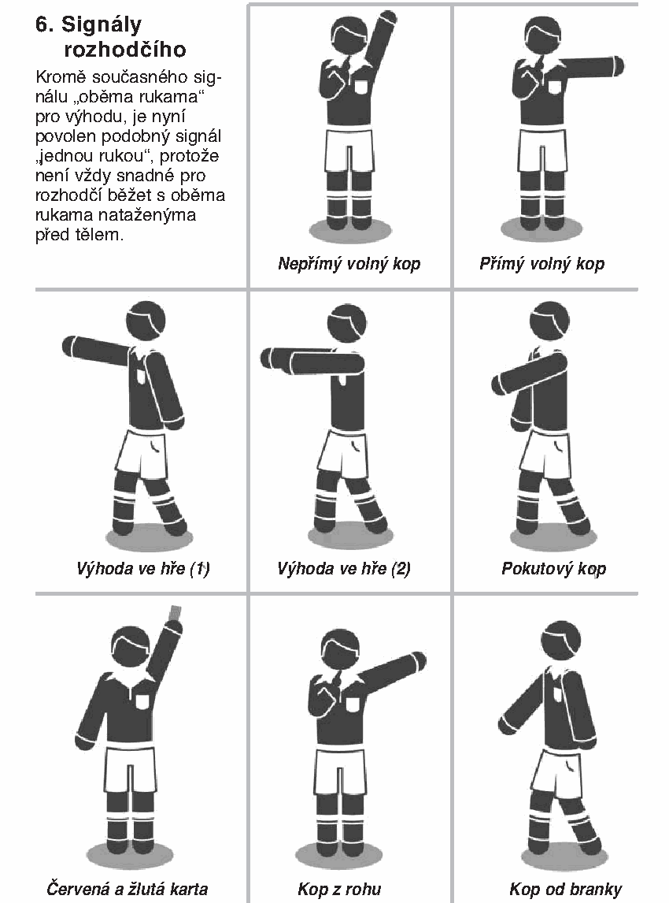

[Tištěná strana 54 · PDF 56](sources/pravidla-fotbalu-facr-2024.pdf#page=56)

**Ukázání na sluchátko – prst k uchu s prodloužením druhé ruky, signál pozdržení navázání hry za účelem komunikace s VAR**

1. zahájení přezkoumání záznamu
2. přijmutí rozhodnutí na základě přezkoumání

### 7. Odpovědnost rozhodčích

Rozhodčí nebo ostatní rozhodčí nesmí být činěni odpovědnými za:

a) žádná zranění hráčů, funkcionářů, nebo diváků

b) žádné škody na majetku jakéhokoli druhu

c) jiné újmy jakýchkoli jednotlivců, klubů, společností, asociací či jiných orgánů, které vznikly nebo mohly vzniknout v souvislosti s jeho rozhodnutími při řízení utkání, a která rozhodčí učinil podle pravidel fotbalu nebo jiných platných herních řádů.

#### Může se jednat o rozhodnutí:

a) o tom, zda stav hrací plochy, jejího příslušenství, nebo povětrnostní podmínky jsou takové, že utkání umožňují nebo neumožňují sehrát,

b) o tom, zda utkání pro povětrnostní podmínky ukončí nebo neukončí,

c) o tom, zda míč, nebo příslušenství hrací plochy, např. brankové tyče, břevno, rohové praporky apod., odpovídají příslušným ustanovením pravidel,

d) o tom, zda přeruší nebo nepřeruší hru pro incidenty v hledišti nebo pro problémy s diváky,

e) o tom, zda přeruší nebo nepřeruší hru k ošetření zraněného hráče,

f) o tom, zda dá nebo nedá pokyn k odnesení zraněného hráče mimo hrací plochu,

g) o tom, zda a v jaké míře povolí či nepovolí hráči hrát s určitou částí výstroje,

h) o tom, zda a v jaké míře povolí či nepovolí v průběhu utkání jakýmkoli oso-

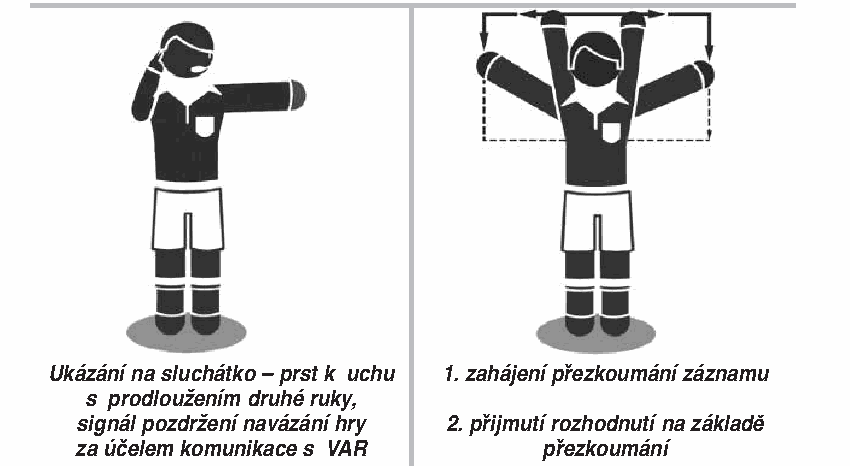

[Tištěná strana 55 · PDF 57](sources/pravidla-fotbalu-facr-2024.pdf#page=57)

bám (členům realizačního týmu, pořadatelům, fotografům a zástupcům médií) přítomnost v blízkosti hrací plochy,

i) jakékoliv jiné rozhodnutí, které rozhodčí učinil v souladu s Pravidly fotbalu nebo podle platných herních řádů FIFA, konfederací, federací, asociací a lig, podle nichž se utkání hraje.

### ROZHODNUTÍ FAČR

1\. V soutěžních utkáních musí rozhodčí používat formulář ZoU schválený FAČR, pokud nelze použít elektronický systém ZoU.

2\. Všechny údaje písemného ZoU potvrzuje svým podpisem vedoucí družstva. V případě elektronického ZoU postupuje rozhodčí a vedoucí dle příslušných ustanovení SŘ.

3\. Rozhodčí je oprávněn poskytovat informace nebo podat vysvětlení ke všem případům, které se staly před utkáním, v průběhu utkání nebo po utkání pouze ostatním delegovaným rozhodčím, delegátovi utkání a na vyzvání i příslušnému řídícímu orgánu. Nikomu jinému nesmí rozhodčí do vyřešení příslušnou odbornou komisí informace nebo vysvětlení poskytovat (pokud Rozpisem soutěže není stanoveno jinak).

4\. Rozhodčí přijímá opatření vůči funkcionářům družstva, kteří se nechovají odpovědným způsobem 4. a varuje je nebo je napomene, nebo je vyloučí. Pokud nemůže být provinilec identifikován, obdrží trest trenér přítomný v TZ. Pokud není trenér přítomen, obdrží trest vedoucí družstva.

### VÝKLAD K PRAVIDLU

#### Pravomoci rozhodčího

5.1 Pravomoc rozhodčího uplatňovat pravidla spočívá zejména v jeho oprávnění kdykoli přerušit hru pro přestupky hráčů, nařizovat herní a udělovat osobní tresty a odpovídajícím způsobem hru znovu navazovat.

Pravomoc rozhodčího nařizovat herní a udělovat osobní tresty prostřednictvím barevných karet začíná vstupem rozhodčího na hrací plochu k zahájení hry a trvá až do okamžiku, kdy hrací plochu po závěrečném signálu píšťalkou k ukončení utkání opustí.

Pravomoc rozhodčího uplatňovat pravidla trvá i po dobu poločasové přestávky, proto má rozhodčí právo hráčům, funkcionářům, náhradníkům a vystřídaným hráčům provinivším se o poločasové přestávce, udělovat osobní tresty. Pravomoc rozhodčího uplatňovat pravidla rovněž trvá i po dobu, o kterou bylo utkání prodlouženo, a v době, kdy se provádí penaltový rozstřel, včetně všech příslušných přestávek.

5.2 Pravomoc rozhodčího přijímat disciplinární opatření k proviněním příslušníků družstev začíná vstupem rozhodčího na hrací plochu k předzápasové kontrole hrací plochy a vybavení hřiště a končí odchodem z hrací plochy po ukončení utkání (včetně penaltového rozstřelu).

Ostatní provinění, ke kterým dojde mimo tuto dobu, popíše rozhodčí v ZoU.

[Tištěná strana 56 · PDF 58](sources/pravidla-fotbalu-facr-2024.pdf#page=58)

5.3 Za bezpečnost rozhodčích odpovídají kromě pořadatele utkání i příslušníci obou družstev. V případě potřeby jsou proto povinni jim poskytnout ochranu.

Je-li na rozhodčím nebo ostatních rozhodčích spáchána inzultace (viz výklad k Pravidlu 5), je rozhodčí povinen utkání ukončit a průběh události podrobně popsat v zápise o utkání. Stejnou povinnost, tzn. průběh události v ZoU podrobně popsat, má rozhodčí i v případě, jestliže v průběhu utkání nebo po jeho skončení dojde k nepřístojnostem.

#### Všeobecná ustanovení

5.4 Jestliže rozhodčí při utkání náhle onemocní nebo se zraní a nemůže utkání dále řídit, převezme řízení utkání po zjištění všech skutečností AR1 nebo 4R (je-li k utkání delegován), pokud není Rozpisem soutěže stanoveno jinak.

Zemře-li v průběhu utkání příslušník družstva nebo některý z rozhodčích nebo delegátů, utkání předčasně končí. Utkání předčasně končí i v případě, že příslušník družstva nebo rozhodčí byl při hře vážně zraněn a rozhodčí se od odpovědných funkcionářů dozví, že na následky zranění zemřel.

Zemře-li rozhodčí, utkání ukončí a splnění všech formalit zajistí AR1, (pokud není Rozpisem soutěže stanoveno jinak).

5.5 Nařídí-li příslušník Policie ČR ve veřejném zájmu utkání ukončit, oznámí to rozhodčí za účasti asistentů oběma kapitánům a vedoucím družstev. Důvod nařízení příslušníka Policie ČR k ukončení utkání uvede do ZoU s tím, že uvede jeho služební číslo.

5.6 Bez souhlasu rozhodčího nemá do jeho kabiny přístup žádná osoba kromě delegáta utkání, vedoucích družstev a dopingového komisaře, který se prokáže pověřením k provedení dopingové kontroly. Za dodržení tohoto ustanovení odpovídá hlavní pořadatel utkání.

5.7 Rozhodčí, který má příslušnou disciplinární komisí zastavenou činnost, nesmí vykonávat funkci rozhodčího ani funkci ostatních rozhodčích v žádném utkání.

#### Po příchodu k utkání

5.8 Rozhodčí je povinen dostavit se k utkání 60 minut před jeho úředně stanoveným začátkem (pokud není Soutěžním řádem nebo Rozpisem soutěže stanoveno jinak).

Před odchodem k řízení utkání se rozhodčí přesvědčí, že má:

a) kartu rozhodčího

b) předepsanou výstroj, a to v čistém stavu

c) odznak rozhodčího fotbalu

d) dobře slyšitelnou píšťalku

e) přesně jdoucí hodinky

f) minci na losování

[Tištěná strana 57 · PDF 59](sources/pravidla-fotbalu-facr-2024.pdf#page=59)

g) žlutou a červenou kartu

h) tužku a papír na poznámky

i) ZoU

Předepsaná výstroj rozhodčího se skládá z dresu, trenýrek, stulpen a kopaček. Rozhodčím je zakázáno, stejně jako hráčům, mít na sobě vyjma hodinek jakoukoli nepovolenou výstroj (např. šperky, prsteny).

5.9 Po příchodu na hřiště se rozhodčí (případně i delegovaný delegát) představí funkcionářům obou družstev a hlavnímu pořadateli, zjistí, kde má kabinu na převléknutí a zkontroluje její vybavení; na závady ve vybavení kabiny upozorní hlavního pořadatele. Dále rozhodčí zkontroluje stav a vyznačení hrací plochy a jejího příslušenství, a hlavního pořadatele požádá o odstranění zjištěných závad. Všechny zjištěné závady uvede rozhodčí v zápise o utkání. Rozhodčí je povinen domluvit se s hlavním pořadatelem na zabezpečení chodu pořadatelské služby.

#### Zápis o utkání

5.10  O každém utkání, jehož konání schválil řídící orgán, musí být pořízen ZoU (pokud není Soutěžním řádem, Rozpisem soutěže popřípadě propozicemi turnaje stanoveno jinak).

Rozhodčí utkání nejdříve 15 minut před začátkem utkání zkontroluje údaje vyplněné administrátory klubů v zápise o utkání a na základě sdělení vedoucích družstev opraví případné nedostatky v zápise o utkání. Před odchodem na hrací plochu je rozhodčí povinen uložit případné provedené změny v zápise o utkání a odhlásit se z elektronického informačního systému.

V případě písemného ZoU musí vedoucí domácího družstva předat řádně vyplněný a vedoucími družstev podepsaný ZoU nejméně 30 minut před začátkem utkání (pokud není Soutěžním řádem nebo Rozpisem soutěže stanoveno jinak). Rozhodčí zkontroluje vyplněný ZoU a přesvědčí se, zda údaje v něm uvedené odpovídají Listinám hráčů družstev.

5.11  Rozhodčí je povinen vyhovět vedoucímu družstva, přeje-li si provést kontrolu totožnosti hráčů soupeře. Přitom zajistí, aby kontrola totožnosti proběhla podle příslušných ustanovení Soutěžního řádu.

5.12  V případě opožděného příjezdu některého z družstev nebo v případě nedostavení se některého z družstev postupuje rozhodčí podle příslušných ustanovení Soutěžního řádu.

#### Před zahájením utkání

5.13  Před odchodem na hrací plochu se rozhodčí dohodne s ostatními rozhodčími o spolupráci (viz Praktické pokyny pro rozhodčí) a určí prostor pro rozcvičování náhradníků.

5.14  Před zahájením utkání rozhodčí zkontroluje výstroj hráčů. Pokud to podmínky na stadiónu umožňují, provede kontrolu výstroje ještě před nástupem hráčů na hrací plochu. V rámci kontroly výstroje rozhodčí rovněž zkontroluje

[Tištěná strana 58 · PDF 60](sources/pravidla-fotbalu-facr-2024.pdf#page=60)

, zda čísla na dresech všech hráčů a náhradníků obou družstev odpovídají údajům uvedeným v ZoU.

Kontrolou výstroje hráčů může rozhodčí pověřit asistenty rozhodčího. Za řádné provedení kontroly výstroje a přijetí případných opatření odpovídá rozhodčí.

5.15  K zahájení utkání přivede rozhodčí obě družstva na hrací plochu, kde společně pozdraví diváky. Pozdrav se provede tímto způsobem:

a) Rozhodčí se společně s asistenty postaví v cca 1/3 hloubi hrací plochy čelem k hlavní tribuně, a hráči obou družstev zaujmou postavení po jejich boku rovnoběžně s pomezní čárou tak, že kapitáni družstev stojí vedle rozhodčích.

b) Na znamení rozhodčího pozdraví hráči obou družstev diváky.

c) Kapitán domácího družstva, a po něm postupně všichni jeho spoluhráči, pozdraví podáním ruky rozhodčí a hráče soupeře.

d) Kapitán hostujícího družstva a po něm všichni jeho spoluhráči pozdraví podáním ruky rozhodčí.

Není porušením pravidla, jestliže ceremoniál zahájí jako první hráči hostujícího družstva.

Po pozdravu rozhodčí provede losování. Po losování zaujmou rozhodčí a hráči obou družstev předepsaná postavení k zahájení hry.

Poznámka: čtvrtý rozhodčí, pokud byl k utkání delegován, na hrací plochu společně s hráči a rozhodčími nenastupuje.

#### V průběhu utkání

5.16  Rozhodčí má utkání řídit v souladu se zněním a výkladem pravidel a v duchu hry. Pravidla se musí snažit uplatňovat tak, aby hra byla co nejméně přerušována.

Proto rozhodčí musí:

a) Pískat jasně a zřetelně; rozhodčí však nemusí přerušit hru písknutím při kopu od branky, kopu z rohu, vhazování a po dosažení branky (vyjma sporných situací). Ve všech ostatních případech musí rozhodčí přerušit hru písknutím.

b) Dát po každém přerušení hry znamení k pokračování ve hře píšťalkou, pokynem ruky nebo slovně; dát znamení k navázání hry píšťalkou není nutné při volných kopech, kopech od branky, kopech z rohu a při vhazování. Při volných kopech prováděných v blízkosti pokutového území se doporučuje dát znamení píšťalkou vždy, v každém případě však rozhodčí musí mít provedení volného kopu pod kontrolou. K provedení výkopu, pokutového kopu a k ukončení utkání se znamení píšťalkou musí dát vždy.

c) Používat signálů předepsaných Pravidly fotbalu.

[Tištěná strana 59 · PDF 61](sources/pravidla-fotbalu-facr-2024.pdf#page=61)

d) Pohybovat se na hrací ploše tak, aby hráčům nepřekážel ve hře, ale aby měl neustále přehled o herních situacích a o přestupcích hráčů (viz Praktické pokyny pro rozhodčí).

e) Sledovat nejen co se děje v blízkosti míče, ale kontrolovat i situaci po celé hrací ploše.

f) Pohybovat se tak, aby měl v zorném poli jednoho ze svých asistentů.

g) Uplatňovat pravidla stejným způsobem bez ohledu na to, zda je porušil hráč domácího nebo hostujícího družstva, nebo zda se přestupek stal v pokutovém území nebo na jiném místě hrací plochy.

h) Nekompenzovat své chyby rozhodováním ve prospěch poškozeného družstva.

i) Nezvýhodňovat družstvo, jež se provinilo.

j) V zárodku potlačovat surovou hru a energicky postupovat proti hrubému nesportovnímu chování hráčů.

k) Při napomínání nebo vylučování hráče zachovat klid; provinivšímu se hráči může sdělit důvod napomenutí nebo vyloučení. Doporučuje se však, aby napomínaný nebo vylučovaný hráč byl od rozhodčího vzdálen 2 až 3 m.

l) Nebavit se zbytečně s hráči a ani se jich nedotýkat.

m) Vyhýbat se přehnané gestikulaci.

n) Nedovolit, aby se v bezprostřední blízkosti hrací plochy, tj. nejméně 2 m od pomezních a 4 m od brankových čar, zdržovaly osoby cizí.

o) Dbát, aby náhradníci při rozcvičování nerušili asistenty rozhodčího ve výkonu jejich funkce.

5.17  Rozhodčí nemusí ihned přerušit hru, jestliže dojde k přestupku hráče, za který by měl nařídit volný nebo pokutový kop. Je-li názoru, že by přerušením hry zvýhodnil družstvo, jehož hráč se provinil, hru nepřerušuje a poskytne výhodu ve hře; případné osobní tresty udělí až při nejbližším přerušení hry. Při zvažování o poskytnutí výhody ve hře musí rozhodčí postupovat s citem pro herní situaci.

#### Zásady pro poskytování výhody ve hře:

a) Výhoda ve hře je zcela vědomé nepřerušení hry pro potrestání jinak zcela evidentního přestupku v situaci, kdy přerušením hry by bylo poškozeno družstvo, které se neprovinilo.

b) Uplatnění výhody ve hře je rozhodčí povinen naznačit předepsaným signálem. V případě, že výhoda ve hře neměla předpokládaný účinek, má rozhodčí právo se do několika sekund vrátit k původnímu přestupku a nařídit odpovídající volný kop; to však neplatí pro případ, že zvýhodněné družstvo přijde o míč vlastní vinou.

c) Uplatnění výhody ve hře nezbavuje rozhodčího povinnosti udělit případné osobní tresty.

[Tištěná strana 60 · PDF 62](sources/pravidla-fotbalu-facr-2024.pdf#page=62)

d) Dopustí-li se hráč přestupku nebo provinění, za který má být napomenut, ponechá rozhodčí výhodu pouze v případě, když družstvo pokračuje alespoň do slibně se rozvíjející útočné akce.

Dopustí-li se hráč přestupku nebo provinění, za který má být vyloučen (včetně vyloučení po druhém napomenutí), ponechá rozhodčí výhodu pouze v případě, když družstvo pokračuje do zjevné brankové možnosti nebo má možnost přímo dosáhnout branky.

Ve všech ostatních případech rozhodčí přeruší hru a udělí odpovídající osobní trest.

#### Nezahájení nebo předčasné ukončení utkání

5.18  Utkání nebude zahájeno nebo bude předčasně ukončeno:

a) jestliže počet hráčů jednoho z družstev klesne definitivně pod sedm,

b) při inzultaci některého z rozhodčích,

c) při úmrtí příslušníka družstva, některého z rozhodčích nebo delegátů, nebo v případě jiných mimořádných událostí (úmrtí jiných osob, těžká zranění hráčů), kdy se obě družstva shodnou na tom, že nechtějí pokračovat ve hře.

d) jestliže družstvo opustí hrací plochu jako projev nesouhlasu s rozhodováním rozhodčího,

e) na úřední zákrok orgánu Policie ČR,

f) v dalších případech uvedených v Pravidle 1 a v Soutěžním řádu.

Předčasné ukončení utkání provede rozhodčí písknutím. Poté sdělí oběma kapitánům v přítomnosti asistentů důvody svého rozhodnutí a společně s ostatními rozhodčími opustí co nejrychleji hrací plochu a prostor hřiště. Nemůže-li např. v důsledku předchozí inzultace rozhodčí sám utkání ukončit, ukončí ho některý z jeho asistentů. V případě předčasného ukončení utkání se závěrečný pozdrav neprovádí.

5.19  Jestliže je na kterémkoli rozhodčím spáchán některý z níže uvedených násilných činů a on z toho důvodu není schopen – ať již pro fyzickou nebo psychickou indispozici – pokračovat ve výkonu své funkce, tak rozhodčí, který utkání řídí, ho z důvodu inzultace rozhodčího ukončí.

Jedná se o tyto činy:

a) násilné udeření,

b) násilné kopnutí,

c) úmyslné podražení,

d) násilné vrážení,

e) násilné cloumání,

f) úmyslné vyražení píšťalky z úst,

g) úmyslné prudké udeření míčem nebo jiným předmětem.

[Tištěná strana 61 · PDF 63](sources/pravidla-fotbalu-facr-2024.pdf#page=63)

Je-li rozhodčí, který utkání řídí, tak postižen, že sám není schopen utkání ukončit, je oprávněn ukončit utkání některý z ostatních delegovaných rozhodčích. Jestliže ale v takovém případě není žádný delegovaný rozhodčí, který by utkání mohl ukončit, skončilo utkání okamžikem, kdy bylo z tohoto důvodu přerušeno.

Pouhý pokus o udeření míčem nebo jiným předmětem nebo plivnutí na rozhodčího se za inzultaci rozhodčího nepovažuje; pokud se ho však dopustí příslušník družstva, považuje se za projev hrubého nesportovního chování.

5.20  Rozhodčí má právo utkání nezahájit nebo ho předčasně ukončit z těchto důvodů:

a) Tma V případě, že pro špatnou viditelnost není zaručena regulérnost utkání, ukončí rozhodčí utkání. Přitom však dbá, aby zbytečně nepoškodil sport tím, že by utkání zkrátil pouze o několik málo minut.

b) Špatné povětrnostní podmínky Zhorší-li se během utkání povětrnostní podmínky, např. přijde prudký déšť, sněhová vánice, mlha, prudký vítr nebo bouřka s nebezpečím zásahu bleskem, rozhodčí hru přeruší. V případě, že se zhoršené podmínky nezlepší nebo trvají již tak dlouho, že by utkání nemohlo být za dobré viditelnosti dohráno, rozhodčí utkání ukončí.

c) Nezpůsobilý stav hrací plochy Jestliže v průběhu utkání se hrací plocha stala nezpůsobilou ke hře, např. vlivem prudkého deště, náhlého tání apod. a je zřejmé, že ji již nebude možno uvést do způsobilého stavu, rozhodčí utkání ukončí. Přitom však dbá, aby zbytečně nepoškodil sport tím, že by utkání zkrátil pouze o několik málo minut.

d) Neuposlechnutí rozhodčího příslušníkem družstva Zdráhá-li se vyloučený příslušník družstva opustit hrací plochu, resp. prostor hřiště, stanoví k tomu rozhodčí vedoucímu jeho družstva krátkou lhůtu, nejvýše však 2 minuty. Jestliže po uplynutí této lhůty vyloučený příslušník družstva neodejde, rozhodčí utkání ukončí (stejným způsobem jako v případě inzultace rozhodčího).

Vyloučený příslušník družstva je povinen opustit prostor hřiště.

e) Vniknutí obecenstva do prostoru hřiště Vnikne-li v průběhu utkání obecenstvo do prostoru hřiště nebo na hrací plochu, požádá rozhodčí hlavního pořadatele, aby se postaral o její vyklizení, a stanoví k tomu přiměřenou lhůtu. Nepodaří-li se hrací plochu a prostor hřiště v určené lhůtě vyklidit, rozhodčí utkání ukončí stejným způsobem jako v případě inzultace. Rozhodčím se zakazuje, aby se sami na vyklízení hrací plochy podíleli.

f) Hrubě nesportovní projevy obecenstva Dojde-li v průběhu utkání k hrubým urážkám nebo vyhrožování ze strany obecenstva, vhazování předmětů do hřiště, násilnostem mezi diváky nebo

[Tištěná strana 62 · PDF 64](sources/pravidla-fotbalu-facr-2024.pdf#page=64)

k ohrožení bezpečnosti příslušníků družstev, požádá rozhodčí hlavního pořadatele o zajištění pořádku a o zjištění případných viníků. Dojde-li k obdobným projevům i po opakované výzvě, nebo je-li diváky vážně ohroženo zdraví účastníků utkání, rozhodčí utkání ukončí (stejným způsobem jako v případě inzultace rozhodčího).

g) Porucha umělého osvětlení

Přerušení hry v utkáních hraných při umělém osvětlení z důvodu poruchy na osvětlovacím zařízení nebo z důvodu výpadku dodávky elektrické energie se považuje za zdržení, které je rozhodčí povinen nahradit nastavením doby hry. Je-li z uvedených důvodů hra v jednom utkání takto přerušena vícekrát, nemělo by celkové zdržení hry překročit 60 minut. Jestliže však součet přerušení hry již činí 60 minut, ale je naděje, že v dohledné době bude hra moci pokračovat, rozhodčí ještě přiměřeně vyčká.

5.21  Vpřípadech uvedených v čl. 5.20 v bodech e) a f) musí rozhodčí dříve, než utkání předčasně ukončí, vyčerpat všechny možnosti, aby se utkání mohlo dohrát. Kdykoli rozhodčí předčasně ukončí utkání, učiní o tom přesný a vyčerpávající záznam v ZoU.

5.22  Je zakázáno, aby řízení utkání převzal jiný kvalifikovaný nebo oddílový rozhodčí, jestliže rozhodčí, který utkání řídil, ho předčasně ukončil.

#### Postup rozhodčího při zranění hráče

5.23  Není povoleno ošetřovat hráče na hrací ploše. Rozhodčí dotazem u hráče zjistí jeho zdravotní stav a případně umožní, aby na hrací plochu vstoupila jedna nebo nejvýše dvě osoby, které odborně posoudí rozsah zranění hráče. Vyžadují-li to okolnosti, zajistí rozhodčí odchod nebo přepravu zraněného hráče z hrací plochy. Pořadatelé s nosítky smějí vstoupit na hrací plochu až na pokyn rozhodčího

Návrat ošetřovaného hráče na HP po uplynutí doby tří minut:

Na základě rozhodnutí FAČR se v neprofesionálních soutěžích doporučuje, aby se ošetřovaný hráč směl na hrací plochu vrátit nejdříve po uplynutí tří minut; je na řídícím orgánu příslušné soutěže, zda Rozpisem příslušné soutěže bude tento postup nařízen.

Pro ošetřování zraněných hráčů stanovila FAČR tento postup:

Rozhodujícím okamžikem pro opuštění hrací plochy je vstup osoby určené ke zjištění zdravotního stavu hráče či k jeho případnému ošetření. Pokud tato osoba vstoupí na hrací plochu, musí hráč následně hrací plochu opustit, i kdyby k ošetření vůbec nedošlo.

Výjimky, kdy hráči nemusí po ošetření opustit hrací plochu:

  - je zraněn a musí být ošetřen brankář

  - brankář se srazil s hráčem z pole a oba potřebují ošetření

  - srazili se dva nebo více hráčů téhož družstva a potřebují okamžité ošetření,

[Tištěná strana 63 · PDF 65](sources/pravidla-fotbalu-facr-2024.pdf#page=65)

  - došlo k vážnému zranění hráče

  - hráč je ošetřován po přestupku, za který byl provinivší se hráč soupeře napomenut nebo vyloučen a ošetření bude provedeno rychle.

  - pokud byl nařízen pokutový kop a zraněný hráč bude tento pokutový kop zahrávat.

Ve všech ostatních případech musí hráč hrací plochu opustit a smí se na ní vrátit se souhlasem R (AR) nejdříve po uplynutí doby tří minut.

Doba tří minut se měří od okamžiku navázání hry po odchodu ošetřovaného hráče z hrací plochy.

Za dodržení doby tří minut jsou odpovědni delegovaní AR; pokud k utkání nebyl delegován AR, zodpovídá rozhodčí

Pokud hráč sám opustí hrací plochu, aby se nechal ošetřit mimo ní, aniž by přitom jiná osoba vstoupila na hrací plochu, a ve hře se pokračuje, může se se svolením R vrátit na HP ihned po ošetření a nemusí čerpat dobu 3 minut

V praxi mohou nastat situace, jejichž řešení bude následující:

  - hráč po ošetření opustí hrací plochu v závěrečných minutách 1. poločasu utkání a do konce poločasu (včetně nastavené doby hry) nebude mimo HP předepsané tři minuty – po uplynutí poločasové přestávky nastupuje hráč normálně do hry, tzn., že nebude na začátku druhého poločasu čerpat zbytek z tří minut

  - opustí-li ošetřovaný hráč hrací plochu kdykoliv v průběhu utkání a družstvo tohoto hráče při nejbližším přerušení hry vystřídá, může náhradník nastoupit do hry ihned; povinnost tří minut se nepřenáší na náhradníka nastupujícího do hry

  - opustí-li ošetřovaný hráč hrací plochu kdykoliv v průběhu utkání a z tohoto důvodu klesne počet hráčů v jeho družstvu pod sedm, rozhodčí nechá pokračovat ve hře za předpokladu, že se hráč po uplynutí tří minut bude moci vrátit na hrací plochu; je-li zřejmé, že se hráč na hrací plochu vrátit nemůže a počet hráčů klesne definitivně pod sedm, R utkání předčasně ukončí pro nedostatečný počet hráčů.

#### Po ukončení utkání

5.24  Po ukončení utkání družstva poděkují rozhodčím za řízení utkání a pozdraví diváky. Ceremoniál se provede tímto způsobem:

a) Po závěrečném signálu rozhodčího píšťalkou k ukončení utkání se rozhodčí odebere do středového kruhu, kde se setká se svými asistenty.

b) Setkání rozhodčích ve středovém kruhu je signálem pro hráče obou družstev, aby se shromáždili ve středu hrací plochy.

c) Kapitán družstva odpovídá za to, že přijdou všichni hráči a postaví se za ním.

d) Pozdrav zahájí kapitán domácího družstva tak, že postupně podá ruku rozhodčím a následně i všem hráčům družstva soupeře; podobně učiní i všichni

[Tištěná strana 64 · PDF 66](sources/pravidla-fotbalu-facr-2024.pdf#page=66)

jeho spoluhráči. Následně stejným způsobem pozdraví všechny rozhodčí i všichni hráči hostujícího družstva. Není porušením pravidla, jestliže ceremoniál zahájí jako první hráči hostujícího družstva. Na způsobu provedení pozdravu musí být rozhodčí a obě družstva domluveni před vstupem na hrací plochu k zahájení utkání.

5.25  Vždy, když družstva opouštějí hrací plochu, odcházejí z hrací plochy nejdříve hosté, jejichž kapitán jde jako poslední, pak následují rozhodčí a nakonec odcházejí domácí v čele s kapitánem (není-li řídícím orgánem nebo pokynem komise rozhodčích stanoveno jinak).

5.26  Rozhodčí ihned po ukončení utkání uvede do ZoU zejména výsledek utkání, hrací dobu včetně nastavení doby hry, udělení osobních trestů a případná další opatření přijatá vůči příslušníkům družstev, a doplní ZoU o všechna provedená doplňování a střídání hráčů a střelce branek.

5.27  Dopustí-li se příslušník družstva za zády rozhodčího závažného přestupku, který nepostřehl žádný z ostatních rozhodčích, ale pouze delegát utkání, oznámí delegát po ukončení utkání v kabině rozhodčích přestupek příslušníka družstva vedoucímu družstva; rozhodčí přestupek příslušníka družstva uvede do ZoU. Dopustí-li se přestupku hráč v prvním poločase nebo o poločasové přestávce, informuje delegát rozhodčího, ale provinivší se hráč smí do druhého poločasu nastoupit.

5.28  V případě, že rozhodčí uvede do ZoU události, které by mohly být předmětem dalšího šetření, potvrdí vedoucí družstva ověřením v elektronickém informačním systému, že byl o obsahu zprávy rozhodčího informován.

5.29  K výkonu rozhodčího nelze vznášet námitky. Připomínky k pochybení rozhodčího nebo k porušení pravidel fotbalu lze uplatnit pouze formou protestu. Formu protestu stanovuje Procesní řád.

5.30  Rozhodčí je povinen v ZoU uvést všechny podstatné okolnosti (není-li řídícím orgánem stanoveno jinak).

Vyjádří se zejména:

a) k přestupkům vyloučeného příslušníka družstva (není-li řídícím orgánem stanoveno jinak),

b) k přestupkům příslušníků družstev, o kterých ho informoval delegát utkání,

c) ke svým závažným rozhodnutím a ke sporným herním situacím,

d) k délce a důvodům nastavení nebo prodloužení doby hry,

e) k dalším událostem, ke kterým došlo před utkáním, v jeho průběhu nebo po jeho ukončení.

5.31  Rozhodčí je povinen úplně a přesně ZoU nejpozději do dvanácté hodiny následujícího dne vyplnit.

[Tištěná strana 65 · PDF 67](sources/pravidla-fotbalu-facr-2024.pdf#page=67)

## Pravidlo 6 – OSTATNÍ ROZHODČÍ

K utkání mají být delegováni ostatní rozhodčí: dva asistenti rozhodčího (AR1, AR2), čtvrtý rozhodčí (4R), dva brankoví rozhodčí (AAR1, AAR2) a náhradní AR (NAR), videoasistent rozhodčího (VAR) a minimálně jeden asistent videoasistenta rozhodčího (AVAR). Ostatní rozhodčí pomáhají rozhodčímu při řízení utkání v souladu s Pravidly fotbalu, ale konečné rozhodnutí je vždy v kompetenci rozhodčího.

Rozhodčí, AR, 4R, AAR a NAR jsou rozhodčí působící na hrací ploše nebo u hrací plochy. VAR a AVAR jsou videorozhodčí (VMO) a asistují rozhodčímu v souladu s pravidly fotbalu a protokolem VAR.

Ostatní rozhodčí vykonávají svoje funkce podle Pravidel fotbalu a podle pokynů rozhodčího pomáhají rozhodčímu s posuzováním přestupků a porušením pravidel, pokud mají o situaci lepší přehled než rozhodčí. V případě neoprávněného vměšování nebo nevhodného chování je rozhodčí zbaví jejich funkce a podá zprávu příslušnému orgánu.

V případě závažných přestupků nebo porušení pravidel nebo jiných událostí, ke kterým došlo mimo zorné pole (za zády) rozhodčího a ostatních rozhodčích, musí podat zprávu příslušnému řídícímu orgánu. Jejich povinností je informovat rozhodčího a ostatní rozhodčí o každé zprávě, kterou podali příslušnému řídícímu orgánu.

Rozhodčí působící na hrací ploše (s výjimkou náhradního asistenta rozhodčího) pomáhají rozhodčímu při kontrole hrací plochy, míčů a výstroje hráčů apod. Vedou záznamy o době hry, dosažení branek, osobních trestech atd.

Soutěžní řád nebo Rozpis soutěže musí jasně uvádět, kdo nahradí rozhodčího nebo některého z ostatních rozhodčích, který není schopen nastoupit k utkání nebo pokračovat v utkání, a všechny související změny. Zejména musí být jasné, zda v případě, kdy rozhodčí není schopen pokračovat, převezme jeho funkci čtvrtý rozhodčí, AR nebo náhradní AR.

### 1. Asistent rozhodčího

Povinností asistenta je signalizovat, že

- míč celým objemem opustil hrací plochu a které družstvo je oprávněno provést kop z rohu, kop od branky, vhazování

- hráč v ofsajdové pozici má být potrestán za ofsajd

- je připraveno střídání

- při provádění pokutového kopu brankář předčasně opustil brankovou čáru

[Tištěná strana 66 · PDF 68](sources/pravidla-fotbalu-facr-2024.pdf#page=68)

a jestli míč celým objemem přešel přes brankovou čáru; pokud jsou delegováni brankoví rozhodčí, zaujme AR při provádění pokutového kopu postavení na úrovni pokutové značky

Úlohou asistenta rozhodčího je rovněž kontrolovat správný průběh střídání hráčů.

AR smí vstoupit na hrací plochu pro kontrolu vzdálenosti 9,15 metrů (10 yardů) při provádění volných kopů

### 2. Čtvrtý rozhodčí

Úlohou čtvrtého rozhodčího je rovněž:

- kontrolovat správný průběh střídání hráčů

- kontrolovat výstroj hráčů/náhradníků

- povolit návrat hráče na hrací plochu na pokyn (se souhlasem) rozhodčího

- kontrolovat výměnu míče

- signalizovat minimální délku nastavení doby hry (dle rozhodčího) na konci každého poločasu utkání (včetně prodloužení)

- informovat rozhodčího o nevhodném chování kterékoliv osoby v technické zóně

### 3. Brankový rozhodčí

Brankoví rozhodčí mají signalizovat:

- pokud míč celým objemem přešel přes brankovou čáru, včetně dosažení branky

- které družstvo má provést kop z rohu nebo kop od branky

- zda při provádění pokutových kopů neopustil brankář brankovou čáru dříve, než byl míč kopnut a jestli míč celým objemem přešel přes brankovou čáru

### 4. Náhradní AR

Povinností náhradního asistenta rozhodčího je nahradit asistenta rozhodčího, čtvrtého rozhodčího, nebo brankového rozhodčího, který není schopen pokračovat v utkání a má rozhodčímu pomáhat stejně jako ostatní rozhodčí.

### 5. Videorozhodčí

Videoasistent rozhodčího (VAR) je rozhodčí, který má rozhodčímu pomáhat přijímat rozhodnutí za použití opakovaného videozáznamu pouze při „jasné a zjevné chybě“ nebo při „přehlédnutí závažné situace“, která se týká dosažení nebo nedosažení branky, nařízení nebo nenařízení PK, přímého udělení ČK (ne po druhém napomenutí) nebo záměny identity, když rozhodčí napomíná nebo vylučuje nesprávného hráče provinivšího se družstva

Asistent videoasistenta rozhodčího (AVAR) je rozhodčí, který pomáhá videoasistentovi rozhodčího (VAR), zejména

- sleduje televizní přenos v případě, že videoasistent rozhodčího (VAR) je zaneprázdněn přezkumem opakovaného záznamu

[Tištěná strana 67 · PDF 69](sources/pravidla-fotbalu-facr-2024.pdf#page=69)

- zaznamenává poznámky videoasistenta rozhodčího (VAR) týkající se sledovaných situací a jakýchkoli komunikačních nebo technologických problémů

- pomáhá videoasistentovi rozhodčího při komunikaci s rozhodčím zejména v případě, když videoasistent rozhodčího (VAR) je zaneprázdněn přezkumem opakovaného záznamu; např. sdělením rozhodčímu, aby přerušil hru nebo pozdržel navázání hry

- zaznamenává dobu hry promarněnou při přezkumu opakovaných záznamů

- informace o rozhodnutích videoasistenta rozhodčího (VAR) sděluje příslušným orgánům

### 6. Signály asistenta rozhodčího

#### Volný kop Volný kop

#### pro útočící pro bránící

#### družstvo družstvo

#### Vhazování Vhazování

#### pro útočící pro bránící

#### družstvo družstvo

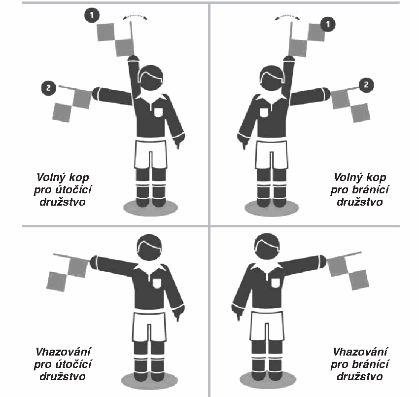

[Tištěná strana 68 · PDF 70](sources/pravidla-fotbalu-facr-2024.pdf#page=70)

#### Kop Kop

#### z rohu od branky

#### Ofsajd Ofsajd Ofsajd

#### na bližší ve středu

#### ploše hrací plochy

#### před AR

#### Ofsajd

#### na vzdálenější Střídání

#### ploše od AR

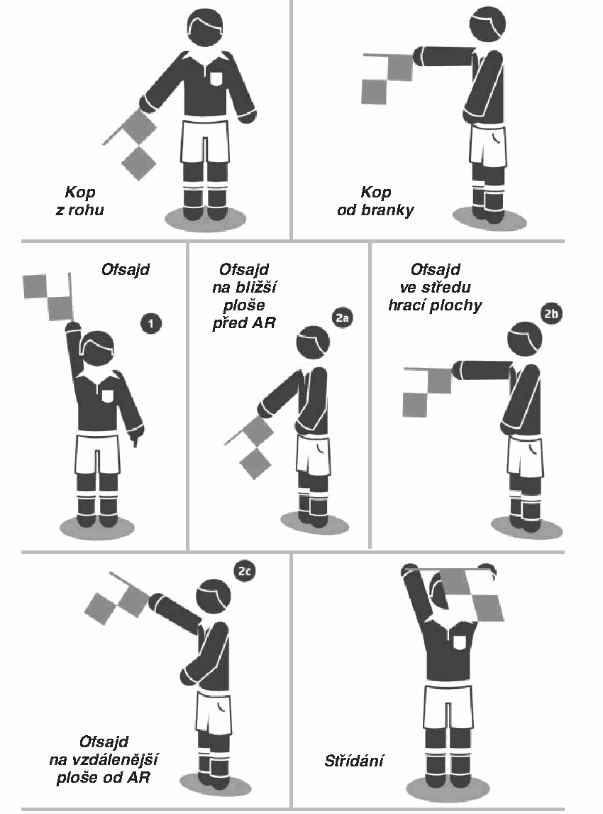

[Tištěná strana 69 · PDF 71](sources/pravidla-fotbalu-facr-2024.pdf#page=71)

### 7. Signalizace brankového rozhodčího

#### Branka

#### – když míč

#### ne zcela jasně

#### přešel přes

#### brankovou čáru

### ROZHODNUTÍ FAČR

1\. Žádné utkání se nesmí hrát bez AR, resp. bez oddílových AR.

2\. Pro utkání, na které jsou delegováni AR, platí, že AR1

a) vykonává funkci asistenta na té straně hrací plochy, kde jsou umístěny lavičky družstev,

b) v případě, že rozhodčí pro zranění nebo pro zdravotní indispozici nemůže utkání dále řídit, převezme jeho funkci, pokud k utkání nebyl delegován 4R.

3\. Praporky AR mají doporučené rozměry 30 x 50 cm a mají mít výraznou barvu, nejlépe červenou nebo žlutou. Je povinností pořadatele utkání vybavit asistenty odpovídajícími praporky.

4 . Ostatní rozhodčí jsou oprávněni poskytovat informace nebo podat vysvětlení ke všem případům, které se staly před utkáním, v průběhu utkání nebo po utkání pouze ostatním delegovaným rozhodčím, delegátovi utkání a na vyzvání i příslušnému řídícímu orgánu. Nikomu jinému nesmí ale ostatní rozhodčí do vyřešení příslušnou odbornou komisí informace nebo vysvětlení poskytovat (pokud Rozpisem soutěže není stanoveno jinak)..

5\. Ostatní rozhodčí jsou povinni rozhodčího upozornit na jeho omyl, jestliže vidí, že rozhodčí uděluje osobní trest nesprávnému příslušníkovi družstva. Měli by tak ale učinit dříve, než rozhodčí znovu zahájí hru.

### VÝKLAD K PRAVIDLU

#### Všeobecná ustanovení

6.1 Rzhodčí dbá, aby ostatní rozhodčí byli zcela nestranní. Zjistí-li rozhodčí, že neplní řádně své povinnosti, vědomě nesprávně signalizují nebo jinak porušují zásady nestrannosti, upozorní je, že v případě opakování je zprostí funkce a nahradí jiným rozhodčím.

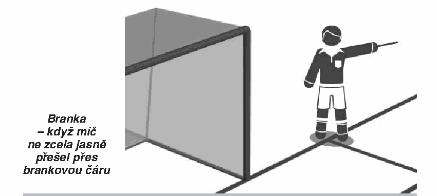

[Tištěná strana 70 · PDF 72](sources/pravidla-fotbalu-facr-2024.pdf#page=72)

6.2 Urážky, zneuctění či napadení ostatních rozhodčích se posuzují stejně jako táž provinění vůči rozhodčímu.

6.3 Jestliže AR při utkání náhle onemocní nebo se zraní a nemůže dále vykonávat svoji funkci, zajistí rozhodčí utkání jiného AR (je-li na stadionu přítomen jiný kvalifikovaný rozhodčí). Není-li na stadionu jiný kvalifikovaný rozhodčí, zajistí rozhodčí utkání oddílového AR. Bez AR nebo oddílového AR se v utkání nemůže pokračovat.

#### V průběhu utkání

6.4 AR působí po celé utkání na té straně hrací plochy, která byla určena delegací k utkání.

6.5 AR se v průběhu utkání pohybuje podél pomezní čáry mimo hrací plochu tak, aby nepřekážel ve hře a aby se ho míč mohl dotknout, jen když je ze hry. Kdyby se však přesto míč odrazil od AR zpět do hrací plochy, aniž předtím úplně přešel za pomezní nebo za brankovou čáru, je stále ve hře a rozhodčí tedy hru nepřerušuje.

6.6 AR se pohybuje na úrovni předposledního hráče bránícího družstva, protože z této pozice může nejlépe posoudit, zda hráči útočícího družstva nejsou v ofsajdové pozici. Je-li předposlední hráč bránícího družstva obehrán, musí se AR pohybovat na téže úrovni jako míč, aby měl stále přehled o tom, zda hráči útočícího družstva nejsou v ofsajdové pozici.

6.7 AR1 je povinen si v průběhu utkání všímat i chování osob na lavičkách a upozornit rozhodčího, kdykoli některá z těchto osob neoprávněně opustí technickou zónu.

AR v průběhu utkání sleduje i rozcvičování náhradníků a upozorní rozhodčího, pokud by rušivě zasahovali do průběhu utkání.

AR rovněž dbá, aby při zranění hráče nevstoupili na hrací plochu více než dva příslušníci družstva (obvykle lékař a masér), popřípadě obsluha s nosítky, ale až poté, co od rozhodčího obdrželi ke vstupu na hrací plochu souhlas.

6.8 Považuje-li AR za nutné ohlásit rozhodčímu něco, co s hrou přímo nesouvisí, sdělí mu to, až když je míč ze hry. Jen v případech vyžadujících okamžitý zákrok upozorní rozhodčího zdvihnutím praporku a pokynem ruky ho zavolá k sobě.

#### Zásady spolupráce

6.9 AR pomáhá rozhodčímu v řízení utkání v souladu s pravidly. Kromě situací uvedených přímo v Pravidle 6 ještě signalizuje zejména porušení Pravidla 11 a Pravidla 12 a dosažení branky.

Porušení Pravidla 12 signalizuje AR pouze v situacích, o kterých se domnívá, že je rozhodčí nemohl vidět, nebo v situacích, kdy rozhodčí evidentně rozhodl nesprávně; konečné rozhodnutí o přestupku však přísluší výhradně rozhodčímu.

6.10  Zásady signalizace AR jsou podrobně uvedeny v Praktických pokynech pro rozhodčí.

6.11  Signalizuje-li AR porušení pravidel, musí ihned přestat signalizovat, jestliže

[Tištěná strana 71 · PDF 73](sources/pravidla-fotbalu-facr-2024.pdf#page=73)

 mu rozhodčí dá na vědomí, že ho vidí, ale že na jeho signalizaci nehodlá brát zřetel. AR rovněž přestane signalizovat, jestliže rozhodčí jeho signalizaci nepostřehl a mezitím se herní situace změnila tak, že je zřejmé, že signalizace asistenta rozhodčího ztratila význam, s výjimkou situací uvedených v čl. 6.14.

6.12  Závažné okolnosti, které mohou podstatným způsobem ovlivnit hru, např. dosažení branky, kterou rozhodčí neviděl, nebo porušení pravidel, k nimž došlo těsně před dosažením branky (ofsajd, ruka útočícího hráče, míč ze hry), signalizuje AR až do doby, dokud ho rozhodčí nepostřehne; jeho signalizaci je povinen převzít i druhý AR. Totéž platí i pro připravené střídání hráčů.

6.13  Spolupráce AR a rozhodčího při posuzování přestupků hráčů:

  - v případě, že rozhodčí má přestupek ve svém zorném poli a AR je přesvědčen, že přestupek rozhodčí viděl lépe, přestupek nesignalizuje,

  - v případě, že rozhodčí sice přestupek viděl, ale od AR si vyžádá pomoc (např. zrakovým kontaktem), sdělí AR dohodnutým skrytým (diskrétním) signálem rozhodčímu svůj názor,

  - v případě, že k přestupku došlo mimo zorné pole rozhodčího nebo v případě, kdy AR je přesvědčen, že rozhodčí přestupek nemohl vidět, signalizuje AR přestupek předepsanou signalizací.

6.14  Přestupky, které se staly za zády rozhodčího a vyžadují podle názoru AR udělení osobního trestu, musí AR signalizovat vždy. Podle závažnosti přestupku a s přihlédnutím k možné výhodě ve hře tak učiní buď ihned, nebo až při nejbližším přerušení hry. V mimořádně závažných případech, kdy hrozí nebezpečí z prodlení, použije AR tzv. zvýrazněné signalizace (viz Praktické pokyny pro rozhodčí).

6.15  AR obvykle nemá sám uplatňovat svůj názor, pokud rozhodčí již rozhodl a před tím se asistenta na jeho názor nedotázal.

AR nesmí projevovat nesouhlas nebo nespokojenost s rozhodnutími rozhodčího.

Na hrací plochu má AR vstupovat pouze při situacích v blízkosti AR a v případech, kdy to urychlí navázání hry, zejména při nedodržení předepsané vzdálenosti bránícími hráči při provádění volných kopů v blízkosti pomezní čáry, nebo v situacích, které vyžadují okamžitý zásah rozhodčího, např. při konfliktech hráčů v přerušené hře.

6.16  Rozhodčí je povinen vyžádat si od AR informace o všech situacích, které sám jasně neviděl nebo o nichž nemohl mít dostatečný přehled a v takovém případě může rozhodnout na základě informace AR; rozhodčí se však nemá AR dotazovat na základě intervencí hráčů. Rozhodne-li rozhodčí na základě signalizace nebo informace AR, nesmí při kritických projevech diváků nebo hráčů demonstrativně ukazovat na AR a naznačovat tak jeho odpovědnost za učiněné rozhodnutí. Za každé své rozhodnutí odpovídá rozhodčí sám.

6.17  AR je povinen dostavit se k utkání 60 minut před jeho úředně stanoveným

[Tištěná strana 72 · PDF 74](sources/pravidla-fotbalu-facr-2024.pdf#page=74)

začátkem (pokud není Soutěžním řádem nebo Rozpisem soutěže stanoveno jinak).

Před odchodem k řízení utkání se AR přesvědčí, že má:

a) kartu rozhodčího

b) praporky asistenta rozhodčího

c) předepsanou výstroj, a to v čistém stavu,

d) odznak rozhodčího fotbalu,

e) dobře slyšitelnou píšťalku,

f) přesně jdoucí hodinky,

g) minci na losování,

h) žlutou a červenou kartu,

i) tužku a papír na poznámky,

j) zápis o utkání.

6.18  Předepsaná výstroj AR rozhodčího se skládá z dresu, trenýrek, stulpen a kopaček. AR je zakázáno, stejně jako hráčům, mít na sobě vyjma hodinek jakoukoli nepovolenou výstroj (např. šperky, prsteny).

### ODDÍLOVÝ ROZHODČÍ

Oddílový (laický) rozhodčí nebo oddílový (laický) asistent rozhodčího musí být členem FAČR.

#### Nedostavení se delegovaného rozhodčího

6.19  Rozhodčí i asistenti rozhodčího jsou povinni dostavit se na stadión nejméně 60 minut před úředním začátkem utkání (pokud není Soutěžním řádem nebo Rozpisem soutěže stanoveno jinak). Čekací doba pro rozhodčího je stanovena na nejvýše 20 minut po úředně stanoveném začátku utkání, pro asistenty rozhodčího a ostatní rozhodčí se čekací doba neuplatňuje.

#### Nedostavení se delegovaného rozhodčího na utkání, ke kterému byli

#### delegováni asistenti rozhodčího a čtvrtý rozhodčí

6.20  Nedostaví-li se rozhodčí ani v čekací době, převezme řízení utkání čtvrtý rozhodčí. Převzal-li řízení čtvrtý rozhodčí, řídí utkání až do konce, i kdyby se delegovaný rozhodčí dostavil opožděně.

#### Nedostavení se delegovaného rozhodčího na utkání, ke kterému byli

#### delegováni asistenti rozhodčího

6.21  Nedostaví-li se rozhodčí ani v čekací době, převezme řízení utkání první AR (asistent, který v delegaci na utkání byl uveden na prvním místě) a funkci prvního AR převezme druhý AR. Převzal-li řízení utkání AR, řídí utkání až do konce, i kdyby se delegovaný rozhodčí dostavil opožděně. Funkci druhého asistenta rozhodčího převezme oddílový asistent rozhodčího ustanovený postupem uvedeným ve článcích 6.31 a 6.32.

[Tištěná strana 73 · PDF 75](sources/pravidla-fotbalu-facr-2024.pdf#page=75)

6.22  Nedostaví-li se rozhodčí a jeden z asistentů ani v čekací době, převezme řízení utkání druhý z asistentů. Jestliže se v dalším průběhu utkání dodatečně dostaví delegovaný rozhodčí nebo druhý asistent, převezme funkci asistenta.

6.23  Nedostaví-li se rozhodčí ani žádný z delegovaných asistentů rozhodčího ani v čekací době, postupuje se podle článků 6.24, 6.25, 6.26 a 6.27. Dostaví-li se některý z nich opožděně, převezme funkci rozhodčího první z těch delegovaných rozhodčích, kteří se dostavili dodatečně. Další opožděně se dostavivší delegovaní rozhodčí převezmou postupně funkce AR1 a AR2.

#### Nedostavení se delegovaného rozhodčího na utkání, ke kterému

#### n e b y l i delegováni asistenti rozhodčího

6.24  Nedostaví-li se delegovaný rozhodčí ani v čekací době a nejsou-li k utkání delegováni asistenti rozhodčího, převezme řízení utkání jiný kvalifikovaný rozhodčí, pokud je na stadiónu přítomen. Tento rozhodčí je povinen se na vyzvání pořadatele přihlásit a utkání řídit, pokud mu v tom nebrání důvody hodné zvláštního zřetele, např. zdravotní indispozice. Převzal-li řízení utkání jiný kvalifikovaný rozhodčí, řídí utkání až do konce, i kdyby se delegovaný rozhodčí opožděně dostavil.

6.25  Dostaví-li se delegovaný rozhodčí opožděně k utkání, které zahájil a řídí oddílový rozhodčí, převezme v přerušené hře řízení utkání a po zjištění všech skutečností (stavu utkání, odehrané doby hry, střídání resp. napomínání a vyloučení hráčů) ho řídí až do konce.

6.26  Není-li k dispozici jiný kvalifikovaný rozhodčí, jsou oba vedoucí družstev povinni dohodnout se na oddílovém rozhodčím a za jeho řízení soutěžní utkání sehrát. Jestliže se vedoucí nedohodnou, rozhodne se losem o tom, které z družstev oddílového rozhodčího určí. Výsledek dohody nebo losování uvede takto ustanovený rozhodčí ještě před zahájením utkání do ZoU.

6.27  Kvalifikovaný nebo oddílový rozhodčí smí utkání zahájit až po uplynutí čekací doby.

#### Práva a povinnosti kvalifikovaných rozhodčích

6.28  Kvalifikovaný rozhodčí má po dobu výkonu funkce rozhodčího stejná práva a povinnosti daná Pravidly fotbalu (vč. nároku na odměnu za řízení utkání) jako delegovaný rozhodčí s tím, že nemusí utkání řídit v předepsaném úboru; pořadatel utkání je však povinen zapůjčit mu vhodný sportovní oděv.

#### Práva a povinnosti oddílových rozhodčích

6.29  Oddílový rozhodčí musí být osoba starší 18 let. Funkci oddílového rozhodčího nesmí zastávat žádný z příslušníků družstva, hlavní pořadatel ani žádný člen pořadatelské služby.

6.30  Oddílový rozhodčí má po dobu výkonu funkce rozhodčího stejná práva a povinnosti daná Pravidly fotbalu (kromě nároku na odměnu za řízení utkání) jako delegovaný rozhodčí s tím, že nemusí utkání řídit v předepsaném úboru, pořadatel utkání je však povinen zapůjčit mu vhodný sportovní oděv.

[Tištěná strana 74 · PDF 76](sources/pravidla-fotbalu-facr-2024.pdf#page=76)

#### Nedostavení se delegovaného AR na utkání, ke kterému byli delego-

#### váni asistenti rozhodčího

6.31  Nedostaví-li se AR, převezme jeho funkci jiný kvalifikovaný rozhodčí, pokud je na stadiónu přítomen. Tento rozhodčí je povinen se na vyzvání pořadatele přihlásit a utkání řídit, pokud mu v tom nebrání důvody hodné zvláštního zřetele, např. zdravotní indispozice. Převzal-li funkci asistenta rozhodčího jiný kvalifikovaný rozhodčí, setrvá v této funkci až do konce, i kdyby se delegovaný asistent rozhodčího opožděně dostavil. Čtvrtý rozhodčí funkci asistenta nepřejímá (pokud Rozpis příslušné soutěže nebo pokyny příslušné komise rozhodčích nestanoví jinak).

6.32  Není-li přítomen jiný kvalifikovaný rozhodčí, jsou oba vedoucí družstev povinni dohodnout se na oddílovém asistentovi rozhodčího. Jestliže se nedohodnou, rozhodne se losem o tom, které z družstev oddílového asistenta rozhodčího určí. Výsledek dohody nebo losování uvede rozhodčí ještě před zahájením utkání do ZoU.

Dostaví-li se delegovaný AR opožděně k utkání, kde funkci AR již vykonává oddílový asistent rozhodčího, je delegovaný AR povinen kdykoliv v průběhu utkání v přerušené hře a po zjištění všech skutečností (stavu utkání, odehrané doby hry, střídání resp. napomínání a vyloučení hráčů) od něj funkci převzít.

#### Určení oddílového asistenta rozhodčího v utkáních, ke kterým byl

#### delegován pouze jeden AR

6.33  Je-li k utkání delegován pouze jeden AR, jsou oba vedoucí družstev povinni dohodnout se na druhém oddílovém AR. Jestliže se vedoucí nedohodnou, rozhodne se losem o tom, které z družstev druhého oddílového AR určí. Výsledek dohody nebo losování uvede rozhodčí ještě před zahájením utkání do ZoU.

#### Určení oddílových asistentů rozhodčího v utkáních, ke kterým

#### nebyli delegováni AR

6.34  Jestliže k utkání nebyli delegováni AR, plní funkci AR oddíloví asistenti rozhodčího. Oddílové asistenty rozhodčího určí obě družstva; v případě, že jedno z družstev tuto povinnost nemůže splnit, určí oba oddílové asistenty rozhodčího družstvo druhé. Není-li pořadatelem utkání ani jedno ze zúčastněných družstev, určí oddílové asistenty rozhodčího pořadatel utkání. Obsazení funkcí oddílových asistentů rozhodčích uvede rozhodčí ještě před zahájením utkání do ZoU.

#### Práva a povinnosti oddílových asistentů rozhodčího

6.35  Oddílový asistent rozhodčího musí být osoba starší 18 let; v utkáních mládeže musí být oddílový asistent rozhodčího nejméně stejného věku jako hráči příslušné soutěže. Družstva jsou odpovědná za to, že do funkce oddílových asistentů rozhodčího určí osoby, o nichž vědí, že dostatečně ovládají Pravidla fotbalu, jsou disciplinované, skýtají záruku nestrannosti a jsou

[Tištěná strana 75 · PDF 77](sources/pravidla-fotbalu-facr-2024.pdf#page=77)

dostatečně fyzicky zdatné. Funkci oddílového asistenta rozhodčího nesmí zastávat žádný z příslušníků družstva, hlavní pořadatel ani žádný z členů pořadatelské služby.

6.36  Oba oddíloví asistenti rozhodčího se před utkáním ohlásí u rozhodčího. Rozhodčí jim určí jejich rozestavení na hrací ploše s tím, že je oprávněn jejich rozestavení podle svého uvážení pro každý poločas změnit. Dále jim dá pokyny ke spolupráci na hrací ploše a zejména je upozorní, že jeho rozhodnutí jsou konečná a že nemají právo reklamovat změnu rozhodnutí, i když s ním nebudou souhlasit.

6.37  Základním úkolem oddílového asistenta rozhodčího je signalizovat, že míč úplně přešel pomezní čáru. Pokud však rozhodčí zjistí, že oddílový asistent rozhodčího je natolik zkušený a objektivní, že je schopen se na řízení utkání podílet ve větší míře, může jeho pravomoc rozšířit i o další povinnosti asistenta rozhodčího; vždy však s tou výhradou, že rozhodnutí rozhodčího jsou konečná.

6.38  Dojde-li ale při utkání k situaci, kterou rozhodčí sám neviděl, může rozhodnout na základě signalizace nebo na základě informací oddílového asistenta rozhodčího, ale jen tehdy, považuje-li jeho informace za dostatečně objektivní.

6.39  Oddíloví asistenti rozhodčího nastupují při utkání k pozdravu a k losování společně s rozhodčím, jen jsou-li sportovně oblečeni. O vhodnosti nástupu oddílových asistentů rozhodčích rozhodne rozhodčí.

6.40  Oddílový asistent rozhodčího nemusí nastoupit v předepsaném úboru, pořadatel utkání je však povinen zapůjčit mu vhodný sportovní oděv.

6.41  Oddílový asistent rozhodčího nemá při výkonu své funkce nárok na odměnu za řízení utkání.

#### Další ustanovení

6.42  Pro případ řízení utkání kvalifikovaným nebo oddílovým rozhodčím je pořádající oddíl povinen mít k dispozici ZoU, píšťalku, červenou a žlutou kartu, hodinky, minci na losování a psací potřeby.

6.43  Pořadatel utkání je povinen mít k dispozici signalizační praporky. Látka praporku má doporučené rozměry 50 x 30 cm a má mít výraznou barvu, nejlépe červenou nebo žlutou.

6.44  Pořádající oddíl je odpovědný za správné vyplnění ZoU před utkáním. Řídí-li utkání kvalifikovaný nebo oddílový rozhodčí, je administrátor organizátora utkání odpovědný za řádné vyplnění a odeslání ZoU (viz Soutěžní řád FAČR).

6.45  Delegát utkání nesmí převzít funkci oddílového rozhodčího ani oddílového asistenta rozhodčího (pokud není Soutěžním řádem nebo Rozpisem soutěže stanoveno jinak).

6.46  Funkci oddílového rozhodčího nebo oddílového asistenta rozhodčího nesmí zastávat osoba, která má zastavenu závodní činnost nebo má zákaz výkonu jakékoliv funkce nebo je v disciplinárním řízení.

[Tištěná strana 76 · PDF 78](sources/pravidla-fotbalu-facr-2024.pdf#page=78)

## Pravidlo 7 – DOBA HRY

### 1. Rozdělení doby hry

Utkání se hraje na dva poločasy po 45 minutách, které mohou být zkráceny pouze po dohodě mezi rozhodčím a oběma družstvy učiněné před začátkem utkání, a pokud je to v souladu s Pravidly fotbalu.

### 2. Poločasová přestávka

Hráči mají nárok na poločasovou přestávku, která trvá nejvýše 15 minut. Krátká přestávka na občerstvení je povolena v poločasu prodloužené doby hry k určení vítěze utkání a neměla by přesáhnout jednu minutu. Pravidly fotbalu musí být stanovena délka poločasové přestávky; ta může být změněna pouze se souhlasem rozhodčího.

### 3. Nastavení promeškané doby hry

Rozhodčí nastaví každý poločas o celou dobu, která v něm byla promeškána při

- střídání hráčů

- ošetřování a/nebo odchodu zraněných hráčů

- zdržování hry

- udělování osobních trestů

- zdravotních přestávkách povolených soutěžním řádem, např. přestávka na pití (která nemá trvat déle než 1 minutu) nebo ochlazovací přestávka (90 sekund až 3 minuty)

- oslavách při dosažení branky

- z jiných důvodů, včetně významných zdržení při navazování hry (např. při zásahu vnějšího vlivu)

- přezkoumání opakovaného záznamu videorozhodčím nebo rozhodčím

Na základě rozhodnutí rozhodčího signalizuje na konci poslední minuty každého poločasu čtvrtý rozhodčí minimální délku nastavení doby hry. Doba nastavení hry může být rozhodčím prodloužena, ale nesmí být zkrácena.

Chyby měření času v prvním poločase nesmí rozhodčí kompenzovat ve druhém poločase.

### 4. Pokutový kop

Má-li být proveden nebo opakován pokutový kop, prodlouží rozhodčí dobu hry poločasu pro dokončení akce pokutového kopu.

[Tištěná strana 77 · PDF 79](sources/pravidla-fotbalu-facr-2024.pdf#page=79)

### 5. Předčasně ukončené utkání

Z jakéhokoli důvodu předčasně ukončené utkání se musí opakovat, není-li příslušným řídícím orgánem stanoveno jinak.

### ROZHODNUTÍ FAČR

1\. Doba hry pro soutěžní utkání je stanovena takto:

a) muži dva poločasy po 45 minutách

b) starší dorost dva poločasy po 45 minutách (pokud není Soutěžním řádem nebo Rozpisem příslušné soutěže stanoveno jinak)

c) mladší dorost dva poločasy po 40 minutách c) (pokud není Soutěžním řádem nebo Rozpisem příslušné soutěže stanoveno jinak)

d) starší žáci dva poločasy po 35 minutách c) (pokud není Soutěžním řádem nebo Rozpisem příslušné soutěže stanoveno jinak)

e) ženy dva poločasy po 45 minutách

Doba hry pro kategorie zde neuvedené se řídí Pravidly malých forem fotbalu, případně Rozpisem příslušné soutěže.

2\. Doba trvání poločasové přestávky je stanovena takto:

a) v soutěžních utkáních 15 minut, pokud není Soutěžním řádem nebo Rozpisem soutěže stanoveno jinak

b) v přátelských utkáních dohodou družstev

c) v utkáních mládeže a žen 15 minut; doba poločasové přestávky musí být dodržena

d) v turnajových utkáních propozicemi turnaje

3\. Časomíra na stadionu: na stadionech, kde je k dispozici časomíra, se tato zastavuje po uplynutí poslední minuty řádné doby hry obou poločasů.

### VÝKLAD K PRAVIDLU

#### Doba hry

7.1 Dobu hry měří rozhodčí od okamžiku, kdy byl správně proveden výkop k zahájení utkání, nikoli od okamžiku, kdy dal píšťalkou znamení k provedení tohoto výkopu. Znamení píšťalkou k ukončení doby hry dá rozhodčí:

a) po uplynutí doby hry (včetně případného nastavení doby hry)

b) po uplynutí prodloužení, jestliže rozhodčí dobu hry prodloužil k provedení pokutového kopu nařízeného v řádné době hry

c) po uplynutí prodloužení (včetně případného dalšího nastavení doby hry) v utkáních, v nichž se má o výsledku rozhodnout v tomto prodloužení

7.2 Pouze hodinky rozhodčího jsou směrodatné pro měření doby hry. Přesto se doporučuje

[Tištěná strana 78 · PDF 80](sources/pravidla-fotbalu-facr-2024.pdf#page=80)

, aby si je rozhodčí před zahájením utkání porovnal s hodinkami svých asistentů rozhodčího a s hodinkami čtvrtého rozhodčího, aby tak dobu hry mohli měřit i oni. Konečné rozhodnutí o trvání doby hry však náleží pouze rozhodčímu.

7.3 V soutěžních utkáních nesmí rozhodčí předepsanou dobu hry zkrátit, ani kdyby družstva nastoupila až po uplynutí čekací doby. V přátelských utkáních může rozhodčí dobu hry zkrátit, např. pro pozdní nastoupení jednoho z družstev. Dobu hry však musí zkrátit rovnoměrně v obou poločasech a musí o tom před utkáním informovat kapitány obou družstev.

7.4 Pořádání mimořádných soutěží, turnajových utkání apod. s kratší dobou hry se řídí propozicemi soutěže (turnaje), které schvaluje příslušný řídící orgán. Rozhodčí musí být s těmito propozicemi před utkáním obeznámen.

#### Nastavení doby hry

7.5 Doba, kdy je míč ze hry, se započítává do doby hry, pokud přerušení vyplynulo z normálního průběhu hry. Doba hry promeškaná jiným způsobem se do doby hry nepočítá a rozhodčí je povinen ji nahradit. Ke zdržením, která se do doby hry nezapočítávají a která je rozhodčí povinen nastavením času nahradit, patří např.

a) zdržování při střídání hráčů

b) zjišťování stavu zraněného hráče na hrací ploše, jeho ošetřování nebo odnesení z hrací plochy

c) doba promarněná procedurou provádění pokutovéh kopu

d) doba promarněná při oslavách po dosažení branky

e) převlékání úborů hráčů při výměně brankáře a hráče z pole

f) doba promarněná úpravou výstroje brankáře

g) jakékoli způsoby nesportovního zdržování hry, např. pomalý odchod vyloučeného hráče z hrací plochy, zakopávání míče mimo hrací plochu, zdržování při některém ze způsobů navázání hry

h) oprava poškozené branky, brankové sítě nebo výměna poškozených rohových praporků

i) oprava vyznačení hrací plochy

j) výměna poškozeného nebo zakopnutého míče

k) vyklízení hrací plochy, na kterou vnikli diváci

l) vyklízení prostorů hřiště, v nichž se bez souhlasu rozhodčího zdržují osoby cizí

m) dočasné přerušení hry z důvodu zhoršení povětrnostních podmínek

n) přerušení způsobené poruchou osvětlení nebo přerušením dodávky elektrické energie

o) jiné dočasné přerušení hry z důvodů nesouvisejících se hrou

Dobu hry rozhodčí nastaví o skutečně promarněný čas. Dobu hry rozhodčí nastaví v tom poločase, ve kterém byla promeškána. Délku případného nastavení doby hry oznámí rozhodčí před koncem řádné hrací doby každého poločasu

[Tištěná strana 79 · PDF 81](sources/pravidla-fotbalu-facr-2024.pdf#page=81)

 vhodným způsobem AR1 (popřípadě čtvrtému rozhodčímu), který zajistí její zveřejnění. Oznámenou délku nastavení doby hry musí rozhodčí dodržet. Pokud v nastavené době hry vznikne povinnost dobu hry znovu nastavit; toto nastavení se již nezveřejňuje.

#### Prodloužení doby hry

7.6 Rozhodčí musí prodloužit dobu hry k provedení pokutového kopu, který byl nařízen v době hry před ukončením poločasu. Pokud se provedení pokutového kopu musí opakovat, prodlouží rozhodčí znovu dobu hry o dobu potřebnou k jeho opakovanému provedení.

#### Poločasová přestávka

7.7 Od poločasové přestávky lze na přání obou družstev upustit. Kdyby však na poločasové přestávce trval třeba jen jediný hráč, musí rozhodčí stanovenou nebo dohodnutou dobu poločasové přestávky dodržet. V utkáních mládeže a žen musí být doba poločasové přestávky dodržena vždy.

7.8 Za dodržení stanovené nebo dohodnuté doby poločasové přestávky odpovídá rozhodčí. Poločasová přestávka včetně odchodu a návratu hráčů a rozhodčích na hrací plochu nemá být delší než 15 minut, pokud příslušný řídící orgán nestanoví jinak.

Dobu trvání poločasové přestávky však rozhodčí může v odůvodněných případech upravit, např. prodloužit pro provedení kontroly totožnosti, nebo upravit z jiných důvodů, např. proto, že z utkání se provádí přímý TV přenos. Důvody úpravy doby poločasové přestávky uvede rozhodčí v zápise o utkání.

#### Prodloužení doby hry k určení vítěze utkání

7.9 Rozpis soutěže nebo propozice turnaje mohou stanovit, že v případě, kdy po skončení doby hry obou poločasů utkání bude výsledek utkání nebo dvojutkání hrané systémem doma venku nerozhodný, se o vítězi utkání rozhodne v prodloužené době hry. Prodloužená doba hry pro určení vítěze utkání musí být rozdělena na dvě časově stejné poloviny.

7.10  Před prodloužením doby k určení vítěze utkání hry mají hráči nárok na přestávku, během níž se však rozhodčí i hráči obou družstev musí zdržovat na hrací ploše. Tato přestávka nemá být delší než 5 minut, pokud Rozpis soutěže nebo propozice turnaje nestanoví jinak. Po skončení této přestávky provede rozhodčí s kapitány družstev losování, jímž se určí družstvo, které zahájí hru. Losování se provádí stejným způsobem jako před zahájením hry.

Po uplynutí první poloviny prodloužené doby hry přestávka není; družstva si pouze vymění poloviny hrací plochy a ve hře se ihned pokračuje výkopem, ale je povolena krátká přestávka na občerstvení, která nemá přesáhnout 1 minutu.

7.11  Rozpis soutěže nebo propozice turnaje mohou rovněž stanovit, že v případech, kdy po ukončení doby hry nebo po ukončení prodloužené doby hry bude výsledek utkání nerozhodný, se vítěz utkání určí penaltovým rozstřelem. V těchto případech se čas potřebný k provedení těchto kopů do doby hry nezapočítává, ale přestupky proti Pravidlům fotbalu, jichž se hráči v této době dopustí, se kvalifikují jako přestupky v době hry.

[Tištěná strana 80 · PDF 82](sources/pravidla-fotbalu-facr-2024.pdf#page=82)

## Pravidlo 8 – ZAHÁJENÍ A NAVAZOVÁNÍ HRY

Výkopem začínají oba poločasy utkání, oba poločasy doby hry prodloužené k určení vítěze utkání a výkopem je navázána hra poté, co bylo dosaženo branky. Volné kopy (přímé nebo nepřímé), pokutové kopy, vhazování, kopy od branky a kopy z rohu, jsou dalšími způsoby navázání hry (viz. Pravidla 13 až 17).

Míč rozhodčího je způsob navázání hry v případě, kdy rozhodčí hru přerušil a Pravidly fotbalu není stanoven žádný z výše uvedených způsobů navázání hry.

Pokud dojde k porušení pravidel v době, kdy není míč ve hře, nemění se způsob navázání hry.

### 1. Výkop

#### Procedura

- rozhodčí provede los mincí a dužstvo, ktreré vyhraje los, se rozhodne, na kterou branku bude útočit v prvním poločase nebo zda provede výkop

- v závislosti na výše uvedeném družstvo soupeře provede výkop nebo se rozhodne, na kterou branku bude útočit v prvním poločase

- družstvo, které se rozhodne, na kterou branku bude útočit v prvním poločase, provede výkop k zahájení druhého poločasu

- před druhým poločasem si družstva vymění strany a útočí na opačné branky

- poté, co družstvo vstřelilo branku, provede výkop družstvo soupeře

Při všech výkopech

- všichni hráči musí být na své polovině hrací plochy s výjimkou hráče provádějícího výkop

- hráči družstva, které neprovádí výkop, musí být nejméně 9,15 m (10 yardů) od míče, dokud míč není ve hře

- míč musí být v klidu na středové značce

- rozhodčí dá signál píšťalkou

- míč je ve hře, jestliže byl kopnut a zjevně se pohnul

- branky může být dosaženo přímo z výkopu do branky soupeře; pokud se míč dostane do branky hráče provádějícího výkop, je ve prospěch soupeřova družstva nařízen kop z rohu.

[Tištěná strana 81 · PDF 83](sources/pravidla-fotbalu-facr-2024.pdf#page=83)

#### Porušení pravidla a sankce

Pokud se hráč provádějící výkop dotkne míče podruhé dříve, než se jej dotkl jiný hráč, nařídí rozhodčí nepřímý volný kop nebo při hraní míče rukou přímý volný kop.

Při každém jiném porušení procedury se výkop opakuje.

### 2. Míč rozhodčího

#### Procedura

- míč rozhodčího je proveden pro brankáře bránícího družstva v jeho pokutovém území, pokud v okamžiku přerušení hry:

– míč byl v pokutovém území, nebo

– k poslednímu dotyku s míčem došlo v pokutovém území

- ve všech ostatních případech provede rozhodčí míč rozhodčího pro jednoho z hráčů družstva, které hrálo míčem naposledy v místě, kde se míče dotkl hráč nebo vnější vliv nebo kde se míče dotkl rozhodčí, jak je uvedeno v článku 1 Pravidla 9

- všichni ostatní hráči obou družstev musí zůstat nejméně 4 m (4,5 yardu) od míče, dokud míč nebude ve hře

Míč je ve hře, když se dotkne země.

#### Porušení pravidla a sankce

Míč rozhodčího se opakuje, jestliže

- míč se dotkne některého hráče dříve než země

- míč opustil hrací plochu poté, co se dotkl země, aniž by se ho předtím dotkl některý z hráčů

Pokud se míč dostane do branky, aniž by se ho předtím dotkli alespoň dva hráči, naváže rozhodčí hru

- kopem od branky, pokud se míč dostane do soupeřovy branky

- kopem z rohu, pokud se míč dostane do vlastní branky

### VÝKLAD K PRAVIDLU

#### V ý k o p

8.1 Před zahájením utkání provede rozhodčí na hrací ploše za účasti kapitánů obou družstev a AR losování. Losování se provádí vždy mincí, stranu mince si zvolí kapitán hostujícího družstva. Kapitán družstva, jež vyhrálo los, si vybere polovinu hrací plochy nebo zda provede výkop.

K provedení výkopu musí rozhodčí vždy dát znamení píšťalkou. Je zakázáno, aby řádný výkop provedly jiné osoby, než hráči zúčastnění na hře.

[Tištěná strana 82 · PDF 84](sources/pravidla-fotbalu-facr-2024.pdf#page=84)

8.2 Výkop je proveden správně, jestliže po znamení rozhodčího k jeho provedení:

- míč, ležící volně a nehybně na středové značce, byl hráčem strany oprávněné k provedení výkopu kopnut tak, že se zjevně pohnul kterýmkoli směrem

- hráči obou družstev neporušili rozestavení stanovené pravidlem dříve, než se míč dostal do hry.

Teprve po správně provedeném výkopu smějí hráči soupeřova družstva vstoupit do středového kruhu a hráči obou družstev (s výjimkou hráče provádějícího výkop) na soupeřovu polovinu hrací plochy.

8.3 Po nesprávně provedeném výkopu nechá rozhodčí výkop opakovat. Hráče, kteří proceduru provádění výkopu poruší opakovaně, rozhodčí napomene.

8.4 Z výkopu může být přímo dosaženo branky ve prospěch družstva, které výkop provádí. Dostane-li se míč přímo z výkopu do soupeřovy branky, rozhodčí ji uzná a hru naváže výkopem hráč soupeřova družstva.

V případě, že hráč provádějící výkop přímo z výkopu dosáhne branky, a některý z hráčů soupeře přitom předčasně porušil předepsané postavení, rozhodčí branku uzná.

V případě, že přímo z výkopu bylo dosaženo branky a předtím porušil pravidlo hráč provádějící výkop nebo jeho spoluhráč, rozhodčí branku neuzná a nechá výkop opakovat.

#### Míč rozhodčího

8.5 Míčem rozhodčího naváže rozhodčí hru, jestliže ji přerušil z jiného důvodu, než pro který se hra navazuje nějakým kopem nebo vhazováním. Tímto důvodem může být např. to, že

- nastaly takové povětrnostní podmínky, které neumožňují pokračovat ve hře, nebo

- došlo k poškození branky, brankové sítě, rohového praporku nebo vyznačení hrací plochy, nebo

- hrací plocha nebo míč se staly nezpůsobilými ke hře, nebo

- vnější vliv na hrací ploše zasáhl míč nebo ovlivnil hru, nebo

- rozhodčí považoval za nutné ihned zkontrolovat míč, nebo

- hráč byl vážně zraněn, aniž přitom došlo k porušení pravidel, nebo

- rozhodčí ihned po přerušení hry poznal, že se přerušením hry dopustil omylu, ať již z viny vlastní nebo z viny asistenta rozhodčího, nebo

- nastaly okolnosti, které sice přímo nesouvisely se hrou, ale podle názoru rozhodčího bylo nutno hru přerušit.

8.6 Při provádění míče rozhodčího nemusí rozhodčí dávat signál píšťalkou. Míč rozhodčího provede rozhodčí tak, že míč z výše pasu pustí volně před sebe na zem.

[Tištěná strana 83 · PDF 85](sources/pravidla-fotbalu-facr-2024.pdf#page=85)

8.7 Při míči rozhodčího nemůže být hráč v ofsajdu; to znamená, že kterýkoli hráč může bezprostředně po správném provedení míče rozhodčího pokračovat ve hře i když je v ofsajdové pozici.

8.8 Rozhodčí neuzná branku, jestliže se bezprostředně po správném provedení míče rozhodčího nedotknou míče alespoň dva hráči.

8.9 Hra se po kontaktu míče a rozhodčího naváže míčem rozhodčího pouze v případě, že míč zůstane na hrací ploše; jde-li míč mimo hrací plochu, je hra navázána, jakoby se míč rozhodčího nedotkl.

8.10  Hráč, který se po míči rozhodčího dotkne míče podruhé, vyjma hry rukou, neporušuje pravidlo.

#### Uctění památky zesnulého

8.11  Uctění památky zesnulého trvá jednu minutu a provádí se před výkopem k zahájení hry.

#### Čestný výkop

8.12  Čestný výkop provádí před zahájením utkání osoba cizí. Rozhodčí nechá cizí osobu provést výkop stejným způsobem jako výkop k zahájení hry. Po provedení čestného výkopu rozhodčí ihned akci zastaví a vyčká, až osoba, která čestný výkop provedla, opustí hrací plochu. Teprve potom dá rozhodčí pokyn k provedení výkopu k zahájení hry. Čas potřebný pro provedení čestného výkopu se do doby hry nezapočítává. Čestný výkop by neměl ovlivnit řádný začátek utkání.

[Tištěná strana 84 · PDF 86](sources/pravidla-fotbalu-facr-2024.pdf#page=86)

## Pravidlo 9 – MÍČ VE HŘE A MÍČ ZE HRY

#### 1. Míč ze hry

Míč je ze hry, jestliže

- přejde po zemi nebo ve vzduchu celým objemem brankovou nebo pomezní čáru, nebo

- rozhodčí přeruší hru

- se dotkne rozhodčího, zůstane na hrací ploše a tím:

– družstvo založí slibnou útočnou akci nebo

– míč jde přímo do branky nebo

– změní se družstvo, které má v držení míč

Ve všech těchto případech se hra naváže míčem rozhodčího.

#### 2. Míč ve hře

Míč je ve hře ve všech ostatních případech, i když se dotkne rozhodčího nebo když se odrazí od brankové tyče, od břevna nebo od rohového praporku a zůstane na hrací ploše.

### VÝKLAD K PRAVIDLU

9.1 Během utkání je míč buď ve hře, nebo ze hry. Pro větší srozumitelnost se ve výkladu používá také pojmů „hra není přerušena“ a „hra je přerušena“ které mají stejný význam.

9.2 Míč je správně ve hře, jestliže:

a) při provádění pokutového kopu byl kopnut a zjevně se pohnul dopředu

b) při provádění výkopu a kopu z rohu byl kopnut a zjevně se pohnul kterýmkoli směrem

c) při provádění kopu od branky byl kopnut a zjevně se pohnul kterýmkoli směrem; přitom nemusí opustit pokutové území

d) při provádění volného kopu byl kopnut a zjevně se pohnul kterýmkoli směrem

e) při vhazování míče hráč provádějící vhazování neporušil ustanovení pravidla, týkající se místa a způsobu vhazování, a míč se dostal na hrací plochu

f) při provádění míče rozhodčího se dotkl země dříve, než se jej dotkl některý hráč

Nedostane-li se míč správně do hry, musí rozhodčí jeho uvedení do hry nechat

[Tištěná strana 85 · PDF 87](sources/pravidla-fotbalu-facr-2024.pdf#page=87)

opakovat ve stejném místě.

9.3 Míč je stále ve hře, dokud rozhodčí nepřeruší hru. Proto je stále ve hře, i když:

a) byla porušena pravidla, ale rozhodčí uplatňuje výhodu ve hře

b) vznikla domněnka, že pravidla byla porušena, ale rozhodčí hru nepřerušil

c) AR signalizoval, že došlo k porušení pravidel, ale rozhodčí hru nepřerušil

Přestanou-li hráči hrát, aniž rozhodčí přerušil hru, může je rozhodčí pokynem, posuňkem nebo slovem upozornit, že se ve hře pokračuje.

#### Míč, který se odrazí od tyče

#### rohového praporku do hrací

#### plochy, je stále ve hře Míč ve hře

#### Míč ve hře

#### Míč ve hře

#### Míč ve hře

#### Míč ze hry

#### Míč ve hře a míč ze hry

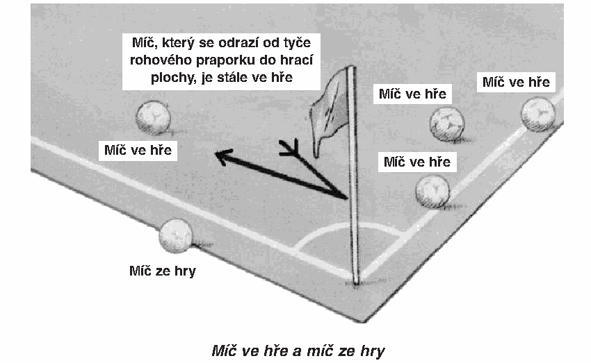

[Tištěná strana 86 · PDF 88](sources/pravidla-fotbalu-facr-2024.pdf#page=88)

## Pravidlo 10 – URČENÍ VÝSLEDKU UTKÁNÍ

#### 1. Dosažení branky

Branky je dosaženo, jestliže míč celým objemem přejde brankovou čáru mezi brankovými tyčemi a pod brankovým břevnem za předpokladu, že družstvo, které vstřelilo branku, neporušilo pravidla. Jestliže brankář hodí míč přímo do branky soupeře, je nařízen kop od branky.

Jestliže rozhodčí signalizuje dosažení branky dříve, než míč celým objemem přešel brankovou čáru, naváže hru míčem rozhodčího.

#### Dosažení branky

#### Branka

Není branka

#### Branka

Není branka

#### Branková čára

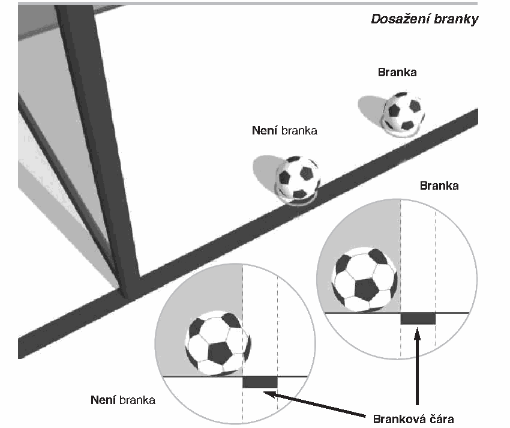

[Tištěná strana 87 · PDF 89](sources/pravidla-fotbalu-facr-2024.pdf#page=89)

### 2. Vítěz utkání

Vítězem utkání je družstvo, které dosáhlo více branek. Není-li dosaženo žádné branky nebo dosáhnou-li obě družstva stejného počtu branek, je výsledek utkání nerozhodný.

Jestliže propozice soutěže stanovují, že po utkání nebo po dvojutkání, hraném systémem doma-venku, musí být znám vítěz utkání, jsou povolenými postu py pro určení vítěze:

- počítání branek dosažených na hřišti soupeře

- dva stejné poločasy prodloužené doby hry, v délce trvání nejvýše 15 minut každého z nich

- penaltový rozstřel

Může být použita kombinace výše uvedených možností.

### 3. Penaltový rozstřel

Penaltový rozstřel je prováděn poté, co utkání skončilo, a platí příslušná ustanovení Pravidel fotbalu, není-li stanoveno jinak. Hráč, který byl během utkání vyloučen, se rozstřelu nesmí zúčastnit; varování a napomínání udělené během utkání se nepřenášejí do penaltového rozstřelu.

#### Procedura

#### Před provedením penaltového rozstřelu

- pokud neexistují jiné důvody (např. terénní podmínky, bezpečnost atd.), rozhodčí losuje mincí, aby rozhodl, na kterou branku bude penaltový rozstřel prováděn, což se může změnit pouze z bezpečnostních důvodů nebo pokud branka nebo hrací plocha se stanou nezpůsobilými

- rozhodčí provede los mincí znovu a družstvo, které vyhraje los, se rozhodne, zda kop provede jako první nebo jako druhé

- penaltový rozstřel mohou provádět mohou provádět pouze hráči, kteří v okamžiku ukončení utkání byli na hrací ploše, nebo byli dočasně mimo hrací plochu (ošetření, úprava výstroje atd.) včetně náhradníka, který případně vystřídá brankáře, který není schopen pokračovat ve hře

- každé družstvo je odpovědné za stanovení pořadí, v jakém budou oprávnění hráči provádět kopy. Rozhodčí nemusí být o pořadí hráčů informován

- pokud na konci utkání a před nebo v průběhu penaltového rozstřelu má jedno družstvo větší počet hráčů než soupeř, musí snížit počet hráčů na stejný, jako má družstvo soupeře.Rozhodčí musí být informován o jménech a číslech hráčů, kteří byli z penaltového rozstřelu vyřazeni. Jakýkoliv vyřazený hráč se nesmí zúčastnit rozstřelu vyjma případů uvedených v následující odrážce

- brankář, který není schopen před nebo v průběhu rozstřelu pokračovat, smí být nahrazen hráčem, který byl z rozstřelu vyřazen pro vyrovnání počtu hráčů, nebo vystřídán náhradníkem, pokud družstvo nevyužilo maximální povolený počet střídání; nahrazený vyměněný/vystřídaný brankář se dále

[Tištěná strana 88 · PDF 90](sources/pravidla-fotbalu-facr-2024.pdf#page=90)

nesmí rozstřelu zúčastnit a nesmí ani kop provéstnesmí kopů účastnit a nesmí ani kop provést

- pokud brankář již kop provedl, smí hráč, který brankáře nahradil nebo náhradník, který brankáře vystřídal, další kop provést až poté, co kop provedli všichni oprávnění hráči jeho družstva

#### V průběhu penaltového rozstřelu

- na hrací ploše se smí zdržovat pouze oprávnění hráči a rozhodčí

- všichni oprávnění hráči, s výjimkou hráče provádějícího kop a obou brankářů se musí zdržovat ve středovém kruhu

- brankář družstva, jehož hráč právě provádí kop, musí stát na hrací ploše u pokutového území poblíž místa, kde brankovou čáru protíná čára ohraničující pokutové území.

- oprávněný hráč si může vyměnit místo s brankářem

- akce kopu je skončena, když se míč zastaví, dostane mimo hru, nebo když rozhodčí hru přeruší pro jakýkoli přestupek; hráč nesmí míčem zahrát podruhé

- o provádění kopů si rozhodčí vede poznámky

- pokud se brankář dopustí přestupku a v důsledku toho se kop opakuje, bude brankář varován za první přestupek a napomenut za jakýkoli následující přestupek

- pokud je provádějící hráč trestán za přestupek, který spáchal poté, co dal rozhodčí znamení k provedení kopu, bude kop zaznamenán jako neproměněný a hráč bude napomenut

- pokud se současně dopustí přestupku brankář i hráč provádějící kop, bude kop zaznamenán jako neproměněný a hráč provádějící kop bude napomenut

V souladu s níže uvedenými podmínkami provádí každé družstvo pět kopů.

- kopy provádějí obě družstva střídavě

- dosáhne-li ještě před provedením všech pěti kopů jedno z družstev více branek, než by druhé družstvo mohlo ještě po provedení svých pěti kopů dosáhnout, zbývající kopy se neprovádějí

- provedou-li obě družstva po pěti kopech a obě dosáhnou stejného počtu branek nebo nedosáhnou žádné branky, pokračují v provádění vždy po jednom kopu a ve stejném sledu další hráči družstva tak dlouho, dokud při stejném počtu kopů nedosáhne jedno z družstev o jednu branku více než druhé

- každý kop je proveden jiným hráčem a všichni oprávnění hráči musí provést kop dříve, než jakýkoliv hráč provede druhý kop

- výše uvedený princip platí pro všechna následná pořadí kopů, ale družstvo smí změnit pořadí hráčů provádějících kopy

- provádění kopů z pokutové značky nesmí být zdržováno kvůli hráči, který

[Tištěná strana 89 · PDF 91](sources/pravidla-fotbalu-facr-2024.pdf#page=91)

opustí hrací plochu. Pokud se hráč včas nevrátí k provedení kopu, jeho právo provést kop propadá (branky nebylo dosaženo)

#### Střídání a vyloučení v průběhu penaltového rozstřelu

- hráč, náhradník, vystřídaný hráč nebo funkcionář družstva, může být napomenut nebo vyloučen

- vyloučený brankář musí být nahrazen některým z oprávněných hráčů

- jiný hráč než brankář, který není schopen pokračovat, nesmí být vystřídán

- rozhodčí utkání předčasně neukončí, klesne-li počet hráčů pod sedm

### ROZHODNUTÍ FAČR

Jestliže utkání nebo dvojutkání má určit vítěze, musí Rozpis příslušné soutěže nebo propozice turnaje obsahovat ustanovení o prodloužení doby hry k určení vítěze utkání nebo jiný, příslušným řídícím orgánem schválený způsob pro určení vítěze utkání.

### VÝKLAD K PRAVIDLU

10.1 O tom, zda bylo nebo nebylo dosaženo branky, rozhoduje výhradně rozhodčí a jeho rozhodnutí je konečné, proto je nezbytné, aby v rozhodujícím okamžiku byl co nejblíže branky. Není-li si jist, zda míč skutečně přešel úplně přes brankovou čáru do branky, smí se ve výjimečných případech, a pouze z vlastní iniciativy, dotázat na názor kterékoliv z ostatních rozhodčích.

#### Branka

#### Není branka

#### Není branka

#### Dosažení branky

#### Není branka

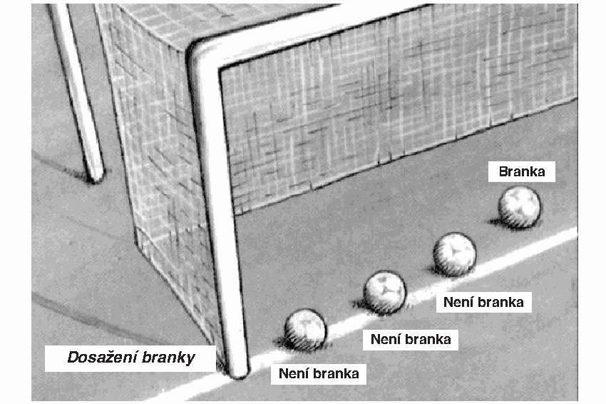

[Tištěná strana 90 · PDF 92](sources/pravidla-fotbalu-facr-2024.pdf#page=92)

Signál píšťalkou při dosažení branky je rozhodčí povinen dát pouze ve sporných případech.

10.2 Pro posouzení, zda bylo či nebylo dosaženo branky, není rozhodující postavení brankáře, ale výhradně poloha míče. Stává se totiž, že brankář sice stojí za brankovou čárou, míč však drží před ní, nebo naopak brankář stojí před brankovou čárou, ale míč v jeho rukou je již za ní.

10.3 Není-li si rozhodčí jist, zda bezprostředně před dosažením branky nedošlo k porušení pravidel, může se před svým rozhodnutím dotázat na názor příslušného asistenta rozhodčího, ale jen je-li nezvratně přesvědčen, že asistent mohl ze svého postavení situaci lépe vidět.

10.4 Rozhodčí branku uzná, dostane-li se míč do soupeřovy branky přímo:

a) ze hry,

b) z přímého volného kopu

c) z pokutového kopu

d) z kopu z rohu

e) z kopu od branky

f) z výkopu

Dosažení branky musí být v souladu s příslušnými ustanoveními pravidel. Hráč útočícího družstva nesmí před dosažením branky porušit pravidla. Hra se naváže výkopem.

10.5 Rozhodčí branku neuzná, dostane-li se míč do soupeřovy branky přímo:

a) z nepřímého volného kopu

b) z vhazování míče

c) z míče rozhodčího, zahrál-li míčem pouze jeden hráč

Hra se naváže kopem od branky.

10.6 Rozhodčí branku neuzná, dostane-li se míč do vlastní branky přímo:

a) z kteréhokoli kopu

b) z vhazování míče

c) z míče rozhodčího, zahrál-li míčem pouze jeden hráč

Hra se naváže kopem z rohu

10.7 Rozhodčí branku neuzná, dostane-li se míč do branky přímo po správně provedeném míči rozhodčího. Míč rozhodčího se opakuje.

10.8 Rozhodčí branku neuzná, jestliže brankář v době, kdy je míč ve hře, ho z vlastního pokutového území vhodí do branky soupeřova družstva.

10.9 Příslušný AR nesignalizuje dosažení branky zdvižením praporku. Signalizace

[Tištěná strana 91 · PDF 93](sources/pravidla-fotbalu-facr-2024.pdf#page=93)

 dosažení branky AR spočívá v tom, že s praporkem, který drží v pravé ruce, běží 25 – 30 m směrem ke středové čáře.

Jestliže podle názoru AR

a) byla branka regulérní, běží AR zaujmout výchozí postavení směrem ke středové čáře

b) bylo dosaženo branky, ale vznikla domněnka, že míč je stále ve hře, AR zdvihne praporek, aby upoutal pozornost rozhodčího, poté s rozhodčím naváže oční kontakt a teprve pak běží směrem ke středové čáře. Druhý asistent v případě potřeby jeho signalizaci převezme.

c) branky nebylo dosaženo regulérním způsobem (např. proto, že před dosažením branky došlo k porušení pravidel hráči útočící strany, které rozhodčí nepostřehl), zůstane asistent stát v aktuálním pozičním postavení, případně na porušení pravidla (ofsajd, přestupek útočícího hráče) upozorní rozhodčího adekvátní signalizací praporkem

d) míč celým svým objemem nepřekročil brankovou čáru, naváže AR s rozhodčím oční kontakt (případně použije domluvený diskrétní signál), aby mu potvrdil, že branky nebylo dosaženo

Rozhodčí proto dříve, než s konečnou platností rozhodne o dosažení branky, ověří pohledem poziční postavení asistenta rozhodčího. Vidí-li, že příslušný asistent zůstal stát na svém místě, popř. že signalizuje porušení pravidel ve smyslu bodu b), zváží okolnosti, které předcházely dosažení branky, a teprve potom rozhodne, zda branku uzná či nikoli. Ještě před tím, než rozhodne, ověří rovněž u druhého asistenta, zda ten nesignalizuje takové porušení pravidel, na základě kterého by branka nemohla být uznána. Zahraje-li hráč bránícího družstva míč úmyslně rukou nebo jinak poruší pravidla a míč skončí v brance jeho družstva dříve, než rozhodčí přerušil hru, musí rozhodčí branku uznat. To ho však nezbavuje povinnosti udělit osobní trest za přestupek, který to vyžaduje.

10.10  Uzná-li rozhodčí branku, stále kontroluje chování hráčů a přitom běží zaujmout postavení poblíž středové čáry k provedení výkopu; teprve tam si učiní poznámku o střelci branky. Chování hráčů kontrolují současně i oba asistenti, aby mohli posoudit případné přestupky za zády rozhodčího.

10.11  Ztratí-li rozhodčí z vážných důvodů na krátkou dobu schopnost postřehu a nemůže proto reagovat na herní situaci, např. proto, že má cizí předmět v oku, v důsledku udeření míčem nebo pro nenadálou zdravotní indispozici, může branku uznat na základě informací, které si vyžádá od ostatních rozhodčích.

[Tištěná strana 92 · PDF 94](sources/pravidla-fotbalu-facr-2024.pdf#page=94)

## Pravidlo 11 – OFSAJD

### 1. Ofsajdová pozice

Být v ofsajdové pozici není porušením pravidla.

Hráč je v ofsajdové pozici, když:

- kterákoliv část hlavy, těla nebo nohy je na polovině soupeře (vyjma středové čáry) a

- kterákoliv část hlavy, těla nebo nohy je blíže k brankové čáře soupeře než míč a než předposlední bránící hráč soupeře

Ruce a paže všech hráčů, včetně brankářů, nejsou brány v úvahu. Pro účely posouzení ofsajdu je horní hranice ruky v linii se spodní částí podpaží

Hráč není v ofsajdové pozici, když je na stejné úrovni jako

- předposlední hráč soupeře nebo

- poslední dva hráči soupeře

### 2. Ofsajd

Hráč, který je v ofsajdové pozici, bude potrestán za ofsajd jen tehdy, jestliže v okamžiku, kdy míčem zahraje nebo se míče dotkne* některý z jeho spoluhráčů, je aktivně zapojen do hry tím, že

- ovlivní hru tak, že zahraje míč nebo se dotkne míče, který mu přihrál spoluhráč, nebo

- ovlivní soupeře tím, že

– zabrání mu v hraní míče nebo v možnosti hrát míčem tím, že mu zjevně brání ve výhledu, nebo

– svádí se soupeřem souboj o míč, nebo

– zjevně se pokusí zahrát míč, který je v jeho blízkosti, přičemž ovlivní soupeře, nebo

– provede jasnou akci, která má zjevný vliv na možnost soupeře hrát míčem, nebo

- získá výhodu tím, že zahraje míč nebo ovlivní soupeře, jestliže míč

– odskočil nebo se odrazil od brankové tyče, břevna, soupeře nebo rozhodčího

– byl úmyslně zahrán soupeřem při obranném zákroku

* Určující je okamžik prvního zahrání nebo doteku jeho spoluhráče s míčem.

[Tištěná strana 93 · PDF 95](sources/pravidla-fotbalu-facr-2024.pdf#page=95)

Hráč v ofsajdové pozici, který obdrží míč od soupeře, který vědomě zahrál* míčem (včetně úmyslného hraní míče rukou) se nepovažuje za hráče, který získal výhodu, pokud to nebyl úmyslný obranný zákrok.

*„Vědomé hraní míče“ (vyjma úmyslného hraní míče rukou) je, když má hráč kontrolu nad míčem a současně má možnost:

- přihrát míč spoluhráči

- získat držení míče“ nebo

- míč odehrát (např. odkopnutím nebo odhlavičkováním)

Je-li přihrávka, pokus o získání držení míče nebo pokus o odehrání míče, nepřesný nebo neúspěšný, nemění to nic na skutečnosti, že hráč „zahrál míč vědomě“.

Následující kritéria by měla být použita jako indikátory toho, že hráč, který měl míč pod kontrolou „zahrál míč vědomě“:

- míč letěl z dálky a hráč na něj měl jasný výhled

- míč se nepohyboval rychle

- směr míče nebyl neočekávaný

- hráč měl čas na koordinaci pohybu svého těla, tj. nejednalo se o instinktivní natažení těla, výskok nebo jiný pohyb, který by omezil možnost zahrát nebo kontrolovat míč

- míč pohybující se po zemi lze zahrát snadněji než míč ve vzduchu

O „obranný zákrok“ se jedná, pokud hráč zahraje nebo se pokusí zahrát míčem, který směřuje na branku, kteroukoliv částí těla vyjma rukou nebo paží (pokud se nejedná o brankáře ve vlastním pokutovém území).

V situacích, kde:

- hráč se pohybuje z ofsajdové pozice nebo stojí v ofsajdové pozici, je v cestě protihráči a tím ovlivní jeho pohyb směrem k míči, se jedná o ofsajd, má-li to vliv na schopnost protihráče hrát míčem nebo svést souboj o míč; jestliže se hráč postaví soupeři do cesty a tím se dopustí přestupku (např. mu brání v pohybu), má být tento přestupek potrestán podle Pravidla 12

- hráč v ofsajdové pozici se pohybuje směrem k míči s úmyslem míč zahrát a je faulován dříve, než míčem zahrál nebo se pokusil míč zahrát, nebo hráč svádí souboj o míč se soupeřem, bude potrestán přestupek, protože k němu došlo dříve, než k ofsajdu

- přestupek je spáchán proti hráči v ofsajdové pozici, který již míčem hraje nebo se pokouší jím hrát nebo svádí se soupeřem souboj o míč, bude potrestán za ofsajd, protože k němu došlo dříve než k přestupku

### 3. Není ofsajd

O ofsajd se nejedná, pokud hráč získá míč přímo:

- z kopu od branky

- z vhazování

- z kopu z rohu

[Tištěná strana 94 · PDF 96](sources/pravidla-fotbalu-facr-2024.pdf#page=96)

### 4. Porušení pravidla a sankce

Za porušení tohoto pravidla rozhodčí nařídí nepřímý volný kop tam, kde došlo k porušení pravidla, včetně případu, kdy k ofsajdu dojde na vlastní polovině hrací plochy.

Bránící hráč, který opustil hrací plochu bez souhlasu rozhodčího, se pro účely ofsajdu považuje za hráče na brankové čáře nebo na pomezní čáře až do nejbližšího přerušení hry nebo do chvíle, kdy bránící družstvo zahrálo míč směrem ke středové čáře, a míč opustil pokutové území bránícího družstva.

Pokud hráč opustil hrací plochu úmyslně, musí být napomenut při nejbližším přerušení hry.

Útočící hráč může opustit hrací plochu nebo zůstat mimo hrací plochu, aby nebyl aktivně zapojen do hry. Pokud se hráč vrátí na hrací plochu přes brankovou čáru a zapojí se do hry před nejbližším přerušením hry, nebo dřív, než bránící družstvo zahraje míč směrem ke středové čáře a míč opustí pokutové území bránícího družstva, má být hráč pro účely ofsajdu považován za hráče stojícího na brankové čáře.

Pokud hráč úmyslně opustí hrací plochu a vrátí se na ni bez souhlasu rozhodčího a tím získá výhodu, nebude potrestán za ofsajd, ale musí být napomenut.

Jestliže útočící hráč nehybně stojí mezi brankovými tyčemi a uvnitř branky ve chvíli, kdy míč vejde do branky, musí být branka uznána, vyjma případů, kdy se hráč proviní ofsajdem nebo poruší Pravidlo 12; v těchto případech rozhodčí naváže hru přímým nebo nepřímým volným kopem.

### VÝKLAD K PRAVIDLU

11.1 Pravidlo 11 má chránit bránící družstvo před tím, aby se hráč útočícího družstva zdržoval v blízkosti soupeřovy branky a mohl tak snadno dosáhnout branky. Pravidlo 11 je tedy pravidlem výlučně ochranným, proto se na něj nevztahuje udělování osobních trestů za soustavné porušování pravidel. Proto, i kdyby hráč byl v ofsajdu častěji a rozhodčí z toho důvodu musel přerušovat hru, nesmí za to hráče napomenout.

V Pravidle 11 jsou používány dva pojmy, které rozhodčí musí důsledně rozlišovat: ofsajdová pozice a ofsajd.

#### Ofsajdová pozice

11.2 Ofsajdová pozice pouze charakterizuje určité rozestavení hráčů na hrací ploše. Postavení hráče v ofsajdové pozici není samo o sobě důvodem pro přerušení hry, ale je pouze prvotním předpokladem pro to, aby následně hráč vůbec mohl být v ofsajdu.

11.3 Hráč je v ofsajdové pozici, je-li současně:

a) na soupeřově polovině hrací plochy a

b) blíže k soupeřově brankové čáře než míč a

c) blíže k soupeřově brankové čáře než předposlední hráč soupeřova družstva

[Tištěná strana 95 · PDF 97](sources/pravidla-fotbalu-facr-2024.pdf#page=97)

nebo než poslední dva hráči bránícího družstva, jsou-li tito dva hráči stejně vzdáleni od své brankové čáry.

11.4 Hráč není v ofsajdové pozici, jestliže:

a) je na vlastní polovině hrací plochy (vč. středové čáry), nebo

b) je na soupeřově polovině hrací plochy, ale ve stejné nebo větší vzdálenosti od soupeřovy brankové čáry než předposlední hráč bránícího družstva nebo než poslední dva hráči bránícího družstva, nebo

c) je na soupeřově polovině hrací plochy, ale ve stejné nebo větší vzdálenosti od soupeřovy brankové čáry než míč, nebo

d) je mimo hrací plochu.

11.5 V definici ofsajdové pozice výraz „hráč je blíže k brankové čáře soupeře než míč a než předposlední hráč soupeře“ znamená, že kterákoliv část jeho hlavy, těla nebo nohou je blíže k brankové čáře soupeře než míč nebo předposlední hráč soupeře. V této definici není záměrně zahrnuta ruka nebo paže hráče (horní končetina hráče od ramene až k dlani), protože fotbal se nehraje rukama. Z toho důvodu hráč, který má na soupeřově polovině hrací plochy hlavu nebo tělo, bude v ofsajdové pozici i v případě, že nohy má ještě na vlastní polovině hrací plochy nebo na středové čáře.

11.6 Hráč, který je v ofsajdové pozici, může dát rozhodčímu najevo, že se nehodlá do hry zapojit, např. tím, že na hrací ploše zůstane klidně stát. To však samo o sobě nestačí: aby rozhodčí tohoto hráče nepovažoval za hráče, který je v ofsajdu, nesmí tento hráč ovlivňovat soupeře ani např. tím, že by mu – třeba i nevědomě – bránil v pohybu.

Obecně lze konstatovat, že hráče, který je v ofsajdové pozici, nebude rozhodčí považovat za hráče v ofsajdu:

a) jestliže v okamžiku, kdy jeho spoluhráč zahraje míčem nebo se míče dotkne, dá najevo, že se nebude aktivně zapojovat do hry a

b) jestliže přitom podle názoru rozhodčího neovlivňuje soupeře.

11.7 Hráč může bez souhlasu rozhodčího opustit hrací plochu, třeba i do prostoru branky, aby nebyl v ofsajdové pozici. Hráč, který z tohoto důvodu opustí hrací plochu, nesmí však z místa mimo hrací plochu porušit Pravidlo 11 (např. ovlivňovat soupeře) nebo Pravidlo 12. Přeruší-li rozhodčí z tohoto důvodu hru, naváže ji odpovídajícím volným kopem a provinivšímu se hráči případně udělí i odpovídající osobní trest.

Rozhodčí přitom může poskytnout výhodu ve hře a případný osobní trest udělit až při nejbližším přerušení hry.

Hráč, který je v ofsajdové pozici, může dosáhnout regulérní branky. Tato situace může nastat např. tehdy, když tento hráč zachytí zpětnou přihrávku soupeře.

[Tištěná strana 96 · PDF 98](sources/pravidla-fotbalu-facr-2024.pdf#page=98)

#### Ofsajd

11.8 Hráče, který je v ofsajdové pozici, považuje rozhodčí za hráče v ofsajdu, jestliže poté, co míčem zahraje nebo se míče dotkne jeho spoluhráč, se podle názoru rozhodčích aktivně zapojí do hry.

Hráč se může v průběhu útočné akce svého družstva kdykoli ocitnout v ofsajdové pozici, ale o tom, zda se tento hráč aktivně zapojil do hry, rozhodnou rozhodčí. Pouhá skutečnost, že hráč je v ofsajdové pozici a současně míčem zahraje nebo se míče dotkne některý z jeho spoluhráčů, není sama o sobě důvodem k přerušení hry.

11.9 Hráč je aktivně zapojen do hry, jestliže v ofsajdové pozici podle názoru rozhodčího:

a) ovlivňuje hru tím, že zahraje či se dotkne míče, který mu přihrál nebo kterého se předtím dotkl jeho spoluhráč. Jestliže je přihrávka směrována přímo na osamoceného hráče a v jeho blízkosti není žádný spoluhráč, který by také mohl míčem zahrát, nemá asistent rozhodčího čekat, až se tento hráč míče dotkne, ale může jeho ofsajd signalizovat hned.

b) ovlivňuje soupeře tím, že

  - omezí jeho možnost hrát míčem, protože mu brání ve výhledu nebo mu brání v pohybu, nebo

  - svádí se soupeřem souboj o míč, nebo

  - učiní jasnou akci, která má zjevný vliv na možnost soupeře hrát míč; přitom „hratelná vzdálenost“ je dána konkrétní herní situací.

c) získává ze svého postavení výhodu tím, že v ofsajdové pozici zahraje míčem,

  - který se odrazil od tyče nebo od břevna, nebo

  - který se odrazil od hráče soupeře, nebo

  - který byl tečován případně zahrán hráčem soupeře při obraném zákroku. „Obranným zákrokem“ se přitom míní situace, kdy bránící hráč se pokusí zabránit tomu, aby míč skončil v brance jeho družstva.

11.10  Hráč, který je v ofsajdové pozici, se smí znovu zapojit do hry:

  - až poté, kdy míčem znovu zahraje jiný hráč, nebo

  - až soupeři změní své postavení tak, že při novém zahrání míče jeho spoluhráčem není již tento hráč v ofsajdové pozici, nebo

  - když se míč ocitne blíže k soupeřově brankové čáře, než je tento hráč, a tam znovu zahraje míčem jeho spoluhráč.

Jestliže se tento hráč zapojí do hry dříve, bude v ofsajdu.

11.11  Vystavení soupeře do ofsajdu je v souladu s pravidlem, ale úspěšné bude jen tehdy, jestliže hráči bránícího družstva vystaví hráče soupeře do ofsajdové pozice dříve, než míčem zahraje některý z jeho spoluhráčů.

[Tištěná strana 97 · PDF 99](sources/pravidla-fotbalu-facr-2024.pdf#page=99)

11.12  Hráč, který je v ofsajdové pozici, nebude v ofsajdu, jestliže dříve, než míčem zahraje některý z jeho spoluhráčů, se vrátí zpět na vlastní polovinu hrací plochy nebo změní své postavení tak, aby nebyl blíže k soupeřově brankové čáře než nejméně dva hráči soupeřova družstva nebo než míč. Jestliže však některý z jeho spoluhráčů zahraje míčem dříve, než hráč své postavení stačí změnit, může být v ofsajdu.

Hráč je v ofsajdu také v případě, že sice převezme míč na vlastní polovině hrací plochy, ale v okamžiku, kdy míčem zahrál jeho spoluhráč, byl v ofsajdové pozici.

11.13  V případě střely na branku hráč, který je v ofsajdové pozici, není automaticky „v ofsajdu“. Jeho ofsajdová pozice se změní v ofsajd až v okamžiku, kdy se tento hráč dotkne míče

  - poté, co ho bránící hráč vyrazil z branky, nebo

  - poté, co se k němu míč odrazil od konstrukce branky,

a to i v případě, že v okamžiku, kdy se míče dotkne, se již v ofsajdové pozici nenachází.

Jestliže v případě střely na branku hráč útočícího družstva, který je v ofsajdové pozici, brání brankáři ve výhledu (na střelce, na míč), považuje se za hráče aktivně zapojeného do hry. Proto je v ofsajdu.

Hráč, který byl v ofsajdové pozici v okamžiku, kdy jeho spoluhráč zahrál míčem, ale rozhodčí hru nepřerušil, protože podle jeho názoru v okamžiku zahrání míče spoluhráčem nebyl tento hráč aktivně zapojen do hry, bude následně potrestán za ofsajd v případě, že zahraje míčem, který se k němu odrazil od rohového praporku, od rozhodčího nebo ostatních rozhodčích stojících na hrací ploše, a to i v případě, že v okamžiku, kdy se míče dotkl, se již v ofsajdové pozici nenachází.

Hráč, který byl v ofsajdové pozici v okamžiku, kdy jeho spoluhráč zahrál míčem, ale rozhodčí hru nepřerušil, protože podle jeho názoru v okamžiku zahrání míče nebyl aktivně zapojen do hry, nemůže být potrestán za ofsajd ani v případě, jestliže v okamžiku, kdy jeho spoluhráč znovu zahraje míčem, se již v ofsajdové pozici nenachází. Jedná se totiž o posouzení nové ofsajdové situace, která vznikla až po dalším zahrání míče jeho spoluhráčem a která s předchozí ofsajdovou situace již nesouvisí.

11.14  Hráč, který není v ofsajdové pozici jenom proto, že opustil hrací plochu, se smí znovu vrátit na hrací plochu i bez souhlasu rozhodčího, ale ne dříve, než skončila útočná akce jeho družstva; vstoupí-li na hrací plochu dříve, než skončila útočná akce jeho družstva, považuje se pro účely ofsajdu za hráče na hrací ploše. Když však tento hráč vstupem na hrací plochu ovlivní hru, přeruší rozhodčí hru, hráče napomene za neoprávněný vstup na hrací plochu a nařídí nepřímý volný kop v místě, kde hráč ovlivnil hru. Když se navíc tento hráč dopustí ještě dalšího přestupku, přeruší rozhodčí hru, nařídí odpovídající volný kop a případně udělí odpovídající osobní trest.

[Tištěná strana 98 · PDF 100](sources/pravidla-fotbalu-facr-2024.pdf#page=100)

11.15  Hráče, který sice v ofsajdové pozici je, ale je zřejmé, že nemůže zasáhnout do hry, protože je zraněn, bude rozhodčí považovat za hráče aktivně zapojeného do hry pouze v případě, že by ovlivňoval hru nebo soupeře.

11.16  Hráč bránícího družstva nemůže vystavit soupeře do ofsajdu tak, že by (třeba i setrvačností) opustil hrací plochu; rozhodčí bude pro účely ofsajdu tohoto hráče považovat za hráče na brankové čáře nebo na pomezní čáře, a to až do nejbližšího přerušení hry, nebo do chvíle, kdy bránící družstvo odehraje míč směrem ke středové čáře a míč opustí jeho pokutové území. Jestliže by ale podle názoru rozhodčího bylo počínání hráče bránícího družstva úmyslné, napomene ho rozhodčí při nejbližším přerušení hry za „úmyslné opuštění hrací plochy bez souhlasu rozhodčího“.

11.17  Dopustí-li se hráč přestupku vůči soupeři, který je v ofsajdu, nařídí rozhodčí nepřímý volný kop za ofsajd, neboť ofsajd byl v pořadí prvním porušením pravidel; hráči, který se dopustil přestupku, rozhodčí případně udělí i odpovídající osobní trest.

Dopustí-li se hráč přestupku vůči soupeři, který je v ofsajdové pozici, nařídí rozhodčí příslušný kop a hráči, který se dopustil přestupku, případně udělí i odpovídající osobní trest.

11.18  Ustanovení Pravidla 11 platí v plném rozsahu i pro provádění volných kopů.

#### Signalizace asistentů

11.19  Posouzení, zda je hráč v ofsajdu, vyžaduje dokonalou spolupráci rozhodčího s asistenty rozhodčího. Asistent nemá signalizovat ofsajdovou pozici hráče, ale má signalizovat až jeho případný ofsajd.

11.20  Signalizace asistenta rozhodčího je určena pouze rozhodčímu a sama o sobě nepřerušuje hru. Teprve rozhodčí s konečnou platností rozhodne, jestli hráč, který je v ofsajdové pozici, se aktivně zapojil do hry, a zda proto přeruší hru. Proto se hráčům důrazně připomíná, aby po signalizaci asistenta rozhodčího stále pokračovali ve hře až do okamžiku, kdy rozhodčí přeruší hru píšťalkou.

[Tištěná strana 99 · PDF 101](sources/pravidla-fotbalu-facr-2024.pdf#page=101)

#### DIAGRAMY K PRAVIDLU 11 – OFSAJD

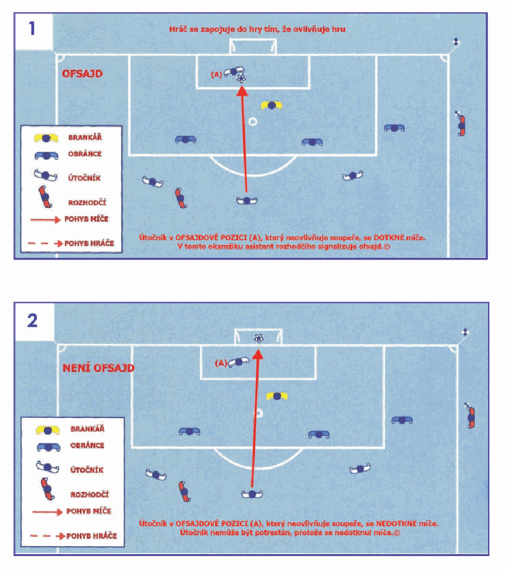

[Tištěná strana 100 · PDF 102](sources/pravidla-fotbalu-facr-2024.pdf#page=102)

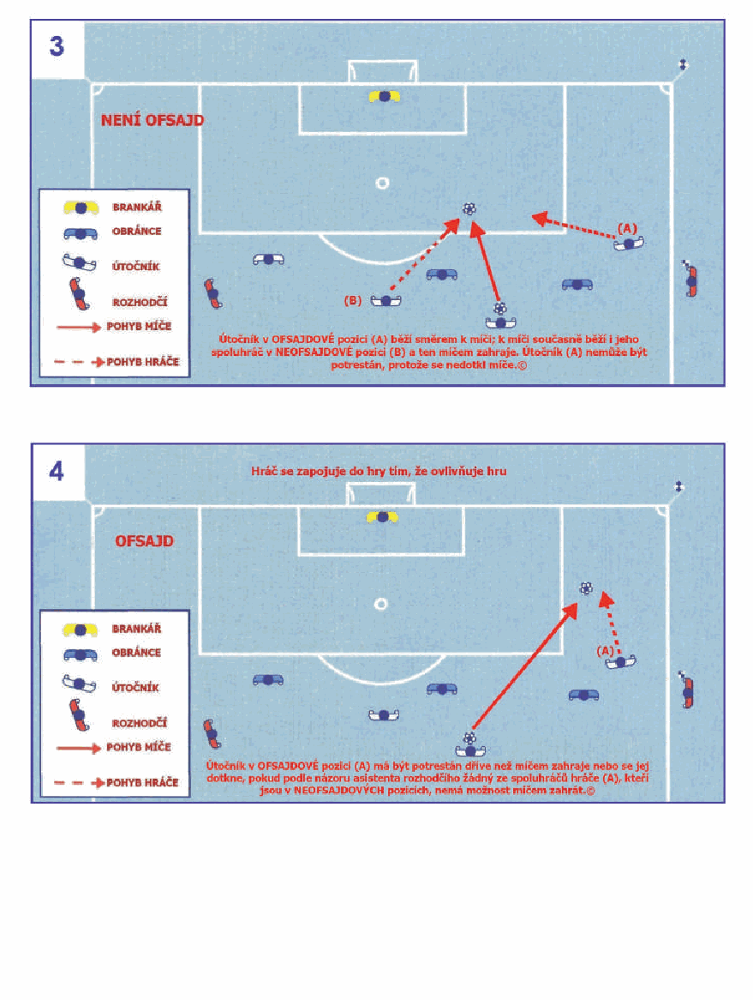

[Tištěná strana 101 · PDF 103](sources/pravidla-fotbalu-facr-2024.pdf#page=103)

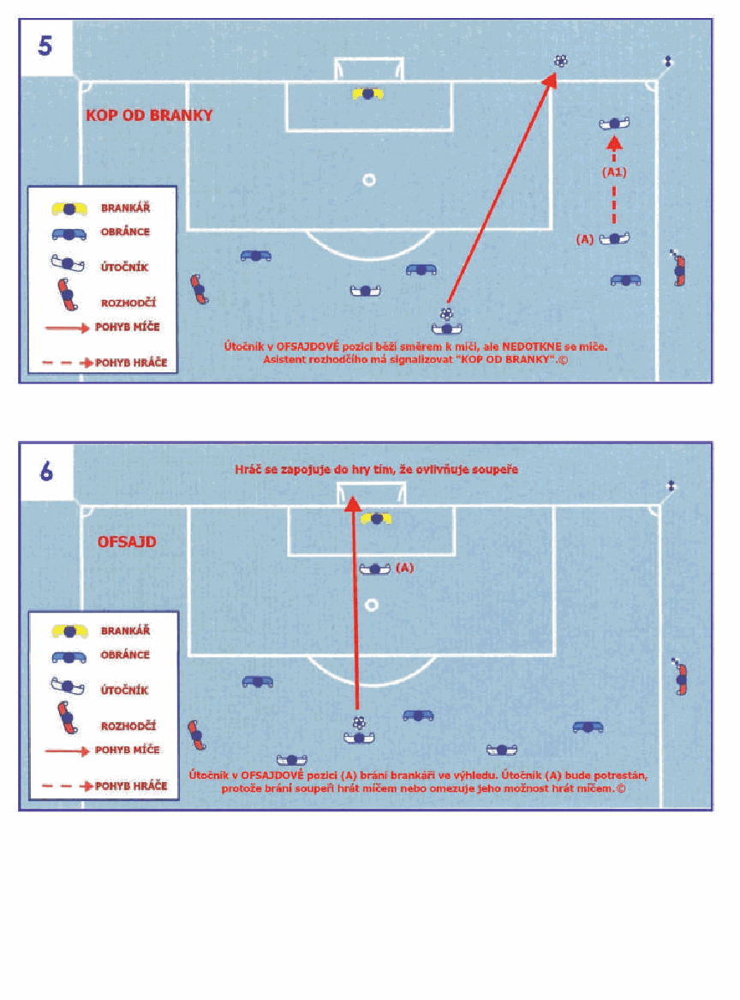

[Tištěná strana 102 · PDF 104](sources/pravidla-fotbalu-facr-2024.pdf#page=104)

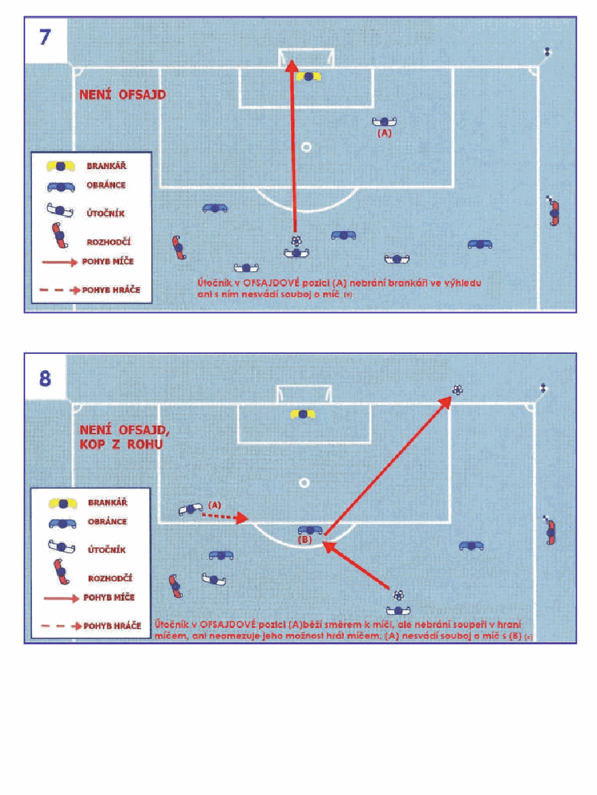

[Tištěná strana 103 · PDF 105](sources/pravidla-fotbalu-facr-2024.pdf#page=105)

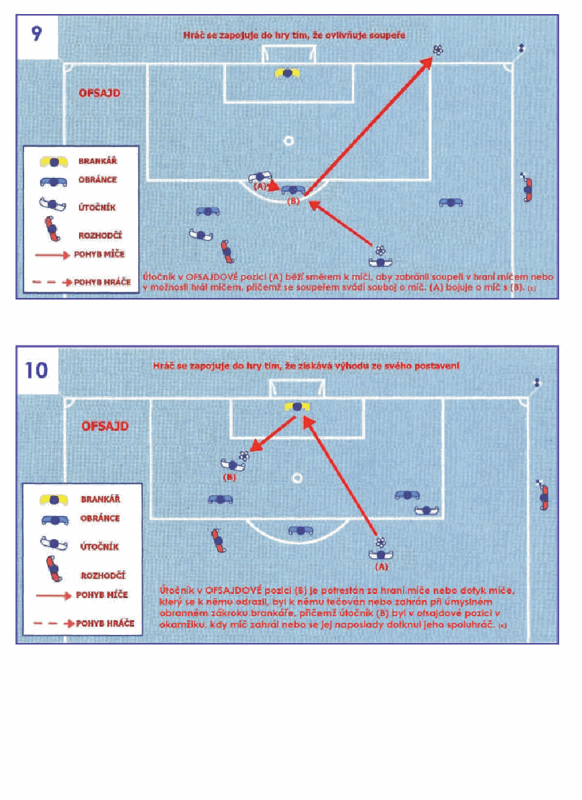

[Tištěná strana 104 · PDF 106](sources/pravidla-fotbalu-facr-2024.pdf#page=106)

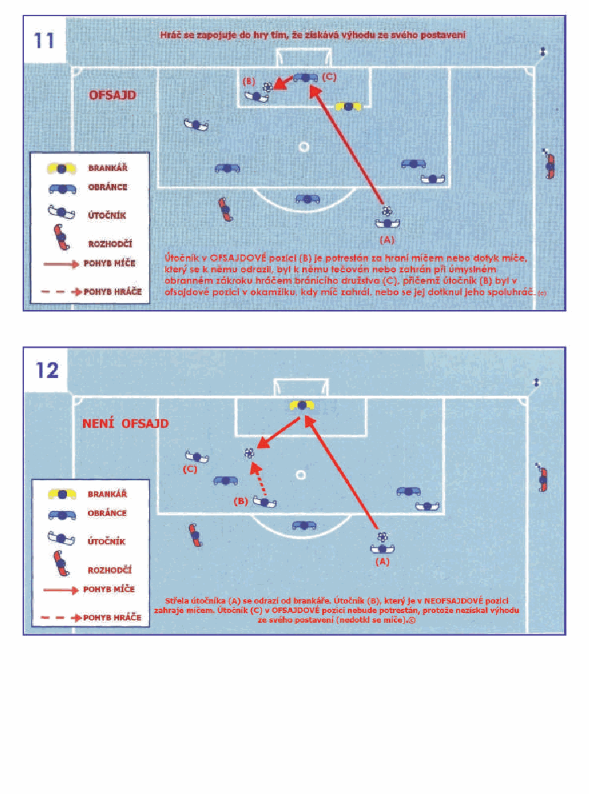

[Tištěná strana 105 · PDF 107](sources/pravidla-fotbalu-facr-2024.pdf#page=107)

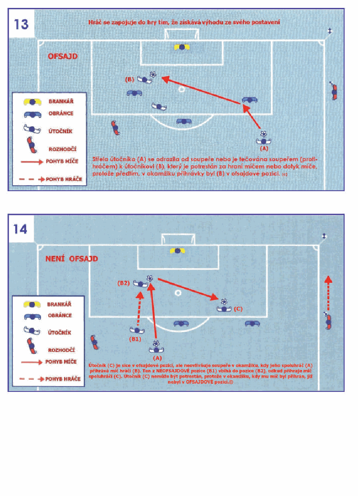

[Tištěná strana 106 · PDF 108](sources/pravidla-fotbalu-facr-2024.pdf#page=108)

## Pravidlo 12 – PŘESTUPKY A PROVINĚNÍ

Přímé a nepřímé volné kopy a pokutové kopy mohou být nařízeny pouze za přestupky a provinění provedené v době, když míč je ve hře.

### 1. Přímý volný kop

Přímý volný kop rozhodčí nařídí, jestliže se hráč dopustí některého z následujících přestupků vůči soupeři způsobem, který je podle názoru rozhodčího nedbalý, bezohledný nebo který je proveden s použitím nepřiměřené síly:

1\. vrazí do soupeře

2\. skočí na soupeře

3\. kopne nebo se pokusí kopnout soupeře

4\. strčí do soupeře

5\. udeří nebo se pokusí udeřit soupeře (vč. udeření hlavou)

6\. nedovoleně zastaví soupeře nebo

7\. podrazí nebo se pokusí podrazit soupeře

Přestupek s fyzickým kontaktem se trestá přímým volným kopem nebo pokutovým kopem, přičemž

- za nedbalost se považuje nepozornost nebo nedostatečná předvídavost následků boje o míč, ale stále ještě ve sportovním duchu; udělení osobního trestu není nutné

- za bezohlednost se považuje, jestliže se hráč chová bez ohledu na možné důsledky pro soupeře, proto musí být napomenut

- použití nepřiměřené síly se jedná, když hráč použije nepřiměřenou sílu a ohrozí zdraví a bezpečnost soupeře, proto musí být vyloučen

Přímý volný kop rozhodčí také nařídí, jestliže se hráč dopustí některého z následujících přestupků

8\. hraje míč rukou (vyjma brankáře v jeho vlastním pokutovém území)

9\. drží soupeře

10\. brání soupeři v pohybu, přičemž dojde ke kontaktu

11\. plivne na někoho nebo kousne někoho z příslušníků družstva nebo rozhodčího

12\. hodí předmět na míč, soupeře nebo rozhodčího, nebo předmětem, který drží v ruce, se dotkne míče

Přímé volné kopy viz také přestupky v Pravidle 3.

[Tištěná strana 107 · PDF 109](sources/pravidla-fotbalu-facr-2024.pdf#page=109)

#### Hrání míče rukou

Pro účely určení přestupků hraní míče rukou je horní hranice ruky v linii se spodní částí podpaží (viz. obr.)

Ne každý kontakt míče s rukou/paží hráče je přestupkem.

Je přestupkem, pokud hráč:

- se úmyslně dotkne míče rukou/paží, např. pohybem ruky/paže proti míči

- se dotkne míče rukou/paží, která zvětšuje nepřirozeně prostor těla. Má se za to, že hráč učinil své tělo nepřirozeně větším, pokud poloha jeho ruky/paže není důsledkem nebo není ospravedlnitelná vzhledem k pohybu těla hráče pro danou konkrétní situaci. Tím, že má ruku/paži v takové poloze, hráč riskuje, že jeho ruka/paže bude zasažena míčem a on bude potrestán

- skóruje do soupeřovy branky:

– přímo od ruky/paže, i když náhodně, včetně brankáře

– bezprostředně poté, co míč se dotkl jeho ruky nebo paže, i když náhodně

Brankář vně pokutového území má stejná omezení týkající se hraní míče rukou jako každý jiný hráč. Jestliže brankář zahraje míč rukou ve vlastním pokutovém území, když to není dovoleno, je nařízen nepřímý volný kop, ale neuděluje se žádný disciplinární trest.

Pokud po navázání hry je přestupkem druhé hraní míčem (bez ruky nebo rukou nebo paží) dříve, než se míče dotkne jiný hráč, musí být brankáři udělen osobní trest, pokud přestupkem zastavil slibně se rozvíjející útočnou akci nebo zmařil soupeři nebo soupeřovu družstvu dosažení branky nebo jeho zjevnou brankovou možnost.

### 2. Nepřímý volný kop

Nepřímý volný kop je nařízen, pokud hráč:

- hraje nebezpečným způsobem

- brání soupeři v pohybu, aniž by došlo ke kontaktu

- projevuje nesouhlas s rozhodnutím rozhodčího, používá útočné, urážlivé nebo vulgární výrazy nebo gesta nebo chování, nebo jiné verbální přestupky

- brání brankáři v rozehrání míče nebo kopne či pokusí se kopnout do míče v okamžiku, kdy jej brankář rozehrává

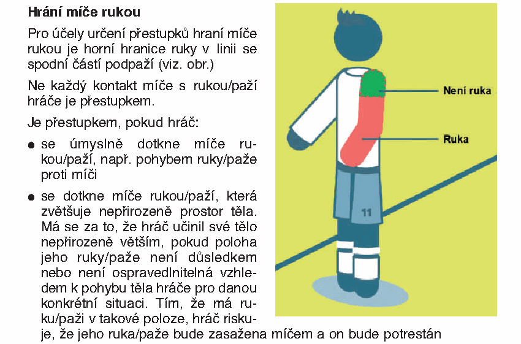

[Tištěná strana 108 · PDF 110](sources/pravidla-fotbalu-facr-2024.pdf#page=110)

- iniciuje úmyslný trik pro přihrávku míče (včetně volného kopu nebo kopu od branky) brankáři hlavou, hrudníkem, kolenem atd., aby obešel pravidlo, ať už se brankář dotkne nebo nedotkne míče rukama; brankář bude potrestán, pokud je zodpovědný za iniciování úmyslného triku on

- dopustí se jiného přestupku neuvedeného v Pravidlech fotbalu, pro který byla hra přerušena pro napomenutí nebo vyloučení hráče

Nepřímý volný kop je nařízen, pokud se brankář uvnitř vlastního pokutového území dopustí některého z následujících přestupků:

- má míč v rukou pod kontrolou déle než šest sekund před tím, než se ho zbaví

- dotkne se míče rukou poté co se ho zbavil a dříve, než se ho dotkl jiný hráč

- dotkne se míče rukou poté, co mu ho úmyslně nohou přihrál jeho spoluhráč nebo co ho obdržel přímo po vhazování spoluhráče, vyjma případu, kdy brankář zjevně kopnul nebo se pokusil kopnout míč, aby ho dostal do hry,

Brankář má míč pod kontrolou, pokud:

- má míč mezi rukama nebo mezi rukou a jakýmkoliv povrchem (např. zemí, nebo vlastním tělem) nebo se jej dotkne kteroukoli částí ruky nebo paže, s výjimkou případů, kdy se míč od brankáře náhodně odrazí nebo brankář provede úmyslný obranný zákrok

- drží míč v natažené otevřené dlani

- míčem poklepává o zem nebo ho vyhazuje do vzduchu

Brankář nesmí být atakován soupeřem, jestliže má míč v rukách pod kontrolou.

#### Nebezpečná hra

Hraní nebezpečným způsobem je takový způsob hry, když při pokusu hrát míčem hrozí zranění některého hráče včetně hráče samého, nebo kterým blízko stojícímu soupeři znemožní hraní míčem z obavy před zraněním.

Hraní tzv. „nůžkami“ je přípustné za předpokladu, že není nebezpečné pro soupeře.

#### Bránění soupeři v pohybu bez fyzického kontaktu

O bránění soupeři v pohybu se jedná, jestliže hráč se postaví soupeři do cesty, aby mu překážel, aby ho blokoval nebo zpomalil, nebo ho přinutil změnit směr pohybu, přičemž míč není v blízkosti ani jednoho z obou hráčů.

Všichni hráči mají právo na své postavení na hrací ploše; stát soupeři v cestě není totéž jako postavit se soupeři do cesty.

Hráč může krýt míč který je v blízkosti tím, že se postaví mezi soupeře a míč, ale přitom nesmí soupeře držet rukou nebo tělem. V případě, že míč je v blízkosti, může být hráč dovoleným způsobem atakován soupeřem.

[Tištěná strana 109 · PDF 111](sources/pravidla-fotbalu-facr-2024.pdf#page=111)

### 3. Disciplinární opatření

Rozhodčí má pravomoc přijímat disciplinární opatření (udělovat osobní tresty) od vstupu na hrací plochu při předzápasové kontrole až do opuštění hrací plochy po skončení utkání (včetně penaltového rozstřelu).

Pokud před vstupem na hrací plochu k zahájení utkání se hráč nebo funkcionář družstva dopustí přestupku, za který má být vyloučen, nepřipustí rozhodčí provinivšího se hráče nebo funkcionáře družstva k účasti na utkání (Pravidlo 3.6); jakékoli další přestupky rozhod čí oznámí řídícímu orgánu.

Hráč nebo funkcionář družstva, který se dopustí provinění a to na hrací ploše nebo i mimo ni, bude podle závažnosti přestupku napomenut nebo vyloučen.

Žlutou kartou rozhodčí napomíná, červenou kartou rozhodčí vylučuje.

Žlutá nebo červená karta může být udělena pouze hráči, náhradníkovi, vystřídanému hráči nebo funkcionáři družstva.

#### HRÁČI, NÁHRADNÍCI A VYSTŘÍDANÍ HRÁČI

#### Zdržení navázání hry při udělení osobního trestu

Pokud se rozhodčí rozhodl udělit osobní trest, nesmí být hra navázána dříve, dokud rozhodčí osobní trest neudělí, vyjma případů, kdy družstvo, které se neprovinilo, provede rychle volný kop, má zjevnou možnost k dosažení branky a rozhodčí ještě nezahájil proceduru udělování OT. Osobní trest bude udělen při nejbližším přerušení hry.

Jestliže ale původním přestupkem byla soupeřovu družstvu zmařena zjevná branková možnost, bude hráč pouze napomenut; pokud byla přestupkem ovlivněna nebo zastavena slibně se rozvíjející útočná akce, nebude hráč ani napomenut.

#### Výhoda

Pokud rozhodčí uplatní výhodu ve hře po přestupku, za který má být hráč napomenut nebo vyloučen, musí být napomenutí nebo vyloučení uděleno při nejbližším přerušení hry. Ale v případě, že přestupkem byla zmařena zjevná branková možnost soupeřova družstva, bude hráč napomenut za nesportovní chování; jestliže přestupkem byla ovlivněna nebo zastavena slibně se rozvíjející útočná akce, nebude hráč napomenut.

Výhoda ve hře nemá být uplatňována v situacích, kdy se jedná o surovou hru, hrubé nesportovní chování nebo druhé napomenutí; pouze v případě, že existuje zjevná možnost dosáhnout branky, rozhodčí uplatní výhodu ve hře a provinivšího se hráče vyloučí při nejbližším přerušení hry. Pokud by ale tento hráč zahrál míčem, ovlivnil nebo se pokusil ovlivnit protihráče, přeruší rozhodčí hru, hráče vyloučí a hru naváže nepřímým volným kopem, pokud se hráč nedopustil závažnějšího přestupku.

Pokud obránce začne držet útočníka mimo pokutové území a nadále ho drží i uvnitř pokutového území, musí rozhodčí nařídit pokutový kop.

[Tištěná strana 110 · PDF 112](sources/pravidla-fotbalu-facr-2024.pdf#page=112)

#### Napomenutí

Rozhodčí hráče napomene, jestliže

- zdržuje navázání hry

- projevuje nesouhlas slovy, gesty nebo chováním

- vstupuje, úmyslně opouští hrací plochu nebo se na ni vrací bez souhlasu rozhodčího

- nedodrží předepsanou vzdálenost při provádění míče rozhodčího, volného kopu, kopu z rohu nebo vhazování míče,

- soustavně porušuje Pravidla hry (není určen konkrétní počet nebo typ přestupků pro definici „soustavně“)

- chová se nesportovně

- vstoupí do prostoru vyhrazeného pro přezkoumávání videa rozhodčím

- nepřiměřeným použitím signálu rozhodčího (TV obrazovka) se domáhá přezkoumání videozáznamu

Náhradníka nebo vystřídaného hráče rozhodčí napomene, jestliže

- zdržuje navázání hry

- projevuje nesouhlas slovy, gesty nebo chováním

- vstupuje nebo se vrací na hrací plochu bez souhlasu rozhodčího

- chová se nesportovně

- vstoupí do prostoru vyhrazeného pro přezkoumávání videa rozhodčím

- nepřiměřeným použitím signálu rozhodčího (TV obrazovka) se domáhá přezkoumání videozáznamu

Jestliže jsou návazně spáchány dva samostatné přestupky, za které se napomíná (i těsně po sobě), musí následovat dvě napomenutí. Například když hráč bez souhlasu rozhodčího vstoupí na hrací plochu a bezohledným způsobem podrazí soupeře, nebo když vstoupí na hrací plochu a hrou rukou nebo jiným přestupkem zastaví slibnou akci.

#### Napomínaní za nesportovní chování

Existují různé situace, kdy musí být hráč napomenut za nesportovní chování, včetně případů, kdy hráč:

- pokusí se oklamat rozhodčího, např. předstírá zranění nebo domnělý přestupek (simulování)

- vymění si místo s brankářem v průběhu hry nebo bez souhlasu rozhodčího

- bezohledným způsobem se dopustí přestupku, za který se nařizuje přímý volný kop

- zahraje míč rukou, aby narušil nebo zastavil slibně se rozvíjející útočnou akci, vyjma případu, kdy rozhodčí nařídil pokutový kop za neúmyslné hraní míče rukou

[Tištěná strana 111 · PDF 113](sources/pravidla-fotbalu-facr-2024.pdf#page=113)

- zabrání soupeřovu družstvu dosažení branky nebo zmaří družstvu soupeře zjevnou brankovou možnost a rozhodčí nařídí pokutový kop za neúmyslné hraní míče rukou

- dopustí se jakéhokoliv jiného přestupku, kterým zastavil slibně se rozvíjející útočnou akci, vyjma případu, kdy rozhodčí nařídí pokutový kop za přestupek, ke kterému došlo při pokusu zahrát míč nebo v souboji o míč

- zmaří zjevnou brankovou možnost soupeře přestupkem, kterým se hráč pokusil zahrát míč nebo sváděl souboj o míč a rozhodčí nařídil pokutový kop

- zahraje míč rukou při pokusu o dosažení branky (bez ohledu na to, zda se jednalo o úspěšný pokus) nebo provede neúspěšný pokus zabránit dosažení branky

- udělá na hrací ploše nedovolené značky

- zahraje míčem při odchodu z hrací plochy poté, co mu bylo uděleno povolení k opuštění hrací plochy

- projevuje nedostatek respektu ke hře

- iniciuje úmyslný trik pro přihrávku míče (včetně volného kopu nebo kopu od branky) brankáři hlavou, hrudníkem, kolenem atd., aby obešel pravidlo, ať už se brankář dotkne nebo nedotkne míče rukama; brankář bude potrestán, pokud je zodpovědný za iniciování úmyslného triku on

- verbálně rozptyluje soupeře během hry nebo při navazování hry

#### Oslava dosažení branky

Hráči mohou oslavit dosažení branky, ale oslava nesmí být přehnaná. Choreografické oslavy nejsou povoleny a oslavy nesmí vést k promarňování doby hry (zdržování).

Opuštění hrací plochy při oslavě dosažení branky není přestupkem, za který by hráč měl být napomenut, pokud se na hrací plochu vrátí co nejdříve.

Hráč musí být napomenut, i když branka nebyla uznána, jestliže:

- vyleze na oplocení hřiště anebo se přiblíží k divákům způsobem, který může zapříčinit bezpečnostní problémy

- provádí gesta, nebo posuňky nebo jedná způsobem, který je provokativní, zesměšňující nebo pobuřující

- hlavu nebo obličej si zakryje maskou nebo jiným předmětem

- svlékne si dres nebo si dresem zakryje hlavu

#### Zdržování při navazování hry

Rozhodčí musí napomenout hráče, který zdržuje navázání hry tím, že:

- postaví se k vhazování, ale potom přenechá provedení spoluhráči

- otálí s odchodem z hrací plochy, když má být střídán

- neúměrně zdržuje navázání hry

[Tištěná strana 112 · PDF 114](sources/pravidla-fotbalu-facr-2024.pdf#page=114)

- úmyslně odkopne nebo odnese míč nebo vyvolává konfrontaci tím, že se míče úmyslně dotkne poté, co rozhodčí přerušil hru

- provede volný kop z nesprávného místa, aby dosáhl jeho opakování

#### Vyloučení

Rozhodčí vyloučí hráče, náhradníka nebo vystřídaného hráče, který se dopustí jednoho z následujících přestupků:

- zabrání soupeřovu družstvu dosáhnout branky nebo zmaří jeho zjevnou brankovou možnost tím, že zahraje míč rukou úmyslně (vyjma brankáře v jeho vlastním pokutovém území)

- zabrání soupeřovu družstvu v dosažení branky nebo zmaří soupeři zjevnou možnost dosáhnout branky neúmyslným hraním míče rukou mimo vlastní pokutové území

- zabrání soupeřovu družstvu v dosažení branky nebo zmaří soupeři zjevnou možnost dosáhnout branky tím, že soupeře směřujícího celkově na jeho branku zastaví přestupkem, za který se nařizuje přímý volný kop (není-li dále stanoveno jinak)

- dopustí se surové hry

- kousne nebo plivne na jinou osobu

- chová se hrubě nesportovně (dopustí se hrubého nesportovního chování)

- použije pohoršující, urážlivé nebo ponižující výroky, gesta nebo chování,

- je podruhé napomínán v témže utkání

- vstoupí na pracoviště videoasistenta rozhodčího a jeho asistenta (VOR)

Vyloučený člen družstva musí opustit technickou zónu a prostor hřiště.

#### Zabránění dosažení branky nebo zmaření zjevné brankové možnosti

Jestliže hráč zabrání soupeřovu družstvu dosáhnout branky nebo zmaří jeho zjevnou brankovou možnost tím, že zahraje míč rukou úmyslně, rozhodčí ho vyloučí bez ohledu na to, kde se přestupku úmyslného hraní míče rukou dopustil (vyjma brankáře v jeho vlastním pokutovém území).

Pokud hráč zabránil soupeřovu družstvu dosáhnout branky nebo zmaří jeho zjevnou brankovou možnost tím, že zahraje míč rukou neúmyslně a rozhodčí nařídil pokutový kop, je provinivší se hráč napomenut.

Pokud se hráč ve vlastním pokutovém území vůči soupeři dopustí přestupku, kterým dojde ke zmaření jeho zjevné brankové možnosti a rozhodčí nařídí pokutový kop, je provinivší se hráč napomenut, pokud se při přestupku pokusil zahrát míč nebo sváděl souboj o míč; za všech ostatních okolností (např. držení, tahání, strčení, bez možnosti hrát míčem atd.) musí být provinivší se hráč vyloučen.

Hráč, vyloučený hráč, náhradník nebo vystřídaný hráč, který vstoupí na hrací plochu bez požadovaného souhlasu rozhodčího, následně ovlivní hru nebo soupeře

[Tištěná strana 113 · PDF 115](sources/pravidla-fotbalu-facr-2024.pdf#page=115)

 a tím zabrání soupeřovu družstvu dosáhnout branky nebo zmaří jeho zjevnou možnost dosáhnout branky, se dopustil přestupku, za který musí být vyloučen.

Přitom je třeba vzít v úvahu

- vzdálenost místa přestupku od branky

- směr útočné akce

- pravděpodobnost udržení či získání kontroly nad míčem

- postavení a počet bránících hráčů

#### Surová hra

Způsob hry, kterým je ohrožena bezpečnost soupeře nebo při kterém je použito nepřiměřené síly nebo brutality, musí být potrestán jako surová hra.

Každý hráč, který v souboji o míč napadne soupeře zepředu, ze strany nebo zezadu s použitím jedné nebo obou nohou a s nepřiměřenou silou, nebo ohrozí bezpečnost soupeře, se dopouští surové hry.

#### Hrubé nesportovní chování

Hráč se dopustí hrubého nesportovního chování, pokud použije nebo se pokusí použít nepřiměřenou sílu nebo brutalitu vůči soupeři mimo boj o míč, nebo vůči spoluhráči, členovi realizačního týmu, rozhodčímu, divákovi nebo jiné osobě, bez ohledu na to, zda dojde nebo nedojde ke kontaktu.

Hráč, který mimo souboj o míč úmyslně udeří soupeře nebo jakoukoli jinou osobou do hlavy nebo do obličeje, rukou nebo paží, se dopustí hrubého nesportovního chování, vyjma případů, kdy použitá síla byla zanedbatelná.

#### FUNKCIONÁŘI DRUŽSTVA

Tam, kde je spáchán přestupek někým z technické zóny (náhradník, vystřídaný hráč, vyloučený hráč nebo funkcionář družstva) a provinivší se osoba nemůže být identifikována, obdrží osobní trest hlavní trenér přítomný v technické zóně. (Pokud není trenér přítomen, obdrží trest vedoucí družstva.)

#### Varování

Následující přestupky by obvykle měly vést k varování; opakované nebo zjevné přestupky by měly vést k napomenutí nebo k vyloučení:

- vstoupí na hrací plochu s respektem nebo nekonfrontačním způsobem

- nespolupracuje s rozhodčím, např. ignoruje pokyny nebo požadavky asistenta rozhodčího nebo čtvrtého rozhodčího

- použije méně závažné projevy nesouhlasu s rozhodnutím rozhodčího (slovy nebo chováním)

- občas opustí technickou zónu, aniž by se dopustil dalšího přestupku

[Tištěná strana 114 · PDF 116](sources/pravidla-fotbalu-facr-2024.pdf#page=116)

#### Napomenutí

Přestupky na napomenutí zahrnují zejména:

- zjevně nebo opakovaně nerespektuje hranice technické zóny svého družstva

- zdržuje navázání hry svého družstva

- úmyslně vstoupí do technické zóny soupeřova družstva (nekonfrontačně)

- projevuje nesouhlas (s rozhodnutím) slovy, gesty nebo chováním vč. toho, že

– hodí nebo kopne láhev s nápojem nebo jiný předmět

– gestikulací nebo chováním projevuje jasný nedostatek respektu k rozhodčím (např. sarkasticky tleská)

- vstoupí do prostoru vyhrazeného pro přezkoumání videa

- nadměrnou gestikulací se domáhá udělení ČK nebo ŽK

- nadměrně ukazuje signál TV pro přezkoumání opakovaného záběru

- gestikuluje nebo se chová provokativním nebo pobuřujícím způsobem

- opakovaně se chová nepřijatelně nebo vytrvale opakuje přestupky, za které se uděluje varování

- projevuje nedostatek respektu ke hře

#### Vyloučení

Přestupky na vyloučení zahrnují zejména:

- zdržuje při navazování hry družstvem soupeře, např. zadržováním míče, zakopnutím míče, bráněním v pohybu hráči

- úmyslně opustí technickou zónu, aby:

– projevil nesouhlas s rozhodčím, nebo protestoval proti rozhodnutí rozhodčího

– choval se provokativním nebo pobuřujícím způsobem

- vstoupí do technické zóny soupeře agresivním nebo konfrontačním způsobem

- úmyslně vhodí nebo kopne předmět na hrací plochu

- vstoupí na hrací plochu, aby:

– konfrontoval rozhodčího (vč. poločasové přestávky a po ukončení utkání)

– ovlivnil hru, hráče soupeřova družstva nebo rozhodčího

- vstoupí na pracoviště videoasistenta rozhodčího

- chová se násilně nebo agresivně (vč. plivnutí nebo kousnutí) vůči hráči soupeře, náhradníkovi, funkcionáři družstva, rozhodčímu, divákovi nebo jiné osobě (např. podavači míčů, příslušníkovi bezpečnostní služby nebo pořadateli atd.)

- obdrží druhé napomenutí v tomtéž utkání

[Tištěná strana 115 · PDF 117](sources/pravidla-fotbalu-facr-2024.pdf#page=117)

- použije pohoršující, urážlivé nebo ponižující výroky, gesta nebo chování

- použije neschválené (neautorizované) elektronické nebo komunikační zařízení a/nebo se chová nevhodným způsobem v důsledku použití elektronického nebo komunikačního zařízení

- chová se hrubě nesportovně

#### Přestupky hozeným předmětem nebo míčem příslušníkem družstva

Ve všech případech přijme rozhodčí odpovídající disciplinární opatření:

- bezohledný přestupek – napomene viníka za nesportovní chování

- použití nepřiměřené síly – vyloučí viníka za hrubé nesportovní chování

### 4. Navázání hry po přestupcích a proviněních

Je-li míč ze hry, bude hra navázána způsobem odpovídajícím přerušení hry.

Je-li míč ve hře a hráč se dopustí fyzického přestupku na hrací ploše vůči:

- protihráči – nepřímý nebo přímý volný kop nebo pokutový kop

- spoluhráči, náhradníkovi, vystřídanému nebo vyloučenému hráči, funkcionáři družstva nebo rozhodčímu – přímý volný kop nebo pokutový kop

Všechny verbální přestupky jsou trestány nepřímým volným kopem

Pokud rozhodčí přeruší hru za přestupek spáchaný hráčem na hrací ploše nebo vně hrací plochy vůči vnějšímu vlivu, je hra navázána míčem rozhodčího, vyjma případu, kdy je nařízen nepřímý volný kop za opuštění hrací plochy bez souhlasu rozhodčího; nepřímý volný kop bude proveden z místa na pomezní nebo na brankové čáře, kde hráč opustil hrací plochu.

Je-li míč ve hře a

- hráč se dopustí přestupku vůči rozhodčímu nebo protihráči, náhradníkovi, vystřídanému nebo vyloučenému hráči, nebo funkcionáři družstva mimo hrací plochu nebo

- náhradník, vystřídaný nebo vyloučený hráč, nebo funkcionář družstva se dopustí přestupku vůči soupeři nebo rozhodčímu, anebo ovlivní protihráče nebo rozhodčího mimo hrací plochu

je hra navázána volným kopem na pomezní nebo na brankové čáře nejblíže k místu, kde došlo k přestupku nebo ovlivnění; pokutový kop bude nařízen, pokud se místo přestupku nacházelo za brankovou čárou ohraničující pokutové území provinivšího se družstva.

Je-li přestupek spáchán mimo hrací plochu hráčem proti hráči, náhradníkovi, vystřídanému hráči nebo funkcionáři vlastního družstva, je hra navázána nepřímým volným kopem na brankové nebo pomezní čáře, nejblíže k místu, kde k přestupku došlo.

Jestliže se hráč dotkne míče předmětem, který drží v ruce (kopačka, chránič holeně apod.), je hra navázána přímým volným nebo pokutovým kopem.

[Tištěná strana 116 · PDF 118](sources/pravidla-fotbalu-facr-2024.pdf#page=118)

Pokud hráč, který je na hrací ploše nebo mimo hrací plochu, hodí nebo kopne předmět (nebo jiný míč než určený ke hře) na protihráče, nebo hodí nebo kopne předmět (včetně míče) na soupeřova náhradníka, vystřídaného nebo vyloučeného hráče, nebo funkcionáře družstva, rozhodčího nebo na míč určený ke hře, je hra navázána přímým volným kopem z místa, kde předmět zasáhnul nebo měl zasáhnout osobu nebo míč. Pokud se takové místo nachází mimo hrací plochu, je volný kop proveden na nejbližším místě na pomezní nebo na brankové čáře; při přestupku, za který se má nařídit přímý volný kop, bude pokutový kop nařízen, pokud se místo přestupku nacházelo za brankovou čárou ohraničující pokutové území provinivšího se družstva.

Pokud náhradník, vystřídaný nebo vyloučený hráč, nebo hráč, který je dočasně mimo hrací plochu, nebo funkcionář družstva hodí nebo kopne předmět na hrací plochu a ovlivní tím hru, protihráče nebo rozhodčího, je hra navázána přímým volným kopem (nebo pokutovým kopem) tam, kde předmět ovlivnil hru nebo kde zasáhnul nebo měl zasáhnout protihráče, rozhodčího nebo míč.

### ROZHODNUTÍ FAČR

#### Pravomoci rozhodčího vůči příslušníkům družstva

1\. Pravomoci rozhodčího udělovat osobní tresty příslušníkům družstva jsou dány Pravidly fotbalu; těmto osobám rozhodčí uděluje osobní tresty s použitím barevných karet. Nemá-li rozhodčí karty k dispozici, může osobní trest udělit i ústně.

2\. Vyloučený příslušník družstva je povinen neprodleně opustit prostor hřiště. Odmítne-li vyloučený příslušník družstva opustit prostor hřiště, požádá rozhodčí vedoucího družstva o zjednání nápravy a vše uvede v ZoU.

3\. Jestliže se příslušník družstva dopustí závažného provinění v době od opuštění hrací plochy rozhodčím po ukončení utkání do okamžiku, kdy vedoucí družstev potvrzují údaje v ZoU, sdělí rozhodčí provinění člena příslušníka družstva vedoucímu družstva a vše uvede v ZoU.

4\. Jestliže se osoba, která je příslušníkem družstva, dopustí jakéhokoli závažného provinění, za který má být vyloučena, v době před uzavřením ZoU před utkáním, nepřipustí rozhodčí uvedení této osoby do ZoU, a důvody a provinění této osoby uvede rozhodčí v ZoU.

5\. Jestliže se příslušník družstva dopustí jakéhokoli závažného provinění, za který má být vyloučen, v době po uzavření ZoU před utkáním, nedovolí rozhodčí této osobě účastnit se utkání. Důvody a provinění této osoby uvede rozhodčí v ZoU.

6\. V případě, že osoba, která v utkání byla příslušníkem družstva, se dopustí jaké- hokoli závažného provinění po uzavření ZoU po utkání, uvede rozhodčí její pro- vinění do ZoU.

7\. Členové pořadatelské služby nepodléhají pravomoci rozhodčího. Pokud se někte- rý člen pořadatelské služby chová způsobem nevhodným nebo vůči jiným oso- bám urážlivým, požádá rozhodčí hlavního pořadatele, popřípadě vedoucího domácího družstva o zjednání nápravy s tím, že vše popíše v ZoU.

[Tištěná strana 117 · PDF 119](sources/pravidla-fotbalu-facr-2024.pdf#page=119)

### VÝKLAD K PRAVIDLU

#### VŠEOBECNÁ USTANOVENÍ

12.1 Pravidlo 12 stanoví zásady boje o míč a zásady jednání a chování hráčů. Boj o míč smí být tvrdý, ale musí být čistý, bez zákeřností a hráči mají respektovat soupeře. Veškeré počínání hráčů má být za všech okolností slušné a korektní. Úsilí hráčů o dosažení co nejlepšího výsledku nemá být v rozporu se zásadami sportovní etiky. Každý hráč je povinen dbát o bezpečnost jak svou vlastní, tak i o bezpečnost ostatních hráčů.

Za zakázaný způsob hry se považuje, jestliže hráč si v souboji o míč počíná nedbale, bezohledně, nebo použije nepřiměřenou sílu.

12.2 Pravidla fotbalu dávají rozhodčímu pravomoc k udělování trestů; podle povahy přestupku rozhodčí nařizuje tresty herní a uděluje tresty osobní. Herními tresty jsou přímé volné kopy, nepřímé volné kopy a pokutový kop; osobními tresty jsou napomenutí a vyloučení.

  - v části 1 uvádějí přestupky, za které rozhodčí nařizuje přímý volný kop nebo pokutový kop

  - v části 2 přestupky, za které rozhodčí nařizuje nepřímý volný kop

  - v části 3 přestupky, za které rozhodčí uděluje osobní tresty

  - v části 4 se uvádí způsoby navázání hry

12.3 Pokud dojde současně k více přestupkům, potrestá rozhodčí ten nejzávažnější (viz Pravidlo 5.3 Disciplinární opatření).

12.4 Dopustí-li se jakéhokoliv provinění osoba cizí na hrací ploše v době, kdy je míč ve hře, přeruší rozhodčí hru a zajistí, aby uvedená osoba opustila prostor hřiště. Hru naváže míčem rozhodčího v místě, kde byl míč v okamžiku přerušení hry.

#### VÝKLAD K PRAVIDLU 12, část 1

#### Přestupky trestané přímým volným kopem

12.5 Jestliže rozhodčí přeruší hru, aby nařídil přímý volný nebo pokutový kop, rozhoduje se podle toho, kde na hrací ploše k přestupku došlo.

a) Jestliže k přestupku došlo v důsledku fyzického kontaktu se soupeřem nebo pokusem o tento fyzický kontakt, a to i nepřímo, např. hozením nějakého předmětu, plivnutím apod., považuje rozhodčí za místo přestupku to místo na hrací ploše, kde došlo nebo mělo dojít k fyzickému kontaktu; kopne-li např. hráč, který stojí ve vlastním pokutovém území soupeře, který je mimo pokutové území, nařídí rozhodčí proti jeho družstvu přímý volný kop.

b) Zahraje-li hráč míč rukou, je místem přestupku to místo na hrací ploše, kde došlo ke kontaktu ruky a míče; zahraje-li např. hráč nebo brankář, který stojí ve vlastním pokutovém území míč rukou mimo vlastní pokutové

[Tištěná strana 118 · PDF 120](sources/pravidla-fotbalu-facr-2024.pdf#page=120)

 území, nařídí rozhodčí přímý volný kop z příslušného místa mimo pokutové území.

c) Přestupky, ke kterým došlo přímo na některé z čar ohraničujících pokutové území, se považují za přestupky uvnitř pokutového území.

#### Vrážení do soupeře.

12.6 Při boji o míč je dovoleno plně uplatnit tělesnou sílu, proto hráč smí do soupeře dovoleným způsobem vrazit; vražení však nesmí být podle názoru rozhodčího prudké, bezohledné, ani při něm nesmí být použito nepřiměřené síly.

Vrážet smí hráč pouze v boji o míč a v bezprostřední vzdálenosti od míče, za dovolený způsob vrážení se považuje pouze vrážení ramenem do ramene soupeře nebo vrážení ramenem zezadu do soupeřovy lopatky, přičemž vrážející hráč musí mít paži, jejímž ramenem do soupeře vráží, u těla, a oba hráči přitom musí být na stejné úrovni, tzn., že oba musí být buď na zemi nebo ve výskoku.

Jestliže hráč vráží ramenem do soupeřova hrudníku, považuje se jeho zákrok za nedovolené vrážení. Za nedovolený způsob vrážení se považuje i takový zákrok, při němž hráč prudce vráží vlastním hrudníkem zezadu do soupeře, i když přitom upaží, aby naznačil, že nepoužil rukou. Jestliže vrážející hráč nemá při vrážení paži u těla, považuje se jeho zákrok za strčení do soupeře.

Obrátí-li se hráč z taktických důvodů zády k soupeři proto, aby kryl míč, smí do něho soupeř zezadu dovoleným způsobem vrážet.

#### Skočení na soupeře.

12.7 Skočením na soupeře se rozumí zákrok, při němž hráč provede výskok nejen vzhůru, ale i směrem na soupeře s následným fyzickým kontaktem.

Za skočení na soupeře se rovněž považuje naskočení hráče zezadu na soupeře, i když při tom hráč upaží, aby zdůraznil, že při výskoku nepoužívá rukou, nebo skočení hráče směrem proti soupeři na míč, kterým právě soupeř hraje.

Za porušení pravidla se však nepovažuje, jestliže hráč nebo brankář vyskočí a zasáhne míč a teprve potom o soupeře zavadí nebo na něj i spadne.

#### Kopnutí nebo pokus o kopnutí soupeře.

12.8 Každé kopnutí nebo pokus o kopnutí soupeře, i kdyby k němu došlo v boji o míč, musí rozhodčí potrestat, došlo-li k němu podle jeho názoru z nedbalosti, bezohlednosti nebo za použití nepřiměřené síly.

Kopnutím se rovněž rozumí

  - úder kolenem, nebo

  - zasažení soupeře podrážkou kopačky třeba i prostřednictvím míče (tzv. šlapák, šlapák přes míč), nebo

  - zasažení soupeře podrážkou kopačky ve skluzu zezadu, ze strany nebo zepředu.

[Tištěná strana 119 · PDF 121](sources/pravidla-fotbalu-facr-2024.pdf#page=121)

Za kopnutí se považuje i každý pokus hráče úmyslně kopnout soupeře, při němž sice nedošlo k fyzickému kontaktu, ale to jen proto, že soupeř stačil před kopnutím uhnout.

#### Strčení do soupeře

12.9 Strčením se rozumí strčení, odstrčení nebo postrčení soupeře a to nejen rukou, paží nebo loktem, ale i jinou částí těla, např. stehnem nebo hýždí. Rozhodující není prudkost strčení; je-li soupeř v pohybu nebo ve výskoku, stačí do něj někdy strčit jen lehce, aby ztratil rovnováhu.

#### Udeření nebo pokus o udeření soupeře

12.10  Každé udeření soupeře, i kdyby k němu došlo v boji o míč, musí rozhodčí potrestat, je-li podle jeho názoru nedbalé, bezohledné nebo s použitím nepřiměřené síly. Za udeření soupeře se rovněž považuje úder hlavou nebo udeření míčem či jiným předmětem, který hráč drží v ruce. Jestliže např. brankář úmyslně udeří soupeře míčem, který drží v rukou, nebo zasáhne soupeře prudce hozeným míčem, jedná se rovněž o udeření soupeře.

Za udeření se považuje i každý pokus úmyslně udeřit soupeře, při němž sice nedošlo k fyzickému kontaktu, ale to jen proto, že soupeř stačil před udeřením uhnout.

#### Nedovolené zastavení soupeře

12.11  Při zastavování soupeře musí hráč nejprve zahrát míčem a teprve potom smí dojít k tělesnému kontaktu obou hráčů.

Nejčastějším způsobem zastavení soupeře je odebrání míče soupeři skluzem. Při odebírání míče skluzem není pravidlo porušeno, jestliže bránící hráč nejprve zasáhne míč, a to ani v případě, jestliže soupeř následně upadne přes nohu, kterou předtím bránící hráč míčem zahrál. Zasáhne-li však hráč při odebírání míče skluzem nejprve soupeře a teprve potom míč, považuje se to za zakázaný způsob hry. Za zakázaný způsob hry se považuje rovněž to, jestliže hráč zasáhne míč i soupeře současně, nebo jestliže hráč sice jednou nohou soupeři míč odebere, ale soupeře přitom zasáhne druhou nohou.

#### Podražení nebo pokus o podražení soupeře

12.12  Podražením soupeře se rozumí zákrok, při němž hráč způsobí pád soupeře nastavením nohy, zahákováním nohy soupeře nebo skluzem.

Za podražení se rovněž považuje, sehne-li se hráč za soupeřem nebo před ním a tak přivodí jeho pád (tzv. stolička). Tento zákrok je zvláště nebezpečný proti hráči ve výskoku, především proti brankáři chytajícímu míč.

Za podražení se považuje i každý pokus úmyslně podrazit soupeře, při němž sice nedošlo k podražení soupeře, ale to jen proto, že soupeř se stačil zákroku vyhnout.

[Tištěná strana 120 · PDF 122](sources/pravidla-fotbalu-facr-2024.pdf#page=122)

#### Hra rukou

12.13  Pokud se týká hry rukou, rozlišuje pravidlo tři hlavní kategorie přestupků:

  - úmyslná hra rukou

  - neúmyslná hra rukou, která byla v nepřirozené poloze .

  - neúmyslná hra rukou hráče, po které tento hráč bezprostředně dosáhl branky .

12.14  Při rozhodování, zda se jednalo o hru rukou, musí rozhodčí posoudit tyto aspekty:

  - zda hráč rukou (rukama) učinil své tělo nepřirozeně větším

  - zda se jednalo o pohyb ruky k míči nebo o pohyb míče k ruce

  - zda jeho ruka byla v přirozené poloze, odpovídající pohybu těla hráče

  - zda hráč neměl ruku nad úrovní ramene

  - zda se snažil předejít tomu, aby se míč dotkl jeho ruky

  - zda měl vůbec možnost předejít kontaktu míče s rukou

12.15  Za hru rukou rozhodčí nebude považovat např. tyto situace:

  - míč je nastřelen na ruku, kterou má hráč u těla

  - hráč upadne na míč a přitom se nechtěně dotkne míče rukou

  - hráč padá na zem nebo vstává ze země, přičemž ruku použije jako podpěru těla

  - hráč si instinktivně a reflexivním pohybem chrání před prudce vystřeleným míčem choulostivou část těla

  - hráč míč zahraje ramenem nebo se míč odrazí nebo dotkne jeho ramene

  - po odehrání míče spoluhráčem se míč neočekávaně dotkne ruky blízkého hráče

  - po vědomém hrání míče jinou částí těla se míč dotkne vlastní ruky hráče (hraje vůči sobě)

#### Držení soupeře

12.16  Držením se rozumí aktivní držení, tj. uchopení nebo tahání soupeře za úbor, za paži nebo za kteroukoli jinou část těla soupeře ať již rukou, paží nebo i kteroukoli jinou částí těla (např. stehnem nebo hýždí) se záměrem bránit soupeři ve volném pohybu. Rozpaží-li hráč ruce, aby dotekem soupeři zabránil ve volném pohybu, drží soupeře. Za držení soupeře se rovněž považuje, jestliže hráč vyskočí po míči a při výskoku se rukou nebo rukama opře o stojícího soupeře.

Trestá-li rozhodčí držení, nesmí při rozhodování o místu přestupku zvýhodnit družstvo, jehož hráč se přestupku dopustil.

#### Bránění soupeři v pohybu s fyzickým kontaktem

12.17  Hráč, který nemá míč pod kontrolou, se dopustí přestupku, jestliže bez

[Tištěná strana 121 · PDF 123](sources/pravidla-fotbalu-facr-2024.pdf#page=123)

úmyslu hrát míčem se postaví soupeři do cesty, aby mu bránil v pohybu, přičemž se ho fyzicky dotkne.

#### Kousne nebo plivne na někoho z příslušníků družstva nebo rozhodčího

12.18  Jestliže hráč kousne nebo plivne na někoho z příslušníků družstva nebo rozhodčího, rozhodčí přeruší hru, provinivšího se hráče vyloučí a ve prospěch soupeřova družstva nařídí přímý volný popřípadě pokutový kop. Rozhodčí však může potrestat hráče jen v případě, že přestupek viděl, nebo jestliže ho o přestupku informoval kterýkoli z dalších delegovaných rozhodčích.

#### VÝKLAD K PRAVIDLU 12, část 2

#### Přestupky trestané nepřímým volným kopem

12.19  Rozhodčí je oprávněn nařídit nepřímý volný kop za přestupky vůči soupeři uvedené v části 2 Pravidla 12, kterých se hráč dopustí v době, kdy byl míč ve hře; hru rozhodčí naváže nepřímým volným kopem na tom místě hrací plochy, kde se nacházel provinivší se hráč.

Nepřímý volný kop však rozhodčí nařídí také za přestupky, které Pravidla fotbalu uvádějí na jiných místech.

#### Nebezpečná hra

12.20  Za nebezpečnou hru se považuje takový způsob hry, při kterém sice nedojde ke kontaktu se soupeřem, ale v jehož důsledku soupeř z obavy před zraněním nemůže sám míčem hrát. Jestliže se hráč při zákroku soupeře dotkne, nejedná se o nebezpečnou hru, nýbrž o některý z přestupků uvedených v části 1 Pravidla 12.

12.21  Za nebezpečnou hru vůči soupeři se považuje, jestliže např. hráč

  - snaží se zasáhnout nohou míč na úrovni trupu nebo hlavy soupeře, který je v bezprostřední blízkosti míče (tzv. vysoká noha)

  - provede tzv. nůžky směrem na hráče v bezprostřední blízkosti

  - nastaví nohu podrážkou kopačky proti noze soupeře a přitom nedojde ke kontaktu hráčů

  - snaží se vykopnout míč z rukou brankáře, který má míč pod kontrolou

12.22  Nebezpečnou hrou vůči vlastní osobě sice hráč ohrožuje pouze svou vlastní bezpečnost, ale jeho jednání je přesto v rozporu s pravidly, protože tím soupeři omezuje možnost hrát míčem. Za nebezpečnou hru vůči vlastní osobě se považuje, jestliže např. hráč

  - snaží se zahrát míč hlavou pod úrovní pasu soupeře v okamžiku, kdy soupeř se snaží hrát míčem regulérně nohou, nebo

  - upadne na míč a zůstane na něm nebo těsně u něj sedět nebo ležet, a tím znemožní soupeři hrát míčem regulérně nohou, nebo

  - snaží se zahrát míčem nohou, z níž se mu vyzula kopačka. Ale v případě, že hráč ztratí kopačku náhodně a bezprostředně pokračuje v akci přihrávkou

[Tištěná strana 122 · PDF 124](sources/pravidla-fotbalu-facr-2024.pdf#page=124)

nebo střelou (dosáhne nebo se snaží dosáhnout branky), nejedná se o přestupek

12.23  Za nebezpečnou hru vůči vlastní osobě se rovněž považuje, vrhne-li se brankář ve spletité a nebezpečné situaci po míči, aby se ho zmocnil. Takový zákrok však odpovídá vžitému způsobu hry brankáře, a proto se netrestá.

#### Bránění soupeři v pohybu bez fyzického kontaktu

12.24  Nedovoleným bráněním se rozumí, jestliže hráč, který nehraje míčem, se soupeři postaví do cesty a tím ho zastaví, přinutí ho zpomalit nebo změnit směr pohybu.

Za bránění soupeři v pohybu se nepovažuje, když hráč v blízkosti míče otočený čelem k míči nechává míč opustit hrací plochu a tělem brání soupeři, aby se míče zmocnil.

#### Bránění brankáři v rozehrání míče

12.25  Pravidlo porušuje hráč, který aktivně překáží soupeřovu brankáři, aby se zbavil míče, nebo se snaží hrát míčem, se kterým brankář dribluje nebo který si brankář nadhodil, aby ho mohl vykopnout. Jestliže např. hráč poskakuje nebo pobíhá před brankářem, a tím ho nutí, aby míč držel v rukou déle, než dovolují pravidla, porušuje pravidlo. Za porušení pravidla se nepovažuje, jestliže se hráč před brankáře pouze postaví, brankář má totiž možnost míč vyhodit.

#### Přestupky brankáře

12.26  Brankář smí mít míč pod kontrolou ne víc jak 6 sekund, pak se jej musí zbavit, tj. buď ho vykopnout, vyhodit nebo ho položit či pustit na zem; potom jím i ve vlastním pokutovém území může dál hrát, ale již ne rukou. Rukou se míče smí znovu dotknout poté, co míčem zahraje nebo se ho dotkne jiný hráč, nejedná-li se ovšem o zpětnou přihrávku vlastnímu brankáři.

12.27  Za získání míče pod kontrolu se rovněž považuje, jestliže brankář míč dotykem jedné nebo obou rukou, jedné nebo obou paží nebo jejich částí zadrží. V tomto případě se brankář nesmí míče dotknout znovu rukou dříve, než míčem zahraje nebo se ho dotkne jiný hráč, nejedná-li se o zpětnou přihrávku vlastnímu brankáři. Doba, po kterou míč hraje, není nijak časově omezena.

Jestliže se ale podle názoru rozhodčího jedná o náhodně odražený nebo nastřelený míč, např. když brankář vyráží střelu soupeře, pak se nejedná o případ, kdy brankář má míč pod kontrolou, a proto smí dále míčem hrát i rukou.

#### Zpětná přihrávka brankáři.

12.28  Hráč smí kdykoli přihrát míč svému brankáři (zahrát tzv. malou domů); jestliže ale brankáři přihraje míč úmyslně nohou pod kolenem nebo rukama z vhazování, nesmí se brankář míče dotknout rukou, jinak porušuje pravidlo.

Za přihrání nohou, po němž se brankář nesmí dotknout míče rukou, se považuje, jestliže např.

  - brankář obdrží přihrávku přímo ze hry

[Tištěná strana 123 · PDF 125](sources/pravidla-fotbalu-facr-2024.pdf#page=125)

  - brankář obdrží přihrávku z jakéhokoli kopu

  - spoluhráč nohou míč zastaví, aby ho přenechal brankáři

  - spoluhráč nepřihraje přímo brankáři, ale brankář si pro míč doběhne

  - brankář si přihrávku nejprve zastaví nohou a poté, třeba i po několika krocích, míč uchopí do rukou

Za zpětnou přihrávku brankáři rozhodčí družstvo nepotrestá, jestliže brankář hraje rukou míč, který se náhodně odrazí od nohy jeho spoluhráče.

12.29  Chce-li hráč zahrát míč zpět svému brankáři tak, aby po jeho přihrávce brankář mohl uchopit míč do rukou, může tak učinit tělem, hlavou, kolenem či stehnem. Jestliže však hráč má míč u nohy, a pravidlo obejde tím, že si míč nohou nadhodí na hlavu a potom ho přihraje svému brankáři hlavou, chová se nesportovně a rozhodčí ho napomene; přitom není rozhodující, jestli se po jeho přihrávce brankář rukou míče dotkne či nedotkne, rozhodující je úmysl hráče obejít ustanovení pravidla. Přeruší-li rozhodčí z toho důvodu hru, aby hráče napomenul, naváže ji nepřímým volným kopem v místě, kde se hráč přestupku dopustil.

Jestliže se hráč pokusí obejít ustanovení pravidla při provádění volného kopu, nebo kopu od branky, a kop provede např. tak, že míč rozehraje vlastnímu brankáři kolenem, rozhodčí ho napomene za nesportovní chování a nařídí nepřímý volný kop.

#### VÝKLAD K PRAVIDLU 12, část 3

#### Disciplinární opatření

12.30  Každý příslušník družstva, ať již se nachází na hrací ploše nebo mimo ni, který se dopustí vůči soupeři, spoluhráči, rozhodčímu, asistentovi rozhodčího nebo proti jiné osobě přestupku, za který má být napomenut nebo vyloučen, nebo který použije urážlivých nebo hanlivých výroků, musí být potrestán příslušným trestem podle povahy přestupku.

Ve všech případech, kde se v dalším bude hovořit o udělování osobních trestů, se citovaná ustanovení vztahují na všechny příslušníky družstva.

Osobní trest udělí rozhodčí tak, že kartu příslušné barvy zvedne do výše nad rameno a zřetelně ji ukáže. Rozhodčí nemusí osobní trest udělit ihned po provinění. Vyžaduje-li to situace, poskytne rozhodčí výhodu ve hře a osobní trest udělí při nejbližším přerušení hry.

V Pravidlech fotbalu se na řadě míst konkrétně uvádí, kdy a za jaký přestupek musí osobní trest obdržet; v těchto případech se jedná o tzv. osobní tresty taxativní, tj. takové, které je rozhodčí vždy povinen udělit. Rozhodčí však může udělit osobní trest i v souvislosti s přestupky uvedenými v části 1 Pravidla 12, pokud usoudí, že charakter a povaha přestupku udělení osobního trestu vyžaduje. V těchto případech se však nejedná o tresty taxativní, protože závažnost přestupku posoudí pouze rozhodčí.

[Tištěná strana 124 · PDF 126](sources/pravidla-fotbalu-facr-2024.pdf#page=126)

#### Napomenutí

12.31  Pravidlo 12 uvádí v části 3 přestupky, za které musí být hráč vždy napomenut; mimoto se však v Pravidlech fotbalu na řadě míst uvádějí ještě další přestupky, za které musí být hráč rovněž napomenut; ve všech těchto případech se jedná o osobní tresty tzv. taxativní.

#### Nesportovní chování

12.32  Přestupku se dopouští hráč, je-li podle názoru rozhodčího jeho jednání v rozporu se zásadami slušného chování a čestného boje o míč.

12.33  Jestliže rozhodčí přeruší hru, aby hráče napomenul za nesportovní chování, naváže hru nepřímým volným kopem na tom místě hrací plochy, kde se nacházel provinivší se hráč; jestliže se však hráč současně dopustí přestupku ve smyslu části 1 Pravidla 12, nařídí rozhodčí přímý volný kop z místa, kde k přestupku došlo, nebo pokutový kop.

12.34  Rozhodčí napomene za nesportovní chování hráče, který zastaví slibně se rozvíjející útočnou akci soupeře hraním míč rukou (vyjma brankáře ve vlastním pokutovém území); stejně rozhodčí napomene hráče nebo brankáře, který zastaví slibně se rozvíjející útočnou akci soupeře tím, že zastaví pronikajícího hráče některým z dalších přestupků, za který se nařizuje přímý volný, popřípadě pokutový kop, vyjma přestupku, ke kterému došlo při pokusu zahrát míč nebo v souboji o míč a byl nařízen pokutový kop. Za „slibně se rozvíjející útočnou akci“ se považuje taková herní situace, která by bez porušení pravidla bránícím hráčem umožnila po jedné či dvou přihrávkách přímo ohrozit branku.

12.35  Skluz jako zákrok, kterým se snaží odebrat míč, musí hráč používat ohleduplně vůči soupeři. Proto jako nesportovní chování může rozhodčí posoudit každý skluz, při němž hráč nezasáhne míč, ale podrazí nebo kopne soupeře. Podle názoru rozhodčího však takový zákrok může být posouzen i jako surová hra.

12.36  Rozhodčí napomene za nesportovní chování hráče, který se svým jednáním nebo chováním pokusí oklamat rozhodčího nebo asistenta rozhodčího, nebo který se nesportovním způsobem pokusí oklamat sou peře.

Takovým projevem nesportovního chování hráče je např.

  - pokus hráče o dosažení branky rukou

  - neúspěšný pokus o zabránění v dosažení branky vědomou hrou rukou

  - úmyslné provedení volného kopu nebo vhazování přesto, že rozhodčí hráče vyzval, aby vyčkal až na jeho pokyn

  - simulace nafilmováním pádu nebo zveličením následků kontaktu se soupeřem, která má kdekoli na hrací ploše přimět rozhodčího k nařízení kopu

  - předstírání zranění, apod.

[Tištěná strana 125 · PDF 127](sources/pravidla-fotbalu-facr-2024.pdf#page=127)

12.37  Dalším projevem nesportovního chování např. může být, jestliže hráč

  - dopustí se některého z prvních sedmi přestupků uvedených v části 1 Pravidla 12 bezohledným způsobem

  - pověřený kapitánem k provedení kopu odmítne kop provést, provede kop úmyslně nesprávně

  - provede pokutový kop, ačkoli k tomu nebyl určen

  - projevuje nedostatek respektu ke hře

  - ruší soupeře provádějícího kop nebo vhazování tím, že nevhodně gestikuluje, pobíhá nebo pokřikuje

  - jako projev nesouhlasu s rozhodnutím rozhodčího úmyslně zakopne míč mimo hrací plochu

  - pokřikem nebo jiným nesportovním způsobem se snaží zmást nebo rušit soupeře, ať již na hrací ploše nebo mimo ni

  - v průběhu utkání úmyslně poškodí míč či příslušenství hrací plochy nebo vybavení hřiště (pokud ho rozhodčí neposoudí jako hrubé nesportovní chování)

  - neuposlechne pokynu rozhodčího

  - ve vlastním pokutovém území zastaví slibně se rozvíjející útočnou akci soupeře přestupkem bez pokusu hrát míč nebo mimo souboj o míč. Jedná-li se o zastavení slibné akce sice přestupkem, ale při pokusu zahrát míč nebo v souboji o míč (nikoli přestupkem bezohledným nebo surovým), nařídí rozhodčí pokutový kop a osobní trest neudělí

#### Projevy nesouhlasu a pro t e s t o v á n í

12.38  Přestupku se dopouští příslušník družstva, který slovy, gesty, posuňky nebo jiným podobným jednáním projevuje nesouhlas s rozhodnutím rozhodčího nebo protestuje proti jeho rozhodnutí, nebo který obdobně nesouhlasí se signalizací asistenta rozhodčího. Jestliže rozhodčí z tohoto důvodu přeruší hru, naváže ji nepřímým volným kopem.

#### Soustavné porušování pravidel

12.39  Přestupku se dopouští hráč, který opakovaně porušuje pravidla ve smyslu části 1 nebo části 2 Pravidla 12, i když jednotlivé přestupky samy o sobě nejsou důvodem k napomenutí. Například obránce, který opakovaně zastavuje hráče soupeře držením, tedy přestupkem, jenž sám o sobě není důvodem k udělení osobního trestu (vyjma případu, kdy se jedná o zmaření slibně se rozvíjející akce), soustavně porušuje pravidla.

#### Zdržování při navazování hry

12.40  Každý pokus hráče zdržovat a promarňovat čas při navazování hry potrestá rozhodčí napomenutím. Hráč porušuje pravidlo, jestliže např.

  - postaví se před míč nebo zaujímá předepsanou vzdálenost zdlouhavým způsobem, aby znemožnil soupeři rychlé provedení kopu

[Tištěná strana 126 · PDF 128](sources/pravidla-fotbalu-facr-2024.pdf#page=128)

  - úmyslně odnese, odkopne nebo odhodí míč od místa kopu nebo vhazování, přičemž není rozhodující, zda se tohoto přestupku dopustí hráč bránící nebo útočící strany

  - podle názoru rozhodčího úmyslně otálí s provedením kopu, vhazování

  - jako brankář odmítne při provádění pokutového kopu zaujmout místo v brance na brankové čáře

  - provokuje soupeře, nebo vyvolává nebezpečí střetu s protihráčem úmyslným hraním míče poté, co rozhodčí přerušil hru

#### Nedodržení předepsané vzdálenosti

12.41  Přestupku se dopouští hráč, který úmyslně nedodrží vzdálenost předepsanou při provádění volného kopu, kopu z rohu, vhazování míče nebo míče rozhodčího tím, že před navázáním hry zkrátí předepsanou vzdálenost.

#### Vstup na hrací plochu bez souhlasu rozhodčího

12.42  Přestupku se dopouští hráč, který úmyslně a bez souhlasu rozhodčího vstoupí na hrací plochu.

Tohoto přestupku se může dopustit např.

  - hráč, který po zahájení utkání doplňuje své družstvo

  - hráč, který dočasně opustil hrací plochu

  - hráč, kterého rozhodčí vykázal z hrací plochy pro závadu na výstroji

Jestliže rozhodčí z tohoto důvodu přeruší hru, aby hráče napomenul, naváže hru nepřímým volným kopem na tom místě hrací plochy, kde byl míč v okamžiku přerušení hry; jestliže se však provinivší hráč následně dopustí dalšího přestupku ve smyslu části 1 Pravidla 12, nařídí rozhodčí podle místa, kde se hráč dopustil dalšího přestupku, přímý volný kop nebo pokutový kop.

#### Opuštění hrací plochy bez souhlasu rozhodčího

12.43  Přestupku se dopouští hráč, který úmyslně a bez souhlasu rozhodčího hrací plochu opustí (s výjimkou případů uvedených v Pravidle 3). Jestliže rozhodčí z tohoto důvodu přeruší hru, aby hráče napomenul, nařídí nepřímý volný kop v místě, kde byl míč v okamžiku přerušení hry.

#### Vyloučení

12.44  Pravidlo 12 uvádí v části 3 přestupky, za které se vylučuje; mimoto se však v Pravidlech fotbalu na řadě míst uvádějí ještě další přestupky, za které se také vylučuje.

#### Surová hra

12.45  Surové hry se dopustí hráč, který podle názoru rozhodčího v nepřerušené hře se na hrací ploše v souboji o míč dopustí některého z prvních sedmi přestupků uvedených v části 1 Pravidla 12 vůči soupeři za použití nepřiměřené síly a brutality, při němž hráč ohrozí zdraví nebo bezpečnost soupeře..

[Tištěná strana 127 · PDF 129](sources/pravidla-fotbalu-facr-2024.pdf#page=129)

#### Hrubé nesportovní chování

12.46  Hráč se dopustí hrubého nesportovního chování, pokud použije nepřiměřenou sílu nebo brutalitu vůči soupeři mimo boj o míč nebo v přerušené hře.

Hráč se rovněž dopustí hrubého nesportovního chování, jestliže použije nepřiměřenou sílu nebo brutalitu vůči rozhodčímu, příslušníkovi družstva nebo cizí osobě nebo když se dopustí jiného hrubě pohoršujícího chování.

Jestliže se tohoto přestupku dopustí jiný příslušník družstva, rozhodčí ho vyloučí stejně jako hráče.

Jestliže z tohoto důvodu přeruší hru, naváže ji volným kopem nebo pokutovým kopem ve smyslu části 4 Pravidla 12.

#### Kousnutí nebo plivnutí

12.47  Jestliže hráč na kohokoli plivne nebo kohokoli kousne, rozhodčí ho vyloučí.Jestliže se tohoto přestupku dopustí jiný příslušník družstva, rozhodčí ho vyloučí..

#### Pohoršující, urážlivé a ponižující výro k y

12.48  Rozhodčí vyloučí příslušníka družstva, který se dopustí takových výroků, posuňků nebo gest, jimiž podle názoru rozhodčího kohokoliv uráží nebo ponižuje.

#### Druhé napomenutí

12.49  Byl-li hráč nebo jiný příslušník družstva v utkání již jednou napomenut a dopustí se dalšího přestupku, za který musí být znovu napomenut, napomene ho rozhodčí podruhé a následně ho vyloučí. Osobní tresty udělí rozhodčí tak, že hráči nejprve ukáže žlutou a potom červenou kartu, aby bylo zřejmé, že hráče vylučuje po druhém napomenutí.

V případě, že hráč vstoupí na hrací plochu bez souhlasu rozhodčího (nebo ji bez souhlasu rozhodčího opustí) a následně se dopustí dalšího přestupku, za který mu má být udělen osobní trest, udělí mu rozhodčí osobní trest jak za neoprávněný vstup na hrací plochu (nebo opuštění hrací plochy), tak za následný přestupek.

Jestliže hráč opustí neoprávněně hrací plochu a potom se na ni bez souhlasu rozhodčího znovu vrátí, považuje se to za jediný přestupek.

Jestliže se hráč dopustí přestupku, za který musí být napomenut, ale dříve, než ho rozhodčí napomene, nebo potom, co rozhodčí uplatnil výhodu ve hře, se dopustí dalšího přestupku nebo i několika přestupků, za které musí být napomenut nebo vyloučen, udělí rozhodčí po přerušení hry osobní tresty v pořadí, v jakém se jich hráč dopustil. Všechny přestupky pak popíše v ZoU v pořadí, v jakém se jich hráč dopustil.

12.50  V Pravidle 5 je stanoven princip, podle kterého rozhodčí „může změnit své rozhodnutí, ale jen do okamžiku, než znovu zahájí hru“. Tento princip ale neplatí vždy, např.:

[Tištěná strana 128 · PDF 130](sources/pravidla-fotbalu-facr-2024.pdf#page=130)

  - Jestliže rozhodčí téhož hráče v jednom utkání napomene podruhé, ale poté ho zapomene vyloučit, může tak učinit i dodatečně, ale pouze do doby, dokud dotyčný hráč v utkání hraje (dokud neodstoupil ze hry). Dodatečné vyloučení v tomto případě totiž není nijak v rozporu s výše uvedeným principem, protože rozhodčí své předchozí rozhodnutí nemění, ale pouze ho doplňuje o administrativní povinnost udělit po 2.ŽK i kartu červenou. Platí ale, že všechna rozhodnutí rozhodčího učiněná v souvislosti se hrou v době od udělení 2.ŽK do dodatečného udělení ČK zůstávají v platnosti.

  - Pokud se stane, že rozhodčí hráče napomene a následně ho vyloučí, protože je přesvědčen, že tohoto hráče v tomto utkání napomenul již podruhé, a poté naváže hru, může své rozhodnutí dodatečně změnit.

Aby nedocházelo k omylům při udělování osobních trestů, je jednou z povinností ostatních rozhodčích upozornit rozhodčího na jeho omyl při udělování osobního trestu nesprávnému hráči. Musí tak ale učinit co dříve.

Pokud v utkání přesto dojde k udělení osobních trestů nesprávným hráčům, je rozhodčí povinen všechny okolnosti svého omylu podrobně popsat v ZoU.

#### VÝKLAD K PRAVIDLU 12, část 4

#### Navazování hry po přestupcích a pro v i n ě n í c h

Po přestupcích a proviněních se hra navazuje herními tresty. Místo a způsob navázání hry je podrobně uveden v části 4 Pravidla 12.

.

[Tištěná strana 129 · PDF 131](sources/pravidla-fotbalu-facr-2024.pdf#page=131)

## Pravidlo 13 – VOLNÉ KOPY

### 1. Druhy volných kopů

Přímé a nepřímé volné kopy se nařizují ve prospěch družstva soupeře, pokud se hráč, náhradník, vystřídaný nebo vyloučený hráč, nebo funkcionář družstva proviní vůči pravidlům fotbalu.

#### Signalizace nepřímého volného kopu

Rozhodčí signalizuje nepřímý volný kop paží zvednutou nad hlavu; tato signalizace trvá až do provedení kopu a potom tak dlouho, než se míče dotkne některý jiný hráč nebo dokud není míč ze hry nebo je jasné, že branka nemůže být vstřelena přímo..

Nepřímý volný kop se musí opakovat, jestliže rozhodčí nesignalizoval, že se jedná o nepřímý volný kop a míč byl kopnut přímo do branky.

#### Míč skončí v brance

- Pokud byl přímý volný kop kopnut přímo do soupeřovy branky, branka platí

- Pokud byl nepřímý volný kop kopnut přímo do soupeřovy branky, nařídí rozhodčí kop od branky

- Pokud byl přímý nebo nepřímý volný kop kopnut přímo do vlastní branky, nařídí rozhodčí kop z rohu

### 2. Procedura

Všechny volné kopy se provádějí z místa, kde došlo k přestupku, vyjma případů, kdy:

- nepřímý volný kop útočícího družstva nařízený za přestupek v brankovém území soupeřova družstva musí být proveden na té čáře brankového území, která probíhá rovnoběžně s brankovou čárou a to v místě, které je nejblíže místu přestupku

- volný kop bránícího družstva nařízený v jeho vlastním brankovém území se smí provést z kteréhokoli místa uvnitř tohoto území

- volné kopy za přestupky, související se vstupem, opuštěním a návratem hráče na hrací plochu bez souhlasu rozhodčího, se provedou z místa, kde se míč nacházel v okamžiku přerušení hry. Pokud se ale hráč dopustí přestupku mimo hrací plochu, hru rozhodčí naváže volným kopem na pomezní nebo na brankové čáře nejblíže k místu, kde k přestupku došlo; při přestupku, za který se má nařídit přímý volný kop, bude pokutový kop nařízen, pokud se místo přestupku nacházelo za brankovou čárou ohraničující pokutové území provinivšího se družstva.

- pravidlem je určeno jinak (viz Pravidlo 3, 11, 12)

[Tištěná strana 130 · PDF 132](sources/pravidla-fotbalu-facr-2024.pdf#page=132)

#### Míč

- musí ležet v klidu a hráč, který kop provedl, se nesmí míče znovu dotknout dříve, než se míče dotkne jiný hráč.

- je ve hře, byl-li kopnut a zjevně se pohnul.

Než se míč dostane do hry, musí hráči soupeře zůstat:

- nejméně 9,15 metrů (10 yardů) od míče, vyjma případů, kdy stojí na vlastní brankové čáře mezi brankovými tyčemi

- mimo pokutové území při volných kopech uvnitř soupeřova pokutového území

Tam, kde tři nebo více bránících hráčů staví „zeď“, musí všichni hráči útočícího družstva zůstat minimálně 1 m (1 yard) od „zdi“, než je míč ve hře.

Volný kop může být proveden zdvihnutím míče jednou nohou nebo oběma nohama současně.

Použití finty k oklamání soupeře při provádění volného kopu je povoleno jako součást fotbalu.

Pokud při řádném provádění volného kopu hráč úmyslně nastřelí soupeře, aby mohl míčem znovu hrát, musí rozhodčí umožnit pokračování ve hře, pokud se nejednalo o kop provedený způsobem nedbalým, bezohledným nebo s použitím nepřiměřené síly.

### 3. Porušení pravidla a sankce

Je-li při provádění volného kopu soupeř blíže k míči než je předepsaná vzdálenost, kop se opakuje, není-li uplatněna výhoda ve hře; pokud ale hráč provede volný kop rychle a soupeř, který je blíže než 9,15 m (10 yardů), se míče dotkne, rozhodčí nechá hru pokračovat. Nicméně soupeř, který úmyslně brání provedení volného kopu, musí být napomenut za zdržování hry.

Pokud při provedení volného kopu je hráč útočícího družstva méně než 1 metr (1 yard) od „zdi“ tvořené třemi a více hráči bránícího družstva, je nařízen nepřímý volný kop.

Pokud při provedení volného kopu bránícím družstvem uvnitř vlastního pokutového území se uvnitř pokutového území nachází hráči soupeře, protože neměli čas opustit pokutové území, rozhodčí nechá hru pokračovat. Pokud se při provádění volného kopu protihráč nachází uvnitř pokutového území nebo do pokutového území vstoupí, dotkne se nebo se pokusí míče dotknout dříve, než je míč ve hře, bude se volný kop opakovat.

Pokud poté, co je míč ve hře, se míče podruhé dotkne hráč provádějící kop dříve, než se míče dotkl jiný hráč, je nařízen nepřímý volný kop; pokud hráč provádějící kop zahraje míč rukou:

- je nařízen přímý volný kop

- je nařízen pokutový kop, pokud k přestupku došlo uvnitř pokutového území hráče provádějícího kop; pokud se jedná o brankáře, je nařízen nepřímý volný kop

[Tištěná strana 131 · PDF 133](sources/pravidla-fotbalu-facr-2024.pdf#page=133)

### VÝKLAD K PRAVIDLU

13.1 Míč z volného kopu je správně ve hře, jestliže byl kopnut a zjevně se pohnul. Volný kop může být proveden zdvihnutím míče jednou nohou nebo oběma nohama současně.

13.2 Volné kopy se mají provádět bez zbytečného zdržování. K provedení volného kopu rozhodčí obvykle dává znamení: většinou píšťalkou, může tak však učinit slovem nebo pokynem ruky. Hráči mohou volný kop rozehrát i bez znamení rozhodčího, ten však musí mít provedení volného kopu pod kontrolou. Doporučuje se, aby při provádění volného kopu v blízkosti pokutového území dal rozhodčí znamení k provedení kopu vždy, a to píšťalkou s tím, že hráče by na použití píšťalky měl předem upozornit.

13.3 Po nařízení volného kopu musí hráči družstva, proti němuž je volný kop nařízen, z vlastní iniciativy a bez zbytečného otálení zaujmout předepsanou vzdálenost. Hráče, který toto ustanovení úmyslně nedodrží, a zdrží tak provedení volného kopu např. tím, že se postaví před míč, aby soupeř nemohl míč rozehrát, rozhodčí vyzve, aby zaujal předepsanou vzdálenost; v případě, že hráč výzvy rozhodčího neuposlechne, napomene ho rozhodčí za zdržování při navazování hry. Proviní-li se tímto způsobem několik hráčů, napomene rozhodčí toho hráče, který byl nejblíže k místu, z něhož se volný kop prováděl.

Nezaujme-li dostatečně rychle předepsanou vzdálenost celá zeď bránících hráčů, napomene rozhodčí toho hráče, který ji organizoval.

#### Postavení hráčů při nepřímém volném kopu proti bránícímu družstvu

#### v blízkosti jeho branky

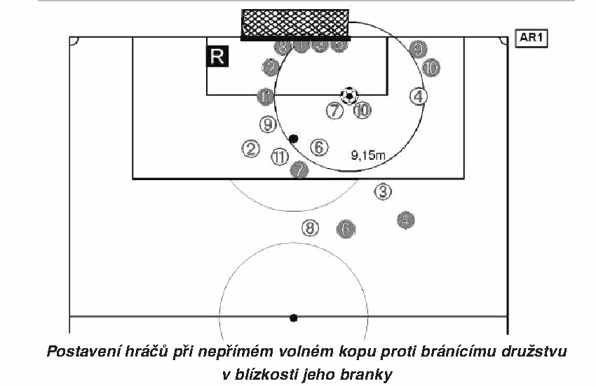

[Tištěná strana 132 · PDF 134](sources/pravidla-fotbalu-facr-2024.pdf#page=134)

13.4 Provádí-li se volný kop a některý z hráčů bránící strany zkrátí předepsanou vzdálenost dříve, než je míč ve hře, napomene rozhodčí provinivšího se hráče a nechá volný kop opakovat. Proviní-li se tímto způsobem více hráčů, napomene rozhodčí toho hráče, který zkrátil vzdálenost nejvíce; stejně postupuje rozhodčí v případě, že se proti míči vysune celá zeď bránících hráčů. Rozhodčí přitom může družstvu, které provádí volný kop, poskytnout výhodu ve hře – v tom případě volný kop opakovat nenechá a provinivšího se hráče napomene při nejbližším přerušení hry.

13.5 Jestliže hráč provede volný kop přesto, že ho rozhodčí vyzval, aby počkal na jeho znamení k provedení kopu, přeruší rozhodčí hru, napomene provinivšího se hráče za nesportovní chování a nechá volný kop opakovat. Stejně bude postupovat i v případě, že se hráč před provedením volného kopu zachová nesportovně.

Jestliže rozhodčí nestačí po předčasném provedení volného kopu přerušit hru:

- a bylo dosaženo branky, rozhodčí ji neuzná, provinivšího se hráče napomene a volný kop nechá opakovat

- v případě, že branky dosaženo nebylo a míč opustí hrací plochu, rozhodčí provinivšího se hráče napomene a hru naváže odpovídajícím způsobem

- míč získá bránící družstvo, ponechá rozhodčí výhodu a provinivšího se hráče napomene při nejbližším přerušení hry

- míč neopustí hrací plochu a zmocní se ho hráči útočícího družstva, přeruší rozhodčí hru, provinivšího se hráče napomene a kop nechá opakovat

13.6 Při provádění volných kopů mohou pravidlo porušit jak hráči bránící, tak hráči útočící strany. Jestliže pravidlo poruší současně hráči obou stran, rozhodčí provinivší se hráče napomene a nechá volný kop opakovat.

[Tištěná strana 133 · PDF 135](sources/pravidla-fotbalu-facr-2024.pdf#page=135)

## Pravidlo 14 – POKUTOVÝ KOP

Pokutový kop rozhodčí nařídí, jestliže se hráč dopustí přestupku, za který se nařizuje přímý volný kop ve vlastním pokutovém území nebo mimo hrací plochu, pokud je přestupek proveden jako součást hry, jak je uvedeno v Pravidle 12 a 13).

Přímo z pokutového kopu může být dosaženo branky.

### 1. Procedura

Míč musí ležet nehybně tak, aby se alespoň částí dotýkal středu pokutové značky nebo aby částí byl nad středem pokutové značky, a brankové tyče, břevno a síť se nesmí pohybovat.

Hráč provádějící pokutový kop musí být jasně určen.

Brankář bránícího družstva musí být obrácen tváří k hráči provádějícímu pokutový kop a musí zůstat na vlastní brankové čáře mezi brankovými tyčemi, dokud míč nebyl kopnut. Brankář se nesmí chovat způsobem, který nefér rozptyluje hráče provádějícího pokutový kop, např. tím, že zdržuje provádění kopu nebo se dotkne brankových tyčí, břevna nebo sítě.

Ostatní hráči kromě hráče provádějícího pokutový kop a brankáře musí být:

- na hrací ploše

- mimo pokutové území

- nejméně 9,15 m (10 yardů) od pokutové značky

- za pokutovou značkou

Poté, co hráči zaujmou postavení předepsané tímto pravidlem, dá rozhodčí znamení k provedení pokutového kopu.

Hráč provádějící pokutový kop musí kopnout míč dopředu; rozehrání míče patou je povoleno, ale míč se musí pohnout směrem dopředu.

Když je míč kopnut, musí mít bránící brankář alespoň část jedné nohy na brankové čáře, nad brankovou čárou, nebo za brankovou čárou.

Míč je ve hře, jestliže byl kopnut a zjevně se pohnul.

Hráč provádějící pokutový kop nesmí míčem hrát podruhé dříve, než se ho dotkne jiný hráč.

Akce pokutového kopu skončila, jestliže se pohyb míče zastavil nebo míč opustil hrací plochu nebo rozhodčí přerušil hru pro jakékoliv porušení pravidel fotbalu.

Rozhodčí prodlouží doby hry k provedení a dokončení akce pokutového kopu na konci obou poločasů řádné hrací doby nebo doby prodloužené k určení

[Tištěná strana 134 · PDF 136](sources/pravidla-fotbalu-facr-2024.pdf#page=136)

vítěze utkání. Akce provedení pokutového kopu končí, když se po jeho provedení míč zastaví na hrací ploše, dostane se mimo hrací plochu, zahraje jím jiný hráč (včetně hráče, který kop provedl) než bránící brankář, nebo rozhodčí přeruší hru za přestupek hráče družstva, které kop provádělo. Pokud se přestupku dopustí hráč bránícího družstva (vč. brankáře) a pokutový kop nebyl proměněn nebo byl chycen, pokutový kop se opakuje.

### 2. Porušení pravidla a sankce

Pokud dal rozhodčí signál k provedení pokutového kopu, musí být kop proveden; není-li proveden, může rozhodčí přijmout disciplinární opatření dříve, než dá signál k provedení pokutového kopu znovu.

#### Jestliže dříve, než bude míč ve hře, dojde k jedné z následujících situací:

- spoluhráč hráče provádějícího pokutový kop je za porušení pravidla potrestán pouze v případě že:

- dojde ke zjevnému ovlivnění brankáře; nebo

- provinivší se hráč zahraje míč nebo svádí souboj o míč s protihráčem a poté vstřelí branku, pokusí se vstřelit branku nebo vytvoří brankovou možnost

- spoluhráč brankáře je za porušení pravidla potrestán pouze v případě že:

- dojde ke zjevnému ovlivnění hráče provádějícího pokutový kop; nebo

- provinivší se hráč zahraje míč nebo svádí souboj o míč s protihráčem a tím zabrání vstřelení branky, pokusu o vstřelení branky nebo vytvoření brankové možnosti

- hráč provádějící pokutový kop nebo jeho spoluhráč poruší pravidlo:

- pokutový kop se bude opakovat, jestliže míč skončí v brance

- rozhodčí přeruší hru a naváže ji nepřímým volným kopem, jestliže míč neskončí v brance

s výjimkou následujících případů, kdy rozhodčí přeruší hru a naváže ji nepřímým volným kopem bez ohledu na to, zda branky bylo či nebylo dosaženo:

- pokutový kop byl kopnut dozadu

- kop provedl spoluhráč hráče určeného k provedení kopu; rozhodčí napomene hráče, který kop provedl

- po dokončení rozběhu k provedení kopu hráč použil fintu k oklamání brankáře; rozhodčí hráče napomene (finta během rozběhu je povolena)

- brankář poruší pravidlo:

- rozhodčí branku uzná, jestliže míč skončí v brance

- jestliže míč mine branku nebo se odrazí od břevna nebo tyče, je kop opakován pouze v případě, pokud přestupek brankáře zjevně ovlivnil hráče provádějícího kop

- jestliže brankář zabrání míči dostat se do branky, je kop opakován

[Tištěná strana 135 · PDF 137](sources/pravidla-fotbalu-facr-2024.pdf#page=137)

### Souhrnná tabulka

Výsledek pokutového kopu

| Přestupek | Branky bylo dosaženo | Branky nebylo dosaženo |
| --- | --- | --- |
| Přestupek hráče útočícího družstva | Dojde-li k ovlivnění procedury pokutového kopu: Pokutový kop se opakuje. Nedojde-li k ovlivnění procedury pokutového kopu: Branka platí | Dojde-li k ovlivnění procedury pokutového kopu: Nepřímý volný kop. Nedojde-li k ovlivnění procedury pokutového kopu: Pokutový kop se neopakuje |
| Přestupek hráče bránícího družstva | Dojde-li k ovlivnění procedury pokutového kopu: Branka platí Nedojde-li k ovlivnění procedury pokutového kopu: Branka platí | Dojde-li k ovlivnění procedury pokutového kopu: Pokutový kop se opakuje. Nedojde-li k ovlivnění procedury pokutového kopu: Pokutový kop se neopakuje |
| Přestupek hráče útočícího i bránícího družstva | Dojde-li k ovlivnění procedury pokutového kopu: Pokutový kop se opakuje. Nedojde-li k ovlivnění procedury pokutového kopu: Branka platí | Dojde-li k ovlivnění procedury pokutového kopu: Pokutový kop se opakuje. Nedojde-li k ovlivnění procedury pokutového kopu: Pokutový kop se neopakuje |
| Přestupek brankáře | Branka platí | PK nebyl chycen ani vyražen: PK se neopakuje, vyjma případu, kdy brankář zjevně ovlivnil hráče provádějícího PK. PK byl chycen nebo vyražen: PK se opakuje a brankář je varován; bude napomenut za každý další přestupek |
| Přestupky brankáře a hráče provádějícího PK provedené ve stejném okamžiku | NVK a ŽK pro hráče provádějícího PK | NVK a ŽK pro hráče provádějícího PK |
| Míč byl rozehrán dozadu | Nepřímý volný kop | Nepřímý volný kop |
| Použití nedovoleného triku | NVK a ŽK pro hráče provádějícího PK | NVK a ŽK pro hráče provádějícího PK |
| Kop provedl jiný než určený hráč | Rozhodčí napomene hráče, který kop provedl a nařídí nepřímý volný kop | Rozhodčí napomene hráče, který kop provedl a nařídí nepřímý volný kop |

[Původní podoba tabulky](assets/pdf-137.png)

[Tištěná strana 136 · PDF 138](sources/pravidla-fotbalu-facr-2024.pdf#page=138)

Jestliže přestupek brankáře vede k opakování kopu, je brankář za první přestupek v utkání varován a za každý následující přestupek je napomenut.

- spoluhráč brankáře poruší pravidlo:

- rozhodčí branku uzná, jestliže míč skončí v brance

- jestliže míč neskončí v brance, rozhodčí nechá pokutový kop opakovat

- poruší pravidlo hráči obou družstev, bude se pokutový kop opakovat, vyjma případu, kdy jeden z hráčů se dopustil závažnějšího přestupku (např. použil nedovolený trik).

- současně dopustí přestupku brankář i hráč provádějící kop, bude hráč provádějící kop napomenut a hra bude navázána nepřímým volným kopem pro bránící družstvo.

#### Jestliže po provedení pokutového kopu:

- se hráč provádějící kop podruhé dotkne míče dříve, než se míče dotkne jiný hráč

- nařídí rozhodčí nepřímý volný kop (nebo přímý volný kop za hraní míče rukou)

- míč, který je v pohybu směrem k brance, zasáhne vnější vliv

- pokutový kop se opakuje, vyjma situace, že míč směřuje do branky a vnější vliv nezabrání brankáři ani obránci zahrát míč; v takovém případě bude branka uznána, pokud míč přešel do branky, i když došlo ke kontaktu s míčem, vyjma případu, kdy ovlivnění zapříčinilo útočící družstvo

- míč se odrazí do hrací plochy od brankáře, břevna nebo brankových tyčí a poté jej zasáhne vnější vliv,

- rozhodčí přeruší hru

- hra se naváže míčem rozhodčího v místě, kde se míče dotkl vnější vliv.

### VÝKLAD K PRAVIDLU

#### Všeobecná ustanovení

14.1 Nařízení pokutového kopu nevylučuje, aby rozhodčí s ohledem na povahu přestupku udělil provinivšímu se hráči osobní trest.

Akce provádění pokutového kopu začíná v okamžiku, kdy rozhodčí dá píšťalkou znamení k jeho provedení. Od tohoto okamžiku rozhodčí postupuje tak, jakoby byl míč ve hře v souvislosti s porušením pravidla 14.

14.2 Před provedením pokutového kopu si smí kterýkoli hráč bránícího družstva vyměnit místo s brankářem, ale rozhodčí o tom musí být před tím informován. Při výměně musí být respektována ustanovení Pravidla 3 a Pravidla 4.

14.3 Pokutový kop smí provést kterýkoli hráč oprávněného družstva. Rozhodčí, a alespoň brankář, který bude pokutovému kopu čelit, však musí vědět, který hráč pokutový kop provede. Jestliže pokutový kop provede jiný hráč než ten, který byl určen, provinivšího se hráče napomene za nesportovní chování a nařídí nepřímý volný kop.

[Tištěná strana 137 · PDF 139](sources/pravidla-fotbalu-facr-2024.pdf#page=139)

14.4 Nařídí-li rozhodčí, aby se pokutový kop opakoval, nemusí ho provádět týž hráč. Opakovaný pokutový kop může provést kterýkoli z hráčů družstva, v jehož prospěch byl pokutový kop nařízen, pokud je oprávněn zúčastnit se hry.

14.5 Klesne-li před provedením pokutového kopu počet hráčů některého družstva pod sedm, nechá rozhodčí nařízený pokutový kop provést.

#### Provedení pokutového kopu

14.6 K provedení pokutového kopu musí rozhodčí vždy dát znamení píšťalkou; znamení dá poté, co se ujistí, že jsou splněny všechny podmínky uvedené v části Procedura.

Pokutový kop se provádí do míče volně a nehybně ležícího na pokutové značce. Posunutí míče úplně mimo pokutovou značku není dovoleno.

14.7 Pokutový kop může být proveden i tak, že hráč provádějící pokutový kop zahraje míč šikmo dopředu, aby se ho mohl zmocnit jeho spoluhráč. Tento spoluhráč však nesmí vkročit do pokutového území, překročit pokutový oblouk nebo se přiblížit na úroveň míče dříve, než je míč ve hře.

Když je míč kopnut, musí mít bránící brankář alespoň část jedné nohy na brankové čáře, nad brankovou čárou, nebo za brankovou čárou.

Když má brankář jednu nohu před brankovou čárou a druhou nohu za brankovou čárou, nezískává tím žádnou nefér výhodu, proto v „duchu” pravidel by neměl být za takovéto postavení trestán. Až do okamžiku, kdy je kop proveden, brankář nesmí stát za (nebo před) brankovou čárou.

14.8 Ve všech případech porušení pravidla rozhodčí nechá pokutový kop provést a dále postupuje podle ustanovení uvedených v části Porušení pravidla a sankce.

14.9 Možná porušení pravidla a z nich vyplývající sankce jsou uvedena v části 3 Souhrnná tabulka.

14.10  Akce pokutového kopu končí v okamžiku, kdy:

a) míč se zastaví v pohybu

b) míč přejde brankovou čáru do branky

c) míč opustí přes brankovou nebo přes pomezní čáru hrací plochu

d) míč se odrazí od tyče nebo od břevna branky zpět do pole

e) brankář míč chytí nebo jej vyrazí zpět do pole

f) míče se dotkne jiný hráč než brankář

g) míč praskne nárazem na brankovou tyč či břevno nebo poté, co se ho dotkl brankář

Jestliže rozhodčí považuje akci pokutového kopu za ukončenou, a míč přitom neopustil hrací plochu, nechá pokračovat ve hře. Jestliže rozhodčí omylem přeruší hru dříve, než skončila akce pokutového kopu, nechá pokutový kop opakovat.

[Tištěná strana 138 · PDF 140](sources/pravidla-fotbalu-facr-2024.pdf#page=140)

14.11  Jestliže po správně provedeném pokutovém kopu je míč ve hře a hráč se dopustí přestupku ve smyslu Pravidla 12, rozhodčí potrestá přestupek hráče příslušným kopem a případně i osobním trestem; přitom může poskytnout výhodu ve hře.

#### Pokutový kop v prodloužené době hry

14.12  Nařídí-li rozhodčí pokutový kop v řádné době hry na konci prvního poločasu nebo na konci utkání, nebo před ukončením některé z polovin prodloužení, a skončí-li doba hry dříve, než pokutový kop mohl být proveden, musí rozhodčí k jeho provedení dobu hry prodloužit. Teprve když je výsledek akce pokutového kopu zřejmý, rozhodčí poločas, popřípadě utkání, ukončí.

Rozhodčí na tuto situaci před provedením pokutového kopu upozorní kapitány obou družstev.

14.13  Dojde-li před provedením pokutového kopu v prodloužené době hry k porušení pravidla, nechá rozhodčí pokutový kop provést a rozhodne podle výsledku akce pokutového kopu.

14.14  Akce pokutového kopu, který se provádí v prodloužené době hry, končí v okamžiku, kdy po správně provedeném pokutovém kopu:

a) míč se zastaví v pohybu

b)míč přejde brankovou čáru do prostoru branky

c) míč přes brankovou nebo přes pomezní čáru opustí hrací plochu

d) míč se odrazí od tyče nebo od břevna branky nebo ho vyrazí brankář zpět do hrací plochy a je zřejmé a nepochybné, že již zůstane na hrací ploše

e) brankář míč chytí

f) míče se dotkne jiný hráč než brankář

g) míč praskne nárazem na brankovou tyč či břevno nebo poté, co se ho dotkl brankář

Akce pokutového kopu však trvá i v době, kdy se míč různě odráží mezi brankovými tyčemi a břevnem nebo i když se ho mezitím, třeba i opakovaně, dotkne brankář. Skončí teprve v okamžiku, kdy míč definitivně opustí hrací plochu buď do branky nebo mimo ni, popřípadě když je s konečnou platností jasné, že zůstane bez pohybu na hrací ploše.

Ustanovení uvedená v tomto článku platí i při provádění penaltového rozstřelu pro určení vítěze utkání

14.15  Jestliže hráč provádějící pokutový kop v prodloužené době hry zahraje míč šikmo dopředu, aby se ho mohl zmocnit jeho spoluhráč, ukončí rozhodčí utkání (případně poločas) v okamžiku, kdy se spoluhráč hráče provádějícího pokutový kop dotkl míče.

[Tištěná strana 139 · PDF 141](sources/pravidla-fotbalu-facr-2024.pdf#page=141)

## Pravidlo 15 – VHAZOVÁNÍ

Vhazovat bude družstvo, jehož hráč se jako poslední nedotkl míče před tím, než míč celým objemem opustil hrací plochu přes pomezní čáru, ať již po zemi nebo vzduchem.

Přímo z vhazování nemůže být dosaženo branky. Pokud se přímo z vhazování míč dostane

- do soupeřovy branky, nařídí rozhodčí kop od branky

- do vlastní branky, nařídí rozhodčí kop z rohu

### 1. Procedura

V okamžiku, kdy vhazuje míč, musí vhazující hráč

- vestoje být obrácen obličejem k hrací ploše,

- alespoň částí obou nohou stát buď na pomezní čáře, nebo za pomezní čárou,

- vhodit míč oběma rukama zezadu přes hlavu a z místa, kde míč opustil hrací plochu.

Všichni hráči soupeře musí stát nejméně 2 m od místa na pomezní čáře, ze kterého se bude míč vhazovat.

Míč je ve hře ihned, jakmile se dostane na hrací plochu. Pokud se míč dotkne země dříve, než se dostane na hrací plochu, nechá rozhodčí vhazování opakovat stejným družstvem ze stejného místa. Není-li vhazování provedeno správně, nechá rozhodčí vhazovat družstvo soupeře.

Pokud vhazující hráč při správném provedení vhazování úmyslně hodí míč na soupeře, aby jím mohl následně opakovaně zahrát, ale neprovede to způsobem ani nedbalým, ani bezohledným, nebo s použitím nepřiměřené síly, nechá rozhodčí ve hře pokračovat.

Hráč, který provedl vhazování, se nesmí znovu dotknout míče dříve, než se míče dotkne jiný hráč.

### 2. Porušení pravidla a sankce

Jestliže poté, kdy míč je ve hře, se hráč, který provedl vhazování, dotkne míče podruhé dříve, než se míče dotkne jiný hráč, nařídí rozhodčí nepřímý volný kop; pokud vhazující hráč zahraje míč rukou, nařídí rozhodčí

- přímý volný kop, nebo

[Tištěná strana 140 · PDF 142](sources/pravidla-fotbalu-facr-2024.pdf#page=142)

- pokutový kop, jestliže k přestupku dojde ve vlastním pokutovém území vhazujícího hráče, vyjma případu, kdy se míče rukou dotknul brankář bránícího družstva; v takovém případě rozhodčí nařídí nepřímý volný kop.

Hráče soupeře, který nesportovně rozptyluje nebo zdržuje hráče provádějícího vhazování nebo nedodrží předepsanou vzdálenost 2 m od místa vhazování, napomene rozhodčí za nesportovní chování, a pokud vhazování již bylo provedeno, nařídí nepřímý volný kop.

Při každém jiném porušení tohoto pravidla provede vhazování hráč soupeřova družstva.

### VÝKLAD K PRAVIDLU

15.1 Míč smí vhodit do hry kterýkoli hráč družstva, jehož hráč se nedotkl míče jako poslední, tedy i brankář.

15.2 Hráč může při vhazování stát na pomezní čáře nebo za touto čárou mimo hrací plochu. Vhazování musí být provedeno z prostoru hřiště; při porušení tohoto ustanovení bude vhazovat soupeř. Rozhodčí ale musí mít na zřeteli, že čím více je hráč při vhazování vzdálen od pomezní čáry, tím je pravděpodobnější, že míč nepřejde na hrací plochu v místě, kde ji opustil. Vhazování lze provést i s rozběhem.

15.3 K vhazování rozhodčí zpravidla nedává znamení píšťalkou, dbá však, aby vhazování bylo provedeno co nejdříve. Zdržuje-li vhazující hráč úmyslně vhazování, rozhodčí ho napomene za zdržování hry; obdobně musí rozhodčí napomenout hráče v případě, že hráč, který se chystá vhodit míč do hry, ho v posledním okamžiku předá jinému spoluhráči.

Vypadne-li při vhazování vhazujícímu hráči míč z rukou na zem, aniž se předtím dostal do hry, opakuje vhazování hráč stejného družstva

15.4 Vhazování je provedeno správně, jestliže míč přejde vzduchem zpět na hrací plochu v místě, kde ji předtím opustil, a jestliže hráč vhodí míč správným způsobem.

15.5 Za správný způsob vhození míče se považuje, jestliže vhazující hráč:

a) vhodí míč oběma rukama zezadu přes hlavu a

b) je přitom obličejem a alespoň částí těla obrácen k hrací ploše a

c) stojí přitom oběma nohama na zemi.

Za nesprávný způsob vhození se zejména považuje, vhodí-li hráč míč pouze jednou rukou.

15.6 Vhazující hráč smí z taktických důvodů vhodit míč na soupeře, aby jím mohl následně opakovaně zahrát, nesmí tak ale učinit způsobem nedbalým, bezohledným nebo s použitím nepřiměřené síly. Jestli ale došlo k udeření soupeře způsobem nedbalým, bezohledným, nebo s použitím nepřiměřené síly, přeruší rozhodčí hru, hráči případně udělí odpovídající osobní trest a hru naváže přímým volným kopem z místa, kde došlo k udeření soupeře.

[Tištěná strana 141 · PDF 143](sources/pravidla-fotbalu-facr-2024.pdf#page=143)

15.7 Vhazující hráč smí z taktických důvodů vhodit míč na spoluhráče, aby jím mohl následně opakovaně zahrát, nesmí tak ale učinit způsobem bezohledným nebo s použitím nepřiměřené síly. Jestli ale došlo k udeření spoluhráče způsobem bezohledným nebo s použitím nepřiměřené síly, přeruší rozhodčí hru, hráči udělí odpovídající osobní trest a hru naváže přímým volným kopem z místa, kde došlo k udeření spoluhráče.

15.8 Jestliže se míč po správně provedeném vhození odrazí od rozhodčího stojícího na hrací ploše nebo se odrazí od země a potom po zemi či ve vzduchu přejde přes pomezní nebo přes brankovou čáru mimo hrací plochu, naváže hru příslušným způsobem hráč soupeřova družstva.

15.9 Při vhazování může být spoluhráč hráče, který vhazování provedl, v ofsajdové pozici, ale přitom nemůže být v ofsajdu.

#### Vhazování míče

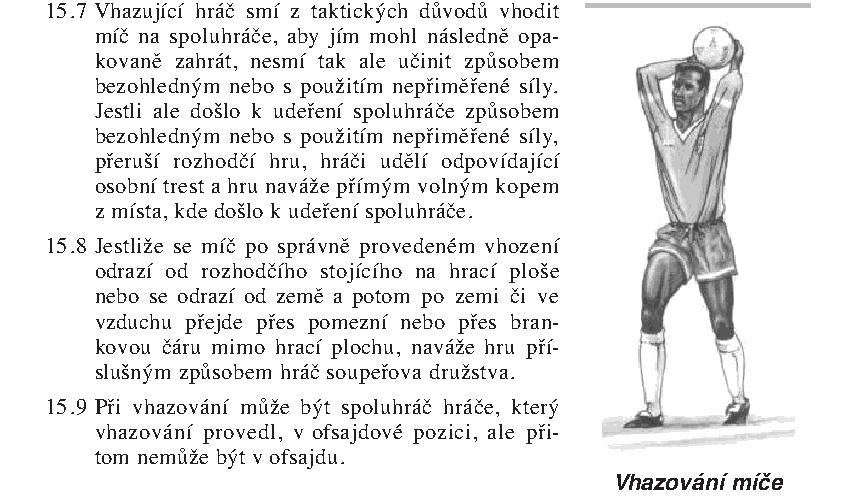

[Tištěná strana 142 · PDF 144](sources/pravidla-fotbalu-facr-2024.pdf#page=144)

## Pravidlo 16 – KOP OD BRANKY

Kop od branky rozhodčí nařídí, jestliže míč, kterého se jako poslední dotkl hráč útočícího družstva, přešel po zemi nebo ve vzduchu celým svým objemem brankovou čáru a nebylo přitom dosaženo branky.

Branky může být dosaženo přímo z kopu od branky, ale pouze proti soupeřovu družstvu; když se přímo po provedení kopu od branky dostane míč do branky hráče, který kop provedl, nařídí rozhodčí kop z rohu ve prospěch soupeřova družstva.

### 1. procedura

- míč musí být v klidu a může být hráčem bránícího družstva kopnut z kteréhokoli místa uvnitř brankového území

- míč je ve hře, jestliže je kopnut a zjevně se pohne

- dokud míč není ve hře, musí být hráči soupeře mimo pokutové území.

### 2. Porušení pravidla a sankce

Jestliže poté, co je míč ve hře, se hráč, který provedl kop od branky, dotkne míče podruhé a dříve, než se míče dotkl jiný hráč, nařídí rozhodčí nepřímý volný kop; pokud hráč provádějící kop od branky zahraje míč rukou, nařídí rozhodčí

- přímý volný kop, nebo

- pokutový kop, jestliže k přestupku došlo uvnitř pokutového území hráče provádějícího kop od branky; pokud by se jednalo o brankáře, nařídí rozhodčí nepřímý volný kop.

Pokud při provádění kopu od branky jsou hráči soupeře uvnitř pokutového území, protože neměli čas jej opustit, umožní rozhodčí pokračování hry.

Pokud se soupeř zdržuje v pokutovém území v okamžiku provedení kopu od branky, nebo vstoupí do pokutového území dříve, než je míč ve hře, se dotkne míče nebo se pokusí zahrát míčem dříve, než je míč ve hře, nechá rozhodčí kop od branky opakovat.

Pokud hráč dříve, než míč byl ve hře, vstoupil do pokutového území a tam došlo k přestupku, nechá rozhodčí kop od branky opakovat a provinivší se hráč může být podle závažnosti přestupku napomenut nebo vyloučen.

Při každém jiném porušení tohoto pravidla se kop od branky opakuje.

[Tištěná strana 143 · PDF 145](sources/pravidla-fotbalu-facr-2024.pdf#page=145)

### VÝKLAD K PRAVIDLU

16.1 Kop od branky se provádí do míče ležícího volně a nehybně v kterémkoli místě uvnitř toho brankového území, kde míč přešel brankovou čáru.

16.2 K provedení kopu od branky rozhodčí zpravidla nedává znamení píšťalkou, dbá však, aby kop od branky byl proveden co nejdříve. Zdržuje-li úmyslně brankář nebo hráč, provádějící kop od branky provedení kopu, rozhodčí ho napomene za zdržování hry.

16.3 Kop od branky lze provést tak, že brankář přihraje míč spoluhráči a ten přihraje míč zpět svému brankáři. To není v rozporu s pravidly, pokud se brankář nedotkne míče rukou (viz Pravidlo 12 – zpětná přihrávka brankáři).

16.4 Kop od branky lze provést také tak, že hráč přihraje míč svému brankáři. To není v rozporu s pravidly, pokud se brankář následně nedotkne míče rukou.

16.5 Jestliže kop od branky bude proveden tak, že brankář kopem nahodí míč na hlavu, hrudník nebo na koleno spoluhráče, aby ho následně mohl uchopit do rukou, přeruší rozhodčí hru a nařídí nepřímý volný kop.

16.6 Při kopu od branky nemůže být v ofsajdu hráč, který míč převezme přímo z kopu od branky.

[Tištěná strana 144 · PDF 146](sources/pravidla-fotbalu-facr-2024.pdf#page=146)

## Pravidlo 17 – KOP Z ROHU

Kop z rohu rozhodčí nařídí, jestliže míč, kterého se jako poslední dotkl hráč bránícího družstva, přešel po zemi nebo ve vzduchu celým svým objemem brankovou čáru a nebylo přitom dosaženo branky.

Branky může být dosaženo přímo z kopu z rohu, ale pouze proti soupeřovu družstvu; když se přímo po provedení kopu z rohu dostane míč do branky hráče, který kop provedl, nařídí rozhodčí kop z rohu ve prospěch soupeřova družstva.

### 1. Procedura

- míč musí být umístěn uvnitř toho rohového čtvrtkruhu, který je blíže k místu, kde míč přešel přes brankovou čáru

- míč musí být v klidu a musí být kopnut hráčem útočícího družstva

- míč je ve hře, jestliže byl kopnut a zjevně se pohnul; přitom není nutné, aby míč opustil rohové území

- rohový praporek nesmí být odstraněn

- hráči soupeře musí setrvat ve vzdálenosti nejméně 9,15 m od rohového čtvrtkruhu, dokud míč není ve hře

### 2. Porušení pravidla a sankce

Jestliže poté, co je míč ve hře, se hráč, který provedl kop z rohu, dotkne míče podruhé a dříve, než se míče dotkne jiný hráč, nařídí rozhodčí nepřímý volný kop; pokud hráč provádějící kop z rohu zahraje míč rukou, nařídí rozhodčí

- přímý volný kop, nebo

- pokutový kop, jestliže k přestupku došlo uvnitř pokutového území hráče provádějícího kop z rohu; pokud by se jednalo o brankáře, nařídí rozhodčí nepřímý volný kop

Pokud hráč provádějící kop z rohu při správném provedení úmyslně kopne míč na soupeře, aby jím mohl následně opakovaně zahrát, ale neprovede to způsobem ani nedbalým, ani bezohledným, nebo s použitím nepřiměřené síly, nechá rozhodčí ve hře pokračovat.

Při každém jiném porušení tohoto pravidla se kop z rohu opakuje.

[Tištěná strana 145 · PDF 147](sources/pravidla-fotbalu-facr-2024.pdf#page=147)

### VÝKLAD K PRAVIDLU

17.1 Rozhodčí má při nařízení kopu z rohu ihned signalizovat, z kterého rohového čtvrtkruhu se má kop provést, aby se jeho provedení zbytečně nezdržovalo.

17.2 K provedení kopu z rohu rozhodčí zpravidla nedává znamení píšťalkou. Dbá však, aby kop z rohu byl proveden co nejdříve. Zdržuje-li hráč úmyslně provedení kopu z rohu, rozhodčí ho napomene za zdržování hry.

17.3 Při provedení kopu z rohu musí hráči soupeřova družstva dodržet vzdálenost 9,15 m od rohového čtvrtkruhu, dokud míč není ve hře. Je-li to potřebné, musí rozhodčí všechny hráče soupeře v menší vzdálenosti před provedením kopu vyzvat, aby na předepsanou vzdálenost ustoupili, a pokud odmítnou, napomene za zdržování při navazování hry toho hráče, který předepsanou vzdálenost zkrátil nejvíce.

Provádí-li se kop z rohu a některý z hráčů bránící strany zkrátí předepsanou vzdálenost dříve, než je míč ve hře, napomene rozhodčí provinivšího se hráče za nedodržení předepsané vzdálenosti a nechá kop z rohu opakovat.

Proviní-li se více hráčů, napomene rozhodčí toho hráče, který byl nejblíže míči. Rozhodčí však může uplatnit výhodu ve hře a hráče, který vzdálenost 9,15 m nedodržel, napomenout až při nejbližším přerušení hry.

Pokud hráč provádějící kop při jeho správném provedení úmyslně kopne míč na soupeře, aby jím mohl následně opakovaně zahrát, nesmí tak učinit nedbale, bezohledně nebo s použitím nepřiměřené síly; v tom případě rozhodčí hru nepřerušuje. Jinak rozhodčí hru přeruší, hráči udělí odpovídající osobní trest a hru naváže přímým volným kopem z místa, kde došlo k udeření soupeře míčem.

Pokud hráč provádějící kop při jeho správném provedení úmyslně kopne míč na spoluhráče, aby jím mohl následně opakovaně zahrát, nesmí tak učinit bezohledně nebo s použitím nepřiměřené síly; v tom případě rozhodčí hru nepřerušuje. Jinak rozhodčí hru přeruší, hráči udělí odpovídající osobní trest a hru naváže přímým volným kopem z místa, kde došlo k udeření spoluhráče míčem.

17.4 Kop z rohu může být proveden libovolným směrem; je proveden správně, jestliže byl kopnut a po provedení kopu se zjevně pohnul; přitom nemusí opustit rohový čtvrtkruh.

17.5 Jestliže míč po správném provedení kopu z rohu, aniž se ho předtím dotkl některý hráč:

a) opustí hrací plochu přes brankovou čáru bránícího družstva, naváže hru kopem od branky hráč soupeřova družstva

b) opustí hrací plochu přes pomezní čáru, naváže hru vhazováním hráč soupeřova družstva

17.6 Kdyby po správném provedení kopu z rohu míč úplně po zemi nebo ve vzduchu přešel brankovou čáru mimo hrací plochu a pak se vlivem větru nebo rotace vrátil zpět na hrací plochu, musí rozhodčí hru přerušit a navázat kopem od branky.

17.7 Při kopu z rohu nemůže být v ofsajdu hráč, který jako první převezme míč přímo po provedení kopu z rohu.

[Tištěná strana 146 · PDF 148](sources/pravidla-fotbalu-facr-2024.pdf#page=148)

## PRAKTICKÉ POKYNY PRO ROZHODČÍ

### Úvod

Tyto pokyny představují praktická doporučení pro rozhodčí. Doplňují informace uvedené v Pravidlech fotbalu.

V Pravidle 5 se hovoří o tom, že rozhodčí mají řídit utkání v souladu se zněním a výkladem pravidel a v duchu hry. Od rozhodčích se tedy očekává, že budou v souvislosti s prosazováním pravidel hry používat „zdravý rozum“ a přihlížet k duchu hry. To platí především o situacích, kdy má rozhodčí určit, zda bude hra přerušena nebo může pokračovat.

To se týká hlavně nižších úrovní fotbalu a soutěží, kde nebude možné pravidla hry vždy striktně dodržet. Například, nebude-li to představovat bezpečnostní riziko, by rozhodčí měl umožnit uskutečnění utkání nebo pokračování hry i v následujících případech:

- chybí jeden či více rohových praporků

- na hřišti jsou drobné nepřesnosti ve značení hrací plochy (např. rohový čtvrtkruh, středový kruh apod.)

- brankové tyče nebo břevno nejsou bílé barvy

Pokud k tomu dojde, musí rozhodčí o všech nedostatcích informovat v ZoU příslušný řídící orgán.

[Tištěná strana 147 · PDF 149](sources/pravidla-fotbalu-facr-2024.pdf#page=149)

### POZIČNÍ POSTAVENÍ, POHYB A SPOLUPRÁCE ROZHODČÍCH

### 1. Všeobecné informace k pohybu a k pozičnímu postavení

Nejlepší poziční postavení je vždy to, ze kterého může rozhodčí učinit správné rozhodnutí.

Veškerá doporučení ohledně pozičního postavení se přizpůsobí na základě konkrétních informací o týmech, hráčích a s ohledem na průběh samotného utkání.

#### Zóny

#### pohybu

#### rozhodčích

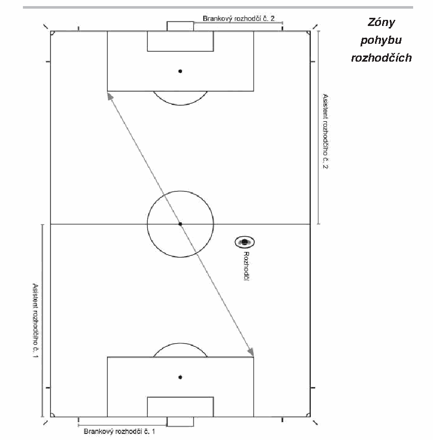

[Tištěná strana 148 · PDF 150](sources/pravidla-fotbalu-facr-2024.pdf#page=150)

Zónou pohybu se míní oblast, ve které se rozhodčí pohybuje, aby byl ve svém rozhodování nejefektivnější. Poziční postavení rozhodčích uváděná v grafických nákresech jsou základním doporučením.

#### Symboly pro označení rozhodčích

#### GK

#### Brankář Obránce Útočník

#### Rozhodčí Asistent Brankový

#### rozhodčího rozhodčí

#### Doporučení

Spolupráce mezi rozhodčím a příslušným asistentem rozhodčího:

- Rozhodčí obvykle používá diagonální způsob řízení (pohybuje se po diagonále nebo po „rozšířené“ diagonále).

- Rozhodčí se pohybuje na úrovni hry, aby měl o hře dobrý přehled a hra mohla nerušené plynout. Přitom příslušného asistenta má mít v zorném poli rozhodčího.

- Rozhodčí by měl být zároveň dostatečně blízko samotné hře, aniž by ovšem tuto hru svým pozičním postavením jakkoli narušoval.

To, co je „třeba vidět“, nemusí být nezbytně v bezprostřední blízkosti míče. Rozhodčí by měl zároveň sledovat:

- konfrontace hráčů mimo míč

- možné přestupky v oblasti, kam se hra přesouvá

- přestupky po odehrání míče

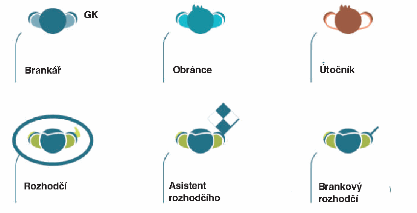

[Tištěná strana 149 · PDF 151](sources/pravidla-fotbalu-facr-2024.pdf#page=151)

#### Poziční postavení asistenta rozhodčího a ostatních rozhodčích

Asistent rozhodčího se pohybuje na úrovni předposledního hráče bránícího družstva nebo s míčem, je-li tento blíže brankové čáře, než předposlední hráč bránícího družstva. Asistent rozhodčího musí být i při běhu vždy obrácen čelem do hrací plochy. Na krátké vzdálenosti by se asistent rozhodčího měl na pomezní čáře pohybovat úkroky do stran. To je důležité především pro posouzení ofsajdové situace, aby asistent rozhodčího měl lepší přehled.

Brankový rozhodčí stojí za brankovou čarou s výjimkou situací, kdy je nezbytně nutné přejít přímo na brankovou čáru, aby mohl posoudit, zda míč překročil brankovou čáru či nikoliv. Brankový rozhodčí nesmí s výjimkou mimořádných okolností vstupovat na hrací plochu.

### 2. Poziční postavení a spolupráce rozhodčích

#### Konzultace

Při řešení disciplinárních přestupků může být dostačující oční kontakt a základní diskrétní znamení rukou od asistenta rozhodčího směrem k rozhodčímu. Je-li nutná přímá konzultace, může asistent rozhodčího vstoupit 2-3 metry do hrací plochy. Při vzájemném rozhovoru by asistent rozhodčího i rozhodčí měli být otočeni čelem ke hrací ploše, aby sledovali hráče a dění na hrací ploše.

#### Kop z rohu

Při kopu z rohu stojí asistent rozhodčího za rohovým praporkem, na úrovni brankové čáry. Nesmí ale přitom bránit hráči, který rohový kop rozehrává a současně musí zkontrolovat, zkontrolovat, že míč je správně umístěn v rohovém čtvrtkruhu.

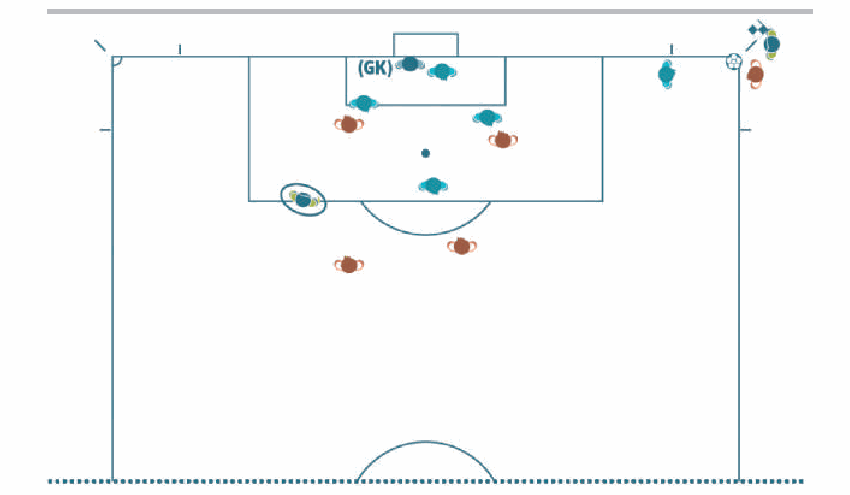

[Tištěná strana 150 · PDF 152](sources/pravidla-fotbalu-facr-2024.pdf#page=152)

#### Volný kop

Při volném kopu stojí asistent rozhodčího na úrovni předposledního bránícího hráče, aby kontroloval případnou ofsajdovou pozici útočících hráčů. Asistent rozhodčího však musí být připraven na rychlý pohyb směrem k rohovému praporku, aby mohl sledovat míč, dojde-li k přímé střele na branku.

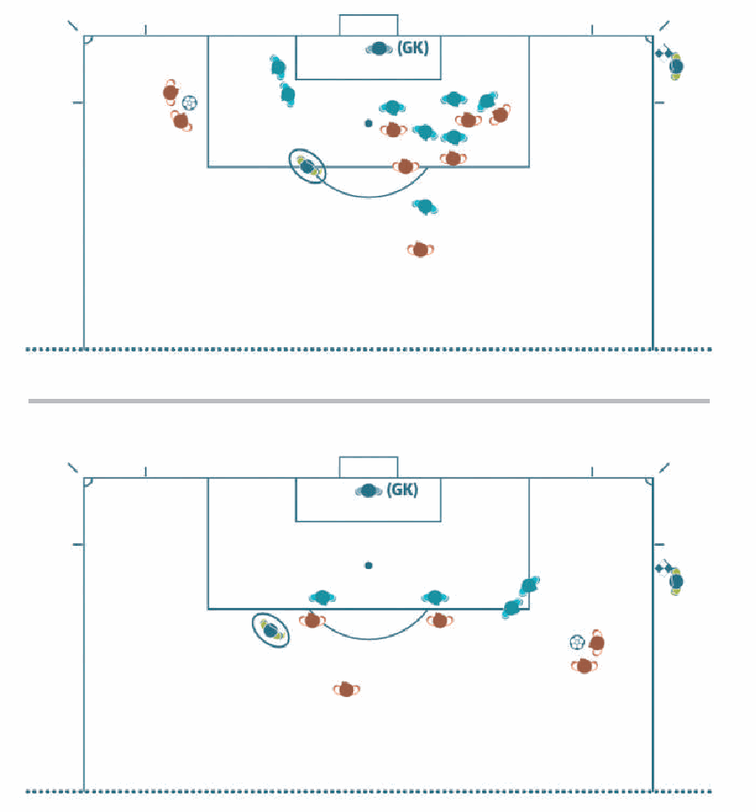

[Tištěná strana 151 · PDF 153](sources/pravidla-fotbalu-facr-2024.pdf#page=153)

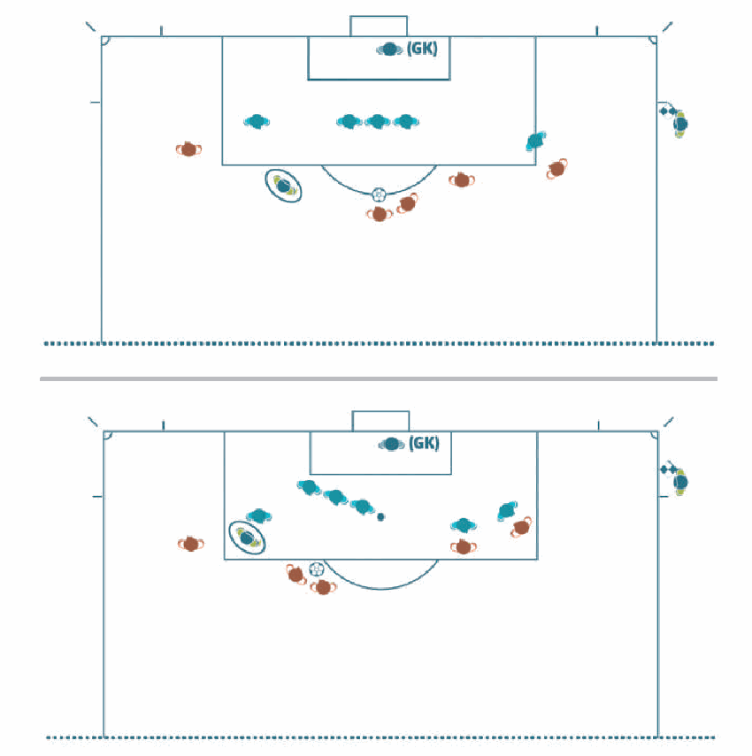

[Tištěná strana 152 · PDF 154](sources/pravidla-fotbalu-facr-2024.pdf#page=154)

#### Dosažení / nedosažení branky

Jestliže nevznikly žádné pochybnosti o tom, že bylo dosaženo branky, naváží rozhodčí a jeho asistent oční kontakt. Poté se asistent rozhodčího rychle přesune 25 – 30 m podél pomezní čáry směrem ke středové čáře. Praporek přitom nezvedá.

Pokud bylo dosaženo branky, ale z pohledu rozhodčího se míč zdá být stále ve hře, musí asistent zvednout praporek, aby upoutal pozornost rozhodčího, a poté pokračovat v obvyklém postupu, tj. rychlém přesunu 25 – 30 metrů podél postranní čáry směrem ke středové čáře hřiště.

V případě, že míč celým objemem nepřekročil brankovou čáru (branky nebylo dosaženo) a hra tak má pokračovat, naváže asistent oční kontakt s rozhodčím, případně mu dá diskrétní znamení rukou.

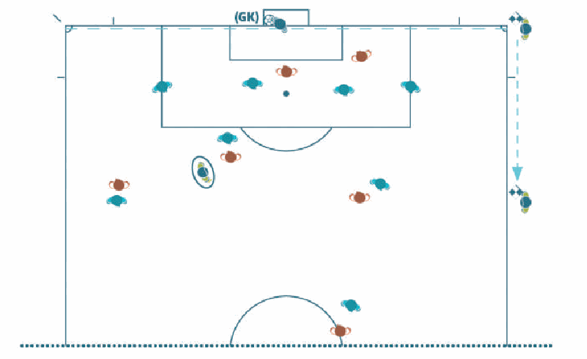

[Tištěná strana 153 · PDF 155](sources/pravidla-fotbalu-facr-2024.pdf#page=155)

#### Kop od branky

Asistent rozhodčího musí nejprve zkontrolovat, zda je míč uvnitř brankového území. Není-li míč správně umístěn, tzn. v brankovém území, musí asistent rozhodčího zůstat na úrovni brankového území, navázat oční kontakt s rozhodčím a zdvihnout praporek.

Když je míč správně umístěn v brankovém území, AR kontroluje správnost provedení kopu od branky. Tzn., zda míč byl kopnut a zjevně se pohnul.

Poté asistent rozhodčího zaujme poziční postavení pro kontrolu ofsajdové linie.

Pokud je přítomen AAR, zaujme asistent rozhodčího poziční postavení pro kontrolu případné ofsajdové situace a AAR zaujme pozici na průsečíku brankové čáry a čáry brankového území a kontroluje, zda je míč správně umístěn uvnitř brankového území. Když míč není umístěn správně, AAR to vhodným způsobem sdělí rozhodčímu.

Brankový rozhodčí zaujme postavení na průsečíku brankové čáry a hranice brankového území, aby mohl zkontrolovat, zda se míč při odkopu nachází v brankovém území. Pokud míč není umístěn v brankovém území, musí to brankový rozhodčí sdělit rozhodčímu.

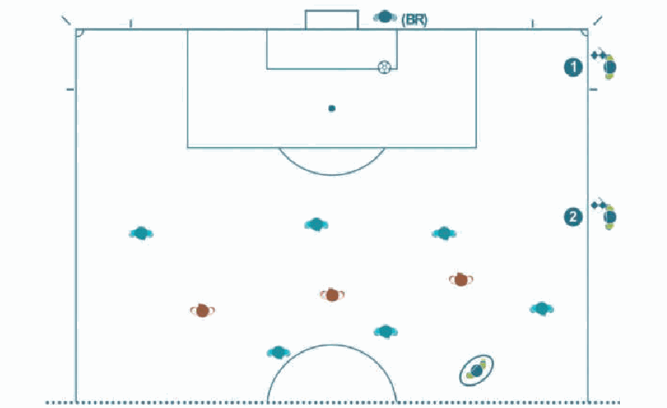

[Tištěná strana 154 · PDF 156](sources/pravidla-fotbalu-facr-2024.pdf#page=156)

#### Vykopnutí nebo vyhození míče brankářem

Asistent rozhodčího musí zaujmout pozici na linii hranice pokutového území a kontrolovat, zda brankář se nedotýká míče rukou mimo pokutové území. Jakmile brankář míč vyhodí do hry, musí asistent rozhodčího rychle zaujmout poziční postavení pro kontrolu ofsajdové čáry.

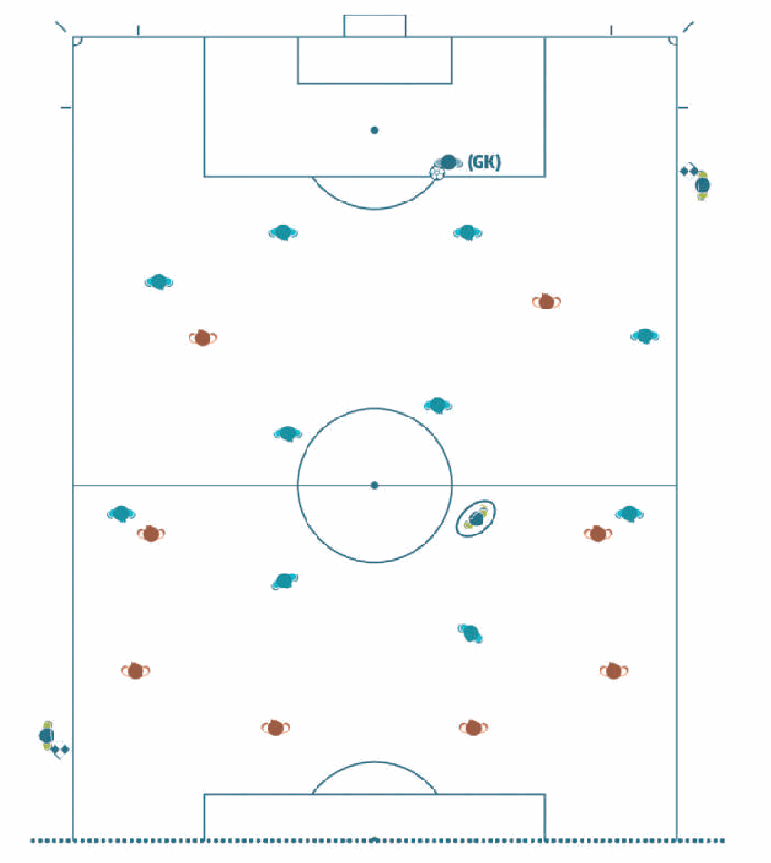

[Tištěná strana 155 · PDF 157](sources/pravidla-fotbalu-facr-2024.pdf#page=157)

#### Výkop

Asistent rozhodčího musí být na úrovni předposledního hráče bránícího družstva.

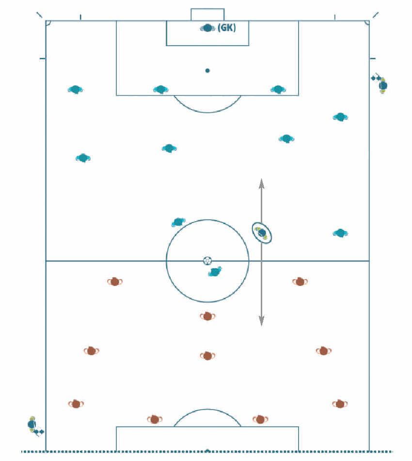

[Tištěná strana 156 · PDF 158](sources/pravidla-fotbalu-facr-2024.pdf#page=158)

#### Penaltový rozstřel

Jeden asistent rozhodčího musí stát na průsečíku brankové čáry a hranice brankového území. Druhý asistent musí stát ve středovém kruhu, aby kontroloval hráče. Jsou-li na hřišti také brankoví rozhodčí, musí stát na obou průsečících brankové čáry a hranice brankového území, vpravo a vlevo od branky.

V tomto případě jsou oba asistenti rozhodčího ve středovém kruhu vyjma případu, že je použita TBČ, kdy je požadován pouze jeden AAR.

AAR2 a AR1 mají sledovat hráče ve středovém kruhu a AR2 a 4R monitorují technické zóny.

#### Bez brankových rozhodčích

#### S brankovými rozhodčími

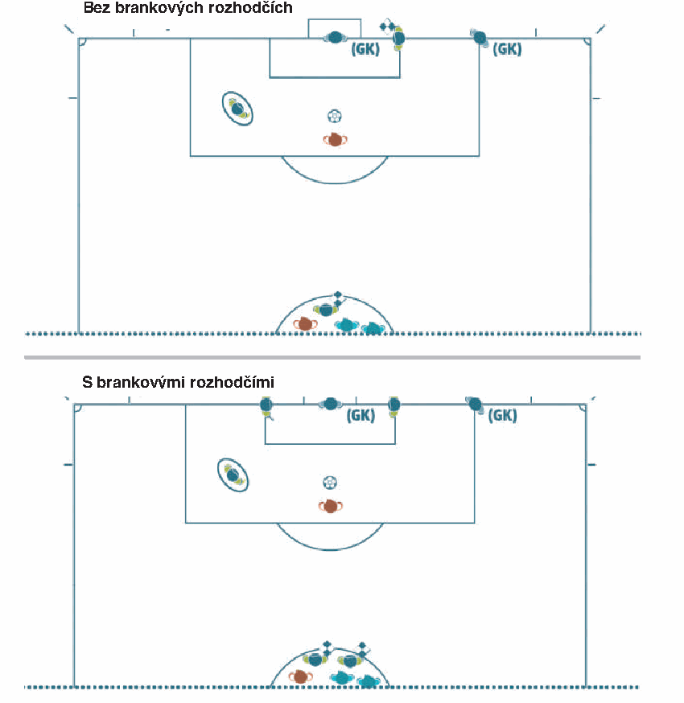

[Tištěná strana 157 · PDF 159](sources/pravidla-fotbalu-facr-2024.pdf#page=159)

#### Pokutový kop

Asistent rozhodčího musí stát na průsečíku brankové čáry a hranice pokutového území.

Pokud jsou na hřišti také brankoví rozhodčí, musí stát na průsečíku brankové čáry a hranice brankového území. Asistent rozhodčího pak stojí na úrovni pokutové značky (což je současně ofsajdová linie).

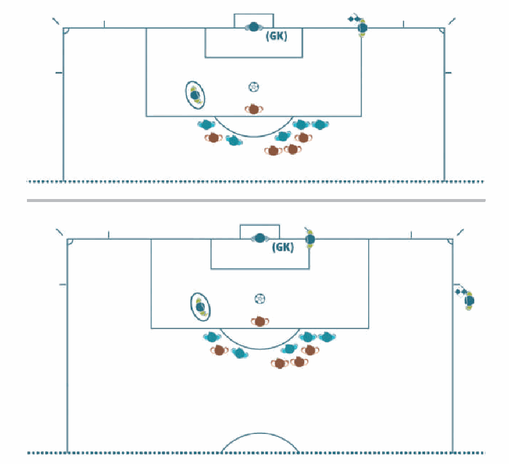

[Tištěná strana 158 · PDF 160](sources/pravidla-fotbalu-facr-2024.pdf#page=160)

#### Hromadná konfrontace hráčů

Dojde-li k hromadné konfrontaci hráčů, může nejbližší asistent rozhodčího vstoupit na hrací plochu, aby pomohl rozhodčímu. Druhý asistent rozhodčího musí sledovat situaci a zaznamenávat detaily incidentu. Čtvrtý rozhodčí by měl zůstat v blízkosti technických zón.

#### Požadovaná vzdálenost

Je-li nařízen volný kop velmi blízko asistenta rozhodčího, může asistent rozhodčího vstoupit na hrací plochu (obvykle na žádost rozhodčího), aby pomohl zajistit, že hráči budou nejméně 9,15 m od míče. Rozhodčí pak musí předtím, než dá pokyn k pokračování hry, vyčkat do návratu asistenta do jeho původní pozice.

#### Střídání

Pokud není k utkání delegován čtvrtý rozhodčí, přesune se asistent rozhodčího na prodlouženou linii středové čáry hrací plochy, aby asistoval při střídání. Rozhodčí pak musí předtím, než dá pokyn k pokračování hry, vyčkat do návratu asistenta do původní pozice.

Pokud je k utkání delegován čtvrtý rozhodčí, nemusí se asistent rozhodčího přesouvat ke středové čáře hrací plochy, protože střídání zajistí čtvrtý rozhodčí. Bude-li ovšem více souběžných střídání, může se asistent rozhodčího ke středové čáře hrací plochy přesunout a asistovat čtvrtému rozhodčímu při střídání.

[Tištěná strana 159 · PDF 161](sources/pravidla-fotbalu-facr-2024.pdf#page=161)

### ŘEČ TĚLA, KOMUNIKACE, PÍŠŤALKA

### 1. Rozhodčí

#### Řeč těla

Řeč těla je nástroj, který rozhodčí využívá:

- k řízení utkání

- k získání autority a sebeovládání

Řeč těla neslouží k vysvětlování rozhodnutí.

#### Signály

Signály rozhodčího viz Pravidlo 5

#### Píšťalka

Píšťalka je nezbytná

- při výkopu k zahájení hry (1. a 2. poločasu řádné hrací doby a prodloužení) a výkopu po dosažení branky

- k přerušení hry

– pro nařízení volného kopu nebo pokutového kopu

– bylo-li utkání přerušeno nebo předčasně ukončeno

– k ukončení hry na konci každého poločasu

- k navázání hry

– při volných kopech s dodržením předepsané vzdálenosti

– při pokutových kopech

- k navázání hry, která byla přerušena z důvodu

– udělení osobního trestů

– zranění

– střídání

Píšťalka není nutná:

- při přerušení hry

– když je zjevné, že následuje kop od branky, kop z rohu, vhazování nebo dosažení branky

- při navázání hry

– většinou volných kopů, kopem od branky, kopem z rohu, vhazováním, nebo při míči rozhodčího

[Tištěná strana 160 · PDF 162](sources/pravidla-fotbalu-facr-2024.pdf#page=162)

Je-li píšťalka používána příliš často a zbytečně, má menší účinnost v případech, kdy je její použití opravdu nutné.

Chce-li rozhodčí, aby hráč vyčkal na signál píšťalkou před opětovným zahájením hry (např. proto, aby při provádění volného kopu zajistil dodržení vzdálenosti bránícími hráči nejméně 9,15 m od míče), musí o tom jasně a srozumitelně útočícího hráče poučit.

Pokud rozhodčí chybným písknutím přeruší hru, naváže ji míčem rozhodčího v místě, kde se míč nacházel v okamžiku přerušení hry.

### 2. Asistenti rozhodčího

#### Zvuková signalizace

Systém zvukové signalizace je pomocným prostředkem, jehož smyslem je výhradně upoutání pozornosti rozhodčího.

Mezi situace, kdy může být zvuková signalizace prospěšná, patří:

- ofsajd

- přestupek mimo zorné pole rozhodčího

- vhazování, kop z rohu, kop od branky nebo zjevné dosažení branky

#### Elektronický komunikační systém

Je-li použit elektronický komunikační systém, poučí rozhodčí své asistenty před zápasem o situacích, ve kterých bude vhodné tento komunikační systém použít namísto fyzické signalizace.

#### Technika použití praporku

Praporek asistenta rozhodčího musí být vždy zcela rozvinutý a viditelný pro rozhodčího. To znamená, že asistent zpravidla drží praporek v té ruce, která je blíže rozhodčímu. Při signalizaci se asistent rozhodčího zastaví, otočí se čelem do hrací plochy, naváže oční kontakt s rozhodčím a zdvihne praporek uváženým (nikoliv ukvapeným nebo přehnaně emotivním) pohybem.

Praporek by měl být prodloužením paže asistenta rozhodčího. Asistent rozhodčího musí praporek zdvihnout rukou, kterou použije k provedení dalšího následného signálu. Změní-li se okolnosti a asistent musí pro další signál použít druhou ruku, musí si pod úrovní pasu praporek přendat do druhé ruky.

Signalizuje-li asistent rozhodčího, že míč je mimo hru, musí signál udržovat až do okamžiku, kdy ho rozhodčí zpozoruje a jeho signál vezme na vědomí.

Signalizuje-li asistent rozhodčího přestupek, za který bude hráč vyloučen, přičemž jeho signál rozhodčí nezpozoruje okamžitě:

- pokud byla hra zastavena, může být navázání hry změněno v souladu s pravidly hry (volný kop, pokutový kop apod.)

- pokud byla hra navázána, může rozhodčí stále přistoupit k disciplinárnímu opatření, avšak nesmí již přestupek potrestat volným nebo pokutovým kopem

[Tištěná strana 161 · PDF 163](sources/pravidla-fotbalu-facr-2024.pdf#page=163)

#### Gesta

Základní zásadou je, že asistent rozhodčího nemá jakkoliv gestikulovat rukama, v některých případech však může vyslat směrem k rozhodčímu diskrétní znamení rukou. Toto znamení rukou by mělo mít jasný význam a gesta, jež budou použita, by měla být domluvena během porady rozhodčích před zahájením utkání.

#### Signály

Signály asistenta rozhodčího viz Pravidlo 6.

#### Kop z rohu nebo kop od branky

Překročí-li míč celým objemem brankovou čáru, zvedne AR praporek pravou rukou (z důvodu lepšího výhledu na hru), aby informoval rozhodčího, že je míč ze hry a potom

- když je to blíže k AR signalizuje, zda se jedná o kop od branky nebo kop z rohu

- když je to dále od AR, naváže oční kontakt a postupuje podle rozhodnutí rozhodčího

Pokud míč jasně přešel přes brankovou čáru, nemusí AR zvedat praporek, aby signalizoval, že míč opustil hrací plochu. Je-li rozhodnutí o kopu od branky nebo kopu z rohu jasné, není nutné dávat signál, obzvláště jestliže signál dává rozhodčí.

#### Přestupky

Dojde-li v bezprostřední blízkosti nebo mimo dohled rozhodčího k přestupku či porušení pravidel, musí asistent rozhodčího takovou situaci signalizovat zdvihnutým praporkem. Ve všech ostatních případech musí asistent rozhodčího vyčkat a nabídnout svůj názor pouze v případě, že jej o to rozhodčí požádá. Poté musí rozhodčímu sdělit, co viděl a slyšel, a kterých hráčů se situace týká.

Před signalizací přestupku musí asistent rozhodčího zvážit

- jestli k přestupku došlo mimo zorné pole rozhodčího nebo neměl-li o situaci dobrý přehled

- jestli by rozhodčí neposkytl výhodu ve hře

Dojde-li k přestupku nebo porušení pravidel, které vyžadují signalizaci ze strany asistenta rozhodčího, musí asistent rozhodčího

- zdvihnout praporek stejnou rukou, kterou následně použije k další signalizaci; tím rozhodčí jasně zjistí, které družstvo bude provádět volný kop

- navázat s rozhodčím oční kontakt

- lehce zamávat praporkem (bez zbytečně zbrklých nebo příliš emotivních pohybů)

Asistent rozhodčího musí využívat techniku „vyčkávání a sledování“ (wait and see), aby tak umožnil hře pokračovat a zdvihnutím praporku nepoškodil družstvo, které se neprovinilo. Proto je pro asistenta rozhodčího důležité, aby s rozhodčím navázal oční kontakt.

[Tištěná strana 162 · PDF 164](sources/pravidla-fotbalu-facr-2024.pdf#page=164)

#### Přestupky uvnitř pokutového území

Dojde-li k přestupku bránícím hráčem uvnitř jeho pokutového území a mimo zorné pole rozhodčího, zejména bude-li to v blízkosti asistenta rozhodčího, musí asistent rozhodčího nejprve navázat oční kontakt s rozhodčím, aby se přesvědčil, kde se rozhodčí nachází a jaké je jeho rozhodnutí. Pokud rozhodčí žádné rozhodnutí nesignalizuje, musí asistent rozhodčího použít praporek nebo elektronický zvukový signál a poté se zřetelně vydat podél pomezní čáry směrem k rohovému praporku.

#### Přestupky mimo pokutové území

Dojde-li k přestupku bránícím hráčem mimo pokutové území ale poblíž pokutového území, měl by asistent rozhodčího navázat s rozhodčím oční kontakt, aby se přesvědčil, kde se rozhodčí nachází a jaké je jeho rozhodnutí, a případně signalizovat situaci praporkem.

V případě protiútoku by měl asistent rozhodčího být schopen poskytnout informaci, zda k přestupku došlo či nikoliv, zda se přestupek stal uvnitř či mimo pokutové území, a jaký osobní trest by měl následovat. Asistent rozhodčího by se měl zřetelně vydat podél pomezní čáry směrem ke středové čáře, aby tím signalizoval, že k přestupku došlo mimo pokutové území.

#### Dosažení / nedosažení branky

Pokud je jasné, že míč přešel celým svým objemem brankovou čáru, musí asistent rozhodčího navázat oční kontakt s rozhodčím bez dalších znamení a signálů.

Je-li vstřelena branka, ale není-li jasné, zda míč přešel brankovou čáru celým svým objemem, musí asistent rozhodčího nejprve zdvihnout praporek k upoutání pozornosti rozhodčího a poté potvrdit vstřelení branky.

#### Ofsajd

První reakcí asistenta rozhodčího na ofsajdovou situaci je zdvihnutí praporku (v pravé ruce, aby měl asistent rozhodčího nerušený výhled na hru). Poté, pokud rozhodčí zastaví hru, použije asistent rozhodčího praporek k označení místa na hrací ploše, kde k ofsajdu došlo. Pokud si rozhodčí zdviženého praporku ihned nevšimne, musí asistent rozhodčího v signálu pokračovat, dokud ho rozhodčí nezpozoruje, nebo dokud se míč nedostane pod jasnou kontrolu bránícího týmu.

#### Pokutový kop

Když se brankář zjevně předčasně pohne z brankové čáry směrem dopředu dříve, než míč byl kopnut, a zabrání tím dosažení branky, měl by AR jeho přestupek signalizovat způsobem dohodnutým na předzápasové poradě.

#### Střídání

Jakmile je asistent rozhodčího informován (čtvrtým rozhodčím nebo funkcionářem týmu), že je připraveno střídání, musí to signalizovat rozhodčímu při nejbližším přerušení hry.

[Tištěná strana 163 · PDF 165](sources/pravidla-fotbalu-facr-2024.pdf#page=165)

#### Vhazování

Přešel-li míč celým svým objemem pomezní čáru:

- blízko asistenta rozhodčího, vyšle asistent rozhodčího rozhodčímu jasný signál indikující směr vhazování

- daleko od asistenta rozhodčího, přičemž o zahrávání vhazování není pochyb, vyšle asistent rozhodčího rozhodčímu jasný signál indikující směr vhazování

- daleko od asistenta rozhodčího, přičemž asistent rozhodčího má o směru vhazování pochybnosti, informuje asistent rozhodčího zdvihnutím praporku rozhodčího pouze o tom, že míč je mimo hrací plochu, pak s rozhodčím naváže oční kontakt a řídí se jeho rozhodnutím

### 3. Brankoví rozhodčí

Brankoví rozhodčí využívají rádiový komunikační systém (nikoliv praporky) ke komunikaci s rozhodčím. Selže-li tento komunikační systém, použije brankový rozhodčí elektronickou zvukovou signalizaci.

Brankoví rozhodčí obvykle nepoužívají signály rukou. V některých situacích ale mohou diskrétní signalizaci rukou použít, pomůže-li to rozhodčímu. Takový signál však musí mít jasný význam. Signály si rozhodčí dohodnou při přípravném pohovoru před utkáním.

#### Dosažení branky

Brankový rozhodčí, poté co posoudil, že míč přešel celým svým objemem brankovou čáru, musí

- okamžitě informovat rozhodčího prostřednictvím komunikačního systému, že bylo dosaženo branky, nebo

- vyslat jasný signál levou paží kolmo k brankové čáře, směřující do středu hřiště (v levé ruce také drží signalizační zařízení); tento signál není nutný, pokud míč zjevně přešel brankovou čáru

Konečné rozhodnutí učiní rozhodčí.

[Tištěná strana 164 · PDF 166](sources/pravidla-fotbalu-facr-2024.pdf#page=166)

### DALŠÍ RADY A DOPORUČENÍ

#### a) Poskytnutí výhody

Rozhodčí může udělit výhodu ve hře, kdykoliv dojde k porušení pravidel nebo k přestupku, avšak měl by při rozhodování, zda výhodu ve hře udělí nebo zda hru zastaví, zvážit následující:

- závažnost přestupku: jedná-li se o přestupek, po kterém bude následovat vyloučení hráče, musí rozhodčí přerušit hru a vyloučit hráče, nemá-li ovšem poškozený tým zjevnou možnost dosáhnout branky

- místo, kde k přestupku došlo: čím blíže je poškozený hráč k brance soupeře, tím účinnější může použití výhody ve hře být

- možnost založit okamžitý a slibný útok

- atmosféru utkání

#### b) Nahrazení promeškané doby

Časté přerušování hry je přirozené (např. pro navázání hry vhazováním, kopem od branky apod.). Promeškaná doba se nahrazuje pouze v případě, že přerušení bylo dlouhodobějšího charakteru.

#### c) Držení protihráče

Rozhodčím je připomínáno, aby včas a rázně řešili přestupky spočívající v držení protihráče, především pak uvnitř pokutového území při zahrávání kopů z rohu a volných kopů.

Pro tento účel musí rozhodčí

- varovat každého hráče, který bude držet svého soupeře ještě před uvedením míče do hry

- napomenout hráče, pokud v držení protihráče před uvedením míče do hry i nadále pokračuje

- nařídit přímý volný kop nebo pokutový kop a napomenout hráče, dojde-li k držení protihráče, když je míč ve hře

#### d) Ošetření hráče po udělení osobního trestu

Dříve platilo, že zraněný hráč, který byl ošetřován na hrací ploše, musel před navázáním hry HP opustit. To ale nemuselo být spravedlivé, způsobil-li zranění hráči jeho soupeř, protože družstvo soupeře by tak získalo po navázání hry početní výhodu. Tento požadavek byl nicméně zaveden proto, že hráči často nesportovně využívali svá zranění ke zdržování navázání hry z taktických důvodů.

[Tištěná strana 165 · PDF 167](sources/pravidla-fotbalu-facr-2024.pdf#page=167)

Aby byly tyto dvě situace spravedlivě vyváženy, rozhodl IFAB, že v případě fyzických přestupků, které budou potrestány i osobním trestem, může být zraněný hráč rychle prohlédnut a ošetřen na hrací ploše.

Obecně by tak zdržení nemělo být delší, než když (v současnosti) přijde na hrací plochu zdravotnický personál k provedení kontroly nebo k ošetření hráče. Rozdíl tedy spočívá v tom, že dříve musel hráč po povolání zdravotníků opustit hrací plochu, zatímco nyní může na hrací ploše zůstat.

Aby se zajistilo, že zraněný hráč nebude nesportovně (z taktických důvodů) prodlužovat dobu ošetření, doporučuje se rozhodčím

- pozorně sledovat situaci zápasu a vnímat případné taktické důvody vedoucí ke zdržování při navazování hry

- poučit zraněného hráče, že bude-li potřebovat zákrok zdravotníků, musí být tento zákrok co nejrychlejší

- dát pokyn zdravotnickému personálu a případně i obsluze nosítek připomenout, že ošetření musí být co nejrychlejší

Když se rozhodčí rozhodne, že hra už musí být znovu navázána

- zdravotnický personál opustí hrací plochu a hráč na ní zůstane, nebo

- hráč opustí hrací plochu k dalšímu ošetření; v takovém případě může být nutné dát pokyn obsluze nosítek

Obecně platí, že k navázání hry by mělo dojít asi 20 – 25 sekund poté, co jsou všichni připraveni k navázání hry, mimo případů vážného zranění nebo pro posouzení zranění hlavy..

Rozhodčí musí promarněnou dobu hry nahradit.

#### e) Zranění

Bezpečnost hráčů má prvořadý význam a rozhodčí by měl usnadnit práci zdravotnickému personálu, zejména v případech vážného zranění nebo pro posouzení zranění hlavy. To zahrnuje respektování a pomoc v souladu s protokolem pro posouzení a ošetření zranění.

[Tištěná strana 166 · PDF 168](sources/pravidla-fotbalu-facr-2024.pdf#page=168)

### POZNÁMKY

[Tištěná strana 167 · PDF 169](sources/pravidla-fotbalu-facr-2024.pdf#page=169)

### POZNÁMKY

[PDF 170](sources/pravidla-fotbalu-facr-2024.pdf#page=170)

FOTBALOVÁ ASOCIACE ČESKÉ REPUBLIKY

## PRAVIDLA FOTBALU

### PLATNÁ OD 1. 7. 2024

Vydalo Nakladatelství Olympia, s.r.o. Werichova 973, 252 64 Velké Přílepy v roce 2024 jako svou 4220. publikaci Vydání první, 168 stran Publikace neprošla jazykovou úpravou v nakladatelství Zlom Jaroslav Salač 27-008-2024 © ČUS ISBN 978-80-7376-695-5

[PDF 171](sources/pravidla-fotbalu-facr-2024.pdf#page=171)

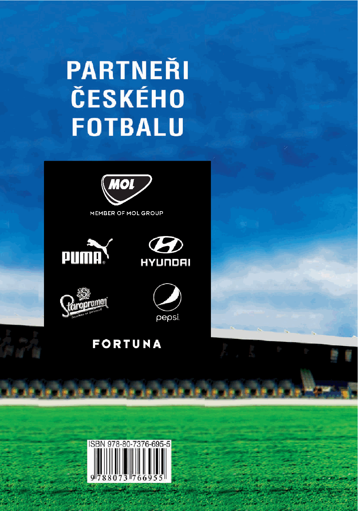
