# Soutěžní řád FAČR – znění označené účinností od 26. 6. 2026

> Pracovní převod uživatelem dodaného PDF. Pozdější změny nejsou zahrnuty; účinnost jednotlivých novel je nutné posoudit podle § 73 odst. 3 a data situace.

Zdroj: [původní PDF](sources/soutezni-rad-facr-2026-06-26.pdf). PDF obsahuje 87 stran; tištěné číslování odpovídá pořadí stran PDF (bez posunu). Nativní text je zachován, tabulky mají pevné rozložení. Obrazové strany 83–87 mají zvlášť označený automatický OCR přepis; rozměry, tabulky a vztahy v diagramech ověřuj v přiloženém obrázku nebo PDF, nikoli jen z OCR.

SHA-256 PDF: `2aa7ce271ab02c79e7f0c591f8f8531fdc97fbaa9b0b198ae4b830f8d018b883`.

## Obsah – hlavní řád a přílohy

- [§ 1 – Základní ustanovení](#pdf-002)
- [§ 2 – Výklad některých pojmů](#pdf-002)
- [§ 3 – Působnost](#pdf-004)
- [§ 4 – Soutěže](#pdf-005)
- [§ 5 – Soutěžní ročník](#pdf-005)
- [§ 6 – Řídící orgán soutěže](#pdf-006)
- [§ 7 – Sportovně-technická komise](#pdf-006)
- [§ 8 – Rozpis soutěží a termínová listina](#pdf-007)
- [§ 9 – Zápis o utkání](#pdf-008)
- [§ 10 – Soupiska družstva](#pdf-009)
- [§ 11 – Mistrovské soutěže](#pdf-010)
- [§ 12 – Systém mistrovských soutěží](#pdf-013)
- [§ 13 – Začátky mistrovských utkání](#pdf-013)
- [§ 14 – Hodnocení výsledků v mistrovských soutěžích](#pdf-014)
- [§ 15 – Zařazení družstva členského klubu do soutěže](#pdf-014)
- [§ 16 – Losovací aktiv](#pdf-016)
- [§ 17 – Pořadí družstev v soutěži](#pdf-016)
- [§ 18 – Postupy a sestupy](#pdf-017)
- [§ 19 – Kolize více družstev jednoho členského klubu](#pdf-018)
- [§ 20 – Doplňování míst v soutěžích](#pdf-019)
- [§ 21 – Pohárové soutěže OFS, KFS a PFS](#pdf-022)
- [§ 22 – Pohár FAČR](#pdf-022)
- [§ 23 – Systém Poháru FAČR](#pdf-022)
- [§ 24 – Účast v Poháru FAČR](#pdf-022)
- [§ 25 – Zařazování účastníků do Poháru FAČR](#pdf-023)
- [§ 26 – Termíny utkání Poháru FAČR](#pdf-023)
- [§ 27 – Organizátor utkání Poháru FAČR](#pdf-023)
- [§ 28 – Vítěz Poháru FAČR](#pdf-023)
- [§ 29 – Pohár FAČR žen](#pdf-023)
- [§ 30 – Systém Poháru FAČR žen](#pdf-024)
- [§ 31 – Zařazení a kvalifikace do Poháru FAČR žen](#pdf-024)
- [§ 32 – Termíny utkání Poháru FAČR žen](#pdf-024)
- [§ 33 – Organizátor utkání Poháru FAČR žen](#pdf-024)
- [§ 34 – Vítěz Poháru FAČR žen](#pdf-025)
- [§ 35 – Příslušníci družstva](#pdf-025)
- [§ 36 – Věkové kategorie](#pdf-025)
- [§ 37 – Oprávnění hráčů a hráček nastupovat](#pdf-027)
- [§ 38 – Vedoucí družstva](#pdf-029)
- [§ 39 – Trenéři družstva](#pdf-030)
- [§ 40 – Ostatní příslušníci družstva](#pdf-030)
- [§ 41a – Povinné počty družstev mládeže](#pdf-030)
- [§ 41b – Povinné počty družstev a dívek](#pdf-031)
- [§ 42 – Účast cizinců v družstvu](#pdf-032)
- [§ 42a – Status hráčů v profesionálních soutěžích](#pdf-033)
- [§ 42b – Pravidla pro nastupování hráčů licenčních klubů v nižších soutěžích](#pdf-034)
- [§ 43 – Práva a povinnosti členského klubu](#pdf-034)
- [§ 44 – Práva a povinnosti hráčů](#pdf-035)
- [§ 45 – Míč](#pdf-035)
- [§ 46 – Lékařská prohlídka](#pdf-035)
- [§ 47 – Odpovědnost hráče za výstroj](#pdf-036)
- [§ 48 – Organizátor utkání](#pdf-036)
- [§ 49 – Hlavní pořadatel](#pdf-036)
- [§ 50 – Pořadatelská služba](#pdf-037)
- [§ 51 – Odpovědnost za porušení povinností pořadatelské služby](#pdf-037)
- [§ 52 – Nemistrovské soutěže a přátelská utkání](#pdf-037)
- [§ 53 – Působnost](#pdf-038)
- [§ 54 – Technické povinnosti organizátora utkání](#pdf-038)
- [§ 55 – Pořádkové povinnosti organizátora utkání](#pdf-039)
- [§ 56 – Práva a povinnosti družstev](#pdf-040)
- [§ 57 – Práva a povinnosti vedoucího družstva](#pdf-040)
- [§ 58 – Čekací doba](#pdf-040)
- [§ 59 – Nedostavení se delegovaného rozhodčího](#pdf-041)
- [§ 60 – Práva a povinnosti rozhodčího utkání před zahájením utkání](#pdf-042)
- [§ 61 – Práva a povinnosti delegáta](#pdf-043)
- [§ 62 – Příprava zápisu o utkání](#pdf-043)
- [§ 63 – Působnost](#pdf-044)
- [§ 64 – Zahájení utkání](#pdf-044)
- [§ 65 – Kapitán družstva](#pdf-045)
- [§ 66 – Práva a povinnosti rozhodčího během utkání](#pdf-045)
- [§ 67 – Kontrola totožnosti](#pdf-045)
- [§ 68 – Počet hráčů a střídání](#pdf-046)
- [§ 69 – Nezahájení, přerušení a předčasné ukončení utkání](#pdf-048)
- [§ 70 – Uzavření zápisu o utkání](#pdf-049)
- [§ 71 – Protest](#pdf-050)
- [§ 72 – Společná a přechodná ustanovení](#pdf-050)
- [§ 73 – Závěrečná ustanovení](#pdf-052)
- [Příloha č. 1](#pdf-053)
- [Příloha č. 2](#pdf-054)
- [Příloha č. 3](#pdf-060)
- [Příloha č. 4](#pdf-064)
- [Příloha č. 5](#pdf-065)
- [Příloha č. 6](#pdf-072)
- [Příloha č. 7](#pdf-075)

<a id="pdf-001"></a>

## PDF strana 1 / tištěná strana 1

[PDF, strana 1](sources/soutezni-rad-facr-2026-06-26.pdf#page=1)

SOUTĚŽNÍ ŘÁD FOTBALOVÉ ASOCIACE ČESKÉ REPUBLIKY

ČÁST PRVNÍ – OBECNÁ ČÁST (§ 1 - § 52)

HLAVA I – OBECNÁ USTANOVENÍ (§ 1 - § 3)

HLAVA II – ORGANIZACE SOUTĚŽÍ (§ 4 - § 52)

Díl 1 - Společná ustanovení pro organizaci soutěží (§ 4 - § 10)

Díl 2 - Organizace mistrovských soutěží (§ 11 - § 20)

Díl 3 - Organizace pohárových soutěží (§ 21 - § 34)

Díl 4 - Práva a povinnosti členů FAČR (§ 35 - § 51)

Díl 5 - Organizace nemistrovských soutěží (§ 52)

ČÁST DRUHÁ – ZVLÁŠTNÍ ČÁST (§ 53 - § 71)

HLAVA I – PRÁVA A POVINNOSTI ČLENŮ FAČR (§ 53 - § 62)

HLAVA II – PRÁVA A POVINNOSTI ČLENŮ FAČR V PRŮBĚHU UTKÁNÍ (§ 63 - § 69)

HLAVA III – PRÁVA A POVINNOSTI ČLENŮ FAČR PO UKONČENÍ UTKÁNÍ (§ 70 -

§ 71)

ČÁST TŘETÍ – USTANOVENÍ SPOLEČNÁ, PŘECHODNÁ A ZÁVĚREČNÁ (§ 72 - § 73)

PŘÍLOHA Č. 1 – ŘAZENÍ HRÁČŮ DO VĚKOVÝCH KATEGORIÍ

PŘÍLOHA Č. 2 - MODIFIKACE SOUTĚŽNÍHO ŘÁDU

PŘÍLOHA Č. 3 - TABULKY PRO ROZLOSOVÁNÍ

PŘÍLOHA Č. 4 - LICENČNÍ PODMÍNKY PRO PROFESIONÁLNÍ SOUTĚŽE

PŘÍLOHA Č. 5 - POVOLÁVÁNÍ HRÁČŮ DO REPREZENTAČNÍCH DRUŽSTEV

PŘÍLOHA Č. 6 - PRAVIDLA PRO PŘÍPADY UDÁLOSTÍ ZPŮSOBENÝCH VYŠŠÍ MOCÍ

PŘÍLOHA Č. 7 – PODMÍNKY ATESTACE A UŽÍVÁNÍ HŘIŠTĚ S UMĚLÝM

TRÁVNÍKEM PŘI SOUTĚŽNÍCH UTKÁNÍ

<a id="pdf-002"></a>

## PDF strana 2 / tištěná strana 2

[PDF, strana 2](sources/soutezni-rad-facr-2026-06-26.pdf#page=2)

ČÁST PRVNÍ

OBECNÁ ČÁST

HLAVA I

OBECNÁ USTANOVENÍ

### § 1

Základní ustanovení

1. Fotbalová asociace České republiky (dále „FAČR“), jakožto organizátor soutěží fotbalu v České republice, je oprávněna stanovovat pravidla těchto soutěží a rozhodovat o porušení těchto pravidel prostřednictvím svých orgánů nebo orgánů pobočných spolků.

2. K účelům podle odst. 1 vydává FAČR tento Soutěžní řád FAČR (dále „tento řád“), který stanoví zejména:

a) základní podmínky organizace fotbalových soutěží;

b) vznik, změnu a zánik práv povinností subjektů, které se účastní, organizují nebo se jinak podílí na fotbalových soutěžích.

### § 2

Výklad některých pojmů

1. Pro účely tohoto řádu se v souladu se Stanovami následujícími pojmy rozumí:

a) administrátor členského klubu – fyzická osoba, která je v souladu se Stanovami registrována jako člen FAČR , plní funkci administrátora členského klubu a je pověřená členským klubem, aby jeho jménem a v rozsahu svého pověření uskutečňovala právní jednání v rámci informačního systému FAČR buď jako hlavní administrátor, který je oprávněn uskutečňovat veškerá právní jednání, jakož i pověřovat ostatní administrátory, anebo pověřený administrátor, který je oprávněn uskutečňovat právní jednání pouze v rozsahu pověření uděleného prostřednictvím hlavního administrátora;

b) amatérský hráč – hráč, který není profesionálním hráčem;

c) člen FAČR – fyzická nebo právnická osoba, která je v souladu se Stanovami zaregistrována jako člen FAČR;

d) členský klub – právnická osoba, která je v souladu se Stanovami registrována jako člen FAČR s právy a povinnostmi členského klubu;

e) delegát – fyzická osoba, která je v souladu se Stanovami registrována jako člen FAČR a po udělení licence je oprávněna vykonávat funkci delegáta;

f) delegovaná osoba – rozhodčí nebo delegát, který je v souladu se Stanovami registrován jako člen FAČR;

g) disciplinární orgán – takový orgán FAČR nebo orgán jejího pobočného spolku, který je oprávněn v souladu se Stanovami a Disciplinárním řádem rozhodovat v disciplinárním řízení;

<a id="pdf-003"></a>

## PDF strana 3 / tištěná strana 3

[PDF, strana 3](sources/soutezni-rad-facr-2026-06-26.pdf#page=3)

h)  disciplinární přečin – takové jednání, které Stanovy, Disciplinární řád nebo další předpis, na nějž Disciplinární řád výslovně odkazuje, označuje jako disciplinární přečin a které vykazuje znaky v těchto předpisech uvedené;

i) Disciplinární řád – předpis FAČR vydaný na základě Stanov, včetně případných změn a doplňků, upravující zejména skutkové podstaty disciplinárních přečinů, druhy disciplinárních trestů, jakož i postup disciplinárních orgánů FAČR v disciplinárním řízení;

j) hlediště – část stadiónu určená pro diváky;

k) hrací plocha – část hřiště vyznačená v souladu s Pravidly fotbalu;

l) hráč – fyzická osoba, která je v souladu se Stanovami registrována jako člen FAČR a je oprávněna nastupovat do soutěžních utkání;

m) hřiště – uzavřená a zpravidla oplocená vnitřní část stadionu, na níž je vyznačena hrací plocha; do prostoru hřiště mají přístup pouze přesně určené osoby;

n) informační systém FAČR – informační systém, prostřednictvím kterého je vedena evidence týkající se členů FAČR a jsou realizována některá práva a povinnosti členů FAČR;

o) KA – klubová akademie ve smyslu Licenčního řádu talentované mládeže FAČR;

p) KFS – příslušný krajský fotbalový svaz jakožto pobočný spolek FAČR;

q) kvalifikační utkání – soutěžní utkání, v kterém musí být rozhodnuto o vítězi;

r) lékař nebo jiný zdravotník – fyzická osoba, která je v souladu se Stanovami registrována jako člen FAČR a je oprávněna být uvedena v zápisu o utkání jako lékař nebo jiný zdravotník;

s) licenční klub – členský klub, který se na základě licence udělené v souladu s předpisy FAČR svým družstvem účastní soutěží 1. nebo 2. ligy;

t) ligový profesionální hráč – profesionální hráč, který má uzavřenou s členským klubem ligovou profesionální smlouvu;

u) Ligový výbor LFA – orgán Ligové fotbalové asociace, který je v souladu se Stanovami řídícím orgánem celostátních ligových soutěží;

v) listina hráčů – výpis hráčů členského klubu z informačního systému FAČR v písemné podobě;

w) mládežnické družstvo – vlastní družstvo mládeže členského klubu;

x) nastoupení hráče – skutečnost, že hráč nastoupil k soutěžnímu utkání v základní sestavě nebo do něj v jeho průběhu vstoupil jako střídající hráč nebo byl uveden v zápise o utkání jako náhradník, je-li v utkání povoleno opakované střídání;

y) OFS – příslušný okresní fotbalový svaz jakožto pobočný spolek FAČR;

z) PFS – Pražský fotbalový svaz jakožto pobočný spolek FAČR;

aa) profesionální soutěž – 1. liga a 2. liga;

bb) realizační tým – vedoucí družstva, trenér, asistent trenéra, trenér brankářů, lékař nebo jiný zdravotník, masér, nebo jiná osoba, která je uvedena v zápise o utkání;

cc) rozhodčí – fyzická osoba, která je v souladu se Stanovami registrována jako člen FAČR, po udělení licence je oprávněna vykonávat funkci rozhodčího;

dd) ŘKČ – Řídící komise pro Čechy, která je řídícím orgánem některých soutěží podle tohoto řádu, a která je organizační jednotkou FAČR;

<a id="pdf-004"></a>

## PDF strana 4 / tištěná strana 4

[PDF, strana 4](sources/soutezni-rad-facr-2026-06-26.pdf#page=4)

ee) ŘKM – Řídící komise pro Moravu, která je řídícím orgánem některých soutěží podle tohoto řádu, a která je organizační jednotkou FAČR;

ff) sdružené družstvo – společné družstvo dvou členských klubů;

gg) soutěž – souhrn mistrovských nebo pohárových utkání, organizovaných FAČR nebo jejími pobočnými spolky;

hh) soutěžní utkání – utkání mistrovské nebo pohárové soutěže;

ii) standardní profesionální hráč – profesionální hráč, který má uzavřenou standardní profesionální smlouvu;

jj) Stanovy – základní předpis FAČR schválený její Valnou hromadou, včetně případných změn a doplňků;

kk) start hráče – uvedení hráče v sestavě družstva klubu v zápisu o utkání, který byl uzavřen;

ll) startovné – poplatek klubu hrazen řídicímu orgánu soutěže jako nevratné plnění za účast družstva klubu v soutěži;

mm)        Úřední deska – součást webových stránek FAČR, jejímž prostřednictvím je FAČR oprávněna doručovat svým členům rozhodnutí svých orgánů a jiná oznámení;

nn) zahraniční asociace – národní fotbalová asociace sdružená ve FIFA s výjimkou FAČR.

2. Pokud Soutěžní řád užívá pojmu, který v něm není výslovně vymezen, vykládá se takovýto pojem v souladu se Stanovami a ostatními předpisy FAČR, právními předpisy České republiky, případně s jeho obvyklým významem.

### § 3

Působnost

1. Dle tohoto řádu se organizují soutěže fotbalu na území České republiky.

2. Práva a povinnosti účastníků v soutěžích FAČR, včetně jejích pobočných spolků, a podmínky těchto soutěží, se posuzují dle tohoto řádu a Stanov účinných v době právního jednání.

3. Soutěžní řád se vztahuje na členy FAČR účastnící se soutěží organizovaných FAČR nebo jejími pobočnými spolky, pokud tento řád nebo jiný předpis nestanoví jinak.

4. Soutěžní řád se vztahuje na všechny soutěže organizované FAČR nebo jejími pobočnými spolky, pokud tento řád nebo jiný předpis nestanoví jinak.

5. Výkonný výbor FAČR zřizuje Komisi ženského fotbalu a pověřuje ji organizací a řízením soutěží fotbalu žen a dívek na území České republiky, pokud v tomto řádu není uvedeno jinak, přičemž Komise ženského fotbalu je řídícím orgánem soutěže ve smyslu § 6, jakož i sportovně-technickou komisí ve smyslu § 7.

<a id="pdf-005"></a>

## PDF strana 5 / tištěná strana 5

[PDF, strana 5](sources/soutezni-rad-facr-2026-06-26.pdf#page=5)

HLAVA II

ORGANIZACE SOUTĚŽÍ

Díl 1

Společná ustanovení pro organizaci soutěží

### § 4

Soutěže

1. FAČR nebo její pobočné spolky organizují soutěže:

a) mistrovské;

b) pohárové.

2. Na nemistrovské soutěže a přátelská utkání podle § 52, organizované FAČR nebo jejími pobočnými spolky, se užijí ustanovení tohoto řádu přiměřeně.

3. Veškerá práva vyplývající ze soutěží dle odst. 1, zejména mediální a komerční práva a práva k datům, v souladu s čl. 3 odst. 2 Stanov náleží výlučně FAČR, přičemž FAČR je oprávněna s těmito právy nakládat a dále je obchodovat.

### § 5

Soutěžní ročník

1. Soutěžní ročník je časové období, v kterém se odehrávají soutěžní utkání dle Pravidel fotbalu schválených před začátkem příslušného soutěžního ročníku.

2. Soutěžní ročník se dělí na podzimní a jarní část.

3. Soutěžní ročník ve všech soutěžích začíná nejdříve dne 1. 7. kalendářního roku a končí nejpozději dne 30. 6. bezprostředně následujícího kalendářního roku.

4. Soutěžní ročník je zahájen dnem uvedeným v rozhodnutí řídícího orgánu soutěže o zahájení soutěžního ročníku učiněném na losovacím aktivu soutěže a zveřejněném na Úřední desce.

5. Řídící orgán soutěže není oprávněn zahájit soutěžní ročník v případě, že není ukončen soutěžní ročník předchozí.

6. Soutěžní ročník je ukončen rozhodnutím řídícího orgánu soutěže o ukončení soutěžního ročníku zveřejněném na Úřední desce.

7. Ve výjimečných případech, kdy nelze soutěž dohrát důvodů vyšší moci, může být soutěžní ročník ukončen nebo změněn systém mistrovských a pohárových soutěží rozhodnutím Výkonného výboru FAČR zveřejněném na Úřední desce.

8. Rozhodnutí podle odst. 7 musí obsahovat přinejmenším:

a) stanovení, kterých soutěží se rozhodnutí týká;

b) určení dne ukončení soutěžního ročníku;

c) způsob určení pořadí družstev v soutěži včetně určení rozhodného dne;

d) ustanovení, zda se vylučuje použití ustanovení § 18, tedy zda družstva postupují a sestupují.

9. Rozhodnutí podle odst. 7 může obsahovat i taková ustanovení, jimiž dojde v důsledku nedohrání soutěžního ročníku ke změně řádu pro nedohraný a následující soutěžní ročník.

<a id="pdf-006"></a>

## PDF strana 6 / tištěná strana 6

[PDF, strana 6](sources/soutezni-rad-facr-2026-06-26.pdf#page=6)

### § 6

Řídící orgán soutěže

1. Řídící orgán soutěže organizuje a řídí příslušnou soutěž a stanovuje práva a povinnosti pro její účastníky v souladu s tímto řádem.

2. Řídící orgán soutěže:

a) vydává vždy před začátkem soutěžního ročníku rozpisy soutěží, kdy rozpisy soutěží se mohou odchýlit od ustanovení tohoto řádu a dalších předpisů FAČR pouze tam, kde to soutěžní řád nebo jiný předpis výslovně připouští; neplatná jsou taková ustanovení rozpisu soutěží, která jsou v rozporu s účelem a nastavením informačního systému FAČR;

b) deleguje své pravomoci podle odst. 1 sportovně-technické komisi, kterou za tímto účelem zřizuje.

3. Řídící orgán soutěže není oprávněn upravovat rozpis soutěží v průběhu soutěžního ročníku s výjimkou:

a) termínové listiny soutěže;

b) změny těch ustanovení rozpisu soutěží, která jsou zjevně v rozporu s tímto řádem;

c) plnění povinností uložené rozhodnutím Odvolací komise FAČR.

4. Řídící orgán soutěže schvaluje hřiště, na kterém je členský klub oprávněn hrát soutěžní utkání. To neplatí v neprofesionálních soutěžích, kdy bylo hřiště s umělým trávníkem třetí generace atestováno FAČR v souladu s Podmínkami atestace a užívání hřiště s umělým trávníkem při soutěžních utkáních, které tvoří PŘÍLOHA Č. 7 tohoto řádu. V případě podstatných změn na již schváleném hřišti v průběhu soutěžního ročníku, je zakázáno na takovém hřišti hrát soutěžní utkání do doby opětovného schválení hřiště řídícím orgánem soutěže.

5. Řídící orgán soutěže je oprávněn udělit výjimku z povinnosti hraní soutěžních utkání pouze na hřištích s travnatou hrací plochou.

6. Řídící orgán schvaluje umělé osvětlení, pod kterým je členský klub oprávněn hrát soutěžní utkání. Obligatorní náležitostí pro schválení umělého osvětlení je předložení příslušné dokumentace a vyjádření odborníka o kvalitě a intenzitě umělého osvětlení. Umělé osvětlení je povoleno zapojit v průběhu soutěžního utkání pouze po předchozí dohodě s rozhodčím a delegátem soutěžního utkání.

### § 7

Sportovně-technická komise

1. Sportovně-technická komise je v působnosti řídícího orgánu soutěže povinna navrhovat k projednání následující disciplinární přečiny s návrhem na uložení disciplinárního trestu:

a) odmítne-li družstvo v případě vyplňování písemného zápisu o utkání předložit listinu hráčů a současně neumožní kontrolu totožnosti startujících hráčů;

b) odehraje-li členský klub soutěžní utkání v jiném termínu nebo na jiném hřišti, než schválil řídící orgán soutěže;

<a id="pdf-007"></a>

## PDF strana 7 / tištěná strana 7

[PDF, strana 7](sources/soutezni-rad-facr-2026-06-26.pdf#page=7)

c) není-li možné sehrát soutěžní utkání, protože organizátor utkání nepřipravil bez oprávněného důvodu hrací plochu tak, aby byla způsobilá ke hře nebo jí nevyznačil podle pravidel fotbalu anebo nepřipravil osvětlení, ačkoli bylo stanoveno, že utkání se sehraje za umělého osvětlení;

d) nenastoupí-li družstvo členského klubu bez závažných důvodů k soutěžnímu utkání anebo nastoupí k utkání po uplynutí čekací doby stanovené Pravidly fotbalu;

e) opustí-li družstvo členského klubu bez závažných důvodů svévolně hrací plochu v průběhu soutěžního utkání anebo v takovém utkání bez závažných důvodů odmítne pokračovat a soutěžní utkání se z tohoto důvodu nedohraje;

f) bylo-li soutěžní utkání předčasně ukončeno v důsledku inzultace rozhodčího některým příslušníkem družstva, nebo v důsledku odmítnutí vyloučeného příslušníka družstva opustit hřiště;

g) bylo-li soutěžní utkání ovlivněno způsobem, který odporuje principu poctivého sportovního soutěžení;

h) nastoupí-li hráč neoprávněně k soutěžnímu utkání;

i) bylo-li soutěžní utkání ukončeno z důvodu, že počet hráčů družstva klesl pod povolený počet dle Pravidel fotbalu.

2. Sportovně-technická komise je v působnosti řídícího orgánu soutěže povinna navrhnout k projednání disciplinární přečin porušení tohoto řádu spočívající v odhlášení družstva členského klubu ze soutěže nebo v nesplnění minimálního počtu mládežnických družstev podle § 41a a § 41b s návrhem na uložení disciplinárního trestu vyloučení družstva ze soutěže.

3. Sportovně-technická komise je v působnosti řídícího orgánu soutěže oprávněna uložit za porušení ustanovení tohoto řádu, pokud nejde o porušení podle odst. 1 nebo odst. 2, pořádkovou pokutu:

a) do výše 500 000 Kč v soutěžích, kde příslušným řídícím orgánem soutěže je Ligový výbor LFA;

b) do výše 50 000 Kč v soutěžích, kde příslušným řídícím orgánem soutěže je ŘKČ nebo ŘKM;

c) do výše 50 000 Kč v soutěžích, kde příslušným řídícím orgánem soutěže je Komise ženského fotbalu;

d) do výše 30 000 Kč v soutěžích, kde příslušným řídícím orgánem soutěže je KFS nebo PFS;

e) do výše 10 000 Kč v soutěžích, kde příslušným řídícím orgánem soutěže je OFS.

4. Ve vztahu k profesionálním soutěžím vykonává působnost sportovně technické komise Výkonný ředitel LFA.

### § 8

Rozpis soutěží a termínová listina

1. Rozpis soutěží obsahuje zejména:

a) termínovou listinu soutěže;

b) práva a povinnosti účastníků soutěže;

<a id="pdf-008"></a>

## PDF strana 8 / tištěná strana 8

[PDF, strana 8](sources/soutezni-rad-facr-2026-06-26.pdf#page=8)

c) výši a způsob hrazení startovného;

d) minimální požadavky na hřiště včetně podmínek užití náhradního hřiště;

e) stanovení počtu postupujících a sestupujících družstev včetně systému postupů a sestupů;

f) seznam účastníků soutěže.

2.   Rozpisy soutěží a termínové listiny nižších soutěží musí být přizpůsobeny rozpisům vyšších soutěží co do systémů postupů a sestupů a počtu postupujících a sestupujících družstev.

3.   Termínová listina soutěže je seznam termínů utkání soutěže schválených řídícím orgánem soutěže. Termíny utkání jsou závazné pro všechna družstva příslušné soutěže.

4.   Družstva jsou oprávněna po vzájemné dohodě a souhlasu řídícího orgánu soutěže odehrát svá utkání mimo stanovený termín v termínové listině, jakož i dohodnout změnu místa konání utkání. Dohoda družstev o změně termínu utkání nebo místa konání utkání musí být uložena do informačního systému FAČR nejpozději 17 dnů před původně stanoveným termínem utkání. Dohoda družstev a souhlas řídícího orgánu soutěže dle předchozí věty musí být proveden vždy prostřednictvím informačního systému FAČR nejpozději do 10 dnů před stanoveným termínem utkání. Organizátor utkání je oprávněn navrhnout bez souhlasu soupeře řídícímu orgánu soutěže, že konkrétně vymezená soutěžní utkání odehraje v jiném termínu, než který byl stanoven pro soutěžní ročník, a to nejpozději 15 dnů před dnem prvního soutěžního utkání příslušné části soutěže.

5.   Řídící orgán soutěže je oprávněn do rozpisu soutěží implementovat modifikace dle přílohy č. 2 tohoto řádu.

### § 9

Zápis o utkání

1. Záznamem o průběhu utkání je zápis o utkání. K vyplnění zápisu o utkání poskytuje organizátor utkání rozhodčímu utkání potřebné vybavení, zejména výpočetní techniku s internetovým připojením.

2. Zápis o utkání se pořizuje přímo ve specializované aplikaci informačního systému FAČR pro zpracování elektronického zápisu o utkání.

3. Aplikaci pro zpracování elektronického zápisu o utkání je oprávněn obsluhovat pouze administrátor členského klubu s právy zápisu o utkání a delegované osoby. Do zápisu o utkání není oprávněna zasahovat žádná další osoba.

4. Pokud technické nebo jiné podmínky nedovolují zpracování zápisu o utkání v informačním systému FAČR, vyplní se tištěný formulář zápisu o utkání ručně a do informačního systému FAČR bude převeden dodatečně organizátorem utkání, který odpovídá za doručení písemného zápisu o utkání řídícímu orgánu soutěže.

5. Nezpracuje-li klub zápis o utkání v informačním systému FAČR bez závažného důvodu, bude řídícím orgánem soutěže potrestán uložením pořádkové pokuty.

<a id="pdf-009"></a>

## PDF strana 9 / tištěná strana 9

[PDF, strana 9](sources/soutezni-rad-facr-2026-06-26.pdf#page=9)

### § 10

Soupiska družstva

1. Soupiska družstva je doklad, který určuje příslušnost hráčů k družstvu členského klubu. Jeden hráč může být uveden na jedné soupisce.

2. Na soupisku družstva lze zařadit pouze hráče z informačního systému FAČR členského klubu dle příslušné věkové kategorie.

3. Soupisku družstva je oprávněn vyplnit pouze administrátor členského klubu na předepsaném formuláři v informačním systému FAČR. Na soupisce družstva je povinen uvést 11 hráčů, případně alespoň ten počet hráčů, v jakém se soutěž hraje, kteří spadají do příslušné věkové kategorie soutěže.

4. Soupiska družstva se vyhotovuje vždy k jednotlivé části soutěžního ročníku, a to vždy nejpozději 3 dny před zahájením jednotlivé části soutěže, kdy se pro účely tohoto ustanovení za podzimní část soutěžního ročníku považuje období od 1. 7. do 31. 12. kalendářního roku a za jarní část soutěžního ročníku období od 1. 1. do 30. 6. kalendářního roku.

5. Změny v soupisce družstva je administrátor členského klubu oprávněn provádět pouze do termínu podle odst. 4. V průběhu příslušné části soutěžního ročníku je členský klub povinen ve lhůtě 7 dnů nahlásit řídícímu orgánu soutěže změny v soupisce družstva pouze v případě, že dojde k přestupu či hostování hráče ze soupisky družstva nebo k doloženému dlouhodobému zranění hráče s odhadovanou dobou léčby nejméně 3 měsíce ze soupisky družstva. Řídící orgán soutěže pak provede takovou změnu soupisky.

6. Členské kluby, které mají v jedné věkové kategorii pouze jedno družstvo přihlášené do soutěže, soupisku tohoto družstva v informačním systému FAČR nevyplňují.

7. Členské kluby, které mají v jedné věkové kategorii více družstev přihlášených do různých soutěží, nepředkládají soupisku družstva přihlášeného do nejnižší soutěže.

8. Ze soupisek družstev členského klubu vyšší soutěže jsou oprávněni startovat pouze dva hráči v jednom soutěžním utkání, a to pouze za družstvo členského klubu hrající nejbližší nižší soutěž.

9. Hráč uvedený na soupisce družstva nižší soutěže je oprávněn startovat za družstvo vyšší soutěže.

10. Hráč neuvedený na žádné soupisce družstva členského klubu je oprávněn startovat za všechna družstva členského klubu.

11. Rozpis soutěží může obsahovat ustanovení, které stanoví minimální počet odehraných minut či utkání pro jednotlivé hráče uvedené na soupisce. V případě nesplnění povinnosti dle předchozí věty je řídící orgán oprávněn uložit za každého hráče pořádkovou pokutu podle § 7 odst. 3.

<a id="pdf-010"></a>

## PDF strana 10 / tištěná strana 10

[PDF, strana 10](sources/soutezni-rad-facr-2026-06-26.pdf#page=10)

Díl 2

Organizace mistrovských soutěží

### § 11

Mistrovské soutěže

1. Mistrovské soutěže mužů a jejich příslušné řídící orgány jsou:

a) 1. liga (Ligový výbor LFA);

b) 2. liga (Ligový výbor LFA);

c) 3. česká liga (ŘKČ) a 3. moravskoslezská liga (ŘKM);

d) 4. ligy (ŘKČ nebo ŘKM);

e) 5. liga (KFS nebo PFS);

f) 6. liga (KFS nebo PFS);

g) 7. liga (KFS nebo PFS);

h) 8. liga (OFS nebo PFS);

i) 9. liga (OFS nebo PFS);

j) 10. liga (OFS).

2. Mistrovské soutěže staršího dorostu jsou:

a) 1. celostátní liga KA staršího dorostu (odborná komise pověřená Výkonným výborem FAČR);

b) 2. česká liga staršího dorostu (ŘKČ);

c) 2. moravskoslezská liga staršího dorostu (ŘKM);

d) 3. česká liga (ŘKČ);

e) 3. moravskoslezská liga (ŘKM);

f) 4. liga staršího dorostu (KFS/PFS);

g) 5. liga staršího dorostu (KFS/PFS);

h) 6. liga staršího dorostu (OFS);

i) 7. liga staršího dorostu (OFS).

3. Mistrovské soutěže mladšího dorostu jsou:

a) 1. celostátní liga KA mladšího dorostu U17 (odborná komise pověřená Výkonným výborem FAČR);

b) 1. celostátní liga KA mladšího dorostu U16 (odborná komise pověřená Výkonným výborem FAČR);

c) 2. česká liga mladšího dorostu (ŘKČ);

d) 2. moravskoslezská liga mladšího dorostu (ŘKM);

e) 3. česká liga (ŘKČ);

f) 3. moravskoslezská liga (ŘKM);

g) 4. liga mladšího dorostu (KFS/PFS);

h) 5. liga mladšího dorostu (KFS/PFS nebo OFS);

i) 6. liga mladšího dorostu (OFS);

j) 7. liga mladšího dorostu (OFS).

4. Mistrovské soutěže starších žáků jsou:

a) 1. česká liga starších žáků U15 (ŘKČ);

b) 1. moravskoslezská liga starších žáků U15 (ŘKM);

<a id="pdf-011"></a>

## PDF strana 11 / tištěná strana 11

[PDF, strana 11](sources/soutezni-rad-facr-2026-06-26.pdf#page=11)

c) 1. česká liga starších žáků U14 (ŘKČ);

d) 1. moravskoslezská liga starších žáků U14 (ŘKM);

e) 2. česká liga starších žáků U15 (ŘKČ);

f) 2. moravskoslezská liga starších žáků U15 (ŘKM);

g) 2. česká liga starších žáků U14 (ŘKČ);

h) 2. moravskoslezská liga starších žáků U14 (ŘKM);

i) 3. liga starších žáků (KFS/PFS);

j) 4. liga starších žáků (KFS/PFS nebo OFS);

k) 5. liga starších žáků (OFS);

l) 6. liga starších žáků (OFS).

5.   Mistrovské soutěže mladších žáků jsou:

a) 1. česká liga mladších žáků U13 (ŘKČ);

b) 1. moravskoslezská liga mladších žáků U13 (ŘKM);

c) 1. česká liga mladších žáků U12 (ŘKČ);

d) 1. moravskoslezská liga mladších žáků U12 (ŘKM);

e) 2. česká liga mladších žáků U13 (ŘKČ);

f) 2. česká liga mladších žáků U12 (ŘKČ);

g) 3. liga mladších žáků (KFS/PFS);

h) 4. liga mladších žáků (KFS/PFS nebo OFS);

i) 5. liga mladších žáků (OFS);

j) 6. liga mladších žáků (OFS). členské kluby, které se účastní soutěží U15 a U14 podle odst. 4 písm. a) – h) a současně též soutěží podle odst. 4 písm. i) – l), jsou povinny pro družstva U15 a U14 vyhotovit soupisku podle § 10; Členské kluby, které se účastní soutěží U13 a U12 podle odst. 5 písm. a) – f) a současně též soutěží podle odst. 5 písm. g) – j), jsou povinny pro družstva U13 a U12 vyhotovit soupisku podle § 10.

6.   Mistrovské soutěže starších přípravek jsou:

a) 1. liga přípravek (KFS/PFS);

b) 2. liga přípravek (OFS);

c) 3. liga přípravek (OFS).

7.   Mistrovské soutěže mladších přípravek jsou:

a) 1. liga přípravek (KFS a PFS);

b) 2. liga přípravek (OFS);

c) 3. liga přípravek (OFS).

8.   Řídící orgány soutěží nevedou a neuveřejňují výsledkové tabulky soutěží podle odst. 6, 7 a 12 a jsou oprávněny užívat pro soutěže přípravek odlišné názvy, než jsou uvedeny v odst. 6, 7 a 12.

9.   Mistrovské soutěže žen jsou:

a) 1. liga žen (Komise ženského fotbalu);

b) 2. liga žen (Komise ženského fotbalu);

c) 3. česká liga žen (Komise ženského fotbalu);

d) 3. moravskoslezská liga žen (ŘKM);

<a id="pdf-012"></a>

## PDF strana 12 / tištěná strana 12

[PDF, strana 12](sources/soutezni-rad-facr-2026-06-26.pdf#page=12)

e) 4. liga žen (Komise ženského fotbalu nebo ŘKM);

f) 5. liga žen (KFS/PFS);

g) 6. liga žen (OFS).

10. Mistrovské soutěže dorostenek jsou:

a) 1. liga dorostenek (Komise ženského fotbalu);

b) 2. liga dorostenek Čechy (Komise ženského fotbalu);

c) 2. liga dorostenek Morava (ŘKM)

d) 3. liga dorostenek Čechy (Komise ženského fotbalu);

e) 3. liga dorostenek Morava (Komise ženského fotbalu);

f) 4. liga dorostenek (KFS/PFS);

g) 5. liga dorostenek (OFS).

11. Mistrovské soutěže žákyň jsou:

a) 1. liga starších žákyň Čechy (Komise ženského fotbalu);

b) 1. liga starších žákyň Morava (Komise ženského fotbalu);

c) 1. liga mladších žákyň Čechy (Komise ženského fotbalu);

d) 1. liga mladších žákyň Morava (Komise ženského fotbalu);

e) 2. liga starších žákyň Čechy (Komise ženského fotbalu);

f) 2. liga starších žákyň Morava (Komise ženského fotbalu nebo ŘKM)

g) 2. liga mladších žákyň Čechy (Komise ženského fotbalu);

h) 2. liga mladších žákyň Morava (Komise ženského fotbalu nebo ŘKM)

i) 3. liga žákyň (KFS/PFS);

j) 4. liga žákyň (OFS).

12. Mistrovské soutěže přípravek jsou:

a) 1. liga přípravek (Komise ženského fotbalu);

b) 2. liga přípravek (KFS/PFS);

c) 3. liga přípravek (OFS);4. liga přípravek (OFS).

13. Vítězové soutěží podle odst. 4 písm. a) a b) se utkají ve vzájemném dvojutkání o titul mistra republiky starších žáků U15. Vítězové soutěží podle odst. 4 písm. c) a d) se utkají ve vzájemném dvojutkání o titul mistra republiky starších žáků U14. Dvojutkání o titul dle předchozích vět se hrají systémem „dvojutkání“ (doma-venku), přičemž:

a) se utkání hrají v počtu hráčů družstva 10+1 a v průběhu utkání je oprávněno vystřídat 7 hráčů;

b) doma začíná družstvo, které v základní části získalo více bodů, v případě rovnosti bodů se použijí kritéria podle § 17 odst. 5;

c) termíny utkání stanoví po konzultaci s oběma účastnícími se kluby FAČR;

d) pokud obě družstva docílí v obou utkáních a po skončení řádné hrací doby druhého z utkání shodný počet branek, rozhodne o vítězi penaltový rozstřel.

14. Není-li soutěž podle dorostu nebo žáků dělena na mladší a starší, užije se rozdělení do lig podle příslušných ustanovení přiměřeně s tím, že nedělená soutěž se považuje za soutěž staršího dorostu nebo žáků.

<a id="pdf-013"></a>

## PDF strana 13 / tištěná strana 13

[PDF, strana 13](sources/soutezni-rad-facr-2026-06-26.pdf#page=13)

```text
§ 12
                            Systém mistrovských soutěží
1. Mistrovské soutěže se hrají systémem každý s každým dvoukolově nebo turnajovým
   systémem dle tohoto řádu a příslušného rozpisu soutěží v období podzimní a jarní části
   soutěžního ročníku, vyjma soutěží 1. celostátní liga KA staršího dorostu, 1. celostátní
   liga KA mladšího dorostu U17 a 1. celostátní liga KA mladšího dorostu U16, které se
   mohou hrát i odlišným systémem upraveným rozpisem soutěží.
2. Mistrovské soutěže žen a dívek se hrají systémem, který je upraven v příslušném rozpisu
   soutěží.
3. Systém profesionálních soutěží stanoví Rozpis profesionálních soutěží.

                                       § 13
                            Začátky mistrovských utkání
1. Začátky utkání v mistrovských soutěžích jsou:
  Od                     Do                      Denní světlo            Umělé osvětlení
  1. 1.                  15. 2.                  13.30 hod.              15.30 hod.
  16. 2.                 1. 3.                   14.00 hod.              16.00 hod.
  2. 3.                  15. 3.                  14.30 hod.              16.30 hod.
  16. 3.                 31. 3.                  15.00 hod.              17.00 hod.
  1. 4.                  15. 4.                  15.30 hod.              17.30 hod.
  16. 4.                 30. 4.                  16.00 hod.              18.00 hod.
  1. 5.                  15. 5.                  16.30 hod.              18.30 hod.
  16. 5.                 15. 6.                  17.00 hod.              19.30 hod.
  16. 6.                 31. 7.                  17.30 hod.              19.30 hod.
  1. 8.                  15. 8.                  17.00 hod.              19.00 hod.
  16. 8.                 31. 8.                  16.30 hod.              18.30 hod.
  1. 9.                  15. 9.                  16.00 hod.              18.00 hod.
  16. 9.                 30. 9.                  15.30 hod.              17.30 hod.
  1. 10.                 15. 10.                 15.00 hod.              17.00 hod.
  16. 10.                31. 10.                 14.30 hod.              16.30 hod.
  1. 11.                 15. 11.                 14.00 hod.              16.00 hod.
  16. 11.                31. 12.                 13.30 hod.              15.30 hod.

2. V období, kdy se uplatní letní čas, se připočte k termínu začátku soutěžního utkání podle
   odst. 1 jedna hodina.
3. Termín a začátek utkání vysílaného televizní stanicí v přímém přenosu je stanoven po
   vzájemné dohodě mezi řídícím orgánem soutěže a provozovatelem televizního vysílání.
```

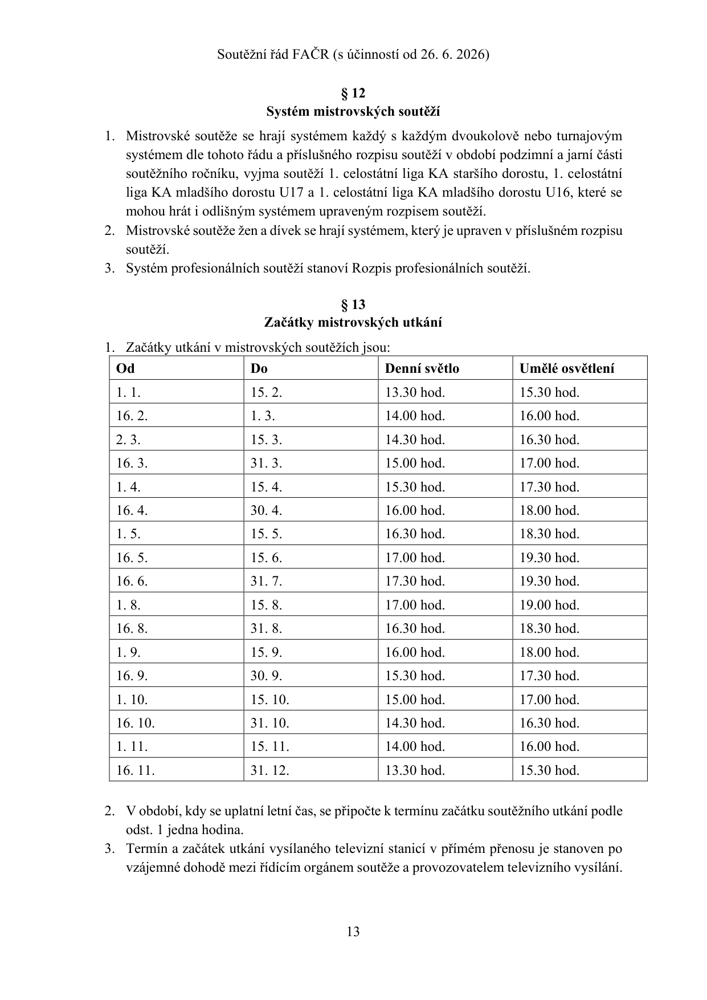

<a id="pdf-014"></a>

## PDF strana 14 / tištěná strana 14

[PDF, strana 14](sources/soutezni-rad-facr-2026-06-26.pdf#page=14)

4. V případě, že soutěžní utkání dorostu nebo žáků je hráno jako předzápas, musí být začátek soutěžního utkání stanoven minimálně 135 minut dříve než hlavní soutěžní utkání dospělých.

5. Na žádost domácího družstva je řídící orgán soutěže oprávněn schválit pozdější čas začátku mistrovského utkání, jde-li o utkání hrané pod umělým osvětlením.

### § 14

Hodnocení výsledků v mistrovských soutěžích

1. Za vítězství v utkání se družstvu přidělují 3 body. Za nerozhodný výsledek v utkání se oběma družstvům přiděluje 1 bod.

2. V případě, že řídící orgán soutěže v souladu s tímto řádem v rozpise soutěží stanoví, že v určených soutěžích se v případě nerozhodného výsledku provede rozstřel ze značky pro pokutový kop podle Pravidel fotbalu, bude jeho vítězi přidělen další 1 bod.

3. Za předpokladu, že byl členskému klubu uložen disciplinární trest kontumace utkání, budou druhému členskému klubu účastnícímu se tohoto utkání přiděleny 3 body a aktivní brankový poměr 3:0; to neplatí, pokud družstvo v utkání dosáhlo příznivějšího výsledku.

4. Za předpokladu, že byl členskému klubu uložen disciplinární trest kontumace utkání, nebude tomuto členskému klubu přidělen žádný bod a bude mu započten pasivní brankový poměr 0:3, pokud družstvo v utkání dosáhlo příznivějšího výsledku.

5. Za předpokladu, že byl oběma členským klubům za téže soutěžní utkání uložen disciplinárně trest kontumace utkání, nebude žádnému členskému klubu přidělen žádný bod a oběma bude za soutěžní utkání započten brankový poměr 0:3.

6. Za předpokladu, že byl členskému klubu uložen disciplinární trest vyloučení družstva ze soutěže, anulují se všechny dosavadní výsledky družstva členského klubu, družstvo členského klubu je zařazeno na poslední místo v tabulce a pohlíží se na něj jako na prvního sestupujícího. Rozpis profesionální soutěže může obsahovat i jinou úpravu, než která je stanovena v předchozí větě, a stanovit, že družstvo členského klubu je zařazeno na poslední místo v tabulce a pohlíží se na něj jako na prvního sestupujícího, avšak v určitých případech se dosavadní výsledky družstva členského klubu neanulují.

### § 15

Zařazení družstva členského klubu do soutěže

1. Řídící orgán soutěže na základě:

a) členským klubem nabytých práv k účasti v příslušné soutěži;

b) členským klubem včasně doručených přihlášek družstva členského klubu do soutěží;

c) umístění družstev členského klubu v příslušných soutěžích v předcházejícím soutěžním ročníku a;

d) členským klubem splněných podmínek stanovených tímto řádem pro účast v soutěži;

<a id="pdf-015"></a>

## PDF strana 15 / tištěná strana 15

[PDF, strana 15](sources/soutezni-rad-facr-2026-06-26.pdf#page=15)

zařadí družstva členského klubu do soutěží a příslušných skupin soutěží a provede rozlosování dle tabulek uvedených v příloze č. 3 tohoto řádu a v případě profesionálních soutěží dle postupu určeném v Rozpisu profesionálních soutěží.

2.   Řídící orgán nezařadí do soutěže družstva mužů takového členského klubu, který ve lhůtě pro zpětvzetí přihlášky neuhradil svoje splatné dluhy:

a) stanovené sběrnou fakturou;

b) stanovené v souladu s ustanovením § 21 odst. 1 písm. b) Přestupního řádu, pokud nemá ve vztahu k takovým dluhům s oprávněným členským klubem uzavřenou dohodu o splátkovém kalendáři; Sekretariát FAČR může v případech zvláštního zřetele hodných rozhodnout po projednání věci s řídícím orgánem soutěže řízené OFS, KFS nebo PFS o povolení splátkového kalendáře; v takovém případě se ustanovení písm. a) nepoužije.

3.   Pro zařazení družstva členského klubu do mistrovských soutěží 1. ligy a 2. ligy, je členský klub povinen získat licenci dle licenčních podmínek pro profesionální soutěže blíže specifikovaných v příloze č. 4 tohoto řádu.

4.   Práva účastnit se soutěže mladšího dorostu nabývá členský klub v závislosti na právu účastnit se odpovídající soutěže staršího dorostu, nestanoví-li rozpis soutěží jinak.

5.   Práva účastnit se soutěže:

a) 1. celostátní liga KA staršího dorostu nabývá členský klub v závislosti na splnění požadované struktury mládežnických družstev, splnění podmínek podle Licenčního řádu talentované mládeže FAČR a získání příslušného statusu KA, nestanoví-li rozpis soutěží jinak;

b) 1. celostátní liga KA mladšího dorostu U17 a U16 nabývá členský klub v závislosti na právu účastnit se soutěže 1. celostátní ligy KA staršího dorostu, nestanoví-li rozpis soutěže jinak;

c) starších žáků (U14) nabývá členský klub v závislosti na právu účastnit se soutěže starších žáků (U15), nestanoví-li rozpis soutěží jinak;

d) mladších žáků (U12) nabývá členský klub v závislosti na právu účastnit se odpovídající soutěže mladších žáků (U13), nestanoví-li rozpis soutěží jinak;

e) mladších žáků dle rozpisu soutěží KFS, PFS nebo OFS nabývá členský klub v závislosti na právu účastnit se odpovídající soutěže starších žáků, nestanoví-li rozpis soutěží jinak.

6.   Přihlášku družstva členského klubu do soutěže podle odst. 1 písm. b) je členský klub povinen doručit příslušnému řídícímu orgánu do 25. 5.; v odůvodněných případech je řídící orgán soutěže oprávněn přijmout přihlášku do soutěže i po tomto termínu.

7.   Návrh zařazení družstev členského klubu do soutěží dle odst. 1 a rozdělení soutěží na skupiny, je řídící orgán soutěže povinen zveřejnit před zahájením losovacího aktivu na Úřední desce.

8.   Řídící orgán soutěže je povinen vyhovět žádosti členského klubu o přeřazení družstva členského klubu do nižší soutěže, učiní-li tak ve lhůtě pro podání přihlášky. Později je povinen vyhovět pouze tehdy, jedná-li se o sestupujícího nebo postupujícího.

9.   V případě nepodání přihlášky družstva členského klubu do žádné soutěže bude družstvo členského klubu pro následující soutěžní ročník příslušným řídícím orgánem soutěže zařazeno do nejnižší soutěže příslušného OFS, a to bez ohledu na umístění v předchozím

<a id="pdf-016"></a>

## PDF strana 16 / tištěná strana 16

[PDF, strana 16](sources/soutezni-rad-facr-2026-06-26.pdf#page=16)

soutěžním ročníku. To neplatí, pokud členský klub požádá výslovně o nezařazení družstva do žádné soutěže.

10. V případě vyloučení družstva ze soutěže bude družstvo zařazeno do soutěže stanovené v rozhodnutí o vyloučení, nepodá-li přihlášku do nižší soutěže nebo nepostupuje-li se podle odst. 8. V případě, kdy dojde k nabytí právní moci rozhodnutí o vyloučení družstva ze soutěže v období od ukončení losovacího aktivu dané soutěže do zahájení prvního soutěžního utkání této mistrovské soutěže, je řídící orgán soutěže ve výjimečných případech a po předchozím projednání s řídícími orgány dalších dotčených soutěží oprávněn rozhodnout, že družstvo vyloučené ze soutěže bude pro daný soutěžní ročník zařazeno do soutěže stanovené v rozhodnutí o vyloučení a nebude na něj v tomto konkrétním případě nahlíženo jako na prvního sestupujícího podle § 14 odst. 6 a § 18 odst. 6 tohoto řádu a místo v soutěži uvolněné vyloučeným družstvem bude doplněno postupem podle § 20 tohoto řádu. Obdobně by bylo postupem podle § 20 tohoto řádu postupováno u dalších případně dotčených soutěží.

11. V odůvodněných případech:

a) může být členský klub jako celek začleněn pod jiný OFS, KFS nebo PFS podle čl. 5 odst. 4 a 5 Stanov;

b) se může družstvo nebo družstva členského klubu účastnit soutěží organizovaných jiným OFS, KFS nebo PFS podle čl. 5 odst. 4 a 5 Stanov.

12. Mládežnické družstvo členského klubu se může účastnit soutěže organizované jiným OFS nebo KFS, a to v té kategorii mládeže, která není místně příslušným OFS nebo KFS organizována. Je-li soutěž dle předchozí věty organizována nebo jde o soutěž mužů, může se družstvo účastnit soutěže organizované jiným OFS nebo KFS pouze v případě, že s tím souhlasí oba příslušné OFS nebo KFS.

13. Členský klub, jehož družstva se účastní soutěží 1. celostátní ligy KA, není oprávněn se svým dalším družstvem v kategoriích staršího a mladšího dorostu účastnit soutěží 2. české a moravskoslezské ligy staršího a mladšího dorostu.

### § 16

Losovací aktiv

1. Losovací aktiv pořádá příslušný řídící orgán soutěže nejdříve po ukončení předchozího soutěžního ročníku a po skončení losovacích aktivů vyšších mistrovských soutěží.

2. Losovací aktiv vede předsedající, kterého určí řídící orgán soutěže.

3. Losovacího aktivu jsou povinni se účastnit zástupci všech členských klubů, které podaly přihlášku družstva do soutěže.

4. Zpětvzetí přihlášky družstva do soutěže jsou členské kluby oprávněny podat nejpozději čtyři dny před konáním losovacího aktivu.

5. Losovací aktiv je ukončen schválením zařazení družstev do skupin příslušných soutěží a rozhodnutím řídícího orgánu o zahájení soutěžního ročníku.

### § 17

Pořadí družstev v soutěži

1. Vítězem soutěže nebo její skupiny je družstvo, které dosáhne nejvyššího počtu bodů.

<a id="pdf-017"></a>

## PDF strana 17 / tištěná strana 17

[PDF, strana 17](sources/soutezni-rad-facr-2026-06-26.pdf#page=17)

2. Posledním družstvem soutěže nebo její skupiny je družstvo, které dosáhne nejnižšího počtu bodů.

3. V případě shodného počtu bodů více družstev po odehrání všech soutěžních utkání příslušné soutěže, jakož i po odehrání části soutěže, má-li pořadí vliv na zařazení družstev do skupiny nadstavby či jarní části čtyřkolového systému dle § 3 a § 4 přílohy č. 2 tohoto řádu, rozhoduje o pořadí postupně:

a) vyšší počet bodů ze vzájemných utkání;

b) brankový rozdíl ze vzájemných utkání;

c) vyšší počet vstřelených branek ve vzájemných utkáních;

d) vyšší brankový rozdíl ze všech odehraných utkání v soutěži;

e) vyšší počet vstřelených branek v soutěži;

f) kvalifikační utkání (pokud tak stanoví příslušný rozpis soutěží);

g) los.

4. V případě shodného počtu bodů více družstev v průběhu soutěžního ročníku rozhoduje o pořadí postupně:

a) vyšší brankový rozdíl z odehraných utkání v soutěži;

b) vyšší počet vstřelených branek v soutěži.

5. V případě shodného počtu bodů více družstev v různých skupinách stejné soutěže po odehrání shodného počtu soutěžních utkání rozhoduje o pořadí postupně:

a) vyšší brankový rozdíl ze všech odehraných utkání ve skupině;

b) vyšší počet vstřelených branek v soutěži;

c) kvalifikační utkání (pokud tak stanoví příslušný rozpis soutěží);

d) los.

6. V případě rozhodování o pořadí více družstev při různém počtu bodů více družstev v různých skupinách stejné soutěže po odehrání různého počtu soutěžních utkání rozhoduje o pořadí postupně:

a) vyšší podíl z počtu bodů a počtu odehraných soutěžních utkání;

b) vyšší brankový rozdíl ze všech odehraných utkání ve skupině;

c) vyšší podíl z počtu vstřelených branek v soutěži a počtu odehraných soutěžních utkání;

d) kvalifikační utkání (pokud tak stanoví příslušný rozpis soutěží);

e) los.

7. Má-li se rozhodovat o pořadí družstev podle odst. 5 a 6, nepřihlíží se k bodům získaným na základě pokutových kopů podle § 6 přílohy č. 2 tohoto řádu. To neplatí v případě, že se podle § 6 přílohy č. 2 tohoto řádu shodně postupuje ve všech skupinách, kterých se účastní družstva, o jejichž pořadí má být rozhodnuto.

### § 18

Postupy a sestupy

1. Vítěz soutěže nebo její skupiny získává právo postoupit do vyšší soutěže, v případě

3. české ligy vítěz kvalifikačního dvojutkání. Vítěz soutěže, jakož i další postupující podle odst. 3 nebo § 19 a § 20 jsou povinni pro nabytí práva účasti ve vyšší soutěži splnit

<a id="pdf-018"></a>

## PDF strana 18 / tištěná strana 18

[PDF, strana 18](sources/soutezni-rad-facr-2026-06-26.pdf#page=18)

další povinnosti dané předpisy FAČR nebo jejích pobočných spolků, včetně podání přihlášky družstva do příslušné soutěže.

2.   Poslední družstvo soutěže nebo její skupiny sestupuje do nižší soutěže, pokud nejde o nejnižší soutěž. Poslední družstvo soutěže, jakož i další sestupující podle odst. 3 a 6 nebo § 19 a § 20 a jsou povinni při sestupu do nižší soutěže splnit další povinnosti dané předpisy FAČR nebo jejích pobočných spolků, včetně podání přihlášky družstva do příslušné soutěže.

3.   O počtu postupujících a sestupujících družstev včetně systému postupů a sestupů rozhoduje příslušný řídící orgán soutěže, a to v rozpisu soutěží. Řídící orgán profesionálních soutěží stanoví v rozpisu soutěží i podrobná pravidla o počtu postupujících a sestupujících družstev v případech, kdy dojde ke kolizi více družstev jednoho členského klubu podle § 19, některé z družstev neobdrželo licenci pro účast v profesionální soutěži, nepodalo přihlášku družstva do nejvyšší soutěže, kam mělo oprávnění se přihlásit, nesplnilo jiné podmínky pro účast v profesionální soutěži nebo bylo v disciplinárním řízení vyloučeno ze soutěže. Řídící orgán 1. celostátních lig KA stanoví v rozpisu soutěží i podrobná pravidla o počtu postupujících a sestupujících družstev v případě, kdy členský klub neobdrží požadovaný status KA, nemá požadovanou strukturu mládežnických družstev, nesplnilo jiné podmínky pro účast v soutěži nebo bylo v disciplinárním řízení vyloučeno ze soutěže.

4.   Celkový počet postupujících a sestupujících družstev je závislý od celkového konečného počtu sestupujících družstev z vyšší soutěže a celkového počtu postupujících družstev z nižší soutěže.

5.   Poslední družstvo soutěže nesestupuje, není-li doplněn počet družstev postupem podle § 20. Pro účely 1. celostátních lig KA platí, že pokud klub nesplní podmínky stanovené rozpisem soutěží, jeho družstvo nepostupuje a zároveň poslední družstvo soutěže nesestupuje.

6.   Prvním sestupujícím je družstvo, které bylo v disciplinárním řízení vyloučeno ze soutěže.

7.   Za další sestupující družstvo nad rámec sestupujících podle rozpisu soutěží se považuje takové družstvo, které:

a) nesplnilo jiné podmínky pro účast v soutěži, která není profesionální soutěží;

b) nepodalo přihlášku družstva do nejvyšší soutěže, která není profesionální soutěží, kam mělo oprávnění se přihlásit.

8.   Není-li možné postupem podle § 20 uvolnit místo pro zařazení družstva podle odst. 7 do soutěže, rozhodne řídící orgán o sestupu dalšího družstva ze soutěže, kam se družstvo podle odst. 7 zařazuje.

### § 19

Kolize více družstev jednoho členského klubu

1. V případě sestupu družstva do nižší soutěže, kde hraje již jiné družstvo stejného členského klubu, bude toto jiné družstvo přeřazeno do nižší soutěže podle územní příslušnosti a jeho místo bude doplněno postupem podle § 20, nestanoví-li Rozpis

<a id="pdf-019"></a>

## PDF strana 19 / tištěná strana 19

[PDF, strana 19](sources/soutezni-rad-facr-2026-06-26.pdf#page=19)

profesionální soutěže jinak. Ustanovení předchozí věty se nevztahuje na jiné družstvo stejného členského klubu, které je již postupující či sestupující.

2.   V případě postupu družstva do vyšší soutěže, kde hraje již jiné družstvo stejného členského klubu, družstvo nepostupuje a právo postupu do vyšší soutěže získává další nejlépe umístěné družstvo. Ustanovení předchozí věty se nevztahuje na jiné družstvo stejného členského klubu, které je již postupující či sestupující.

3.   Členské kluby jsou oprávněny se se svými družstvy přípravek účastnit více skupin jedné soutěže, přičemž v takovém případě nemají povinnost vyhotovovat seznam hráčů.

4.   Další podmínky účasti více družstev jednoho členského klubu ve stejné soutěži upravuje § 8 PŘÍLOHA Č. 2 tohoto řádu.

5.   Rozpis profesionální soutěže může obsahovat i jinou úpravu, než která je stanovena v odst. 1, a to sice, že v případě sestupu družstva účastnícího se profesionální soutěže do nižší profesionální soutěže, kde již hraje jiné družstvo stejného členského klubu, bude toto jiné družstvo namísto přeřazení do nižší soutěže podle územní příslušnosti a doplnění jeho místa postupem podle § 20, považováno za druhého, případně dalšího sestupujícího v rámci sestupujících podle Rozpisu profesionální soutěže.

### § 20

Doplňování míst v soutěžích

1. V případě nutnosti doplnění soutěže získává právo účasti:

a) v případě 1. ligy družstvo, které se umístilo na prvním, případně druhém místě

2. ligy za postupujícími družstvy; v případě, že tato družstva nemohou postoupit nebo nemají zájem postoupit, družstvo, které se v 1. lize umístilo na vyšším sestupovém místě, nesestupuje;

b) v případě 2. ligy v závislosti na tom, kam členský klub, jež nutnost doplnění zapříčinil, územně náleží, buď družstvo, které bylo nejúspěšnějším družstvem na základě obdobného postupu podle § 18 odst. 1 a 5 až 7 ve skupinách 3. české ligy, kdy se postupně porovnají nepostupující družstva, která se umístila na prvním, druhém, třetím, případně čtvrtém místě, nebo družstvo, které se umístilo na prvním, druhém, případně třetím místě 3. moravskoslezské ligy za postupujícím družstvem; v případě, že tato družstva nemohou postoupit nebo nemají zájem postoupit, doplní se 2. liga bez ohledu na uzemní příslušnost

3. české nebo moravskoslezské ligy; v případě, že ani tato družstva nemohou postoupit nebo nemají zájem postoupit, družstvo, které se v 2. lize umístilo na vyšším sestupovém místě, nesestupuje;

c) v případě 3. české ligy družstvo, které bylo nejúspěšnějším družstvem na základě obdobného postupu podle § 18 odst. 1 a 5 až 7 ve skupinách 4. české ligy, kdy se postupně porovnají družstva, která se umístila na prvním, druhém, případně třetím místě za postupujícími družstvy; v případě, že tato družstva nemohou postoupit nebo nemají zájem postoupit, družstvo, které se v 3. české lize umístilo na vyšším sestupovém místě, nesestupuje;

d) v případě 3. moravskoslezské ligy družstvo, které bylo nejúspěšnějším družstvem na základě obdobného postupu podle § 18 odst. 1 a 5 až 7 ve skupinách 4. moravskoslezské ligy, kdy se postupně porovnají družstva, která se

<a id="pdf-020"></a>

## PDF strana 20 / tištěná strana 20

[PDF, strana 20](sources/soutezni-rad-facr-2026-06-26.pdf#page=20)

umístila na prvním, druhém, případně třetím místě za postupujícími družstvy; v případě, že tato družstva nemohou postoupit nebo nemají zájem postoupit, družstvo, které se v 3. moravskoslezské lize umístilo na vyšším sestupovém místě, nesestupuje;

e) v případě 4. ligy družstvo, které se umístilo na prvním, druhém, případně třetím místě 5. ligy za postupujícími družstvy v závislosti na tom, kam členský klub, jež nutnost doplnění zapříčinil, územně náleží; v případě, že tato družstva nemohou postoupit nebo nemají zájem postoupit, postoupí družstvo, které bylo nejúspěšnějším družstvem na základě obdobného postupu podle § 18 odst. 1 a 5 až 7, kdy v případě skupin 4. české ligy se postupně porovnají družstva, která se umístila na prvním, druhém, případně třetím místě za postupujícími družstvy 5. ligy, které územně náleží do působnosti ŘKČ a v případě skupin

4. moravskoslezské ligy se postupně porovnají družstva, která se umístila na prvním, druhém, případně třetím místě za postupujícími družstvy 5. ligy, které územně náleží do působnosti ŘKM; v případě, že ani tato družstva nemohou postoupit nebo nemají zájem postoupit, družstvo, které se v příslušné skupině

4. ligy umístilo na vyšším sestupovém místě, nesestupuje;

f) v případě 5. ligy družstvo, které bylo nejúspěšnějším družstvem na základě obdobného postupu podle § 18 odst. 1 a 5 až 7 ve skupinách 6. ligy, kdy se postupně porovnají družstva, která se umístila na prvním, druhém, případně třetím místě za postupujícími družstvy skupin 6. ligy, které náleží do působnosti příslušného KFS; v případě, že tato družstva nemohou postoupit nebo nemají zájem postoupit, družstvo, které se v 5. lize umístilo na vyšším sestupovém místě, nesestupuje;

g) v případě 6. ligy družstvo, které bylo nejúspěšnějším družstvem na základě obdobného postupu podle § 18 odst. 1 a 5 až 7 ve skupinách 7. ligy, kdy se postupně porovnají družstva, která se umístila na prvním, druhém, případně třetím místě za postupujícími družstvy skupin 7. ligy, které náleží do působnosti příslušného KFS; v případě, že tato družstva nemohou postoupit nebo nemají zájem postoupit, družstvo, které se v 6. lize umístilo na vyšším sestupovém místě, nesestupuje;

h) v případě 7. ligy družstvo, které se umístilo na prvním, druhém, případně třetím místě okresního přeboru za postupujícími družstvy v závislosti na tom, kam členský klub, jež nutnost doplnění zapříčinil, územně náleží; v případě, že tato družstva nemohou postoupit nebo nemají zájem postoupit, postoupí družstvo, které bylo nejúspěšnějším družstvem na základě obdobného postupu podle § 18 odst. 1 a 5 až 7 v 8. ligách na území příslušného KFS, kdy se postupně porovnají družstva, která se umístila na prvním, druhém, případně třetím místě za postupujícími družstvy; v případě, že ani tato družstva nemohou postoupit nebo nemají zájem postoupit, družstvo, které se v 7. lize umístilo na vyšším sestupovém místě, nesestupuje;

i) v případě 8. ligy družstvo, které bylo nejúspěšnějším družstvem na základě obdobného postupu podle § 18 odst. 1 a 5 až 7 ve skupinách 9. ligy, kdy se postupně porovnají družstva, která se umístila na prvním, druhém, případně

<a id="pdf-021"></a>

## PDF strana 21 / tištěná strana 21

[PDF, strana 21](sources/soutezni-rad-facr-2026-06-26.pdf#page=21)

třetím místě za postupujícími družstvy; v případě, že tato družstva nemohou postoupit nebo nemají zájem postoupit, družstvo, které se v 8. lize umístilo na vyšším sestupovém místě, nesestupuje;

j) v případě 9. ligy družstvo, které bylo nejúspěšnějším družstvem na základě obdobného postupu podle § 18 odst. 1 a 5 až 7 ve skupinách 10. ligy, kdy se postupně porovnají družstva, která se umístila na prvním, druhém, případně třetím místě za postupujícími družstvy; v případě, že tato družstva nemohou postoupit nebo nemají zájem postoupit, družstvo, které se v 9. lize umístilo na vyšším sestupovém místě, nesestupuje;

k) v případě, že do vyšší soutěže dorostu nemá mimo pořadí zájem postoupit žádné z družstev z první poloviny tabulky nižší soutěže dorostu, je řídící orgán oprávněn snížit počet sestupujících, vyjma pravidla podle odst. 4;

l) v případě, že do vyšší soutěže žáků nemá mimo pořadí zájem postoupit žádné z družstev z první poloviny tabulky nižší soutěže žáků, je řídící orgán oprávněn snížit počet sestupujících, vyjma pravidla podle odst. 4;

m) doplňování míst v jednotlivých soutěžích přípravek je stanoveno v příslušném rozpisu soutěží;

2. Postoupit podle odst. 1 písm. a) až j) mohou pouze družstva umístivší se nejhůře na čtvrtém místě.

3. Není-li postupem podle odst. 1 písm. a) až j) doplněn plný počet družstev do soutěže, je řídící orgán soutěže oprávněn rozhodnout o tom, že se omezení podle odst. 2 nepoužije.

4. Ustanovení § 20 odst. 1, 2 a 3 se nepoužije ve vztahu k:

a) 1. celostátním ligám KA, pro které se žádné doplňování neuplatní;

b) 2. české lize staršího dorostu a 2. moravskoslezské lize staršího dorostu, pro které platí samostatná pravidla pro doplňování spočívající v tom, že doplnění se nabídne pouze družstvu, které se umístilo na prvním místě za postupujícím družstvem, a to pouze v příslušné skupině, ve které postupující družstvo nemohlo nebo nemělo zájem postoupit s tím, že nedoplní-li se podle tohoto ustanovení, je řídící orgán oprávněn snížit počet sestupujících;

c) 2. české lize starších žáků a 2. moravskoslezské lize starších žáků, pro které platí samostatná pravidla pro doplňování spočívající v tom, že doplnění se nabídne pouze družstvu, které se umístilo na prvním místě za postupujícím družstvem, a to pouze v příslušné skupině, ve které postupující družstvo nemohlo nebo nemělo zájem postoupit s tím, že nedoplní-li se podle tohoto ustanovení, je řídící orgán oprávněn snížit počet sestupujících.

<a id="pdf-022"></a>

## PDF strana 22 / tištěná strana 22

[PDF, strana 22](sources/soutezni-rad-facr-2026-06-26.pdf#page=22)

Díl 3

Organizace pohárových soutěží

### § 21

Pohárové soutěže OFS, KFS a PFS

1. Řídícím orgánem pohárové soutěže může být OFS, PFS, KFS, který je oprávněn pověřit řízením pro tyto účely jmenovanou osobu nebo komisi.

2. Řídící orgány soutěží jsou oprávněny stanovit rozpisem soutěží podrobnější podmínky organizace pohárových soutěží.

3. Pohárové soutěže se hrají vylučovacím jednokolovým systémem, neurčí-li řídící orgán jinak. Vítězové pohárových soutěží KFS jsou oprávnění podat přihlášku podle § 24 písm. c).

4. Ustanovení o pohárových soutěžích se použijí obdobně také pro kategorie mládeže chlapců i dívek.

### § 22

Pohár FAČR

1. Nejvyšší pohárovou soutěží dospělých je Pohár FAČR.

2. Pohár FAČR je kvalifikační soutěž pro účast v Evropské lize UEFA.

3. Řídícím orgánem Poháru FAČR je Výkonný výbor FAČR, který je oprávněn pověřit řízením pro tyto účely jmenovanou osobu nebo komisi.

4. Je-li účastníkem utkání členský klub profesionální soutěže, nelze pro utkání Poháru FAČR využít hřiště s umělým trávníkem; to neplatí, pokud tento členský klub s odehráním utkání na hřišti s umělým trávníkem souhlasí.

### § 23

Systém Poháru FAČR

1. Pohár FAČR se hraje vylučovacím jednokolovým systémem.

2. Pravidla o prodloužení normální hrací doby a pokutových kopech upraví rozpis poháru FAČR.

### § 24

Účast v Poháru FAČR Klub se účastní Poháru FAČR pokud:

a) hraje profesionální soutěž;

b) podá přihlášku do Poháru FAČR a zároveň se svým nejúspěšnějším družstvem mužů účastní soutěže řízené Řídící komisí pro Čechy nebo Řídící komisí pro Moravu;

c) podá přihlášku a zároveň je jeho A – družstvo vítězem poháru KFS podle § 21.

<a id="pdf-023"></a>

## PDF strana 23 / tištěná strana 23

[PDF, strana 23](sources/soutezni-rad-facr-2026-06-26.pdf#page=23)

### § 25

Zařazování účastníků do Poháru FAČR

1. Do Poháru FAČR jsou zařazena družstva účastnící se profesionálních soutěží povinně a všechna ostatní družstva na základě platně podané přihlášky.

2. Do 1. a 2. předkola Poháru FAČR jsou zařazena vítězná družstva z krajských kol Poháru FAČR a dále všechna ostatní platně přihlášená družstva hrající soutěže organizované Řídící komisí pro Čechy a Řídící komisí pro Moravu.

3. Do 1. kola Poháru FAČR jsou zařazená vítězná družstva z 2. předkola Poháru FAČR a dále všechna ostatní platně přihlášená družstva s výjimkou družstev účastnících se

1. ligy.

4. Družstva účastnící se 1. ligy jsou zařazena přímo do 2. kola Poháru FAČR, s výjimkou družstev, které se účastní kvalifikační fáze evropských klubových soutěží. V případě, že se družstva účastní základní fáze evropských klubových soutěží, jsou zařazena přímo do

3. kola Poháru FAČR. Do 3. kola Poháru FAČR je také zařazen vítěz skupiny „Play-off o umístění“ 1. ligy.

5. Losování všech fází Poháru FAČR upravuje Rozpis poháru FAČR.

### § 26

Termíny utkání Poháru FAČR Termíny Poháru FAČR jsou uvedeny v termínové listině Poháru FAČR, kterou vydává Řídící orgán Poháru FAČR. Termínová listina Poháru FAČR musí být v souladu s termínovou listinou profesionálních soutěží.

### § 27

Organizátor utkání Poháru FAČR

1. Podrobnosti týkající se určení organizátora utkání stanoví Rozpis Poháru FAČR.

2. Organizátorem utkání finále Poháru FAČR je FAČR. Řídící orgán Poháru FAČR vybere stadion, který splňuje bezpečnostní kritéria.

### § 28

Vítěz Poháru FAČR

1. Vítěz Poháru FAČR:

a) obdrží putovní Pohár FAČR;

b) se kvalifikuje do Evropské ligy UEFA či Evropské konferenční ligy UEFA; to neplatí, pokud se zároveň kvalifikuje do Ligy mistrů UEFA;

c) obdrží pro své hráče medaile.

2. Poražený finalista obdrží pro své hráče medaile.

### § 29

Pohár FAČR žen

1. Pohárovou soutěží žen je Pohár FAČR žen.

2. Pohár FAČR žen doplňuje mistrovské soutěže žen.

<a id="pdf-024"></a>

## PDF strana 24 / tištěná strana 24

[PDF, strana 24](sources/soutezni-rad-facr-2026-06-26.pdf#page=24)

3. Řídícím orgánem Poháru FAČR žen je Komise ženského fotbalu, která je oprávněna pověřit řízením odbornou komisi.

### § 30

Systém Poháru FAČR žen

1. Pohár FAČR žen se hraje vylučovacím jednokolovým systémem.

2. O vítězi Poháru FAČR žen rozhoduje jednokolové finále, jehož organizátorem je FAČR.

3. V případě nerozhodného stavu po skončení normální hrací doby, rozhodují o vítězi utkání kopy ze značky pokutového kopu dle Pravidel fotbalu, příloha A.

### § 31

Zařazení a kvalifikace do Poháru FAČR žen

1. Do Poháru FAČR žen jsou zařazena družstva 1. ligy žen, 2. ligy žen a všechna ostatní družstva na základě podané přihlášky a splnění podmínek dle odst. 2 písm. b).

2. Družstvo se kvalifikuje do Poháru FAČR žen pokud:

a) hraje 1. ligu žen nebo 2. ligu žen;

b) podá přihlášku do Poháru FAČR žen a zároveň se účastní soutěží řízených Komisí ženského fotbalu nebo Řídící komisí pro Moravu.

### § 32

Termíny utkání Poháru FAČR žen

1. Termíny Poháru FAČR žen jsou uvedeny v termínové listině soutěží, kterou vydává Komise ženského fotbalu. Termínová listina Poháru FAČR žen musí být v souladu s termínovou listinou mistrovských soutěží řízených Sportovně-technickou komisí fotbalu žen.

2. O změně v termínové listině Poháru FAČR žen je oprávněn rozhodnout výlučně Řídící orgán Poháru FAČR žen.

### § 33

Organizátor utkání Poháru FAČR žen

1. Organizátorem utkání Poháru FAČR žen je:

a) vždy účastník nižší mistrovské soutěže (pro určení je rozhodující mistrovská soutěž, které se kluby účastnily v předchozím soutěžním ročníku);

b) v případě shody úrovně soutěže obou klubů je organizátorem utkání klub, který bude jako organizátor utkání vylosován Řídícím orgánem Poháru. Kluby jsou oprávněny se losování zúčastnit.

2. Finále Poháru FAČR žen bude sehráno na stadionu určeném Řídícím orgánem FAČR Poháru žen.

<a id="pdf-025"></a>

## PDF strana 25 / tištěná strana 25

[PDF, strana 25](sources/soutezni-rad-facr-2026-06-26.pdf#page=25)

### § 34

Vítěz Poháru FAČR žen

1. Vítěz Poháru FAČR žen:

a) obdrží putovní Pohár FAČR žen;

b) obdrží pro své hráčky medaile.

2. Poražený finalista obdrží pro své hráčky medaile.

Díl 4

Práva a povinnosti členů FAČR

### § 35

Příslušníci družstva

1. Za příslušníky družstva jsou považováni:

a) hráči družstva uvedeni v zápise o utkání;

b) vedoucí družstva;

c) trenér družstva;

d) asistent trenéra družstva;

e) trenér brankářů;

f) kondiční trenér;

g) lékař nebo zdravotník družstva;

h) masér družstva.

2. Příslušníci družstva zdržující se během utkání v ohraničeném prostoru hřiště jsou povinni být označení způsobem, který stanoví Rozpis soutěží.

3. V případě pořizování audio-vizuálního záznamu utkání souhlasí příslušnici družstva s pořízením a užitím audio-vizuálního záznamu, vědomi si, že obsahem takového záznamu může být zachycení podobizny příslušníka družstva. Poskytnutý souhlas dle předchozí věty se vztahuje pouze na užití pro nekomerční účely a pouze pro potřeby organizátora utkání, hostujícího klubu nebo řídícího orgánu soutěže.

### § 36

Věkové kategorie

1. Umístění hráčů do kategorie podle ročníku narození je specifikováno v příloze č. 7 tohoto řádu.

2. Mládež se rozřazuje do kategorií:

a) hráčů (mladší přípravka, starší přípravka, mladší žáci, starší žáci, dorost, mladší dorost, starší dorost);

b) hráček (mladší přípravka, starší přípravka, mladší žákyně, starší žákyně, dorostenky).

3. Hráč náleží do kategorie:

a) mužů od prvního dne soutěžního ročníku začínajícího v kalendářním roce, ve kterém hráč dovrší 19 let;

<a id="pdf-026"></a>

## PDF strana 26 / tištěná strana 26

[PDF, strana 26](sources/soutezni-rad-facr-2026-06-26.pdf#page=26)

b) staršího dorostu od prvního dne soutěžního ročníku začínajícího v kalendářním roce, ve kterém hráč dovrší 17 let (U18) a 18 let (U19);

c) mladšího dorostu (U17) od prvního dne soutěžního ročníku začínajícího v kalendářním roce, ve kterém hráč dovrší 16 let;

d) mladšího dorostu (U16) od prvního dne soutěžního ročníku začínajícího v kalendářním roce, ve kterém hráč dovrší 15 let;

e) starších žáků (U15) od prvního dne soutěžního ročníku začínajícího v kalendářním roce, ve kterém hráč dovrší 14 let;

f) starších žáků (U14) od prvního dne soutěžního ročníku začínajícího v kalendářním roce, ve kterém hráč dovrší 13 let;

g) mladších žáků (U13) od prvního dne soutěžního ročníku začínajícího v kalendářním roce, ve kterém hráč dovrší 12 let;

h) mladších žáků (U12) od prvního dne soutěžního ročníku začínajícího v kalendářním roce, ve kterém hráč dovrší 11 let;

i) starší přípravky (U11) od prvního dne soutěžního ročníku začínajícího v kalendářním roce, ve kterém hráč dovrší 10 let;

j) starší přípravky (U10) od prvního dne soutěžního ročníku začínajícího v kalendářním roce, ve kterém hráč dovrší 9 let;

k) mladší přípravky (U9) od prvního dne soutěžního ročníku začínajícího v kalendářním roce, ve kterém hráč dovrší 8 let;

l) mladší přípravky (U8) od prvního dne soutěžního ročníku začínajícího v kalendářním roce, ve kterém hráč dovrší 7 let.

4. Hráčka náleží do kategorie:

a) žen od prvního dne soutěžního ročníku začínajícího v kalendářním roce, ve kterém dovrší 18 let;

b) dorostenek od prvního dne soutěžního ročníku začínajícího v kalendářním roce, ve kterém dovrší 17 let;

c) dorostenek od prvního dne soutěžního ročníku začínajícího v kalendářním roce, ve kterém dovrší 16 let;

d) dorostenek od prvního dne soutěžního ročníku začínajícího v kalendářním roce, ve kterém dovrší 15 let;

e) starších žákyň (U15) od prvního dne soutěžního ročníku začínajícího v kalendářním roce, ve kterém dovrší 14 let;

f) starších žákyň (U14) od prvního dne soutěžního ročníku začínajícího v kalendářním roce, ve kterém dovrší 13 let;

g) mladších žákyň (U13) od prvního dne soutěžního ročníku začínajícího v kalendářním roce, ve kterém dovrší 12 let;

h) mladších žákyň (U12) od prvního dne soutěžního ročníku začínajícího v kalendářním roce, ve kterém dovrší 11 let;

i) starších přípravek (U11) od prvního dne soutěžního ročníku začínajícího v kalendářním roce, ve kterém dovrší 10 let;

j) starších přípravek (U10) od prvního dne soutěžního ročníku začínajícího v kalendářním roce, ve kterém dovrší 9 let;

<a id="pdf-027"></a>

## PDF strana 27 / tištěná strana 27

[PDF, strana 27](sources/soutezni-rad-facr-2026-06-26.pdf#page=27)

k) mladších přípravek (U9) od prvního dne soutěžního ročníku začínajícího v kalendářním roce, ve kterém dovrší 8 let;

l) mladších přípravek (U8) od prvního dne soutěžního ročníku začínajícího v kalendářním roce, ve kterém dovrší 7 let.

### § 37

Oprávnění hráčů a hráček nastupovat

1. V kategorii mužů jsou oprávněni nastupovat:

a) hráči kategorie mužů;

b) hráči kategorie staršího dorostu;

c) hráči kategorie mladšího dorostu;

d) hráčky kategorie žen.

2. V kategorii dorostu, kdy tato kategorie není dělena na mladší dorost a starší dorost mohou nastupovat:

a) hráči kategorie staršího dorostu;

b) hráči kategorie mladšího dorostu;

c) hráči kategorie starších žáků;

d) hráčky kategorie žen do konce soutěžního ročníku v kalendářním roce, ve kterém dovrší 18 let;

e) hráčky kategorie dorostenek.

3. V kategorii staršího dorostu jsou oprávněni nastupovat:

a) hráči kategorie staršího dorostu;

b) hráči kategorie mladšího dorostu;

c) hráči kategorie starších žáků;

d) hráčky kategorie dorostu podle § 36 odst. 4 písm. b).

4. V kategorii mladšího dorostu jsou oprávněni nastupovat:

a) hráči kategorie mladšího dorostu;

b) hráči kategorie starších žáků;

c) hráčky kategorie dorostu podle § 36 odst. 4 písm. b), c) a d).

5. V kategorii starších žáků jsou oprávněni nastupovat:

a) hráči kategorie starších žáků;

b) hráči kategorie mladších žáků;

c) hráčky kategorie dorostu podle § 36 odst. 4 písm. d);

d) hráčky kategorie dorostu podle § 36 odst. 4 písm. c) a d) a to v soutěžích organizovaných OFS, PFS nebo KFS;

e) hráčky kategorie starších žákyň podle § 36 odst. 4 písm. e) a f).

6. V kategorii mladších žáků jsou oprávněni nastupovat:

a) hráči kategorie mladších žáků;

b) hráči kategorie starší přípravky;

c) hráčky kategorie starších žákyň podle § 36 odst. 4 písm. f);

d) hráčky kategorie starších žákyň podle § 36 odst. 4 písm. e), a to v soutěžích organizovaných OFS, PFS nebo KFS;

e) hráčky kategorie mladších žákyň podle § 36 odst. 4 písm. g) a h).

<a id="pdf-028"></a>

## PDF strana 28 / tištěná strana 28

[PDF, strana 28](sources/soutezni-rad-facr-2026-06-26.pdf#page=28)

7. V kategorii starší přípravky jsou oprávněni nastupovat:

a) hráči kategorie starší přípravky;

b) hráči kategorie mladší přípravky;

c) hráčky kategorie mladších žákyň podle § 36 odst. 4 písm. h) a mladší;

d) hráčky kategorie mladších žákyň podle § 36 odst. 4 písm. g), a to v soutěžích organizovaných OFS, PFS nebo KFS.

8. V kategorii mladší přípravky jsou oprávněni nastupovat:

a) hráči kategorie mladší přípravky;

b) hráči ode dne dovršení 5 let věku;

c) hráčky kategorie starší přípravky podle § 36 odst. 4 písm. j);

d) hráčky kategorie starších přípravek podle § 36 odst. 4 písm. i) a j), a to v soutěžích organizovaných OFS, PFS nebo KFS;

e) hráčky kategorie mladších přípravek podle § 36 odst. 4 písm. k) a l) a mladší;

f) hráčky ode dne dovršení 5 let věku.

9. V kategorii žen jsou oprávněny nastoupit:

a) hráčky kategorie žen;

b) hráčky dorostenek podle § 36 odst. 4 písm. b), c), d) a vyšší.

10. V kategorii dorostenek jsou oprávněny nastoupit:

a) hráčky kategorie dorostenek;

b) hráčky kategorie starších žákyň podle § 36 odst. 4 písm. e) a f).

11. V kategorii žákyň jsou oprávněny nastoupit:

a) hráčky kategorií starších žákyň;

b) hráčky kategorií mladších žákyň;

c) hráčky kategorie starší přípravky podle § 36 odst. 4 písm. i) a j) v případě, že soutěž kategorie žákyň není dělena na mladší a starší žákyně a zároveň nemá členský klub družstvo mladších žáků.

12. V kategorii starších žákyň jsou oprávněny nastoupit:

a) hráčky kategorií starších žákyň;

b) hráčky kategorie mladších žákyň podle § 36 odst. 4 písm. g) a h);

c) hráčky kategorie starší přípravky podle § 36 odst. 4 písm. i) a j) v případě, že členský klub nemá družstvo mladších žákyň a zároveň nemá družstvo mladších žáků.

13. V kategorii mladších žákyň jsou oprávněny nastoupit:

a) hráčky kategorií mladších žákyň;

b) hráčky kategorie starší přípravky podle § 36 odst. 4 písm. i) a j).

14. V kategorii starší přípravky v dívčí kategorii jsou oprávněny nastoupit:

a) hráčky kategorií starší přípravky;

b) hráčky kategorie mladší přípravky podle § 36 odst. 4 písm. k) a l).

15. V kategorii mladší přípravky v dívčí kategorii jsou oprávněny nastoupit:

a) hráčky kategorie mladší přípravky podle § 36 odst. 4 písm. k), l);

b) hráčky ode dne dovršení 5 let věku.

16. Rozpis soutěží může stanovit, že v soutěžích řízených OFS, PFS nebo KFS, jsou oprávněni nastoupit maximálně dva tzv. future hráči o jeden rok starší, než mládež zařazena do věkových kategorií dle § 36 odst. 3, a to až do kategorie starších žáků. Za

<a id="pdf-029"></a>

## PDF strana 29 / tištěná strana 29

[PDF, strana 29](sources/soutezni-rad-facr-2026-06-26.pdf#page=29)

tzv. future hráče se považují hráči věkem spadající do vyšší kategorie mládeže, avšak nikoliv tak biologicky vyspělí, aby mohli hrát v této vyšší kategorii mládeže. Členský klub je povinen předložit ke schválení do dne předcházejícímu prvnímu utkání v soutěžním ročníku řídícímu orgánu soutěže seznam o maximálním počtu 4 hráčů oprávněných nastoupit podle předchozí věty.

17. Kluby jsou povinny vyžádat písemný souhlas zákonného zástupce hráče či hráčky s jeho působením ve vyšší kategorii mládeže a na požádání jej předložit řídícímu orgánu soutěže.

18. V případě, že klub není schopen sestavit družstvo přípravek anebo mladších žákyň složené výhradně z dívek, je klub oprávněn přihlásit i takové družstvo, kde poměr dívek a chlapců bude 80 % dívek a 20 % chlapců v družstvu. Kombinované družstvo dle předchozí věty se může účastnit soutěží, jejímž řídícím orgánem je OFS, KFS nebo PFS. Řídící orgán soutěže je oprávněn přihlášení kombinovaného družstva zpoplatnit.

19. V rámci jednoho soutěžního ročníku může hráč nastoupit pouze ve dvou klubech k soutěžnímu utkání.

### § 38

Vedoucí družstva

1. Vedoucím družstva může být pouze osoba starší 18 let.

2. Vedoucí družstva je povinen zejména:

a) dbát na kázeň a pořádek v družstvu;

b) dodržovat Pravidla fotbalu a předpisy FAČR nebo jejích pobočných spolků;

c) podřídit se rozhodnutím a opatřením orgánů a komisí FAČR nebo jejích pobočných spolků;

d) chovat se při výkonu své funkce ukázněně;

e) prokázat na žádost delegované osoby svoji totožnost;

f) respektovat rozhodnutí a pokyny rozhodčích, delegáta a členů pořadatelské služby;

g) zajistit, aby vyloučený příslušník družstva opustil prostor hřiště;

h) mít k dispozici aktuální listinu hráčů;

i) ověřovat a brát na vědomí zápis o utkání;

j) zamezit, aby se v technické zóně zdržovaly osoby neuvedené v zápise o utkání nebo vyloučení příslušníci družstva.

3. Družstvo je povinno mít vedoucího družstva. Bez vedoucího družstva nemůže být utkání zahájeno. V případě vyloučení vedoucího družstva z ohraničeného prostoru hřiště pro příslušníky družstva převezme jeho povinnosti dle odst. 2 jiný příslušník družstva jako zástupce vedoucího družstva.

4. Hráči družstva uvedeni v zápise o utkání nejsou oprávněni vykonávat funkci vedoucího družstva; to neplatí v případě, kdy není vyjma hráčů žádný jiný příslušník družstva přítomen.

5. V soutěžních utkáních dorostu není vedoucí družstva oprávněn být uvedený zároveň jako hráč nebo náhradník v zápisu o utkání.

<a id="pdf-030"></a>

## PDF strana 30 / tištěná strana 30

[PDF, strana 30](sources/soutezni-rad-facr-2026-06-26.pdf#page=30)

### § 39

Trenéři družstva

1. Trenéři družstva jsou povinni zejména:

a) dbát na kázeň a pořádek v družstvu;

b) dodržovat Pravidla fotbalu a předpisy FAČR nebo jejích pobočných spolků;

c) podřídit se rozhodnutím a opatřením orgánů a komisí FAČR nebo jejích pobočných spolků;

d) chovat se ukázněně v technické zóně i mimo ni;

e) prokázat na žádost delegované osoby svoji totožnost;

f) respektovat rozhodnutí a pokyny rozhodčích, delegáta a členů pořadatelské služby.

2. Podrobnosti o výkonu funkce trenérů družstva stanoví Řád trenérů FAČR.

### § 40

Ostatní příslušníci družstva Ostatní příslušníci družstva jsou povinni zejména:

a) dodržovat Pravidla fotbalu a předpisy FAČR nebo jejích pobočných spolků;

b) podřídit se rozhodnutím a opatřením orgánů a komisí FAČR nebo jejích pobočných spolků;

c) chovat se na hrací ploše i mimo ni ukázněně;

d) prokázat na žádost rozhodčího nebo delegáta svou totožnost;

e) respektovat rozhodnutí a pokyny rozhodčích, delegáta a členů pořadatelské služby.

### § 41a

Povinné počty družstev mládeže

1. Členské kluby hrající soutěže FAČR jsou povinny mít počet družstev v mládežnických kategoriích dle odst. 5.

2. Členský klub je povinen uhradit kompenzační poplatek do 14 dnů od právní moci rozhodnutí o vyměření kompenzačního poplatku v případě:

a) nižšího počtu přihlášených mládežnických družstev členského klubu;

b) vyloučení mládežnického družstva členského klubu ze soutěže.

3. V případě nižšího počtu mládežnických družstev členského klubu, než je stanovený minimální počet mládežnických družstev členského klubu pro příslušnou soutěž, nebude družstvo členského klubu oprávněno účastnit se příslušné soutěže.

4. Stanovený počet mládežnických družstev je počtem mládežnických družstev v různých kategoriích; pro účely výpočtu kompenzačního poplatku však budou uznány nejvýše 2 družstva kategorie přípravek.

5. Počet mládežnických družstev, výše kompenzačního poplatku za jedno mládežnické družstvo a minimální počet mládežnických družstev pro účast v soutěži se stanovují pro příslušné soutěže takto:

<a id="pdf-031"></a>

## PDF strana 31 / tištěná strana 31

[PDF, strana 31](sources/soutezni-rad-facr-2026-06-26.pdf#page=31)

```text
Výše
                                                                        Minimální počet
                               Počet             kompenzačního
                                                                        mládežnických
            Soutěž         mládežnických        poplatku za jedno
                                                                       družstev pro účast
                              družstev            mládežnické
                                                                           v soutěži
                                                    družstvo

                          5 mládežnických                                 4 mládežnická
  3. česká liga                                     250 000 Kč
                              družstev                                       družstva


  3. moravskoslezská      5 mládežnických                                 4 mládežnická
                                                    250 000 Kč
  liga                        družstev                                       družstva


                           4 mládežnická                                  3 mládežnická
  4. liga                                           200 000 Kč
                              družstva                                       družstva

                           3 mládežnická                                  2 mládežnická
                           družstva nebo                                  družstva nebo
  5. liga                    sdružená               30 000 Kč               sdružená
                            mládežnická                                    mládežnická
                              družstva                                       družstva
                           2 mládežnická                                  1 mládežnické
                           družstva nebo                                  družstvo nebo
  6. liga                    sdružená               20 000 Kč               sdružené
                            mládežnická                                    mládežnické
                              družstva                                       družstvo
                           1 mládežnické
                           družstvo nebo
  7.liga                     sdružené               10 000 Kč
                            mládežnické
                              družstvo

6. Minimální počet mládežnických družstev členského klubu v profesionální soutěži
   stanoví licenční podmínky pro profesionální soutěže dle přílohy č. 4 tohoto řádu
   a Rozpis profesionálních soutěží. V soutěžích nižší úrovně než těch, které jsou uvedeny
   v odst. 5, nejsou členské kluby povinny mít mládežnické družstvo. V soutěžích 3. české
   ligy, 3. moravskoslezské ligy a 4. ligy je řídící orgán příslušné soutěže oprávněn stanovit
   v rozpisu svých soutěží vyšší požadovaný počet mládežnických družstev, než je uveden
   v odst. 5, jakož i odlišné podmínky pro uznávání konkrétních kategorií podle odst. 4.

                                        § 41b
                            Povinné počty družstev a dívek
1. Kluby hrající mistrovské soutěže žen FAČR jsou povinny mít počet družstev v dívčích
   kategoriích dle odst. 4.
```

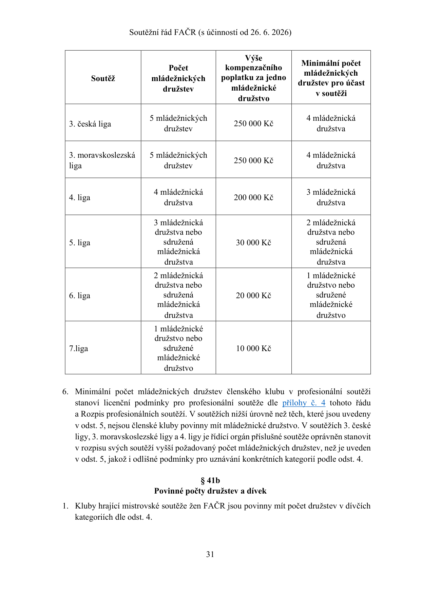

<a id="pdf-032"></a>

## PDF strana 32 / tištěná strana 32

[PDF, strana 32](sources/soutezni-rad-facr-2026-06-26.pdf#page=32)

```text
2. V případě nižšího počtu dívčích družstev klubu 1. a 2. ligy žen, než je stanovený
   minimální počet dívčích družstev klubu pro příslušnou soutěž, nebude družstvo klubu
   oprávněno účastnit se příslušné soutěže.
3. Stanovený počet dívčích družstev je počtem dívčích družstev v různých věkových
   kategoriích, přičemž do tohoto počtu se započítává i případné sdružené dívčí družstvo.
4. Počet dívčích družstev, výše kompenzačního poplatku za jedno dívčí a minimální počet
   dívčích nebo mládežnických družstev pro účast v soutěži jsou stanoveny pro příslušné
   soutěže žen takto:

                                                        Výše
                                   Počet           kompenzačního    Minimální počet dívčích
          Soutěž                  dívčích           poplatku za             družstev
                                 družstev            jedno dívčí       pro účast v soutěži
                                                      družstvo

                              3 dívčí družstva
                                                                         3 dívčí družstva
                             (dorostenky, starší
        1. liga žen                                nelze vykoupit   (dorostenky, starší žákyně,
                               žákyně, mladší
                                                                         mladší žákyně)
                                  žákyně)

                                2 dívčí nebo
                                                                    2 dívčí nebo sdružená
                             sdružená družstva
        2. liga žen                                nelze vykoupit   družstva (dorostenky a
                               (dorostenky a
                                                                    starší žákyně)
                               starší žákyně)


     3. česká liga žen        1 dívčí družstvo       40 000 Kč           není povinnost


                           1 dívčí družstvo
  3. moravskoslezská liga
                          nebo kombinované           40 000 Kč           není povinnost
           žen
                               družstvo


        4. liga žen            není povinnost          0 Kč              není povinnost


                                          § 42
                                Účast cizinců v družstvu
1. V soutěžním utkání je za družstvo oprávněn nastoupit nejvýše 1 hráč, který není
   občanem členského státu Evropské unie, Evropského hospodářského prostoru nebo
   kandidátských zemí Evropské unie.
2. Rozpis soutěží může obsahovat ustanovení, které stanoví vyšší počet hráčů dle odst. 1,
   kteří jsou za družstvo oprávněni nastoupit.
```

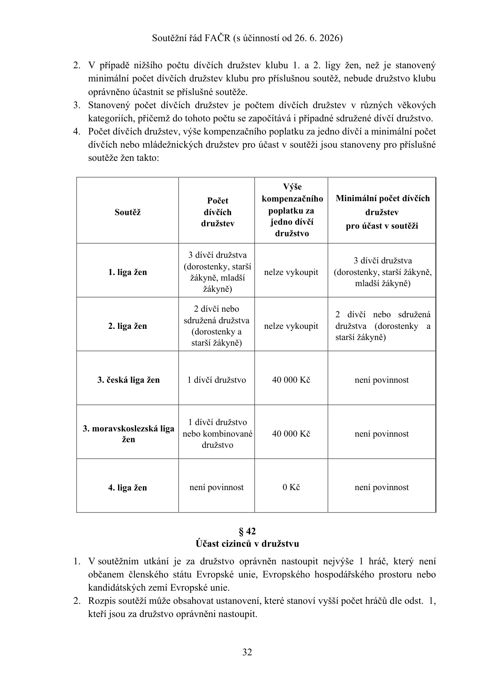

<a id="pdf-033"></a>

## PDF strana 33 / tištěná strana 33

[PDF, strana 33](sources/soutezni-rad-facr-2026-06-26.pdf#page=33)

### § 42a

Status hráčů v profesionálních soutěžích

1. V profesionální soutěži smí nastoupit k soutěžnímu utkání pouze ligoví profesionální hráči.

2. Kromě ligových profesionálních hráčů smí nastoupit k soutěžnímu utkání:

a) 1. ligy nejvýše 3 hráči, kteří nejsou ligovými profesionálními hráči;

b) 2. ligy nejvýše 5 hráčů, kteří nejsou ligovými profesionálními hráči.

3. Amatérský hráč nebo standardní profesionální hráč je oprávněn nastoupit pouze do soutěžních utkání profesionální soutěže, která náleží do té části soutěžního ročníku, v níž nastoupil v soutěžním utkání profesionální soutěže:

a) v rámci 1. ligy nejvýše po dobu 6 měsíců ode dne jeho prvního nastoupení do soutěžního utkání 1. ligy;

b) v rámci 2. ligy nejvýše po dobu 12 měsíců ode dne jeho prvního nastoupení do soutěžního utkání 2. ligy. Omezení dle tohoto odstavce 3 se neuplatní ve vztahu k hráčům ve věku do 21 let, kteří mohou v rámci limitu stanoveného v odstavci 2 nastupovat k soutěžním utkáním bez ligové profesionální smlouvy.

4. Ustanovení odstavců 2 a 3 neplatí s dále uvedenou výjimkou pro amatérského hráče nebo standardního profesionálního hráče, který již byl ligovým profesionálním hráčem nebo hráčem, který již byl profesionálním hráčem podle předpisů zahraniční asociace. Takový hráč není oprávněn bez ligové profesionální smlouvy k soutěžnímu utkání v profesionální soutěži nastoupit, ledaže se jedná o hráče, který v daném soutěžním ročníku dovršil nebo dovrší 24. rok svého věku. Takový hráč je v rámci limitu stanoveného v odstavci 2 oprávněn nastoupit k soutěžnímu utkání v profesionální soutěži i bez ligové profesionální smlouvy, a to po dobu uvedenou v odstavci 3 s tím, že pro tyto účely se za první nastoupení do soutěžního utkání dané profesionální soutěže považuje první nastoupení poté, kdy k tomu byl na základě předchozí věty tohoto odstavce oprávněn.

5. Přestoupí-li či uskuteční-li hostování hráč do členského klubu, jehož družstvo se účastní profesionální soutěže, mimo přestupní období uvedené v § 2 odst. 1 písm. w) Přestupního řádu, a působí-li v tomto členském klubu jako amatérský nebo standardní profesionální hráč, nesmí nastoupit v příslušné části soutěžního ročníku, ve kterém se takový přestup či hostování uskutečnilo, v žádném soutěžním utkání za družstvo účastnící se profesionální soutěže. Pro účely tohoto ustanovení se za podzimní část soutěžního ročníku považuje období od 1. 7. do 31. 12. kalendářního roku a za jarní částí soutěžního ročníku období od 1. 1. do 30. 6. kalendářního roku.

6. Nastoupení hráče v rozporu s odst. 2 až 5 není neoprávněným startem v utkání podle § 50 odst. 1 Disciplinárního řádu ani neoprávněným nastoupením hráče podle § 69 odst. 1 či 2 Disciplinárního řádu, je však disciplinárním přečinem podle § 69 odst. 3 Disciplinárního řádu.

<a id="pdf-034"></a>

## PDF strana 34 / tištěná strana 34

[PDF, strana 34](sources/soutezni-rad-facr-2026-06-26.pdf#page=34)

### § 42b

Pravidla pro nastupování hráčů licenčních klubů v nižších soutěžích

1. Hráči, kteří nastoupili v průběhu soutěžního ročníku v mistrovském utkání v soutěžích řízených LFA na dobu minimálně 45 minut (nastavená doby hry se nezapočítává), nejsou oprávněni nastoupit ve dvou nejbližších utkáních ostatních družstev mužů licenčního klubu v mistrovských soutěžích od 2. do 10. ligy a zároveň v žádném soutěžním utkání, které se uskuteční v nejbližším reprezentačním termínu FIFA.

2. Doba, kdy hráči nebudou oprávněni k utkání nastoupit podle odst. 1, uplyne nejpozději po 18 dnech od posledního nastoupení hráče v soutěžích řízených LFA.

3. Hráči, kteří nastoupili v jednom z posledních dvou mistrovských utkání družstva mužů licenčního klubu v soutěži řízené LFA v příslušném soutěžním ročníku na dobu minimálně 45 minut (nastavená doba hry se nezapočítává), nejsou oprávněni nastoupit ve zbývajících utkáních ostatních družstev mužů licenčního klubu v mistrovských soutěžích od 2. do 10. ligy do konce příslušného soutěžního ročníku.

4.     Pravidla uvedená v odst. 1 – 3 se neuplatní na hráče, kteří k 1.7. příslušného soutěžního ročníku nedovršili 23 let věku.

5.     Na hráče podle odst. 1 – 4 se neuplatní pravidlo o soupiskách podle § 10 tohoto řádu a omezení počtu hráčů oprávněných startovat v jednom soutěžním utkání podle § 10 odst. 8 tohoto řádu.

### § 43

Práva a povinnosti členského klubu

1. Členský klub je povinen:

a) podat ve stanoveném termínu přihlášku družstva do příslušné soutěže, jakož i uhradit stanovenou výši startovného;

b) zajistit, aby družstvo členského klubu dohrálo soutěž, do které bylo přihlášeno;

c) uvolňovat hráče pro účely státní reprezentace ve všech věkových kategoriích v souladu s přílohou č. 5 tohoto řádu;

d) mít trenéra s trenérskou licencí podle Řádu trenérů;

e) mít registrovaného alespoň jednoho administrátora členského klubu;

f) dodržovat předpisy FAČR a jejích pobočných spolků;

g) mít k dispozici prohlášení hráče o své zdravotní způsobilosti;

h) do zápisu o utkání uvést pouze hráče oprávněné startovat v utkání a ostatní příslušníky družstva oprávněné vykonávat funkce, v níž jsou v zápise o utkání uvedeni;

i) umožnit nastoupení k utkání pouze hráčům uvedeným v zápise o utkání;

j) hrát soutěžní utkání pouze na hřištích s travnatou hrací plochou; to neplatí, je-li členskému klubu udělena výjimka dle § 6 odst. 5;

k) hrát soutěžní utkání pouze na hřišti schváleném řídícím orgánem soutěže dle Pravidel fotbalu;

l) hrát soutěžní utkání pouze pod umělým osvětlením schváleným řídícím orgánem soutěže;

<a id="pdf-035"></a>

## PDF strana 35 / tištěná strana 35

[PDF, strana 35](sources/soutezni-rad-facr-2026-06-26.pdf#page=35)

m) mít odpovídající výpočetní techniku s internetovým připojením pro účely přístupu a administrace v informačním systému FAČR;

n) hrát domácí soutěžní utkání na hřišti, které schválil příslušný řídící orgán soutěže.

### § 44

Práva a povinnosti hráčů

1. Hráči jsou povinni:

a) chovat se na hrací ploše i mimo ni ukázněně;

b) respektovat rozhodnutí a pokyny rozhodčích, delegáta a členů pořadatelské služby;

c) dodržovat Pravidla fotbalu a předpisy FAČR nebo jejích pobočných spolků;

d) podřídit se rozhodnutím a opatřením orgánů a komisí FAČR nebo jejích pobočných spolků;

e) v případě výzvy se dostavit k dopingové kontrole.

2. Hráči jsou oprávněni startovat a nastupovat v soutěžních utkáních pouze za členský klub, ve kterém jsou registrováni podle Registračního řádu FAČR. Tím nejsou dotčena ustanovení § 9 přílohy č. 2 tohoto řádu o sdruženém družstvu.

3. V utkáních kategorií přípravek a mladších žáků je povoleno hrát pouze v odpovídající obuvi opatřené kolíky pevně spojenými s podrážkou, popřípadě s jinou sportovní obuví.

4. Hráči starších žáků a mladší žáci nastupující v kategorii starších žáků jsou oprávněni hrát v obuvi s vyměnitelnými kolíky.

### § 45

Míč

1. Organizátor utkání je povinen zajistit v mistrovských utkáních minimálně 5 hracích míčů.

2. V utkáních mladší přípravky je povolen ke hře pouze míč č. 3, jehož obvod je 57-62 cm a jehož hmotnost činí 250-310 g.

3. V utkáních starší přípravky je ke hře povolen ke hře míč č. 4, jehož obvod je 63-66 cm a jehož hmotnost činí 290-390 g, případně míč č. 3, jehož obvod je 57-62 cm a jehož hmotnost činí 250-310 g.

4. V utkáních mladších žáků je povoleno použít ke hře pouze míč č. 4, jehož obvod je 63-66 cm a jehož hmotnost činí 290-390 g.

5. V utkáních starších žáků je povoleno použít ke hře pouze míč č. 5, jehož obvod je 68-70 cm a jehož hmotnost činí 410-450 g.

### § 46

Lékařská prohlídka

1. Každý hráč je povinen zabezpečit si ve svém vlastním zájmu a na své náklady informaci o své zdravotní způsobilosti ke hraní fotbalu. U hráčů mladších 18 let má tuto povinnost jejich zákonný zástupce.

<a id="pdf-036"></a>

## PDF strana 36 / tištěná strana 36

[PDF, strana 36](sources/soutezni-rad-facr-2026-06-26.pdf#page=36)

2. V případě zdravotní způsobilosti pro hraní fotbalu je hráč povinen vlastnoručně podepsat prohlášení následujícího znění: „Prohlašuji na základě lékařského posouzení svého zdravotního stavu, že jsem způsobilý absolvovat fyzickou zátěž fotbalových tréninků a utkání bez nebezpečí poškození svého zdraví.“

3. Prohlášení dle odst. 2 musí být opatřeno datem a nesmí být starší než 1 rok. Kluby jsou povinny mít k dispozici prohlášení všech svých hráčů. Kontrolu prohlášení podle předchozí věty provádějí řídicí orgány soutěží, které v případě nedostatků (prohlášení s uplynulou dobou, chybějící prohlášení hráčů) jsou oprávněny postihnout členský klub pořádkovou pokutou.

### § 47

Odpovědnost hráče za výstroj

1. Hráč nebo jeho zákonný zástupce či opatrovník odpovídá za výstroj, která musí být v souladu s Pravidly fotbalu. V utkání mládežnických kategorií odpovídá za správnou výstroj i vedoucí družstva.

2. O přípustnosti výstroje rozhoduje rozhodčí utkání.

### § 48

Organizátor utkání

1. Organizátorem utkání je členský klub, který je v zápisu o utkání uveden na prvním místě.

2. Organizátor utkání je povinen sehrát utkání na hřišti, jež v přihlášce do soutěže označil jako hřiště vlastní, nestanoví-li řídící orgán soutěže jinak.

3. Organizátor utkání je povinen zajistit on-line vysílání utkání:

a) jde-li o utkání kategorie mužů, a

b) jde o utkání: i. 3. české ligy nebo 3. moravskoslezské ligy; ii. 4. ligy; iii. 5. ligy, stanoví-li tak rozpis soutěží; přičemž bližší práva a povinnosti organizátora utkání ve vztahu k povinnosti podle tohoto odst. stanoví rozpis soutěží.

4. V případě, kdy organizátor utkání není z důvodu výpadku techniky schopen zajistit on-line vysílání dle odst. 3, je povinen nejpozději do 48 hodin od odehrání utkání zaslat řídícímu orgánu soutěže záznam utkání.

### § 49

Hlavní pořadatel

1. Hlavním pořadatelem je fyzická osoba starší 18 let, člen FAČR, která je spolu s organizátorem utkání odpovědná za splnění technických a pořádkových povinnosti organizátora utkání a je povinna respektovat pokyny rozhodčího, případně delegáta utkání k řádnému zajištění pořadatelské služby.

2. Hlavní pořadatel je povinen být označen nápisem „Hlavní pořadatel“, kdy takové označení musí být výrazně odlišné od označení ostatních pořadatelů.

<a id="pdf-037"></a>

## PDF strana 37 / tištěná strana 37

[PDF, strana 37](sources/soutezni-rad-facr-2026-06-26.pdf#page=37)

3. Je zakázáno, aby hlavní pořadatel vykonával současně funkci rozhodčího utkání, delegáta utkání nebo příslušníka družstva.

### § 50

Pořadatelská služba

1. Pořadatelská služba je složena z fyzických osob starších 18 let, které jsou poučeny o svých právech a povinnostech hlavním pořadatelem.

2. Pořadatelská služba je zpravidla tvořena:

a) hlavním pořadatelem;

b) zástupcem hlavního pořadatele;

c) pořadateli;

d) pokladníky;

e) zdravotní službou (lékařem či zdravotníkem);

f) hlasatelem;

g) obsluhou umělého osvětlení;

h) videotechnikem;

i) bezpečnostním manažerem.

3. Minimální počet členů pořadatelské služby stanoví pro jednotlivé soutěže příslušný řídící orgán soutěže v rozpisu soutěží.

4. Členové pořadatelské služby jsou povinni být označeni výrazným a nezaměnitelným způsobem.

### § 51

Odpovědnost za porušení povinností pořadatelské služby Za nesplnění nebo porušení povinností pořadatelské služby odpovídá organizátor utkání a hlavní pořadatel.

Díl 5

Organizace nemistrovských soutěží

### § 52

Nemistrovské soutěže a přátelská utkání

1. Pro nemistrovské soutěže a přátelská utkání se použijí ustanovení řádu přiměřeně.

2. Na nemistrovské soutěže a přátelská utkání se nevztahují ustanovení o právech a povinnostech členů FAČR, které se vztahují k informačnímu systému FAČR.

3. Konání přátelského utkání jsou kluby povinny nahlásit příslušné komisi rozhodčích nebo příslušnému řídícímu orgánu soutěže, jehož soutěže se účastní družstvo mužů do úrovně ŘKM a ŘKČ.

4. Členské kluby účastnící se svými družstvy mužů soutěží ŘKČ a ŘKM jsou povinny informovat sekretariát FAČR o skutečnosti, že v přátelském utkání za jejich družstvo

<a id="pdf-038"></a>

## PDF strana 38 / tištěná strana 38

[PDF, strana 38](sources/soutezni-rad-facr-2026-06-26.pdf#page=38)

nastupuje hráč, který není členem FAČR s tím, že sdělí sekretariátu FAČR jméno, příjmení, datum narození a státní příslušnost takového hráče.

5.   Řídící orgány soutěží jsou oprávněny stanovit podrobnější podmínky organizace nemistrovských soutěží a přátelských utkání.

6.   Propozice nemistrovských soutěží a přátelská utkání schvaluje řídící orgán soutěže, jehož soutěže se účastní družstvo účastnící se nejvyšší soutěže.

7.   Organizátor nemistrovské soutěže je povinen zaslat schválené propozice všem zúčastněným klubům.

8.   Nemistrovské soutěže a přátelská utkání do úrovně 5. ligy je možné konat pouze za účasti rozhodčího s licencí FAČR. Nemistrovské soutěže a přátelská utkání řídí zpravidla rozhodčí s licencí odpovídající mistrovské soutěži, v níž nastupuje nejvýše startující družstvo účastnící se utkání. Odměna rozhodčímu odpovídá mistrovské soutěži, které se účastní družstvo organizátora utkání.

9.   Nemistrovské soutěže a přátelská utkání mezi mládežnickými družstvy mohou řídit rozhodčí s jakoukoliv licencí podle požadavku organizátora utkání.

ČÁST DRUHÁ

ZVLÁŠTNÍ ČÁST

HLAVA I

PRÁVA A POVINNOSTI ČLENŮ FAČR

### § 53

Působnost Podle ustanovení této hlavy se postupuje do zahájení soutěžního utkání dle výkladu Pravidel fotbalu.

### § 54

Technické povinnosti organizátora utkání

1.        Organizátor utkání je povinen:

a)   připravit vybavení k utkání a vyznačit hrací plochu dle Pravidel fotbalu;

b)   poskytnout za účelem vyplnění zápisu o utkání nejpozději 60 minut před plánovaným začátkem soutěžního utkání výpočetní techniku s připojením k internetu v kabině rozhodčích, nestanoví-li rozpis soutěží lhůtu delší;

c)   mít k dispozici formulář zápisu o utkání, píšťalku, červenou a žlutou kartu, hodinky, minci na losování a praporky pro asistenty rozhodčího;

d)   zajistit pro soupeře a rozhodčí nejpozději 60 minut před plánovaným začátkem soutěžního utkání čisté, dostatečně velké, uzamykatelné, v chladných dnech vytápěné šatny, které jsou vybaveny věšáky a umožnit jim řádně se umýt;

<a id="pdf-039"></a>

## PDF strana 39 / tištěná strana 39

[PDF, strana 39](sources/soutezni-rad-facr-2026-06-26.pdf#page=39)

e) vyhradit pro delegáta utkání, případně další delegované osoby místo, z něhož budou mít dobrý rozhled na hrací plochu a celý prostor hřiště;

f) zajistit zdravotní službu s potřebným vybavením pro první pomoc. Za poskytnutí první pomoci v době utkání odpovídá osoba, jejíž jméno, příjmení a ID se uvádí v zápisu o utkání. Zdravotní služba je povinna poskytnout první pomoc jak divákům, tak příslušníkům obou družstev, nemají-li vlastního lékaře či zdravotníka;

g) poskytnout vhodné prostory pro výkon antidopingové kontroly;

h) informovat prostřednictvím rozhlasu o činnostech obou klubů;

i) prostřednictvím rozhlasu vyzývat k pořádku a klidu v hledišti;

j) poskytnout vhodné občerstvení delegovaným osobám v poločase utkání;

k) zajistit přítomnost člena pořadatelské služby před kabinou rozhodčích;

l) poskytnout místo k parkování dopravních prostředků delegovaných osob; organizátor utkání odpovídá za škodu způsobenou na dopravním prostředku umístěném na místě k tomu určeném;

m) zajistit bezpečné uložení osobních věcí příslušníků družstev a delegovaných osob v šatnách a v případě žádosti zabezpečit úschovu peněz a cenností příslušníků družstev a delegovaných osob;

n) umožnit pořízení audio – video záznamu nebo obdobného záznamu utkání řídicímu orgánu soutěže a hostujícímu družstvu pro vlastní nekomerční účely;

o) zajistit včasné otevření pokladen podle povahy utkání;

p) zajistit označení cen vstupenek na viditelném místě;

q) zajistit osobám s řádně zakoupenou vstupenkou nebo průkazem opravňujícím ke vstupu vstup do prostorů stadionu a hlediště;

r) zajistit instalaci a řádný chod turniketů, pokud tak stanoví rozpis soutěží;

s) zabezpečit řádný technický stav umělého osvětlení, včetně provozu náhradních osvětlení a zdrojů elektrické energie při dodržení všech provozních předpisů; za osobu zajišťující obsluhu a opravu v době utkání odpovídá hlavní pořadatel;

t) zajistit vhodné osoby pro výkon funkce rozhodčích v případě, že rozhodčí nejsou delegováni nebo pokud se nedostaví;

u) zajistit pořadatelskou službu v potřebném počtu a kvalitě podle kategorií utkání či rozpisu soutěží, a to tak, aby pořadatelská služba vykonávala své povinnosti od okamžiku počátku soustřeďování diváků až do doby jejich odchodu ze stadionu;

v) zpracovat a řídicímu orgánu soutěže předložit řád pořadatelské služby, případně plnit další povinnosti, pokud to vyplývá z rozpisu soutěží.

### § 55

Pořádkové povinnosti organizátora utkání

1. Organizátor utkání je povinen:

a) neumožnit přístup do prostoru stadionu osobám podnapilým, ozbrojeným či osobám vnášejícím předměty, kterými by mohly ohrozit život nebo zdraví ostatních účastníků utkání;

<a id="pdf-040"></a>

## PDF strana 40 / tištěná strana 40

[PDF, strana 40](sources/soutezni-rad-facr-2026-06-26.pdf#page=40)

b) zabezpečit zákaz vstupu do ohraničeného prostoru hřiště (u neohraničených hřišť se za prostor hřiště považuje vzdálenost dvou metrů od pomezních čar a čtyř metrů od brankových čar) všem osobám vyjma: i.    rozhodčích a příslušníků družstva; ii.   členů pořadatelské služby; iii. příslušníků policie či pořádkových služeb; iv.   podavačů míčů, resp. dalších osob oprávněných ke vstupu na základě řádu pořadatelské služby či jiných předpisů; v.    fotoreportérů, rozhlasových, televizních a filmových pracovníků na základě povolení organizátora utkání;

c) umožnit vstup na hrací plochu v průběhu utkání jen hráčům a rozhodčím; další osoby mohou vstoupit na hrací plochu jen se souhlasem rozhodčího;

d) neumožnit do kabiny rozhodčího přístup žádné osobě kromě delegátů utkání s tím, že pouze po výslovně projeveném souhlasu rozhodčího může být umožněn přístup do kabiny rozhodčího také vedoucím družstev, hlavnímu pořadateli a zdravotní službě.

2. Organizátor utkání odpovídá za to, že na hřiště nebudou vhazovány žádné předměty a že v hledišti nebude docházet k výtržnostem, rvačkám či k verbálním projevům hanobícím příslušnost k rase, národu, etniku či k jiným projevům porušování občanského soužití.

### § 56

Práva a povinnosti družstev Družstva jsou povinna se dostavit k utkání tak, aby nebyla čerpána čekací doba.

### § 57

Práva a povinnosti vedoucího družstva Vedoucí družstva je před začátkem utkání oprávněn:

a) vyžádat u rozhodčího provedení kontroly totožnosti hráčů a náhradníků soupeřova družstva a této kontroly se zúčastnit;

b) opsat si údaje uvedené v zápisu o utkání, pokud je zápis o utkání vyplněn ručně do tištěného formuláře.

### § 58

Čekací doba

1. Čekací doba pro obě družstva a delegovaného rozhodčího je 20 minut po úředně stanoveném začátku utkání a je možné ji čerpat pouze z důvodů zvláštního zřetele hodných. Čekací dobu není možné čerpat z důvodů stojících na straně asistentů rozhodčího nebo čtvrtého rozhodčího utkání.

2. K posouzení, zda byla dodržena čekací doba, je příslušný rozhodčí.

3. Řídící orgán soutěže je oprávněn stanovit zákaz čerpání čekací doby, a to v soutěžních utkáních, které v zájmu regulérnosti průběhu soutěže nařídí sehrát ve shodném úředně stanoveném začátku utkání.

<a id="pdf-041"></a>

## PDF strana 41 / tištěná strana 41

[PDF, strana 41](sources/soutezni-rad-facr-2026-06-26.pdf#page=41)

4. Oznámí-li družstvo organizátorovi utkání v průběhu čerpání čekací doby podle odst. 1, že se dostaví a utkání bude možné zahájit nejpozději 40 minut po úředně stanoveném začátku utkání, prodlužuje se čekací doba o dalších 20 minut. Prodlouženou čekací dobu lze čerpat pouze z důvodů zcela nezávislých na osobě, která čekací dobu čerpá.

5. Má-li být nebo hraje-li se utkání s použitím umělého osvětlení, je v případě poruchy na zařízení či přerušení dodávky proudu ze sítě organizátor utkání oprávněn čerpat čekací dobu v délce 60 minut. Čerpá-li se v jednom utkání čekací doba opakovaně, nesmí čekací doba v součtu trvat déle než 60 minut.

6. Členský klub, jehož družstvo čerpalo čekací dobu, je povinen bez zbytečného odkladu, nejpozději však do tří dnů prokázat řídícímu orgánu soutěže důvody čerpání čekací doby. Delegovaný rozhodčí, který čerpal čekací dobu, je povinen bez zbytečného odkladu, nejpozději však do tří dnů, prokázat komisi rozhodčích, která jej k utkání delegovala, důvody čerpání čekací doby.

7. Nedostaví-li se družstvo k utkání v průběhu čekací doby, je povinno organizátoru utkání nebo družstvu soupeře nahradit náklady spojené s neodehraným utkáním ve výši určené řídícím orgánem soutěže.

### § 59

Nedostavení se delegovaného rozhodčího

1. Jsou-li v okamžiku uplynutí čekací doby přítomna obě družstva v prostorách hřiště, jsou družstva povinna utkání sehrát, a to i v případě, že se delegovaný rozhodčí nedostavil.

2. Nedostaví-li se delegovaný rozhodčí v čekací době, převezme řízení utkání delegovaný asistent rozhodčího podle pořadí delegace. Nejsou-li asistenti rozhodčího k utkání delegováni a je-li přítomen jiný kvalifikovaný rozhodčí, je povinen se na vyzvání přihlásit a utkání řídit. Přihlásí-li se více kvalifikovaných rozhodčích, převezme řízení utkání rozhodčí, který je zařazen na nominační listině vyšší soutěže.

3. Není-li na hřišti přítomen žádný delegovaný ani kvalifikovaný rozhodčí, jsou oba vedoucí družstev povinni dohodnout se na oddílovém rozhodčím starším 18 let a za jeho řízení utkání sehrát. V případě, že se nedohodnou, navrhnou členské kluby každý svého kandidáta a o oddílovém rozhodčím se rozhodne losem za přítomnosti obou navržených kandidátů. Dohoda, případně výsledek losování, musí být již před utkáním uvedena v zápisu o utkání. Ustanovení předchozí věty o uvedení dohody, případně výsledku losování, v zápisu o utkání již před utkáním neplatí pro utkání kategorie přípravek.

4. Řídí-li utkání za delegovaného rozhodčího delegovaný asistent rozhodčího nebo jiný kvalifikovaný rozhodčí, řídí utkání až do konce, i kdyby se delegovaný rozhodčí opožděně dostavil. V takovém případě delegovaný rozhodčí převezme funkci asistenta rozhodčího v případě, že tuto funkci vykonává oddílový asistent rozhodčího; od kvalifikovaného rozhodčího funkci nepřebírá.

5. Dostaví-li se delegovaný rozhodčí k utkání, které převzal a řídí oddílový rozhodčí, převezme delegovaný rozhodčí po zjištění všech skutečností řízení utkání a v utkání se pokračuje.

6. Nedostaví-li se k utkání delegovaný asistent rozhodčího a je-li na hřišti přítomen jiný kvalifikovaný rozhodčí, je povinen se na vyzvání pořadatele dostavit a funkci asistenta rozhodčího převzít. Přihlásí-li se více kvalifikovaných rozhodčích, převezme funkci

<a id="pdf-042"></a>

## PDF strana 42 / tištěná strana 42

[PDF, strana 42](sources/soutezni-rad-facr-2026-06-26.pdf#page=42)

asistenta rozhodčího, který je zařazen na nominační listině vyšší soutěže. Není-li žádný kvalifikovaný rozhodčí k dispozici, zajistí se pro výkon funkce oddílového asistenta rozhodčího vhodná a pravidel znalá osoba podle Pravidel fotbalu.

7. Dostaví-li se delegovaný asistent rozhodčího opožděně, převezme funkci asistenta rozhodčího pouze za oddílového asistenta rozhodčího; za kvalifikovaného rozhodčího funkci asistent rozhodčího nepřebírá.

8. Kvalifikovaní nebo oddíloví rozhodčí, ať již nastoupí k výkonu funkce rozhodčího či asistenta rozhodčího, mají všechna práva a povinnosti delegovaných rozhodčích, vyjma nároku na odměnu dle přílohy Řádu rozhodčích a delegátů v případě oddílových rozhodčích, s tím, že utkání nemusí řídit v předepsaném úboru.

9. Při nedostavení se delegovaných rozhodčích je delegovaný delegát povinen učinit opatření k tomu, aby bylo utkání řízeno v souladu s výše uvedenými ustanoveními, případně smí převzít funkci rozhodčího.

10. V případě nedostavení se delegovaných rozhodčích odpovídá za řádné vyplnění a odeslání zápisu o utkání nejpozději do 12. hodiny dne následujícího po sehrání utkání organizátor utkání; v případě vyplnění zápisu o utkání v písemné formě, doručí organizátor utkání zápis o utkání řídícímu orgánu soutěže do 48 hodin po skončení utkání.

11. Pokud není delegovaný rozhodčí dále schopen řídit utkání, postupuje se obdobně podle odst. 1 až 10 a Řádu rozhodčích a delegátů FAČR.

12. Kvalifikovaným ani oddílovým rozhodčím nesmí být příslušník družstva podle § 35 odst. 1.

### § 60

Práva a povinnosti rozhodčího utkání před zahájením utkání Delegovaný rozhodčí je povinen:

a) dostavit se nejméně 60 minut před úředně stanoveným začátkem utkání na místo, které organizátor utkání uvedl jako místo konání utkání, není-li v rozpisu soutěží stanoveno jinak;

b) provést kontrolu hrací plochy a vybavení hřiště a rozhodnout, zda hrací plocha je řádně připravena a je způsobilá k odehrání utkání; při rozhodování postupuje podle Pravidel fotbalu a současně musí dbát na bezpečnost a zdraví příslušníků družstev;

c) zkontrolovat, zda nebylo překročeno čerpání čekací doby;

d) provést kontrolu výstroje hráčů obou družstev;

e) vyplnit zápis o utkání;

f) dodržet hrací dobu;

g) zahájit utkání v úředně stanoveném začátku, při respektování ustanovení o čekací době;

h) omluvit se bez zbytečného odkladu z řízení utkání komisi rozhodčích, jakmile nastanou skutečnosti bránící mu dostavit se k utkání.

<a id="pdf-043"></a>

## PDF strana 43 / tištěná strana 43

[PDF, strana 43](sources/soutezni-rad-facr-2026-06-26.pdf#page=43)

### § 61

Práva a povinnosti delegáta Delegát je povinen:

a) dostavit se nejméně 60 minut před úředně stanoveným začátkem utkání na místo, které organizátor utkání uvedl jako místo konání utkání, není-li v rozpisu soutěží stanoveno jinak;

b) dohlížet na dodržování předpisů FAČR a jejích pobočných spolků a v případě zjištěných nedostatků přijímat opatření k zajištění nápravy;

c) sledovat chování hráčů, trenérů, funkcionářů, diváků a rozhodčích a v případě nutnosti vyzvat organizátora utkání prostřednictvím hlavního pořadatele k zajištění klidu a pořádku v prostoru hřiště a hlediště až do doby, kdy účastníci utkání bezpečným způsobem opustí prostor hřiště a hlediště;

d) na žádost vedoucího družstva hostujícího klubu a rozhodčího vyzvat organizátora utkání prostřednictvím hlavního pořadatele k zajištění policejního doprovodu až na hranice obce, v případě vážného narušení pořádku s ohledem na závažnost situace;

e) sledovat před utkáním, v průběhu utkání i po jeho skončení všechny události související s utkáním a pravdivě je uvést ve zprávě delegáta o utkání.

### § 62

Příprava zápisu o utkání

1. Administrátor organizátora utkání s právy pro elektronický zápis o utkání vyplní v zápise o utkání nejpozději 15 minut před úředně stanoveným začátkem utkání:

a) jméno, příjmení a ID hlavního pořadatele utkání;

b) jméno, příjmení a ID vedoucího družstva;

c) jméno, příjmení a ID trenéra družstva v případech podle odst. 3, v ostatních případech je-li přítomen;

d) jméno, příjmení a ID asistenta trenéra č. 1 družstva, je-li přítomen;

e) jméno, příjmení a ID asistenta trenéra č. 2 družstva, je-li přítomen;

f) jméno, příjmení a ID trenéra brankářů družstva, je-li přítomen;

g) jméno, příjmení a ID kondičního trenéra, je-li přítomen;

h) jméno, příjmení a ID lékaře/zdravotníka družstva, je-li přítomen;

i) jméno, příjmení a ID maséra družstva, je-li přítomen; nejvýše však 8 osob;

j) sestavu, přičemž nejvýše 7 hráčů (v případě profesionálních soutěží a 1. ligy žen nejvýše 11 hráčů) může být uvedeno mezi náhradníky, čísla hráčů a jejich ID;

k) z hráčů v základní sestavě kapitána družstva.

2. Administrátor hostujícího družstva s právy pro elektronický zápis o utkání vyplní v zápise o utkání nejpozději 15 minut před úředně stanoveným začátkem utkání:

a) jméno, příjmení a ID vedoucího družstva;

b) jméno, příjmení a ID trenéra družstva, je-li přítomen;

c) jméno, příjmení a ID asistenta trenéra č. 1 družstva, je-li přítomen;

d) jméno, příjmení a ID asistenta trenéra č. 2 družstva, je-li přítomen;

e) jméno, příjmení a ID trenéra brankářů družstva, je-li přítomen;

<a id="pdf-044"></a>

## PDF strana 44 / tištěná strana 44

[PDF, strana 44](sources/soutezni-rad-facr-2026-06-26.pdf#page=44)

f)   jméno, příjmení a ID kondičního trenéra, je-li přítomen;

g)   jméno, příjmení a ID lékaře/zdravotníka družstva, je-li přítomen;

h)   jméno, příjmení a ID maséra družstva, je-li přítomen; nejvýše však 7 osob;

i)   sestavu, přičemž nejvýše 7 hráčů (v případě profesionálních soutěží a 1. ligy žen nejvýše 11 hráčů) může být uvedeno mezi náhradníky, čísla hráčů a jejich ID;

j) z hráčů v základní sestavě kapitána družstva.

3. V případě, že se družstvo účastní soutěže podle:

a) § 11 odst. 1 písm. a) – e);

b) § 11 odst. 2 písm. a) – e);

c) § 11 odst. 3 písm. a) – e);

d) § 11 odst. 4 písm. a) – h);

e) § 11 odst. 5 písm. a) – f); musí být v zápise o utkání podle vždy uveden trenér družstva.

4. Rozhodčí utkání nejdříve 15 minut před úředně stanoveným začátkem utkání zkontroluje údaje vyplněné administrátory klubů v zápise o utkání a na základě sdělení vedoucích družstev opraví případné nedostatky v zápise o utkání. Před odchodem na hrací plochu je rozhodčí povinen uložit případné provedené změny v zápise o utkání a odhlásit se z informačního systému FAČR.

5. V zápisu o utkání 1. a 2. ligy nesmí být uveden žádný člen FAČR, který je zároveň členem statutárního či kontrolního orgánu klubu. Dále zde nesmí být uveden generální manažer klubu, sportovní ředitel klubu, sportovní manažer klubu či osoby v obdobném postavení. Řídící orgán soutěže může udělit výjimku z tohoto omezení v případě, že daná osoba vykonává funkci trenéra družstva.

HLAVA II

PRÁVA A POVINNOSTI ČLENŮ FAČR V PRŮBĚHU UTKÁNÍ

### § 63

Působnost Podle ustanovení této hlavy se postupuje od zahájení soutěžního utkání do ukončení soutěžního utkání dle výkladu Pravidel fotbalu.

### § 64

Zahájení utkání

1. Družstva jsou povinna nastoupit k utkání ve stanovený úřední začátek utkání. Rozhodčí utkání hru zahájí, pokud na hrací ploše je přítomno nejméně 7 hráčů každého družstva, z nichž jeden je kapitán a jeden je brankář, a byl-li řádně vyplněný zápis o utkání.

2. V případě, že družstvo nastoupilo k utkání s menším počtem hráčů než 11, má právo doplnit počet hráčů na 11 kdykoli v průběhu utkání, ale jen když je míč ze hry; hráč je povinen před vstupem na hrací plochu prokázat rozhodčímu svoji totožnost předložením Listiny hráčů nebo karty hráče z IS FAČR, je-li k tomu rozhodčím vyzván. Zápis o utkání je třeba doplnit, případně opravit v poločase utkání nebo ihned po skončení

<a id="pdf-045"></a>

## PDF strana 45 / tištěná strana 45

[PDF, strana 45](sources/soutezni-rad-facr-2026-06-26.pdf#page=45)

utkání. Oprávnění zápis o utkání doplnit, případně opravit má pouze rozhodčí utkání. V případě řízení utkání oddílovým rozhodčím má pravomoc opravit či doplnit zápis o utkání administrátor organizátora utkání.

3. Náhradníci, jejichž jména nebyla zapsána do zápisu o utkání před zahájením utkání, nemohou být do zápisu o utkání doplněni dodatečně.

### § 65

Kapitán družstva

1. Kapitán družstva je povinen:

a) dbát spolu s vedoucím družstva, trenérem a asistentem trenéra družstva na kázeň a pořádek v družstvu;

b) zajistit spolu se svými spoluhráči a ostatními příslušníky družstva bezpečnost a ochranu zdraví rozhodčích a případně i hráčů družstva soupeře, zejména při jejich odchodu do kabin;

c) být označen na levém rukávu páskou podle Pravidel fotbalu;

d) zajistit provedení společného pozdravu družstva s hráči soupeře a rozhodčími.

2. Kapitán družstva je oprávněn dotazovat se podle Pravidel fotbalu rozhodčího na důvody jeho rozhodnutí.

### § 66

Práva a povinnosti rozhodčího během utkání

1. Rozhodčí je povinen do zápisu o utkání uvést v přestávce mezi poločasy průběžný výsledek utkání a střelce branek.

2. Rozhodčí je oprávněn do zápisu o utkání uvést v přestávce mezi poločasy další skutečnosti, zejména udělené tresty, napomenutí, střídání.

3. Rozhodčí je povinen dodržet přestávku v délce 15 minut mezi poločasy, do které se započítává i odchod a návrat hráčů na hrací plochu; ustanovení předchozí věty neplatí, pokud vznikne dohoda obou vedoucích družstev a rozhodčího o kratší délce přestávky mezi poločasy v soutěžních utkáních kategorie mužů.

### § 67

Kontrola totožnosti

1. Kontrolu totožnosti hráčů a náhradníků družstev uvedených v zápisu o utkání je možné uskutečnit buď z iniciativy delegované osoby nebo na žádost vedoucího družstva provést nejdříve 15 minut před úředně stanoveným utkání a nejpozději do schválení zápisu o utkání oběma vedoucími družstev po ukončení utkání..

2. Provádění kontroly totožnosti podle odst. 1 řídí rozhodčí, kterému je vedoucí kontrolovaného družstva povinen předat Listinu hráčů. Kontroly totožnosti jsou povinni se zúčastní kontrolovaní hráči kontrolovaného družstva, vedoucí kontrolovaného družstva a vedoucí družstva soupeře.

3. Po zahájení kontroly totožnosti předá rozhodčí vedoucímu družstva, který o kontrolu totožnosti požádal, Listinu hráčů a následně vedoucí kontrolovaného družstva představuje vedoucímu soupeřova družstva jednotlivé hráče, o jejichž kontrolu

<a id="pdf-046"></a>

## PDF strana 46 / tištěná strana 46

[PDF, strana 46](sources/soutezni-rad-facr-2026-06-26.pdf#page=46)

totožnosti vedoucí soupeřova družstva požádal. Pokud kontrolovaní hráči mají k dispozici doklady prokazující jejich totožnost, předloží je rozhodčímu k nahlédnutí. Rozhodčí je oprávněn klást kontrolovaným hráčům dotazy směřující k ověření jejich totožnosti.

4.   Po skončení kontroly totožnosti rozhodčí:

a) vrátí vedoucí družstva, který o kontrolu totožnosti požádal, rozhodčímu Listinu hráčů a současně mu oznámí, zda namítá neoprávněný start hráče. Tuto skutečnost rozhodčí zapíše do zápisu o utkání; nebo

b) uvede do zápisu o utkání neoprávněný start hráče, který z vlastní iniciativy zjistil.

5.   Je-li namítnut neoprávněný start hráče, rozhodčí přezkoumá totožnost tohoto hráče, a to zejména dle údajů z předložených osobních dokladů. Pokud rozhodčí dospěje k závěru, že se jedná o neoprávněný start, hráče nepřipustí k další účasti ve hře; v opačném případě je hráč oprávněn pokračovat ve hře. Průběh, důvody a výsledek přezkoumání totožnosti hráče rozhodčí zapíše do zápisu o utkání. Pokud je kontrola totožnosti provedena před zahájením utkání a rozhodčí hráče nepřipustí k další účasti ve hře, může tohoto hráče nahradit náhradník a družstvo hraje s plným počtem hráčů. Pokud je kontrola totožnosti provedena v poločasové přestávce a rozhodčí hráče nepřipustí k další účasti ve hře, rozhodčí hráče vyloučí a nemůže ho nahradit náhradník. Družstvo pokračuje ve hře s menším počtem hráčů.

6.   Do schválení zápisu o utkání oběma vedoucími družstev po ukončení utkání je možno provést individuální kontrolu totožnosti pouze těch hráčů, kteří nastoupili v druhém poločase utkání. Ustanovení odst. 2 až 5 se použijí obdobně.

7.   Hráč je povinen podrobit se kontrole a přezkoumání totožnosti. Za účelem provedení kontroly a přezkoumání totožnosti je povinen:

a) hráč, který nastoupil k utkání v průběhu I. Poločasu a již nenastoupil do II. Poločasu utkání, setrvat na stadionu do zahájení II. Poločasu utkání;

b) hráč, který nastoupil k utkání v průběhu II. Poločasu, setrvat na stadionu do potvrzení kontroly zapsaných údajů v zápisu o utkání vedoucími družstev. Za porušení tohoto ustanovení se nepovažuje, jestliže hráč nesetrvá na stadionu z důvodů zvláštního zřetele hodných.

8.   Pokud hráč, jehož přezkoumání totožnosti má být rozhodčím prováděno, neumožní přezkoumání totožnosti, rozhodčí tuto skutečnost výslovně zapíše do zápisu o utkání, včetně důvodů a hráče nepřipustí k další účasti ve hře.

### § 68

Počet hráčů a střídání

1. Střídání a jeho průběh musí být provedeno v souladu s tímto řádem a s Pravidly fotbalu, za což odpovídají rozhodčí a vedoucí družstva.

2. Vystřídaný hráč se smí zdržovat na lavičce pro příslušníky družstva a v ohraničeném prostoru hřiště pouze, je-li řádně ustrojen a označen způsobem, který umožňuje jeho identifikaci podle zápisu o utkání.

3. V případě prodloužení doby hry k určení vítěze utkání se pro takové prodloužení zvyšuje celkový počet možných střídání o jedno.

<a id="pdf-047"></a>

## PDF strana 47 / tištěná strana 47

[PDF, strana 47](sources/soutezni-rad-facr-2026-06-26.pdf#page=47)

4. Opakovaným střídáním se rozumí umožnění opětovného nastoupení kteréhokoliv hráče uvedeného v zápise o utkání i po jeho předchozím vystřídání, přičemž v posledních 10 minutách utkání lze střídat pouze standardním způsobem, a to nejvýše 2 hráče. V utkání přípravek a mladších žáků lze střídat opakovaným způsobem až do konce utkání. Všichni hráči uvedení v zápise o utkání se považují za hráče nastoupivší do utkání, není- li jiným způsobem prokázána jejich neúčast.

5. V profesionálních soutěžích se hraje v počtu hráčů družstva 10+1 a je možno v průběhu soutěžního utkání vystřídat nejvýše 5 hráčů.

6. V neprofesionálních soutěžích mužů se hraje v počtu hráčů družstva 10+1 a v průběhu soutěžního utkání je oprávněno vystřídat nejvýše 5 hráčů. To neplatí, je-li rozpisem soutěží u dané soutěže povoleno opakované střídání. V takovém případě je družstvo v průběhu soutěžního utkání oprávněno vystřídat nejvýše 7 hráčů.

7. V soutěžích dorostu, staršího dorostu a mladšího dorostu se hraje v počtu hráčů družstva 10+1 a v průběhu soutěžního utkání je oprávněno vystřídat 5 hráčů.

8. V soutěžích starších žáků se hraje v počtu hráčů družstva 10+1 a v průběhu soutěžního utkání je oprávněno vystřídat 7 hráčů.

9. V soutěžích mladších žáků se hraje v počtu hráčů družstva 7+1 nebo 8+1 a v průběhu soutěžního utkání je povoleno opakované střídání.

10. V soutěžích starších přípravek se hraje v počtu hráčů družstva 5+1 a v průběhu soutěžního utkání je povoleno opakované střídání.

11. V soutěžích mladších přípravek se hraje v počtu hráčů družstva 4+1 a v průběhu soutěžního utkání je povoleno opakované střídání.

12. V 1. a 2. lize žen se hraje v počtu hráček družstva 10+1 a v průběhu utkání je oprávněno vystřídat 5 hráček, v nižších soutěžích žen se hraje v počtu hráček družstva 10+1 a průběhu utkání je oprávněno vystřídat 7 hráček.

13. V mistrovských soutěžích 1. a 2. ligy dorostenek se hraje v počtu hráček družstva 10+1 a v průběhu utkání je oprávněno vystřídat 7 hráček.

14. V mistrovských soutěžích 3. ligy dorostenek a nižších se hraje v počtu hráček družstva 7+1 a v průběhu soutěžního utkání je povoleno opakované střídání.

15. V mistrovských soutěžích starších žákyň se hraje v počtu hráček družstva 10+1 a v průběhu soutěžního utkání je povoleno opakované střídání.

16. V mistrovských soutěžích mladších žákyň se hraje v počtu hráček družstva 7+1 a v průběhu soutěžního utkání je povoleno opakované střídání.

17. V soutěžích starších přípravek se hraje v počtu hráček družstva 5+1 a v průběhu soutěžního utkání je povoleno opakované střídání.

18. V soutěžích mladších přípravek se hraje v počtu hráček družstva 4+1 a v průběhu soutěžního utkání je povoleno opakované střídání.

19. V soutěžích přípravek je celkem povoleno do zápisu o utkání uvést 22 hráčů.

20. Řídící orgán soutěže může pro soutěžní utkání rozpisem soutěží povolit jedno dodatečné střídání v případě, kdy došlo u hráče ke zranění hlavy s otřesem mozku nebo podezřením na otřes mozku.

<a id="pdf-048"></a>

## PDF strana 48 / tištěná strana 48

[PDF, strana 48](sources/soutezni-rad-facr-2026-06-26.pdf#page=48)

### § 69

Nezahájení, přerušení a předčasné ukončení utkání

1. Rozhodčí nezahájí, přeruší, popřípadě předčasně ukončí utkání z důvodů uvedených v Pravidlech fotbalu.

2. Rozhodčí může předčasně ukončit utkání také pro rasistické urážky podle „three-step procedure“ protokolu FIFA. Pokud rozhodčí zpozoruje, nebo obdrží od hráče či osoby uvedené v zápisu o utkání informaci o proběhlých nebo probíhajících rasistických urážkách, rozhodčí za fakultativního použití gesta zákazu rasismu (překřížení rukou do písm. X) a přeruší utkání:

a) následně bude hlavním pořadatelem zajištěno, aby bylo veřejně oznámeno, že pokud rasistické urážky neustanou, bude utkání přerušeno;

b) pokud rasistické urážky po opětovném zahájení neustanou, rozhodčí utkání přeruší a dá oběma družstvům pokyn k odebrání se do šaten;

c) následně bude hlavním pořadatelem zajištěno, aby bylo veřejně oznámeno, že pokud rasistické urážky neustanou, bude utkání předčasně ukončeno.

3. V případě, že je utkání předčasně ukončeno:

a) bez zavinění některého z družstev;

b) po odehrání celého prvního poločasu a alespoň 15 minut z druhého poločasu;

c) a obě družstva se dohodnou, že bude ponechán konečný výsledek utkání k času předčasného ukončení utkání; je ponechán konečný výsledek k času předčasně ukončeného utkání a neaplikuje se odst. 4 a násl. Takový postup se neuplatní na profesionální soutěže, ve kterých postup může určit řídící orgán soutěže rozpisem soutěže.

4. Nepostupuje-li se podle odst. 3, o předčasně ukončeném utkání rozhodne řídící orgán soutěže takto:

a) pokud není prokázána příčinná souvislost mezi zaviněním členského klubů a předčasně ukončeným utkáním, utkání se opakuje v novém termínu;

b) pokud bude prokázána příčinná souvislost mezi zaviněním družstva či členského klubu a předčasně ukončeným utkáním, řídící orgán soutěže navrhne projednání věci v disciplinárním řízení.

5. Ukončí-li rozhodčí utkání předčasně nebo utkání není zahájeno zjevně bez zavinění některého z družstev členských klubů, navrhnou členské kluby do 48 hodin od termínu původního začátku utkání nový termín opakovaného utkání řídícímu orgánu soutěže, který o novém termínu rozhodne, a to vyjma podle postupu podle odst. 3. Návrhy nového termínu, popř. dohoda družstev na novém termínu mohou být uvedeny do Zápisu o utkání před jeho uzavřením.

6. O způsobu úhrady či podílu plnění na úhradě nákladů na nové utkání rozhodne řídící orgán.

7. Odst. 1 až 6 se nevztahují na přerušení utkání z bezpečnostních důvodů. V takovém případě organizátor utkání spolu s bezpečnostními složkami učiní opatření k tomu, aby s největším urychlením zjistil, zda nebezpečí skutečně existuje nebo mu zamezil s cílem přerušené utkání dohrát. Nepodaří-li se přes výše uvedené utkání dohrát pro tmu, bude

<a id="pdf-049"></a>

## PDF strana 49 / tištěná strana 49

[PDF, strana 49](sources/soutezni-rad-facr-2026-06-26.pdf#page=49)

se zbývající počet minut utkání dohrávat následující den. Pokud to nebude možné, rozhodne o termínu a hodině dohrávky řídící orgán soutěže.

8. V případě přerušení utkání se následně naváže (pokračuje) od chvíle, kdy bylo utkání přerušeno.

HLAVA III

PRÁVA A POVINNOSTI ČLENŮ FAČR PO UKONČENÍ UTKÁNÍ

### § 70

Uzavření zápisu o utkání

1. Rozhodčí je povinen neprodleně po ukončení utkání do zápisu o utkání uvést:

a) skutečný čas zahájení utkání;

b) konečný výsledek utkání;

c) střelce branek;

d) uložené tresty příslušníkům družstva se stručným popisem skutku;

e) střídání;

f) dobu hry;

g) další podstatné skutečnosti.

2. Vedoucí družstev jsou povinni po vyplnění zápisu o utkání dle odst. 1 na výzvu rozhodčího zkontrolovat zapsané údaje v zápisu o utkání. Kontrolu zapsaných údajů jsou vedoucí družstev povinni za přítomnosti rozhodčího potvrdit ověřením své totožnosti v informačním systému FAČR prostřednictvím svého kódu, případně svým podpisem.

3. Rozhodčí je povinen do 12 hodin dne následujícího po utkání v zápisu o utkání vyplnit ve zprávě rozhodčího následující údaje:

a) čerpání čekací doby včetně uvedení důvodů tohoto čerpání;

b) závady zjištěné na hřišti, a to především z hlediska připravenosti hrací plochy k utkání;

c) odůvodnění vyloučení příslušníků družstva s detailním popisem skutku a zejména okolností, za nichž k jednání došlo;

d) ostatní údaje, které musí rozhodčí zaznamenat do zápisu o utkání podle Pravidel fotbalu;

e) počet najetých kilometrů a počáteční bod cesty rozhodčího na utkání a z utkání včetně případných objížděk, zastávek a detailů týkajících se případné spolujízdy s dalšími rozhodčími.

4. Delegát je povinen do 12 hodin dne následujícího po utkání vyplnit ve zprávě delegáta následující údaje:

a) hodnocení výkonu rozhodčích;

b) podstatné skutečnosti, o kterých se v souvislosti s utkáním dozvěděl.

<a id="pdf-050"></a>

## PDF strana 50 / tištěná strana 50

[PDF, strana 50](sources/soutezni-rad-facr-2026-06-26.pdf#page=50)

### § 71

Protest Členský klub je oprávněn podat protest za podmínek stanovených Procesním řádem.

ČÁST TŘETÍ

USTANOVENÍ SPOLEČNÁ, PŘECHODNÁ A ZÁVĚREČNÁ

### § 72

Společná a přechodná ustanovení

1. Na základě společné žádosti členského klubu, který je spolkem podle zákona č. 89/2012 Sb. občanský zákoník, ve znění pozdějších předpisů, a členského klubu, který je obchodní korporací podle zákona č. 90/2012 Sb., o obchodních korporacích, ve znění pozdějších předpisů, může Výkonný výbor udělit žádajícímu členskému klubu, který je spolkem, status přidruženého mládežnického klubu (dále „přidružený klub“) členského klubu, který je obchodní korporací.

2. Výkonný výbor může status podle odst. 1 udělit v případě, že:

a) žádající členské kluby mají ve svých názvech prvky, které jsou projevem jejich vzájemného vztahu;

b) sídla žádajících členských klubů jsou v katastrálním území jedné obce, popřípadě v odůvodněných případech dvou obcí, které náleží do stejného okresu a jsou od sebe vzdáleny nejvýše 15 km, s tím, že vzdálenost se počítá vždy od hranice jedné obce k hranici druhé obce;

c) žádající členské kluby užívají shodných klubových barev a jiných znaků, pro které je lze považovat za úzce spolupracující;

d) přidružený klub se má svými družstvy zpravidla účastnit soutěží mládeže a členský klub, k němuž je přidružen, zpravidla soutěží dospělých.

3. Pro přidružený klub a členský klub, k němuž je přidružen, platí, že:

a) hráči registrovaní v přidruženém klubu jsou oprávněni nastoupit do soutěžního utkání družstva členského klubu, k němuž je přidružený klub přidružen, nestanoví-li tento řád nebo jinak, jakož i mohou být zapsáni na jeho soupisku podle § 10;

b) hráči registrovaní v členském klubu, ke kterému je přidružený klub přidružen, jsou oprávněni nastoupit do soutěžního utkání družstva přidruženého klubu, nestanoví-li tento řád jinak, a mohou být zapsáni na jeho soupisku podle § 10;

c) hráči, kteří přestoupí do přidruženého klubu v období, kdy je členský klub potrestán disciplinárním trestem zákazu přestupů a hostování nebo zákazu registrací, nesmí nastupovat v členském klubu do skončení tohoto trestu a hráči, kteří přestoupí do členského klubu v období, kdy je přidružený klub potrestán disciplinárním trestem zákazu přestupů a hostování nebo zákazu registrací, nesmí nastupovat v přidruženém klubu do skončení tohoto trestu.

<a id="pdf-051"></a>

## PDF strana 51 / tištěná strana 51

[PDF, strana 51](sources/soutezni-rad-facr-2026-06-26.pdf#page=51)

4. V odůvodněných případech může udělit Výkonný výbor status podle odst. 1 i na základě takové žádosti, kdy jeden z žádajících klubů má jinou právní formu, než jak je stanoveno v odst. 1.

5. Má-li přidružený i členský klub družstvo ve shodné kategorii, uplatní se odst. 3 pouze v rozsahu pravidel pro soupisky dle § 10.

6. Družstva účastnící se k soutěžnímu ročníku 2024/2025 soutěží spadajících do působnosti jiného OFS nebo KFS, než do kterého územně náleží, se k 1. 7. 2025 podle čl. 5 odst. 4 Stanov považují za trvale začleněná do působnosti tohoto jiného OFS nebo KFS.

7. Od soutěžního ročníku 2026/2027 bude ve vztahu k povinnosti vyplnit trenéra do zápisu o utkání podle § 62 odst. 1 písm. c) a odst. 3 platit, že trenér musí mít licenci odpovídající Řádu trenérů FAČR.

8. Povinnost vyplnit trenéra do zápisu o utkání podle § 62 odst. 1 písm. c) a odst. 3 bude od soutěžního ročníku 2027/2028 platit i pro soutěže podle § 11 odst. 1 písm. e), § 11 odst. 6 písm. a) a b) a § 11 odst. 7 písm. a) a b).

9. Ustanovení § 11 odst. 3 písm. b), § 12 odst. 1 druhá a třetí věta, § 15 odst. 5 písm. a) a b), § 18 odst. 3 druhé souvětí, § 19 odst. 5 druhá věta, § 20 odst. 1 písm. h) druhá věta, § 20 odst. 3 a ustanovení § 11 odst. 4 pro 1. celostátní ligu KA staršího dorostu jsou účinné od 1. 7. 2027.

10. 3. česká liga a 3. moravskoslezská liga kategorie mladšího a staršího dorostu podle § 11 odst. 2 písm. d) a e) a odst. 3 písm. e) a f) se ruší k 30. 6. 2027.

11. Ustanovení § 18 (postupy a sestupy) a § 20 (doplňování) se neuplatní pro soutěže 1. celostátní ligy KA staršího a mladšího dorostu, 2. české ligy staršího a mladšího dorostu a 2. moravskoslezské ligy staršího a mladšího dorostu ve vztahu k soutěžnímu ročníku 2027/2028, pro který bude nově vytvořená:

a) 1. Celostátní liga KA staršího dorostu tak, že bude složena z 36 družstev, 23 družstev z Čech a 13 z Moravy, přičemž o zařazení do soutěže rozhodne získání statusu KA 1 – 3, tři družstva v kategoriích U19, U17 a U16 a u KA 3 rovněž pořadí v soutěžním ročníku. Konkrétně se jedná o družstva KA 1 a KA 2 bez ohledu na úroveň soutěže v soutěžním ročníku 2026/2027; KA 3, které hrají v soutěžním ročníku 2026/2027 2., případně 3. ligu v Čechách a 2., případně 3. ligu na Moravě, konkrétní složení bude určeno podle umístění.

b) 2. liga Čech: družstva, která nesplňují podmínky pro účast v 1. Celostátní lize KA staršího dorostu; a hrají v soutěžním ročníku 2026/2027 2. ligu staršího dorostu; družstva, která hrají v soutěžním ročníku 2026/2027 3. ligu staršího dorostu a umístí se do 14.místa; jeden vítěz 4. ligy staršího dorostu z každého kraje; v případě více skupin o pořadí bude rozhodnuto dle § 17. Pokud některý z vítězů 4. ligy staršího dorostu odmítne postup, družstvo na 15. a případně 16. místě nesestupuje.

c) 2. liga Moravy: družstva, která nesplňují podmínky pro účast v 1. Celostátní lize KA staršího dorostu; a hrají v soutěžním ročníku 2026/2027 2. ligu staršího dorostu; družstva, která hrají v soutěžním ročníku 2026/2027 3. ligu staršího dorostu a umístí se do 14. místa; jeden vítěz 4. ligy staršího dorostu z každého kraje; v případě více skupin o pořadí bude rozhodnuto dle § 17. Pokud některý

<a id="pdf-052"></a>

## PDF strana 52 / tištěná strana 52

[PDF, strana 52](sources/soutezni-rad-facr-2026-06-26.pdf#page=52)

z vítězů 4. ligy staršího dorostu odmítne postup, družstvo na 15. a případně 16. místě nesestupuje.

### § 73

Závěrečná ustanovení

1. Zrušuje se Soutěžní řád ze dne 14. ledna 2021 ve znění pozdějších novelizací.

2. Ke dni 30. červnu 2025 se zrušuje Soutěžní řád mládeže a žen ze dne 10. června 2019 ve znění pozdějších novelizací.

3. Tento řád byl schválen Výkonným výborem FAČR dne 11. února 2025 s účinností od

1. července 2025. Novelizace tohoto řádu byla Výkonným výborem FAČR schválena dne 20. května 2025 s účinností od 1. července 2025, dne 24. června 2025 s účinností od 1. července 2025, dne 7. dubna 2026 s účinností od 1. července 2026, dne 14. dubna 2026 s účinností od 1. července 2026 a dne 26. června 2026 s účinností od téhož dne.

<a id="pdf-053"></a>

## PDF strana 53 / tištěná strana 53

[PDF, strana 53](sources/soutezni-rad-facr-2026-06-26.pdf#page=53)

```text
PŘÍLOHA Č. 1
                    Řazení hráčů do věkových kategorií

                                       §1
                         Rozřazení do věkových kategorií
1. Do kategorií mužů a chlapců jsou zařazeni:

                 Soutěžní ročník Soutěžní         Soutěžní ročník
                 2026/2027       ročník           2028/2029
                                 2027/2028
 Muži            2007 a starší   2008 a starší    2009 a starší
 Starší dorost   2008, 2009      2009, 2010       2010, 2011
 Mladší dorost   2010, 2011      2011, 2012       2012, 2013
 Starší žáci     2012, 2013      2013, 2014       2014, 2015
 Mladší žáci     2014, 2015      2015, 2016       2016, 2017
 Starší          2016, 2017      2017, 2018       2018, 2019
 přípravka
 Mladší          2018, 2019       2019, 2020      2020, 2021
 přípravka


2. Do kategorií žen a dívek jsou zařazeny:


                  Soutěžní ročník Soutěžní        Soutěžní ročník
                  2026/2027       ročník          2028/2029
                                  2027/2028
 Ženy             2008 a starší   2009 a starší   2010 a starší
 Dorostenky       2009, 2010,     2010, 2011,     2011, 2012,
                  2011            2012            2013
 Starší žákyně    2012, 2013      2013, 2014      2014, 2015
 Mladší žákyně 2014, 2015         2015, 2016      2016, 2017
 Starší přípravka 2016, 2017      2017, 2018      2018, 2019
 Mladší           2018, 2019      2019, 2020      2020, 2021
 přípravka
```

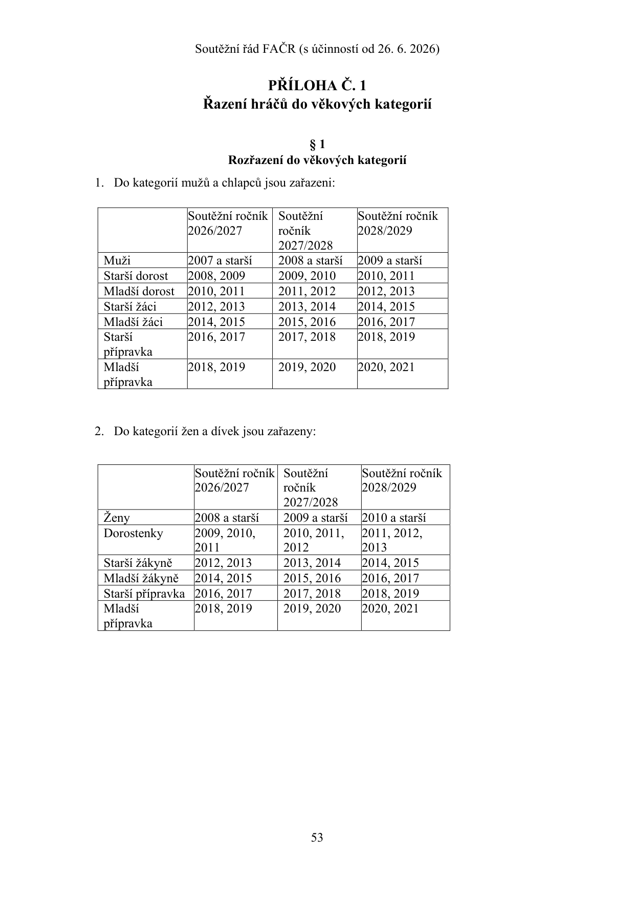

<a id="pdf-054"></a>

## PDF strana 54 / tištěná strana 54

[PDF, strana 54](sources/soutezni-rad-facr-2026-06-26.pdf#page=54)

PŘÍLOHA Č. 2

Modifikace Soutěžního řádu FAČR

### § 1

Základní ustanovení Tato příloha stanoví modifikace Soutěžního řádu FAČR a podmínky, za kterých je možné tyto modifikace implementovat do rozpisu soutěží.

### § 2

Systém postupu a sestupu mezi soutěžemi

1. Rozpis soutěží může obsahovat ustanovení, že družstvo, které se v soutěžním ročníku umístilo na postupové nebo sestupové pozici, nepostupuje nebo nesestupuje přímo, ale účastní se kvalifikačních utkání (dále „kvalifikace“) o takovou soutěž.

2. Kvalifikace se hraje systémem „dvojutkání“ (doma-venku), a to tak, že:

a) pořadí utkání se losuje v případě shodné mistrovské soutěže obou družstev;

b) doma začíná družstvo z nižší soutěže, nestanoví-li rozpis soutěží jinak;

c) pokud obě družstva docílí v obou utkáních a po skončení řádné hrací doby druhého z utkání shodný počet branek, se toto v kategorii dospělých prodlužuje o 2 x 15 minut, v kategorii mládeže se neprodlužuje;

d) není-li o výsledku rozhodnuto ani podle písm. c), rozhodne o vítězi kvalifikace penaltový rozstřel podle Pravidel fotbalu;

e) pokud se vítěz kvalifikace vzdá práva účasti v příslušné soutěži, získává toto právo poražené družstvo kvalifikace;

f) pokud nebude využito práva podle písm. e), poskytne řídící orgán soutěže možnost postupu v souladu s tímto řádem.

3. Rozpis soutěží může obsahovat ustanovení, že se kvalifikace účastní více než 2 družstva a kvalifikace se hraje systémem každý s každým jednokolově, každý s každým dvoukolově, vylučovacím jednokolovým systémem nebo systémem dvojutkání obdobně podle odst. 2.

4. Rozpis profesionální soutěže může obsahovat i jinou úpravu, než která je stanovena v odst. 2 písm. e) a f) a zvláštní úpravu pro případ vzdání se účasti v kvalifikaci, neobdržení licence pro účast v profesionální soutěži vítězem kvalifikace, pro případ kolize více družstev stejného členského klubu a pro případ, kdy bylo v disciplinárním řízení družstvo vyloučeno ze soutěže.

### § 3

Tříkolový systém a jeho modifikace

1. Rozpis soutěží může obsahovat ustanovení, které stanoví, že se mistrovské soutěže hrají systémem každý s každým tříkolově. Soutěžní ročník se v takovém případě dělí na dvě části, kdy v první části se družstva utkají každý s každým dvakrát. Na základě umístění družstev v soutěži po první části soutěže, budou družstva rozlosována pro druhou část dle Bergerových tabulek. Ve druhé části se družstva utkají jedenkrát každý s každým.

<a id="pdf-055"></a>

## PDF strana 55 / tištěná strana 55

[PDF, strana 55](sources/soutezni-rad-facr-2026-06-26.pdf#page=55)

2. Rozpis soutěží může obsahovat ustanovení, které stanoví, že po první části, kdy se družstva utkají dvakrát každý s každým, se družstva rozdělí dle postavení v tabulce do dvou či více skupin, kde odehrají každý s každým jedno utkání. Rozlosování pro druhou část určí rozpis soutěží.

3. Rozpis profesionální soutěže může obsahovat jinou úpravu tříkolového systému, než jak jej stanoví odst. 1 a 2.

### § 4

Čtyřkolový systém a jeho modifikace

1. Rozpis soutěží může obsahovat ustanovení, které stanoví, že se mistrovské soutěže hrají systémem každý s každým čtyřkolově. Soutěžní ročník se dělí na podzimní a jarní část, kdy v každé části se družstva utkají dvakrát každý s každým.

2. Čtyřkolový systém podle odst. 1 lze upravit i tak, že soutěžní ročník se dělí na dvě části, kdy v první části se družstva utkají dvakrát každý s každým. Po první části družstvům získaný počet soutěžních bodů zůstává nebo se dělí dvěma. V případě, že takto získaný podíl není celé číslo, zaokrouhluje se získaný podíl soutěžních bodů směrem nahoru na celé číslo. Řídící orgán soutěže upraví druhou část soutěže tak, aby družstva umístěná po první části soutěže v horní polovině tabulky hrála mezi sebou dvakrát každý s každým a družstva umístěná po první části soutěže ve spodní polovině tabulky také dvakrát každý s každým mezi sebou.

3. Rozpis profesionální soutěže může obsahovat jinou úpravu čtyřkolového systému, než jak jej stanoví odst. 1 a 2.

### § 5

Počet hráčů a střídání

1. Rozpis soutěží může obsahovat ustanovení, které stanoví, že:

a) v soutěžích věkové kategorie dospělých, kde řídícím orgánem soutěže je OFS nebo PFS je v průběhu soutěžního utkání povoleno opakované střídání;

b) v soutěžích kategorie mládeže, kde řídícím orgánem soutěže je KFS nebo PFS, je v průběhu soutěžního utkání povoleno opakované střídání;

c) v soutěžích kategorie staršího dorostu, mladšího dorostu a starších žáků, kde řídícím orgánem soutěže je OFS nebo PFS, je počet hráčů družstva minimálně 7+1 a v průběhu soutěžního utkání je povoleno opakované střídání;

d) v soutěžích kategorie mladších žáků, kde řídícím orgánem soutěže je OFS nebo PFS, je počet hráčů družstva minimálně 5+1 a v průběhu soutěžního utkání je povoleno opakované střídání;

e) v soutěžích kategorie mladších žáků, kde řídícím orgánem soutěže je ŘKČ, ŘKM, PFS nebo KFS, jsou oprávněna hrát družstva s počtem hráčů 7+1 nebo 8+1 a v průběhu soutěžního utkání je povoleno opakované střídaní;

f) v soutěžích žen a dívek je v průběhu soutěžního utkání povoleno opakované střídání;

g) v soutěžích dorostenek a žákyň sehraje v počtu hráček 10+1 nebo 7+1.

<a id="pdf-056"></a>

## PDF strana 56 / tištěná strana 56

[PDF, strana 56](sources/soutezni-rad-facr-2026-06-26.pdf#page=56)

### § 6

Postup pro určení vítěze utkání v případě nerozhodného výsledku v řádné hrací době Rozpis soutěží může obsahovat ustanovení, které stanoví, že v soutěžích, kde řídícím orgánem soutěže je OFS, KFS, PFS, ŘKČ, ŘKM, Řídící orgán 1. celostátní dorostenecké ligy, Sportovně technická komise fotbalu žen nebo jiný řídící orgán soutěží žen, se pro určení vítěze utkání v případě nerozhodného výsledku v řádné hrací době bude provádět penaltový rozstřel podle Pravidel fotbalu, a to tak, že:

a) každé družstvo provede pět kopů;

b) pokud po pěti kopech obou družstev bude výsledek nerozhodný, pokračují v provádění kopů ve stejném sledu další hráči družstva tak dlouho, dokud při stejném počtu kopů nedosáhne jedno z družstev o jednu branku více, než druhé;

c) vítěznému družstvu budou do soutěžní tabulky připsány 2 body, poraženému jeden bod; přičemž v tabulce počtu vstřelených a obdržených branek bude započítáno skoré dosažené v řádné hrací době.

### § 7

Návrat ošetřovaného hráče na hrací plochu

1. Rozhodujícím okamžikem pro opuštění hrací plochy je vstup lékaře, zdravotníka či jiné osoby ke zjištění zdravotního stavu hráče či jeho ošetření. V případě vstupu osoby na hrací plochu z důvodu zjištění zdravotního stavu hráče a případného ošetření, musí hráč hrací plochu opustit, i kdyby k ošetření vůbec nedošlo.

2. Ustanovení odst. 1 se neužije pokud:

a) je zraněn a ošetřován brankář;

b) jsou současně ošetřováni brankář a hráč soupeře z pole;

c) jsou ošetřováni dva hráči téhož družstva;

d) jsou ošetřováni dva hráči téhož družstva a s nimi hráč družstva soupeře;

e) je hráč ošetřován po přestupku, za který je provinivší se hráč soupeře napomenut nebo vyloučen a ošetření bylo provedeno rychle;

f) je nařízen pokutový kop a zraněný hráč sám bude pokutový kop provádět.

3. Hráč se může po ošetření vrátit na hrací plochu poté, co mu umožní vstup na hrací plochu rozhodčí. To neplatí, jestliže rozpis soutěží upravuje pravidlo podle odst. 4.

4. V neprofesionálních soutěžích může řídící orgán soutěže upravit v rozpisu soutěží podmínku, aby se ošetřovaný hráč směl na hrací plochu vrátit i dříve, než po uplynutí jedné minuty, jak stanoví pravidla fotbalu. Doba jedné minuty se měří od okamžiku navázání hry po odchodu ošetřovaného hráče z hrací plochy. Za dodržení doby jedné minuty odpovídají asistenti rozhodčího, a pokud jich není, rozhodčí.

5. V případě, že hráč opustí hrací plochu sám za účelem ošetření mimo ni, aniž by vstoupila na hrací plochu jiná osoba a ve hře se pokračuje, je oprávněn se vrátit na hrací plochu se svolením rozhodčího ihned po ošetření a nemusí čerpat dobu 1 minuty podle odst. 4.

<a id="pdf-057"></a>

## PDF strana 57 / tištěná strana 57

[PDF, strana 57](sources/soutezni-rad-facr-2026-06-26.pdf#page=57)

### § 8

Více družstev klubu ve shodné soutěži

1. Rozpis soutěží může obsahovat ustanovení, které stanoví, že v soutěžích, kde řídícím orgánem soutěže je OFS, KFS nebo PFS, je povolen start více družstev stejného členského klubu v různých skupinách stejné soutěže. V takovém případě je členský klub povinen vyhotovit seznam všech hráčů každého družstva startujícího v různých skupinách stejné soutěže, který zašle řídícímu orgánu soutěže nejpozději 3 dny před zahájením jednotlivé části soutěže; hráči uvedeni na seznamu hráčů jednoho družstva nejsou oprávnění startovat v jiném družstvu stejné soutěže.

2. Ustanovení odst. 1 týkající se seznamu hráčů se nevztahuje na věkovou kategorii přípravek podle § 19 a stanoví-li tak rozpis soutěží, tak ani na kategorii mládeže mladších žáků.

### § 9

Sdružená družstva

1. Rozpis soutěží může obsahovat ustanovení, které stanoví, že soutěže, kde řídícím orgánem soutěže je OFS, KFS, PFS, Komise fotbalu žen nebo jiný řídící orgán soutěží žen, se může účastnit sdružené družstvo.

2. Rozpis soutěží musí obsahovat ustanovení, které podmíní povolení sdruženého družstva minimálním počtem hráčů, a to:

a) 5 hráčů z každého členského klubu na seznamu hráčů sdruženého družstva v kategorii mužů;

b) 5 hráčů z každého členského klubu na seznamu hráčů sdruženého družstva v kategorii dorostu;

c) 4 hráčů z každého členského klubu na seznamu hráčů sdruženého družstva v kategorii žáků;

d) 3 hráčů z každého členského klubu na seznamu hráčů sdruženého družstva v kategorii přípravek. Rozpis soutěží může obsahovat ustanovení týkající se soupisek podle ustanovení § 10 odst. 11, které se obdobně použije pro seznam hráčů.

3. Sdružené družstvo se může soutěže účastnit za podmínek, že:

a) členské kluby podají žádost o povolení sdruženého družstva řídícímu orgánu soutěže a společně s touto žádostí předloží smlouvu o sdruženém družstvu;

b) smlouva podle písm. b) bude podepsána statutárními zástupci obou členských klubů. Přílohou této smlouvy bude seznam hráčů, kteří budou startovat ve sdruženém družstvu a bude vyhotoven zvlášť pro podzimní a zvlášť pro jarní část soutěžního ročníku, s tím, že seznam hráčů sdruženého družstva lze v průběhu ročníku měnit v rámci přestupních období podle § 2 odst. 1 písm. v) Přestupního řádu;

c) smlouva o sdruženém družstvu a seznam hráčů splňuje požadované náležitostí a je schválena řídící orgánem soutěže; schválení je účinné pouze pro soutěžní ročník, pro který byla žádost podána;

<a id="pdf-058"></a>

## PDF strana 58 / tištěná strana 58

[PDF, strana 58](sources/soutezni-rad-facr-2026-06-26.pdf#page=58)

d) termín podání žádosti o povolení sdruženého družstva a smlouvy o sdruženém družstvu se shoduje s termínem podání přihlášek do soutěží;

e) hráč, uvedený na seznamu hráčů sdruženého startu družstev není oprávněn startovat ve svém mateřském klubu za družstvo shodné kategorie, pro kterou bylo sdružené družstvo povoleno, pokud takové družstvo mateřský klub má. Za ostatní družstva mateřského klubu je hráč oprávněn startovat, pokud splní ostatní podmínky dané tímto řádem. Omezení dle tohoto ustanovení se nepoužije v případě, že mateřský klub disponuje družstvem dorostu, které není dělené na mladší a starší, a současně je sdružené družstvo povoleno pro kategorii mladšího dorostu nebo staršího dorostu.

4. Družstvo členského klubu, kterému v případě skončení sdruženého družstva není zachována příslušnost v soutěži, které se sdružené družstvo účastnilo, je zařazeno do nejnižší soutěže.

5. Příslušnost k soutěži bude v případě skončení sdruženého družstva zachována tomu členskému klubu, který jí disponoval před vytvořením sdruženého družstva. V případě, že je sdružené družstvo složeno ze dvou družstev téže soutěže, určí příslušnost k soutěži v případě skončení sdruženého družstva smlouva podle odst. 3 písm. c).

### § 10

Poplatky a lhůty

1. Rozpis soutěží může obsahovat ustanovení, které stanoví poplatek za schválení dohody členských klubů podle § 8 odst. 4 tohoto řádu pro případ, kdy družstva tuto dohodu uloží do informačního systému FAČR v lhůtách kratších, než stanoví § 8 odst. 4 tohoto řádu, s tím, že poplatek může činit nejvýše:

a) 500 Kč uloží-li dohodu do informačního systému FAČR méně než 17 dní před původně stanoveným termínem utkání;

b) 1 000 Kč uloží-li dohodu do informačního systému FAČR méně než 10 dní před původně stanoveným termínem utkání.

2. Rozpis soutěží může obsahovat ustanovení, které stanoví odlišnou lhůtu před dnem prvního soutěžního utkání příslušné části soutěže, než kterou stanoví § 8 odst. 4 tohoto řádu, kdy je organizátor utkání oprávněn navrhnout bez souhlasu soupeře řídícímu orgánu soutěže, že konkrétně vymezená soutěžní utkání odehraje v jiném termínu, než který byl stanoven pro soutěžní ročník.

3. Rozpis soutěží může obsahovat doplňující ustanovení k § 10 tohoto řádu, které stanoví dobu, po kterou hráč uvedený na soupisce je povinen v jednotlivé části soutěžního ročníku nastoupit. Rozpis soutěží, který obsahuje ustanovení povolující opakované střídání podle § 5 této přílohy, může obsahovat doplňující ustanovení k § 10 tohoto řádu, které stanoví počet utkání, do kterých je hráč vedený na soupisce povinen v jednotlivé části soutěžního ročníku nastoupit v základní sestavě.

4. Rozpis soutěží může obsahovat ustanovení, které stanoví odlišnou lhůtu pro doručení přihlášek družstva členského klubu do soutěže, než je stanoveno v § 15 odst. 6. tohoto řádu.

<a id="pdf-059"></a>

## PDF strana 59 / tištěná strana 59

[PDF, strana 59](sources/soutezni-rad-facr-2026-06-26.pdf#page=59)

5. Rozpis soutěží může obsahovat doplňující ustanovení k § 20 tohoto řádu, které stanoví výši poplatku, které je družstvo, které soutěž doplňuje, povinno uhradit.

6. Rozpis soutěží může obsahovat ustanovení, které stanoví odlišnou úpravu lhůty dle § 54 písm. d) tohoto řádu, nikoliv však lhůtu kratší.

7. Rozpis soutěží může obsahovat ustanovení, které stanoví odlišnou paušální částku náhrady nákladů spojených s přípravou utkání v případě nedostavení se družstva hostů k utkání v průběhu čekací doby uvedenou v § 58 odst. 7 tohoto řádu.

8. Rozpis soutěží může obsahovat ustanovení, které stanoví odlišné lhůty uvedené v § 60 a § 61 tohoto řádu. Lhůty uvedené v § 60 písm. a) a v § 61 písm. a) tohoto řádu však nesmí být kratší než 30 minut.

9. Rozpis soutěží může obsahovat ustanovení, které stanoví odlišné lhůty uvedené v § 62 odst. 1, 2 a 3 tohoto řádu, nesmí však být kratší.

10. Pro případ předčasného ukončení utkání dle § 69 tohoto řádu může rozpis soutěží obsahovat ustanovení, které stanoví odlišný způsob úhrady či podílu plnění na úhradě nákladů na nové utkání podle § 69 odst. 4 tohoto řádu.

### § 11

Jiné modifikace

1. Rozpis soutěží může obsahovat ustanovení, které stanoví odlišný postup pro změnu termínu utkání a místa utkání stanovený podle § 8 odst. 4 tohoto řádu, a to tak, že organizátor utkání je povinen příslušnou změnu ve stanoveném termínu předložit řídícímu orgánu soutěže ke schválení a soupeři na vědomí.

2. Rozpis soutěží může obsahovat ustanovení, které stanoví odchylně názvy mistrovských soutěží, než je stanoveno v § 11 odst. 1 tohoto řádu, zejména s ohledem na sponzory a partnery mistrovské soutěže.

3. Rozpis soutěží může obsahovat ustanovení, které stanoví odchylně začátky utkání, než je stanoveno v § 13 tohoto řádu. Začátek utkání nesmí být však stanoven dříve než v 9.00 hod. a později než ve 22.00 hod.

4. Rozpis profesionální soutěže a rozpis 1. celostátní ligy KA staršího dorostu mohou obsahovat jiná kritéria určení pořadí družstev v soutěž, než jak je stanoví § 17 odst. 3 a 4 tohoto řádu.

5. Rozpis soutěží může obsahovat ustanovení, které stanoví, že se příslušníci družstva do 24 hodin po skončení utkání nesmí veřejně vyjadřovat k výkonu delegovaných osob.

6. Rozpis soutěží může obsahovat ustanovení, které stanoví, že v zápise o utkání musí být vždy vyplněn trenér družstva podle § 62 odst. 1 písm. c) a § 62 odst. 2 písm. b) tohoto řádu.

7. Pro případ předčasného ukončení utkání nebo nezahájení utkání dle § 69 odst. 3 tohoto řádu může rozpis soutěží obsahovat ustanovení, které stanoví další pravidla pro určení termínu opakovaného utkání.

8. Rozpis profesionální soutěže může obsahovat ustanovení, které stanoví odlišný postup pro případ přerušení nebo předčasného ukončení utkání dle § 69 tohoto řádu, a to tak, že může stanovit, že utkání se neopakuje v novém termínu, ale že se v utkání následně naváže (pokračuje) od chvíle, kdy bylo utkání přerušeno či předčasně ukončeno.

<a id="pdf-060"></a>

## PDF strana 60 / tištěná strana 60

[PDF, strana 60](sources/soutezni-rad-facr-2026-06-26.pdf#page=60)

```text
9. Rozpis soutěží může obsahovat ustanovení, které stanoví snížený počet sestupujících
    v případě, že do vyšší soutěže nemá mimo pořadí zájem postoupit žádné z v rozpisu
    soutěží určeného počtu družstev nižší soutěže mládeže, než jak stanoví
    § 20 odst. 1 písm. k) až m) tohoto řádu.
10. Rozpis soutěží může obsahovat ustanovení, že se losovací aktiv uskuteční prostředky
    jednání na dálku (per rollam). Řídící orgán soutěže je v takovém případě povinen
    stanovit rozhodné datum a poučit členské kluby o jejich právech a povinnostech.
```

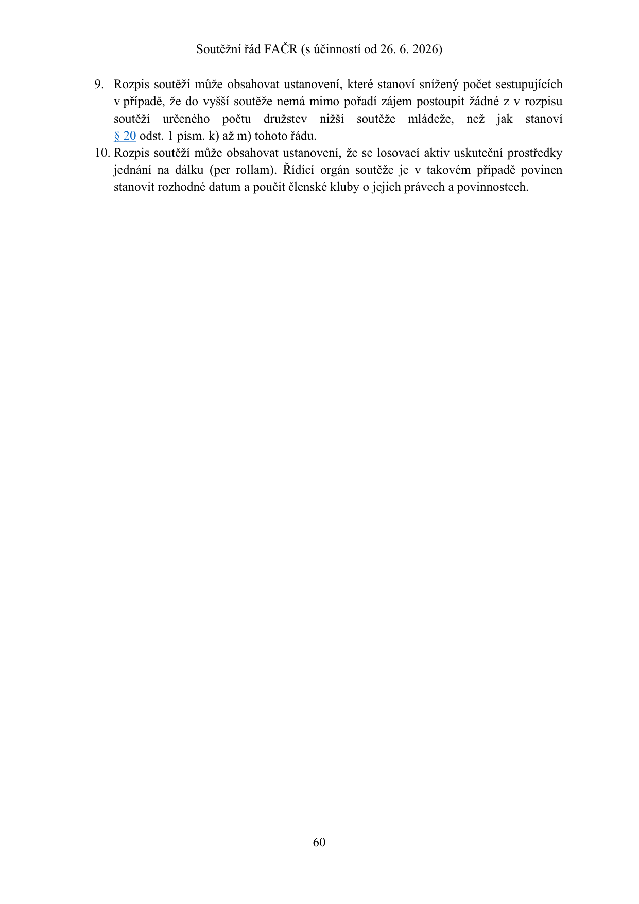

<a id="pdf-061"></a>

## PDF strana 61 / tištěná strana 61

[PDF, strana 61](sources/soutezni-rad-facr-2026-06-26.pdf#page=61)

```text
PŘÍLOHA Č. 3
                            Tabulky pro rozlosování

                                        §1
                                 Bergerovy tabulky
1. Tabulka pro 3 a 4 družstva

 1.kolo     1-4       2-3
 2.kolo     4-3       1-2
 3.kolo     2-4       3-1

2. Tabulka pro 5 a 6 družstev

 1.kolo     1-6       2-5        3-4
 2.kolo     6-4       5-3        1-2
 3.kolo     2-6       3-1        4-5
 4.kolo     6-5       1-4        2-3
 5.kolo     3-6       4-2        5-1

3. Tabulka pro 7 a 8 družstev

 1.kolo     1-8       2-7        3-6     4-5
 2.kolo     8-5       6-4        7-3     1-2
 3.kolo     2-8       3-1        4-7     5-6
 4.kolo     8-6       7-5        1-4     2-3
 5.kolo     3-8       4-2        5-1     6-7
 6.kolo     8-7       1-6        2-5     3-4
 7.kolo     4-8       5-3        6-2     7-1

4. Tabulka pro 9 a 10 družstev

 1.kolo     1-10      2-9        3-8     4-7       5-6
 2.kolo     10-6      7-5        8-4     9-3       1-2
 3.kolo     2-10      3-1        4-9     5-8       6-7
 4.kolo     10-7      8-6        9-5     1-4       2-3
 5.kolo     3-10      4-2        5-1     6-9       7-8
 6.kolo     10-8      9-7        1-6     2-5       3-4
 7.kolo     4-10      5-3        6-2     7-1       8-9
 8.kolo     10-9      1-8        2-7     3-6       4-5
 9.kolo     5-10      6-4        7-3     8-2       9-1
```

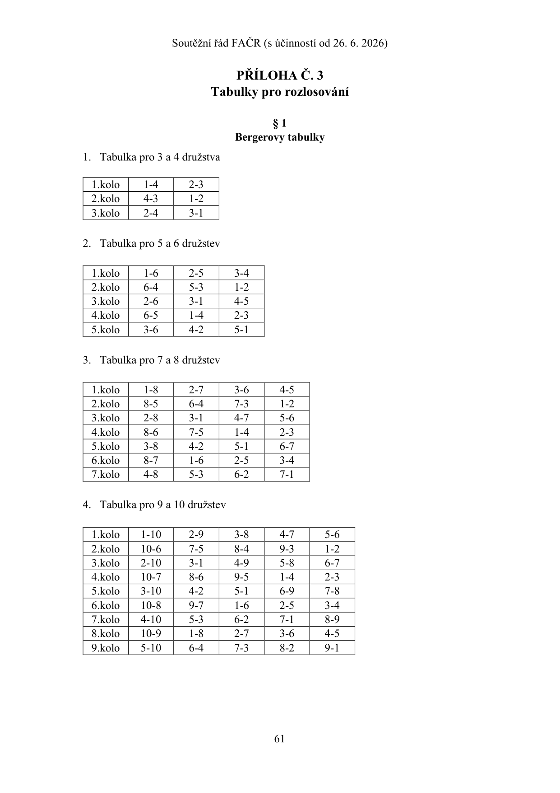

<a id="pdf-062"></a>

## PDF strana 62 / tištěná strana 62

[PDF, strana 62](sources/soutezni-rad-facr-2026-06-26.pdf#page=62)

```text
5. Tabulka pro 11 a 12 družstev

  1.kolo    1-12     2-11      3-10       4-9      5-8        6-7
  2.kolo    12-7      8-6       9-5      10-4     11-3        1-2
  3.kolo    2-12      3-1      4-11      5-10      6-9        7-8
  4.kolo    12-8      9-7      10-6      11-5      1-4        2-3
  5.kolo    3-12      4-2       5-1      6-11     7-10        8-9
  6.kolo    12-9     10-8      11-7       1-6      2-5        3-4
  7.kolo    4-12      5-3       6-2       7-1     8-11      9-10
  8.kolo   12-10     11-9       1-8       2-7      3-6        4-5
  9.kolo    5-12      6-4       7-3       8-2      9-1      10-11
 10.kolo   12-11     1-10       2-9       3-8      4-7        5-6
 11.kolo    6-12      7-5       8-4       9-3     10-2       11-1

6. Tabulka pro 13 a 14 družstev

  1.kolo    1-14      2-13     3-12      4-11     5-10        6-9     7-8
  2.kolo    14-8       9-7     10-6      11-5     12-4       13-3     1-2
  3.kolo    2-14       3-1     4-13      5-12     6-11       7-10     8-9
  4.kolo    14-9      10-8     11-7      12-6     13-5        1-4     2-3
  5.kolo    3-14       4-2      5-1      6-13     7-12       8-11    9-10
  6.kolo   14-10      11-9     12-8      13-7      1-6        2-5     3-4
  7.kolo    4-14       5-3      6-2       7-1     8-13       9-12   10-11
  8.kolo   14-11     12-10     13-9       1-8      2-7        3-6     4-5
  9.kolo    5-14       6-4      7-3       8-2      9-1      10-13   11-12
 10.kolo   14-12     13-11     1-10       2-9      3-8        4-7     5-6
 11.kolo    6-14       7-5      8-4       9-3     10-2       11-1   12-13
 12.kolo   14-13      1-12     2-11      3-10      4-9        5-8     6-7
 13.kolo    7-14       8-6      9-5      10-4     11-3       12-2    13-1

7. Tabulka pro 15 a 16 družstev

  1.kolo    1-16      2-15      3-14     4-13     5-12       6-11    7-10     8-9
  2.kolo    16-9      10-8      11-7     12-6     13-5       14-4    15-3     1-2
  3.kolo    2-16       3-1      4-15     5-14     6-13       7-12    8-11    9-10
  4.kolo   16-10      11-9      12-8     13-7     14-6       15-5     1-4     2-3
  5.kolo    3-16       4-2       5-1     6-15     7-14       8-13    9-12   10-11
  6.kolo   16-11     12-10      13-9     14-8     15-7        1-6     2-5     3-4
  7.kolo    4-16       5-3       6-2      7-1     8-15       9-14   10-13   11-12
  8.kolo   16-12     13-11     14-10     15-9      1-8        2-7     3-6     4-5
  9.kolo    5-16       6-4       7-3      8-2      9-1      10-15   11-14   12-13
 10.kolo   16-13     14-12     15-11     1-10      2-9        3-8     4-7     5-6
 11.kolo    6-16       7-5       8-4      9-3     10-2       11-1   12-15   13-14
 12.kolo   16-14     15-13      1-12     2-11     3-10        4-9     5-8     6-7
 13.kolo    7-16       8-6       9-5     10-4     11-3       12-2    13-1   14-15
 14.kolo   16-15      1-14      2-13     3-12     4-11       5-10     6-9     7-8
```

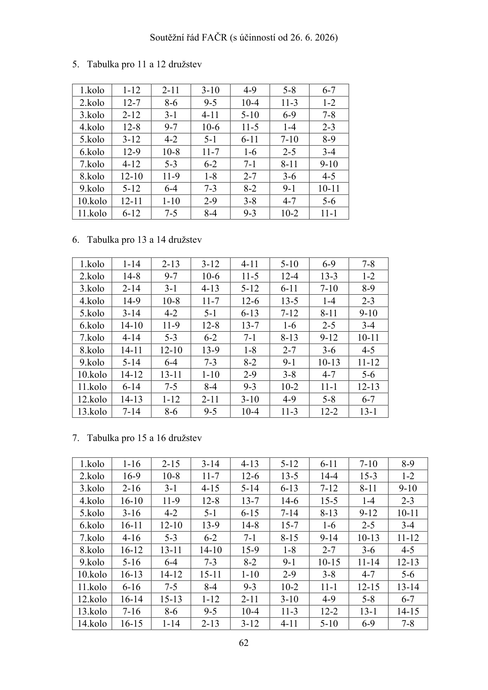

<a id="pdf-063"></a>

## PDF strana 63 / tištěná strana 63

[PDF, strana 63](sources/soutezni-rad-facr-2026-06-26.pdf#page=63)

```text
15.kolo    8-16       9-7      10-6      11-5      12-4      13-3      14-2      15-1


  8. Tabulka pro 17 a 18 družstev

 1.kolo    1-18       2-17      3-16      4-15     5-14       6-13      7-12      8-11      9-10
 2.kolo   18-10       11-9      12-8      13-7     14-6       15-5      16-4      17-3       1-2
 3.kolo    2-18        3-1      4-17      5-16     6-15       7-14      8-13      9-12     10-11
 4.kolo   18-11      12-10      13-9      14-8     15-7       16-6      17-5       1-4       2-3
 5.kolo    3-18        4-2       5-1      6-17     7-16       8-15      9-14     10-13     11-12
 6.kolo   18-12      13-11     14-10      15-9     16-8       17-7       1-6       2-5       3-4
 7.kolo    4-18        5-3       6-2       7-1     8-17       9-16     10-15     11-14     12-13
 8.kolo   18-13      14-12     15-11     16-10     17-9        1-8       2-7       3-6       4-5
 9.kolo    5-18        6-4       7-3       8-2      9-1      10-17     11-16     12-15     13-14
10.kolo   18-14      15-13     16-12     17-11     1-10        2-9       3-8       4-7       5-6
11.kolo    6-18        7-5       8-4       9-3     10-2       11-1     12-17     13-16     14-15
12.kolo   18-15      16-14     17-13      1-12     2-11       3-10       4-9       5-8       6-7
13.kolo    7-18        8-6       9-5      10-4     11-3       12-2      13-1     14-17     15-16
14.kolo   18-16      17-15      1-14      2-13     3-12       4-11      5-10       6-9       7-8
15.kolo    8-18        9-7      10-6      11-5     12-4       13-3      14-2      15-1     16-17
16.kolo   18-17       1-16      2-15      3-14     4-13       5-12      6-11      7-10       8-9
17.kolo    9-18       10-8      11-7      12-6     13-5       14-4      15-3      16-2      17-1
```

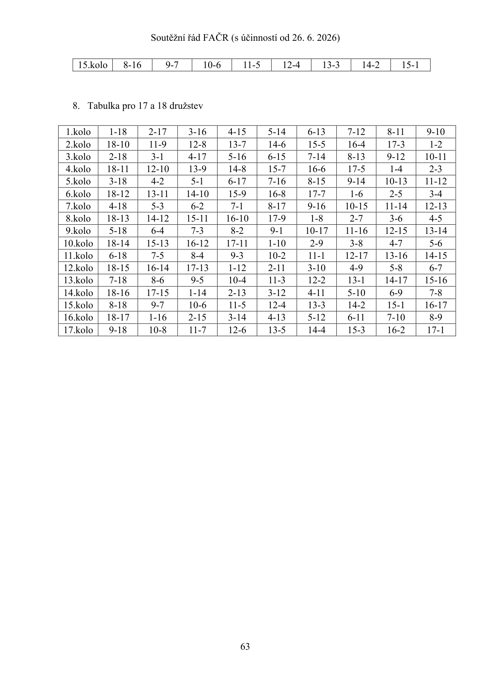

<a id="pdf-064"></a>

## PDF strana 64 / tištěná strana 64

[PDF, strana 64](sources/soutezni-rad-facr-2026-06-26.pdf#page=64)

PŘÍLOHA Č. 4

Licenční podmínky pro profesionální soutěže

### § 1

Základní ustanovení

Licenční podmínky pro profesionální soutěže jsou na internetové adrese zveřejněny na webových stránkách FAČR nebo na stránce clublicensing.cz.

<a id="pdf-065"></a>

## PDF strana 65 / tištěná strana 65

[PDF, strana 65](sources/soutezni-rad-facr-2026-06-26.pdf#page=65)

PŘÍLOHA Č. 5

Povolávání hráčů do reprezentačních družstev

ČÁST PRVNÍ

OBECNÁ USTANOVENÍ

Díl 1

Povolávání hráčů do mužských reprezentačních družstev

### § 1

Základní ustanovení

1. Členský klub je povinen uvolnit hráče pro reprezentační družstvo země, za kterou je hráč oprávněn hrát na základě své státní příslušnosti, je-li k tomu vyzván FAČR nebo zahraniční asociací, a to:

a) pro všechny mezinárodní termíny uvedené v kalendáři mezinárodních utkání FIFA dle § 2 odst. 1 této přílohy;

b) pro závěrečný turnaj Mistrovství světa FIFA (FIFA World Cup™);

c) pro závěrečný turnaj Konfederačního pohár FIFA;

d) pro závěrečný turnaj mistrovství jednotlivých konfederací pro reprezentační „A“ družstva, přičemž příslušná asociace musí být členem organizující konfederace.

2. Členský klub není povinen uvolnit:

a) stejného hráče pro více než jeden závěrečný turnaj reprezentačního „A“ družstva ročně; výjimky z tohoto pravidla může stanovit pouze Výkonný výbor FIFA pro Konfederační pohár FIFA;

b) hráče mimo případy dle odst. 1.

3. Dohoda mezi hráčem a členským klubem v rozporu s ustanovením odst. 1 je neplatná.

### § 2

Kalendář mezinárodních utkání FIFA FIFA zveřejňuje kalendář mezinárodních utkání na období čtyř nebo osmi let. Tento kalendář zahrnuje všechny mezinárodní termíny na dané období. Po zveřejnění kalendáře mezinárodních utkání bude doplněn pouze závěrečný turnaj Mistrovství světa FIFA, závěrečný turnaj Konfederačního pohár FIFA a šampionátů pro reprezentační „A“ týmy jednotlivých konfederací.

### § 3

Mezinárodní termíny

1. Mezinárodní termín je doba devíti dnů, která počíná pondělním ránem a končí úterním večerem bezprostředně následujícího týdne, a která je vyhrazena pro činnost reprezentačních týmů. V průběhu jakéhokoli mezinárodního termínu může každý

<a id="pdf-066"></a>

## PDF strana 66 / tištěná strana 66

[PDF, strana 66](sources/soutezni-rad-facr-2026-06-26.pdf#page=66)

reprezentační tým sehrát nanejvýš dvě utkání, a to bez ohledu na to, zda tato utkání představují kvalifikační utkání na závěrečný mezinárodní turnaj nebo přátelská utkání. Daná utkání mohou být v průběhu mezinárodního termínu naplánována na jakýkoli den počínaje středou, přičemž mezi dvěma utkáními musejí být minimálně dva celé kalendářní dny.

2.   V případě sehrání dvou utkání v rámci mezinárodního termínu jsou reprezentační družstva povinna je sehrát na území stejné konfederace, přičemž jedinou výjimkou jsou mezikontinentální vyřazovací utkání. Je-li alespoň jedno z obou utkání přátelské, mohou být daná utkání sehrána ve dvou různých konfederacích, avšak pouze v případě, že vzdálenost mezi místy nepřekročí pět letových hodin podle oficiálního harmonogramu letecké společnosti, a dvě časově zóny.

3.   V případě mezinárodních termínů musejí být hráči uvolněni a musejí zahájit cestu ke svému reprezentačnímu týmu nejpozději v pondělí ráno a cestu zpět do svého klubu pak musejí zahájit nejpozději následující středu ráno po skončení daného mezinárodního termínu.

4.   V případě závěrečného turnaje ve smyslu § 1 odst. 1 písm. b) až d) této přílohy musejí být hráči uvolněni a musejí zahájit cestu ke svému reprezentačnímu týmu nejpozději v pondělí ráno v týdnu předcházejícím týdnu, kdy dojde k zahájení závěrečného turnaje, a musejí být asociací uvolněni ráno v den po posledním utkání svého týmu na turnaji.

5.   Členské kluby a FAČR nebo zahraniční asociace se mohou dohodnout na delší době uvolnění nebo na odlišných ujednáních vztahujících se k ustanovení odst. 2.

### § 4

Návrat hráče do členského klubu

1. Hráči začnou opět plnit své povinnosti ve svých klubech nejpozději 24 hodin po skončení doby, na kterou museli být uvolněni. Tato doba se prodlužuje na 48 hodin, pokud daná činnost reprezentačních týmů probíhala v rámci jiné konfederace než UEFA. Členské kluby musejí být nejpozději deset dnů před začátkem doby uvolnění písemně informovány o časovém plánu odjezdu i návratu hráče. Asociace jsou povinny zajistit, aby se hráči mohli po utkání včas vrátit ke svým klubům.

2. Nezačne-li hráč opět plnit své povinnosti u svého klubu v termínu podle odst. 1, rozhodne Výbor pro status hráčů FIFA na základě výslovné žádosti, že při jeho příštím povolání FAČR nebo zahraniční asociací bude doba jeho uvolnění následujícím způsobem zkrácena

a) mezinárodní termín: o dva dny;

b) závěrečný turnaj mezinárodního turnaje: o pět dnů.

3. V případě, že FAČR nebo zahraniční asociace opakovaně poruší ustanovení odst. 1, je Výbor pro status hráčů FIFA oprávněn uplatnit sankce dle FIFA RSTP.

<a id="pdf-067"></a>

## PDF strana 67 / tištěná strana 67

[PDF, strana 67](sources/soutezni-rad-facr-2026-06-26.pdf#page=67)

Díl 2

Povolávání hráček do ženských reprezentačních družstev

### § 5

Základní ustanovení

1. Členský klub je povinen uvolnit hráčku pro reprezentační družstvo země, za kterou je hráčka oprávněna hrát na základě své státní příslušnosti, je-li k tomu vyzván FAČR nebo zahraniční asociací, a to:

a) pro všechny mezinárodní termíny uvedené v ženském kalendáři mezinárodních utkání FIFA dle § 6 této přílohy;

b) pro závěrečný turnaj Mistrovství světa žen FIFA;

c) pro ženský olympijský turnaj;

d) pro závěrečný konfederační kvalifikační turnaj na ženský olympijský turnaj;

e) pro závěrečný turnaj mistrovství jednotlivých konfederací pro reprezentační „A“ družstva, přičemž příslušná asociace musí být členem organizující konfederace.

2. Členský klub není povinen uvolnit hráčku mimo případy dle odst. 1.

3. Dohoda mezi hráčkou a členským klubem v rozporu s ustanovením odst. 1 je neplatná.

### § 6

Ženský kalendář mezinárodních utkání FIFA FIFA zveřejňuje ženský kalendář mezinárodních utkání na období dvou nebo čtyř let. Tento kalendář zahrnuje všechny mezinárodní termíny na dané období. Po zveřejnění ženského kalendáře mezinárodních utkání bude doplněn pouze závěrečný turnaj Mistrovství světa žen FIFA, ženský olympijský turnaj, závěrečný konfederační kvalifikační turnaj na ženský olympijský turnaj, závěrečný turnaj mistrovství jednotlivých konfederací pro reprezentační „A“ družstva.

### § 7

Mezinárodní termíny

1. Typ I mezinárodního termínu je doba devíti dnů, která počíná pondělním ránem a končí úterním večerem bezprostředně následující týden, která je vyhrazena pro činnost reprezentačních týmů. V průběhu typu I mezinárodního termínu může každý reprezentační tým sehrát nanejvýš dvě utkání, a to bez ohledu na to, zda tato utkání představují kvalifikační utkání na závěrečný mezinárodní turnaj nebo přátelská utkání. Daná utkání mohou být v průběhu mezinárodního termínu naplánována na jakýkoli den počínaje středou, přičemž mezi dvěma utkáními musejí být minimálně dva celé kalendářní dny.

2. Typ II mezinárodního termínu je doba devíti dnů počínaje pondělním ránem a konče úterním večerem následující týden, která je vyhrazena pro konfederační kvalifikační miniturnaje s tím, že v takovém případě může každý reprezentační tým sehrát nanejvýš tři utkání.

3. Typ III mezinárodního termínu je doba deseti dnů počínaje pondělním ránem a konče středečním večerem následující týden, která je vyhrazena pro přátelský turnaj

<a id="pdf-068"></a>

## PDF strana 68 / tištěná strana 68

[PDF, strana 68](sources/soutezni-rad-facr-2026-06-26.pdf#page=68)

reprezentačních týmů hraných v únoru nebo březnu každého kalendářního roku. V průběhu typu III mezinárodního termínu může každý reprezentační tým sehrát nanejvýš čtyři utkání.

4.   Ustanovení odst. 1 až 3 ohledně počtu dnů mezinárodního termínu neplatí pro závěrečný konfederační kvalifikační turnaj na ženský olympijský turnaj, kdy je může mezinárodní termín činit až 12 dní.

5.   V případě mezinárodních termínů musejí být hráčky uvolněny a musejí zahájit cestu ke svému reprezentačnímu týmu nejpozději v pondělí ráno a cestu zpět do svého klubu pak musejí zahájit nejpozději následující středu ráno po skončení mezinárodního termínu podle odst. 1 a 2 nebo nejpozději následující čtvrtek ráno po skončení mezinárodního termínu podle odst. 3.

6.   V případě závěrečného turnaje ve smyslu § 5 odst. 1 písm. d) této přílohy musejí být hráčky uvolněny a musejí zahájit cestu ke svému reprezentačnímu týmu nejpozději v pondělí ráno před úvodním utkáním kvalifikačního turnaje a musejí být asociací uvolněny ráno v den po posledním utkání svého týmu na turnaji.

7.   V případě závěrečného turnaje ve smyslu § 5 odst. 1 písm. b), c) a e) této přílohy nesmí být hráčky uvolněny a nesmí zahájit cestu ke svému reprezentačnímu týmu později než 14 dní před úvodním utkáním turnaje ráno v týdnu předcházejícím týdnu, kdy dojde k zahájení závěrečného turnaje, a musejí být asociací uvolněni ráno v den po posledním utkání svého týmu na turnaji.

8.   Členské kluby a FAČR nebo zahraniční asociace se mohou dohodnout na delší době uvolnění nebo na odlišných ujednáních vztahujících se k ustanovení odst. 5 až 8.

### § 8

Návrat hráčky do členského klubu

1. Hráčky začnou opět plnit své povinnosti ve svých klubech nejpozději 24 hodin po skončení doby, na kterou musely být uvolněny. Tato doba se prodlužuje na 48 hodin, pokud daná činnost reprezentačních týmů probíhala v rámci jiné konfederace než UEFA. Členské kluby musejí být nejpozději deset dnů před začátkem doby uvolnění písemně informovány o časovém plánu odjezdu i návratu hráčky. Asociace jsou povinny zajistit, aby se hráčky mohly po utkání včas vrátit ke svým klubům.

2. Nezačne-li hráčka opět plnit své povinnosti u svého klubu v termínu podle odst. 1, rozhodne Výbor pro status hráčů FIFA na základě výslovné žádosti, že při jejím příštím povolání FAČR nebo zahraniční asociací bude doba jeho uvolnění následujícím způsobem zkrácena:

a) mezinárodní termín: o dva dny;

b) závěrečný turnaj mezinárodního turnaje: o pět dnů.

3. V případě, že FAČR nebo zahraniční asociace opakovaně poruší ustanovení odst. 1, je Výbor pro status hráčů FIFA oprávněn uplatnit sankce dle FIFA RSTP.

<a id="pdf-069"></a>

## PDF strana 69 / tištěná strana 69

[PDF, strana 69](sources/soutezni-rad-facr-2026-06-26.pdf#page=69)

ČÁST DRUHÁ

FINANČNÍ NÁKLADY A POJIŠTĚNÍ

### § 9

Finanční náklady a pojištění

1. Členské kluby uvolňující hráče či hráčky v souladu s touto přílohou nemají nárok na finanční kompenzaci.

2. Asociace, která hráče či hráčku povolala, hradí cestovní výdaje hráče či hráčky vynaložené v důsledku tohoto povolání.

3. Členský klub, v němž hráč či hráčka působí, odpovídá za jeho nemocenské a úrazové pojištění, a to v průběhu celé doby jeho uvolnění. Toto pojištění se musí vztahovat také na případné úrazy, které hráč či hráčka utrpí v rámci mezinárodního utkání či mezinárodních utkání, pro něž byl uvolněn.

4. Utrpí-li hráč či hráčka v období, kdy je povolán za účelem účasti v mezinárodním utkání reprezentačního A-týmu, tělesné zranění dílem náhody a je v důsledku takového zranění dočasně neschopen/neschopna vykonávat svou činnost, členský klub, v němž je hráč či hráčka registrován/a, bude odškodněn/a ze strany FIFA. Podmínky takového odškodnění jsou stanoveny v Technickém Bulletinu FIFA – Program ochrany klubů.

ČÁST TŘETÍ

POVOLÁVÁNÍ HRÁČŮ A ZRANĚNÍ HRÁČI

### § 10

Povolávání hráčů

1. Každý hráč registrovaný v členském klubu je povinen potvrdit svou účast v reprezentačním družstvu, je-li povolán asociací, kterou je oprávněn na základě svého občanství reprezentovat.

2. FAČR nebo zahraniční asociace je povinna hráče uvědomit o povolání písemně nejpozději 15 dnů před prvním dnem příslušného mezinárodního termínu.

3. Lhůta podle odst. 2 se použije též v případě povolání hráče na závěrečný mezinárodní turnaj.

4. Ustanovení odst. 2 a 3 se použijí též pro informování členského klubu. Členský klub je povinen ve lhůtě 6 dnů od obdržení informace o povolání hráče potvrdit uvolnění hráče.

5. FAČR nebo zahraniční asociace je oprávněna požádat FIFA o součinnost při povolání hráče hrajícího v klubu, který není členským klubem FAČR nebo dané zahraniční asociace, v případě, že:

a) asociace, v které je hráč registrován, byla bezúspěšně požádána o součinnost; a

b) případ je předložen FIFA nejméně 5 dnů před dnem, v němž se koná utkání, pro které je hráč povoláván.

<a id="pdf-070"></a>

## PDF strana 70 / tištěná strana 70

[PDF, strana 70](sources/soutezni-rad-facr-2026-06-26.pdf#page=70)

### § 11

Zranění hráči

1. Hráč podle § 10 odst. 1 této přílohy, který není pro nemoc či zranění schopen účastnit se aktivit reprezentačního družstva, je povinen podstoupit lékařskou prohlídku provedenou lékařem, kterého zvolí FAČR.

2. Požádá-li o to hráč podle odst. 1, lékařská prohlídka se uskuteční na území asociace, ve které je registrován.

ČÁST ČTVRTÁ

OMEZENÍ NASTOUPENÍ A DISCIPLINÁRNÍ OPATŘENÍ

### § 12

Omezení nastoupení

1. Pokud k tomu nedá souhlas asociace, která hráče povolala, není hráč oprávněn nastoupit za členský klub, v němž je hráč registrován, a to po dobu, na kterou byl anebo měl být uvolněn podle ustanovení této přílohy.

2. Omezení podle odst. 1 bude navíc prodlouženo o 5 dní v případě hráče, který se z jakéhokoliv důvodu nepodvolil nebo nemohl podvolit povolání do reprezentačního družstva.

3. Omezení podle odst. 2 se nepoužije v případě, že se hráč nezúčastnil aktivit reprezentačního družstva z důvodu zranění a zároveň byly dodrženy povinnosti stanovené v § 11 Přílohy č. 5 tohoto řádu.

### § 13

Disciplinární opatření

1. Porušení ustanovení této přílohy představuje disciplinární provinění.

2. Pokud členský klub odmítne uvolnit hráče nebo tak učiní z nedbalosti v rozporu s ustanoveními této přílohy, Komise FIFA pro status hráčů bude vyžadovat po FAČR, aby byla veškerá utkání, kterých se tento hráč účastnil v období, na které byl povolán, kontumovala ve prospěch soupeře.

3. Pokud se hráč navrátí z účasti v reprezentačním družstvu opakovaně pozdě, Komise FIFA pro status hráčů je oprávněna na základě žádosti členského klubu, učinit další disciplinární opatření vůči hráči nebo asociaci.

<a id="pdf-071"></a>

## PDF strana 71 / tištěná strana 71

[PDF, strana 71](sources/soutezni-rad-facr-2026-06-26.pdf#page=71)

ČÁST PÁTÁ

ZÁVĚREČNÁ USTANOVENÍ

### § 14

Závěrečná ustanovení V případě rozporu mezi přílohou č. 1 FIFA RSTP a touto přílohou má přednost znění přílohy č. 1 FIFA RSTP, a to zejména v případě mezinárodních termínů, lhůt či návratů hráčů a hráček do členských klubů.

<a id="pdf-072"></a>

## PDF strana 72 / tištěná strana 72

[PDF, strana 72](sources/soutezni-rad-facr-2026-06-26.pdf#page=72)

PŘÍLOHA Č. 6

Pravidla pro případy událostí způsobených vyšší mocí

### § 1

Základní ustanovení

1. Tato příloha stanoví podmínky, za kterých se uskutečňuje a hodnotí soutěžní ročník v případě realizace opatření souvisejícím s událostmi způsobenými vyšší mocí, které ovlivňují možnost odehrání soutěžních či jiných fotbalových utkání.

2. Podmínky zde stanovené se použijí přiměřeně i na takové situace, které zde nejsou výslovně upraveny.

3. Tato pravidla neupravují postavení diváků, které se řídí právními předpisy, rozhodnutími a obdobnými opatřeními orgánů státní správy vydanými v souvislosti s šířením nemoci COVID-19 či jiné události způsobené vyšší moci.

### § 2

Povinnosti členů FAČR

1. Členové FAČR jsou povinni řídit se právními předpisy, rozhodnutími a obdobnými opatřeními orgánů státní správy vydanými v souvislosti s událostí způsobenou vyšší moci.

2. Hráči ani další fyzické osoby se nesmějí účastnit fotbalových utkání:

a) po dobu opatření uloženého příslušným orgánem státní správy;

b) po dobu stanovenou lékařem v případě zjištění nákazy nemocí COVID-19 či jiné nakažlivé nemoci;

c) pokud nesplňují podmínky účasti na utkání dle aktuálně platných právních předpisů.

3. Členské kluby jsou povinny zajistit, aby jejich hráči, funkcionáři, ale i ostatní osoby zúčastněné na fotbalovém utkání neporušili povinnosti stanovené v odst. 2.

4. Členské kluby jsou povinny oznámit bezodkladně řídícímu orgánu soutěže:

a) výskyt infekční nemoci u hráče nebo další osoby podílející se v jakémkoli postavení na fotbalových utkáních;

b) nařízení karantény hráči nebo další osobě podílející se v jakémkoli postavení na fotbalových utkáních.

5. Řídící orgán soutěže je povinen bezodkladně informovat o oznámení podle odst. 4 Sekretariát FAČR.

### § 3

Odložení utkání

1. Není-li dále výslovně stanoveno jinak, tak důvodem pro odložení schváleného termínu soutěžního utkání z důvodu opatření proti události způsobené vyšší moci je:

a) rozhodnutí příslušné Krajské hygienické stanice či jiného příslušného orgánu státní správy;

b) objektivní nemožnost sehrát utkání v důsledku karanténních opatření, tj. méně než jedenáct hráčů způsobilých nastoupit do utkání;

<a id="pdf-073"></a>

## PDF strana 73 / tištěná strana 73

[PDF, strana 73](sources/soutezni-rad-facr-2026-06-26.pdf#page=73)

c) podle uvážení řídícího orgánu soutěže a Sekretariátu FAČR též jiná karanténní opatření či doporučení Krajské hygienické stanice v souvislosti s probíhajícím epidemickým šetřením; vyjádření Sekretariátu FAČR není zapotřebí v případě profesionálních soutěží;

d) dohoda družstev schválená řídícím orgánem soutěže;

e) událost vyšší moci způsobující nemožnost sehrání utkání.

2.   Pro případ odložení schváleného termínu soutěžního utkání podle odst. 1 jsou členské kluby povinny dohodnout se na novém termínu utkání, a to do tří dnů po původním termínu utkání; nový termín musí být sjednán nejpozději do čtyř týdnů od původního termínu utkání, u věkových kategorií žáků a mladších do šesti týdnů v případě, že to situace dovoluje. Nově dohodnutý termín utkání podléhá schválení řídícím orgánem soutěže. To neplatí u profesionálních soutěží, kde termín utkání nařídí bez dalšího řídící orgán soutěže.

3.   Nesplní-li členské kluby svoji povinnost podle odst. 2, případně pokud řídící orgán soutěže dohodnutý termín neschválí, nařídí řídící orgán soutěže termín nového utkání ve shora uvedených lhůtách podle svého uvážení.

4.   Řídící orgán soutěže rozhodne o termínu odloženého utkání dle odst. 2 a 3 s ohledem na termín losovacího aktivu na následující soutěžní ročník a konec probíhajícího soutěžního ročníku. Při objektivní nemožnosti stanovení náhradního termínu odloženého utkání nebude utkání kontumováno. Tím není dotčena kontumace utkání v profesionálních soutěžích v případech, kdy dle odst. 5 nedojde k odložení soutěžního utkání.

5.   Nerozhodne-li řídící orgán soutěže jinak, pak ve vztahu k profesionálním soutěžím platí, že nejsou karanténní opatření ani jiná rozhodnutí či opatření související s události způsobenou vyšší moci důvodem pro odložení soutěžního utkání:

a) v posledních pěti kolech základní části 1. ligy;

b) nadstavbové části 1. ligy;

c) barážových utkáních o účast v 1. lize; a

d) v posledních pěti kolech 2. ligy.

### § 4

Hodnocení pořadí v soutěži po ukončení soutěžního ročníku

1. V případě, že všechna družstva v soutěži neodehrají stejný počet utkání, rozhoduje o pořadí postupně vyšší podíl z počtu bodů a počtu odehraných soutěžních utkání; takto vypočtený koeficient zaokrouhlený na tři desetinná místa se považuje za počet bodů.

2. V případě shodného počtu bodů více družstev, která odehrála shodný počet utkání a současně odehrála vzájemně všechna domácí i venkovní utkání, rozhoduje o pořadí postupně

a) vyšší počet bodů ze vzájemných utkání;

b) brankový rozdíl ze vzájemných utkání;

c) vyšší počet vstřelených branek ve vzájemných utkáních;

d) vyšší brankový rozdíl ze všech odehraných utkání v soutěži;

e) vyšší počet vstřelených branek v soutěži;

<a id="pdf-074"></a>

## PDF strana 74 / tištěná strana 74

[PDF, strana 74](sources/soutezni-rad-facr-2026-06-26.pdf#page=74)

f) los.

3. V případě shodného počtu bodů více družstev, která neodehrála shodný počet utkání a současně odehrála vzájemně všechna domácí i venkovní utkání, rozhoduje o pořadí postupně

a) vyšší počet bodů ze vzájemných utkání;

b) brankový rozdíl ze vzájemných utkání;

c) vyšší počet vstřelených branek ve vzájemných utkáních;

d) vyšší brankový rozdíl ze všech odehraných utkání v soutěži;

e) vyšší podíl z počtu vstřelených branek v soutěži a počtu odehraných soutěžních utkání;

f) los.

4. V případě shodného počtu bodů více družstev, která odehrála shodný počet utkání a současně neodehrála vzájemně všechna domácí i venkovní utkání, rozhoduje o pořadí postupně

a) vyšší brankový rozdíl ze všech odehraných utkání v soutěži;

b) vyšší počet vstřelených branek v soutěži;

c) los.

5. V případě shodného počtu bodů více družstev, která neodehrála shodný počet utkání a současně neodehrála vzájemně všechna domácí i venkovní utkání, rozhoduje o pořadí postupně

a) vyšší brankový rozdíl ze všech odehraných utkání v soutěži;

b) vyšší podíl z počtu vstřelených branek a počtu odehraných utkání v soutěži.

### § 5

Ukončení soutěžního ročníku, postupy a sestupy

1. Ukončit soutěžní ročník v jakékoli soutěži před odehráním všech plánovaných utkání je oprávněn pouze Výkonný výbor FAČR a v případě profesionálních soutěží řídící orgán těchto soutěží.

2. Ustanovení § 18 tohoto řádu o postupech a sestupech se použije jen tehdy, pokud se v soutěži do ukončení soutěžního ročníku odehraje alespoň polovina všech plánovaných utkání; tím není dotčeno ustanovení § 20 tohoto řádu o doplňování míst v soutěžích.

3. V případě, že některé z družstev odehraje méně než polovinu svých plánovaných utkání, nezískává právo postoupit do vyšší soutěže, i kdyby se podle určení pořadí umístilo na místě spojené s právem postupu.

4. Výkonný výbor FAČR je oprávněn na návrh Sekretariátu FAČR v důsledku odlišného počtu odehraných utkání v přímo navazujících soutěží stanovit i jiné pravidlo pro aplikaci postupů a sestupů podle odst. 2 a 3.

5. Rozpis profesionální soutěže může obsahovat jiná kritéria pro určení, zda se použije ustanovení § 18 tohoto řádu o postupech a sestupech, a to zejména jiný počet utkání, než je stanoven v odst. 1 a 2 s tím, že 2. liga a 3. česká liga a 3. moravskoslezská liga jsou povinny umožnit vzájemné postupy a/nebo sestupy v případě splnění kritérií družstva pro postup/sestup.

<a id="pdf-075"></a>

## PDF strana 75 / tištěná strana 75

[PDF, strana 75](sources/soutezni-rad-facr-2026-06-26.pdf#page=75)

### § 6

Stanovisko Sekretariátu FAČR

1. Orgány FAČR nebo jejích pobočných spolků včetně řídících orgánů soutěže jsou povinny si v každém řízení souvisejícím s porušením nebo postupem podle těchto pravidel vyžádat pro své rozhodnutí závazné stanovisko Sekretariátu FAČR.

2. Za účelem splnění povinnosti podle odst. 1 předloží příslušný orgán FAČR nebo jejích pobočných spolků bezodkladně podstatný obsah spisu Sekretariátu FAČR, který vydá stanovisko zpravidla do jednoho týdne.

3. Příslušný orgán FAČR nebo jejích pobočných spolků je povinen stejně jako členové FACŘ poskytnout Sekretariátu FACŘ součinnost.

4. Ustanovení tohoto § 6 se nepoužije pro profesionální soutěže, jejich řídící orgán a Disciplinární komisi Ligové fotbalové asociace.

### § 7

Změna rozpisu soutěží

1. Řídící orgán soutěže je oprávněn v souvislosti s opatřeními proti událostem způsobeným vyšší mocí změnit se souhlasem Sekretariátu FAČR rozpis soutěží i v průběhu soutěžního ročníku.

2. Řídící orgán profesionálních soutěží může změnit rozpis soutěží podle odst. 1 po projednání věci se Sekretariátem FAČR.

### § 8

Porušení povinnosti

1. Úmyslné porušení povinnosti podle § 2 odst. 2 této přílohy, nebo porušení, byť z nedbalosti, povinnosti podle § 2 odst. 3 této přílohy ve vztahu k hráči se považuje za neoprávněné nastoupení hráče ve smyslu ustanovení § 7 odst. 1 písm. h) tohoto řádu a § 69 příp. § 50 Disciplinárního řádu FAČR.

2. Porušení jiné povinnosti stanovené těmito pravidly se považuje za porušení ustanovení tohoto řádu ve smyslu ustanovení § 7 odst. 3 tohoto řádu.

3. V případech těch utkání profesionálních soutěží uvedených v § 3 odst. 5 této přílohy mimořádně platí, že pokud klub v důsledku karanténních opatření či jiných rozhodnutí či opatření proti události způsobené vyšší mocí nebude mít celkem alespoň 14 hráčů způsobilých nastoupit do utkání podle § 42 tohoto řádu, mohou do daného utkání v nezbytném rozsahu (tj. nad rámec všech ligových profesionálních hráčů klubu způsobilých nastoupit do utkání) nastoupit i další hráči, kteří nejsou ligovými profesionálními hráči nad počet uvedený v § 42 odst. 3 tohoto řádu. V takovém případě nebude nastoupení takového hráče považováno za nastoupení hráče v rozporu s § 42 odst. 2 až 5 tohoto řádu a tedy ani za neoprávněné nastoupení k utkání podle § 50 odst. 1 Disciplinárního řádu ani za disciplinární přečin podle § 69 odst. 2 a 3 Disciplinárního řádu.

<a id="pdf-076"></a>

## PDF strana 76 / tištěná strana 76

[PDF, strana 76](sources/soutezni-rad-facr-2026-06-26.pdf#page=76)

PŘÍLOHA Č. 7

Podmínky atestace a užívání hřiště s umělým trávníkem při soutěžních utkáních

ČÁST PRVNÍ

OBECNÁ USTANOVENÍ

### § 1

Základní ustanovení

1.   Tato příloha stanoví podmínky užívání hřišť s umělými trávníky v soutěžních utkáních, přičemž vychází z předpisů FIFA, Pravidel fotbalu, a z normy ČSN EN 15330, a to z jejich aktuálně účinných verzí.

2.   Pro provádění Atestace a udělování Atestačních osvědčení je příslušná Komise pro stadiony a hrací plochy FAČR.

3.   V případě, že členský klub splní podmínky této přílohy, udělí KSHP jako výsledek Atestace Atestační osvědčení, které opravňuje členský klub používat příslušné hřiště pro soutěžní utkání.

### § 2

Výklad některých pojmů

1.   Pro účely této přílohy se v souladu se Stanovami a tímto řádem následujícími pojmy rozumí:

a) Atestace – odborné posouzení hřiště s umělým trávníkem provedené KSHP za účelem ověření splnění všech stanovených technických a organizačních podmínek;

b) Atestační osvědčení – oprávnění členského klubu užívat hřiště v soutěžních utkáních na příslušné úrovni podle tohoto řádu;

c) Certifikace FIFA – systém hodnocení kvality povrchu jako součást hřiště s umělým trávníkem;

d) Certifikační komisař – osoba pověřená k provedení atestace hřiště;

e) Dodavatel – subjekt odpovědný za dodání a instalaci umělého trávníku nebo podkladních vrstev;

f) Investor – osoba, která financuje a organizuje výstavbu hřiště, a to i v případě, že není členským klubem FAČR;

g) KSHP – komise pro hrací plochy a stadiony;

h) Manuál FIFA – FIFA Quality Programme for Football Turf, předpis FIFA vztahující se k užívání hřišť s umělými trávníky;

i) Reatestace – opětovné odborné posouzení hřiště, jehož platná atestace končí, nebo pokud došlo k zásadním změnám povrchu či podkladu.

### § 3

Systém atestačních osvědčení

<a id="pdf-077"></a>

## PDF strana 77 / tištěná strana 77

[PDF, strana 77](sources/soutezni-rad-facr-2026-06-26.pdf#page=77)

1.   Atestačními osvědčeními FAČR jsou:

a)   FAČR A;

b) FAČR B;

c)   FAČR C.

2.   Pro atestační osvědčení platí, že FAČR A je vyšší než FAČR B, a FAČR B je vyšší než FAČR C.

3.   Stanoví-li tato příloha potřebné atestační osvědčení pro užívání hřiště na příslušné úrovni, platí, že hřiště lze užívat i s vyšším atestačním osvědčením.

### § 4

Povinnosti při výstavbě nového hřiště

1.   KSHP zahájí atestační řízení na žádost členského klubu oznámenou písemnou formou předsedovi komise KSHP nebo certifikačnímu komisaři, a to před zahájením stavby.

2.   K zahájení atestačního řízení členský klub ve spolupráci s investorem stavby, pokud je osobou odlišnou od členského klubu, písemně poskytne KSHP před zahájením stavby:

a) situační plánek hřiště s vyznačenou hrací plochou, typů povrchů a výběhů za brankami a postranními čárami;

b) název investora, jeho kontaktní adresu a odpovědnou osobu;

c) obchodní firmu generálního dodavatele, dodavatele umělého trávníku, realizátora spodní a vrchní stavby a jejich kontaktní adresy a odpovědné osoby;

d) typ umělého trávníku, včetně označení certifikačního osvědčení, o které členský klub žádá, a technický list včetně vzorku pro použití vsypových materiálů do umělého trávníku a osvědčení o nezávadnosti;

e) technickou zprávu s výsledkem hydrogeologického průzkumu, vzorový řez spodní stavby a situaci hřiště, včetně předpokládaného termínu zahájení stavby, tedy součásti projektové dokumentace, jejíž zpracování investor ve spolupráci s členským klubem zajistí.

3.   Dodavatel je povinen k atestačnímu řízení na vyžádání doložit:

a) původ trávníku dodacím listem přímo od výrobce se vzorkem tohoto trávníku o velikosti 1 x 1 metr;

b) certifikát vydaný výrobcem umělého trávníku o oprávnění k pokládce a proškolení zaměstnanců k pokládce a údržbě umělého trávníku a prohlášení, že dodavatel disponuje odpovídajícím strojním vybavením k těmto činnostem, licencí na pokládku umělého trávníku přímo od výrobce daného trávníku;

c) původ a vlastnosti vsypového materiálu dodacími listem od výrobce;

d) fotodokumentaci z průběhu výstavby po jednotlivých etapách.

4.   Dodavatelem může být pouze subjekt, který:

<a id="pdf-078"></a>

## PDF strana 78 / tištěná strana 78

[PDF, strana 78](sources/soutezni-rad-facr-2026-06-26.pdf#page=78)

a) doloží, že má obchodní zastoupení pro prodej umělých trávníků kvality FIFA Quality Pro nebo FIFA Quality a oprávnění k jejich pokládce na území Evropského hospodářského prostoru od subjektu akreditovaného FIFA;

b) vlastní odpovídající strojní vybavení pro kladení a zásyp umělých trávníků a má platnou licenci na pokládku umělých trávníků vydanou přímo výrobcem trávníku;

c) doloží, že jeho pracovníci byli zaškoleni k pokládce umělého trávníku přímo výrobcem trávníku;

d) garantuje kvalitu celé stavby hřiště, které je účasten, a to i v případě, že není jediným dodavatelem příslušné stavby.

5.   Příslušné technické parametry stanoví část druhá této přílohy.

6.   KSHP vydá atestační osvědčení FAČR A na základě splnění podmínek podle podmínek podle § 14, polní zkoušky prováděné certifikačním komisařem, předložených dokladů, protokolu o kolaudaci (popř. doložení ohlášení o změně stavby, pokud se kolaudace neprovádí, nebo povolení předčasného užívání stavby) a přejímacího protokolu. Při kontrole hřiště je nutné prokázat splnění všech požadovaných parametrů hřiště podle druhé části této přílohy a rovněž i návazné zajištění řádné údržby hřiště podle § 10 odst. 2, a to do 14 dnů po splnění všech požadavků v atestačním řízení. Toto ustanovení nevylučuje udělení atestace FAČR B podle § 6, pokud by byly naměřeny hodnoty odpovídající FAČR B i u nově postaveného hřiště.

7.   Atestační osvědčení je možno vydat nejpozději do jednoho roku po dokončení stavby hřiště, a to vždy bezodkladně po splnění všech výše požadovaných parametrů hřiště.

### § 5

Atestace FAČR A KSHP udělí atestační osvědčení FAČR A na žádost členskému klubu pro nové nebo již postavení hřiště, a to po polním testu na základě technických parametrů stanovených v § 19 při splnění hodnot FAČR A.

### § 6

Atestace FAČR B KSHP udělí atestační osvědčení FAČR B na žádost členskému klubu pro nové nebo již postavené hřiště, a to po polním testu na základě technických parametrů stanovených v § 20 při splnění hodnot pro FAČR B.

### § 7

Atestace FAČR C KSHP udělí atestační osvědčení FAČR C na žádost členskému klubu pro již postavené hřiště, a to po polním testu na základě technických parametrů stanovených v § 20 při splnění hodnot pro FAČR C.

<a id="pdf-079"></a>

## PDF strana 79 / tištěná strana 79

[PDF, strana 79](sources/soutezni-rad-facr-2026-06-26.pdf#page=79)

### § 8

Povolený povrch Povolený povrch hřiště je pouze takový povrch, který disponuje Certifikací FIFA podle Manuálu FIFA platného v době certifikace takového povrchu.

### § 9

Atestační osvědčení

1.   Vystavení každého atestačního osvědčení je zpoplatněno částkou 10 000 Kč.

2.   Atestační osvědčení je platné:

a)   v případě FAČR A nejvýše na 4 roky;

b) v případě FAČR B nejvýše na 3 roky;

c)   v případě FAČR C nejvýše na 2 roky; přičemž ustanovení § 10 odst. 2 tímto není dotčeno.

### § 10

Kontrola

1.   KSHP provádí kontrolu sledovaných ukazatelů, a to před zahájením stavby, v jejím průběhu i po dokončení stavby. KSHP provede kontrolu i na žádost příslušného řídícího orgánu soutěže.

2.   Pokud KSHP při kontrole shledá, že hřiště nesplňuje technické parametry, je oprávněna pozastavit platnost atestačního osvědčení, a to až do řádně provedené Reatestace podle § 11.

### § 11

Reatestace hřišť s umělým trávníkem

1.   Reatestace se provádí na základě žádosti členského klubu pro hřiště, kterým již bylo uděleno atestační osvědčení FAČR, a to na základě případné polní zkoušky dle § 20.

2.   Pro účely doložení údržby žadatel předloží:

a)   řádně vedený deník provozu a údržby hřiště za uplynulých 12 měsíců;

b) fotodokumentaci prováděné údržby (pokud je dostupná), případně faktury za provedené práce;

c)   seznam vybavení používaného pro údržbu dle doporučení výrobce trávníku, případně smlouvu s externím poskytovatelem údržby. Veškerá údržba musí probíhat v souladu s doporučením výrobce trávníkového systému, přičemž za zaškolení personálu odpovídá investor nebo provozovatel hřiště.

3.   Vystavení každého reatestačního osvědčení je zpoplatněno částkou 5 000 Kč.

### § 12

Specifikace podmínek pro jednotlivá hřiště dle jednotlivých soutěží

<a id="pdf-080"></a>

## PDF strana 80 / tištěná strana 80

[PDF, strana 80](sources/soutezni-rad-facr-2026-06-26.pdf#page=80)

1.     Užití hřiště v 1. a 2. lize mužů je podmíněno souhlasným stanoviskem LFA. Termíny, kdy je při utkání 1. a 2. ligy možno tento povrch použít, stanoví LFA, přičemž hřiště musí splňovat tato kritéria:

a)    Potřebné atestační osvědčení: FAČR A.

b)    Vytápění: Na hlavním stadionu se instalace umělého trávníku musí být zajištěn odpovídající vytápěcí systém této hrací plochy.

c)    Zavlažování: Na hlavním stadionu v případě instalace umělého trávníku musí být zajištěna klimatizační závlaha této hrací plochy vhodným zavlažovacím systémem, kdy účelem tohoto opatření je eliminace přehřívání hrací plochy při extrémně vysokých letních teplotách.

2.     Při užití hřiště v 3. a 4. lize mužů, 1. Celostátní dorostenecké lize U19, 1. Celostátní lize dorostu U17, 1. lize žen a 1. lize dorostenek musí hřiště splňovat tato kritéria:

a)    Potřebné atestační osvědčení: FAČR A nebo FAČR B.

3.     Užití hřiště v ostatních soutěžích nevyjmenovaných výše je povoleno pro hřiště s atestačním osvědčením FAČR C..

4.      Rozměry hřiště a výběhy se řídí Pravidly fotbalu a Rozpisem příslušné soutěže s tím, že u všech hřišť je povinné, aby stejný povrch jako na hrací ploše byl i na celé ploše za postranními i brankovými liniemi; minimálně však musí mít stejný povrch šířku 1,5 m za všemi liniemi (s výjimkou pro atletická hřiště).

ČÁST DRUHÁ

TECHNICKÉ PARAMETRY

### § 13

Nezbytné vybavení hřiště

1.     Pro prostor pro diváky platí. že:

a)    pokud je umělý trávník realizován na hlavním stadionu, je třeba splnit požadavky tohoto řádu a příslušného rozpisu soutěží.

b)    pokud je umělý trávník realizován na vedlejším hřišti, je třeba, aby diváci měli k tomuto hřišti zajištěn samostatný zpevněný přístup, a aby byl pro ně vyčleněn odpovídající prostor řádně oddělený od hrací plochy, a to minimálně v prostoru po celé jedné dlouhé straně hřiště.

2.     Pro střídačky platí, že:

a)    hřiště musí být vybaveno střídačkami s odpovídající kapacitou, a to ve vzdálenosti nejméně 5 a 5 metrů od středové linie. V rámci instalace umělého trávníku musí být zajištěno trvalé ohraničení prostoru pro trenéry.

b)    přední hrana obou střídaček musí odpovídat vzdálenostně minimálně 100% příslušnému výběhu bezpečnostní zóny.

<a id="pdf-081"></a>

## PDF strana 81 / tištěná strana 81

[PDF, strana 81](sources/soutezni-rad-facr-2026-06-26.pdf#page=81)

3.   Branky na hřišti musí být instalovány vždy v souladu s aktuálně platným zněním Pravidel fotbalu včetně dodržení všech bezpečnostních parametrů.

4.   Údržba musí být prováděna odpovídajícím způsobem a pravidelně, součástí vybavení sportoviště musí být trojúhelníkový kartáč a malotraktor, nebo jiné odpovídající tažné zařízení.

### § 14

Granulát pro vsypová hřiště

1.   Každé nově budované (projektované) vsypové hřiště musí mít technicky vyřešenou koncepci pro zamezení úniku granulátu (vsypu) do okolí.

2.   Při výstavbě hřiště není povoleno užití SBR granulátu.

### § 15

Parametry podkladní vrstvy spodní stavby Doklady o provedených měřeních a zkouškách na finální podkladní vrstvě spodní stavby před pokládkou umělého povrchu musí absolvovat informace o:

a) vodopropustnosti;

b) rovinatosti;

c) sklonu hřiště;

d) geodetickém zaměření.

### § 16

Vodopropustnost

1.   Při Atestaci KSHP provede 3 zkoušky propustnosti na finální vrstvě spodní stavby po jedné v obou velkých brankovištích a jedné v prostoru středového kruhu.

2.   Předepsané minimální hodnoty vodoprustnosti materiálu finální konstrukční vrstvy jsou stanoveny na 12 mm/20 minut.

### § 17

Rovinatost hřiště 1    Na finální vrstvě štěrkodrtě frakce 0/4 mm je maximální přípustná tolerance na měřícím klínku pro měření nerovností při měření na třímetrové lati +/- 7,5 mm, na čtyřmetrové lati +/- 10mm. 2    Při Atestaci se provede kontrola na 10 stanovištích, vždy po pěti na obou polovinách hřiště. Na každé polovině bude jedno stanoviště v malém brankovišti, druhé ve velkém brankovišti, třetí v prostoru středového kruhu a zbývající dvě na libovolném místě té, které poloviny hřiště.

3.   Není povolen podélný ani příčný jednostranný sklon hřiště. Přípustný příčný sklon hrací plochy od podélné osy je v rozmezí 0,0 % až 0,5 %. V rámci prováděné kontroly je nutno vyznačit skutečnou hodnotu předem v plánku hřiště nebo na řezu spodní stavbou.

4.   Branková čára musí být minimálně v prostoru brankové konstrukce vodorovná, přičemž uvnitř branky je spád nepřípustný. Roznesení výškového rozdílu je nutné provést

<a id="pdf-082"></a>

## PDF strana 82 / tištěná strana 82

[PDF, strana 82](sources/soutezni-rad-facr-2026-06-26.pdf#page=82)

prostřednictvím roznášecího trojúhelníku doporučenou základnou na brankové čáře min. 12 m (6 m vlevo + 6 m vpravo od podélné osy). Vzdálenost vrcholu trojúhelníku od brankové čáry závisí na příčném sklonu hřiště, přičemž spádování trojúhelníku volíme obvykle mezi 0,2 až 0,25 %. Jestliže volíme podélný sklon v trojúhelníku 0,2 %, potom při příčném spádu hřiště 0,5 % základně šířky 12 m roznášíme výškový rozdíl 3 cm na 15 m.

5.   Doklad o provedení kontroly rovinatosti se vyžaduje od autorizovaného geodeta. Cílem je prokázat především potřebnou stejnou niveletu všech 4 rohů a 2 bodů na středu dlouhých bočních lajn a další základní parametry na středové podélné ose hřiště. Maximální přípustná tolerance +/-1 cm.

### § 18

Sklon hřiště

1.   Není povolen podélný ani příčný jednostranný sklon hřiště. Přípustný příčný sklon hrací plochy od podélné osy je v rozmezí 0,0 % až 0,5 %.

2.   V rámci prováděné kontroly je nutno vyznačit skutečnou hodnotu předem v plánku hřiště nebo na řezu spodní stavbou.

3.   Branková čára musí být minimálně v prostoru brankové konstrukce vodorovná – uvnitř branky je spád nepřípustný.

4.   Roznesení výškového rozdílu je nutné provést prostřednictvím roznášecího trojúhelníku doporučenou základnou na brankové čáře min. 12 m (6 m vlevo + 6 m vpravo od podélné osy). Vzdálenost vrcholu trojúhelníku od brankové čáry závisí na příčném sklonu hřiště, přičemž spádování trojúhelníku volíme obvykle mezi 0,2 až 0,25 %. Jestliže volíme podélný sklon v trojúhelníku 0,2 %, potom při příčném spádu hřiště 0,5 % a základně šířky 12 m roznášíme výškový rozdíl 3cm na 15 m.

### § 19

Geodetické zaměření

1.   Členský klub poskytne doklad o provedení vystavený autorizovaným geodetem. Cílem je prokázat především potřebnou stejnou niveletu všech 4 rohů a 2 bodů na středu dlouhých bočních lajn a další základní parametry na středové podélné ose hřiště.

2.   Metodika postupu geodetického zaměření je podrobněji popsána na dvou přiložených pláncích s celkem 11/9 body v závislosti na spádu hřiště. Maximální přípustná tolerance +/-1 cm.

### § 20

Polní zkouška

1.   Předmětem polní zkoušky je kontrola:

a)   absorpce nárazů odrazové síly (shock absorpce) v procentech;

b)   vertikálního odskoku míče v centimetrech;

c)   valivost míče v metrech;

<a id="pdf-083"></a>

## PDF strana 83 / tištěná strana 83

[PDF, strana 83](sources/soutezni-rad-facr-2026-06-26.pdf#page=83)

```text
d)    mechanického poškození a viditelných vad hřiště.
2.     Pro udělení příslušného atestačního osvědčení musí být splněny povinnosti podle odst. 1
       písm. d) a musí být naměřeny následující parametry:


                                       Tolerance                  Tolerance                    Tolerance
  Charakteristika
                          FAČR A        průměru         FAČR B    průměru        FAČR C        průměru
požadavků na kvalitu
                                         měření                    měření                       měření


     Shock absorbce      60 – 70 %       ±5%       55% – 70%        ±10%       55 % – 75 %      ± 10 %


       Valivost míče     4 – 8 metrů    ±10 %      4 – 10 metrů     ±15%       4 – 15 metrů      ±3%


                                                   60 cm – 100
     Vertikální odskok   60 – 85 cm      ±5%                       ±10 %      60 cm – 115 cm    ± 10 cm
                                                       cm


3.     Polní zkouška bude provedena metodikou dle ilustračního schématu:
```

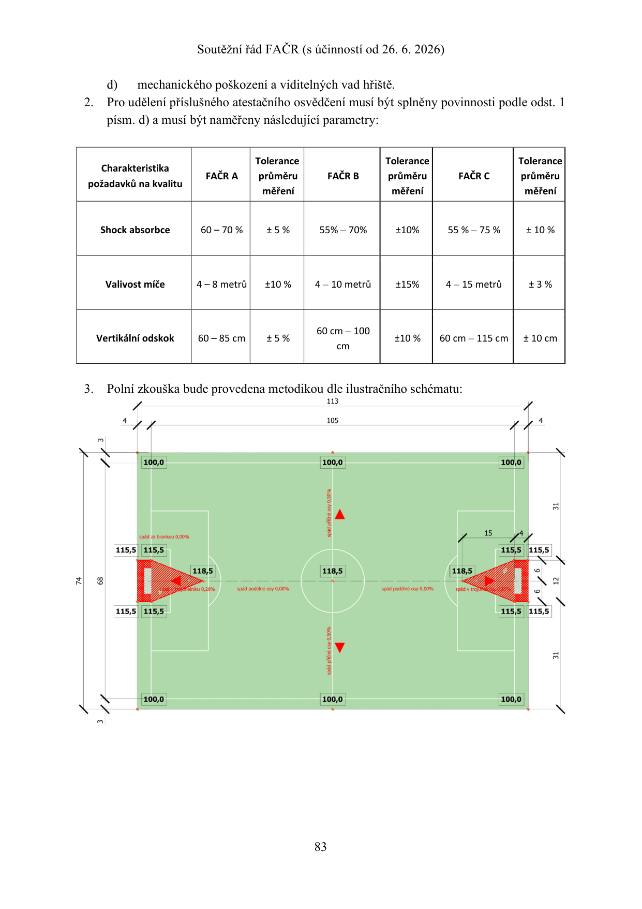

### Automatický OCR přepis obrazové stránky

> Pomůcka pro vyhledávání; může obsahovat chyby a nezachovává prostorové vztahy. Čísla a popisky ověř v obrázku nebo PDF.

```text
d) © mechanického poškození a viditelných vad hřiště.

2. Pro udělení příslušného atestačního osvědčení musí být splněny povinnosti podle odst. 1

písm. d) a musí být naměřeny následující parametry:

. Tolerance Tolerance Tolerance
Charakteristika “ a v x ov x o
a o . FAČR A průměru FAČR B průměru FAČR C průměru
požadavků na kvalitu ".—- —— ——
měření měření měření
Shock absorbce 60-70% +5% 55% — 70% +10% 55 %— 75% +10%
Valivost míče 4- 8metrů| +10% 4— 10 metrů +15% 4— 15 metrů +3%
DSL 60 cm — 100
Vertikální odskok 60— 85 cm +5% +10% 60cm- 115cm | +10cm
cm
3.. Polní zkouška bude provedena metodikou dle ilustračního schématu:
133
4 " 105 " 4

74
68
```

<a id="pdf-084"></a>

## PDF strana 84 / tištěná strana 84

[PDF, strana 84](sources/soutezni-rad-facr-2026-06-26.pdf#page=84)

### § 21

Vzorová dokumentace pro atestační řízení Ve vztahu k dokumentaci pro atestační řízení je žadatel oprávněn využít následující vzorovou dokumentaci.

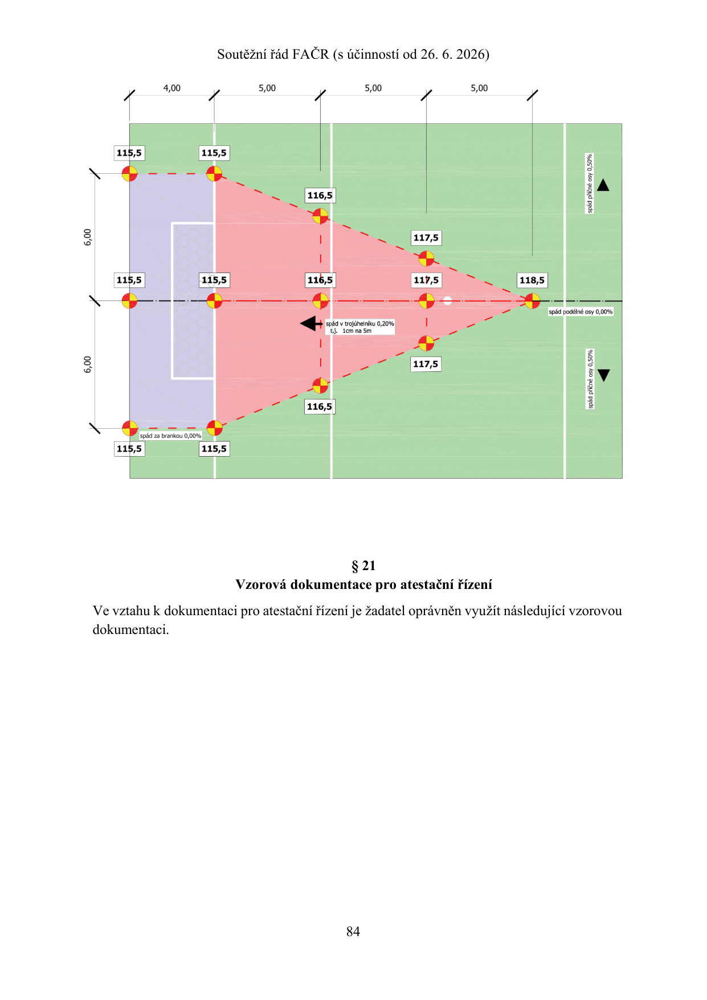

### Automatický OCR přepis obrazové stránky

> Pomůcka pro vyhledávání; může obsahovat chyby a nezachovává prostorové vztahy. Čísla a popisky ověř v obrázku nebo PDF.

```text
N
8
o

x

tj. 1cm na5m

8
o

N

spád za brankou 0,00%

821
Vzorová dokumentace pro atestační řízení

Ve vztahu k dokumentaci pro atestační řízení je žadatel oprávněn využít následující vzorovou
dokumentaci.
```

<a id="pdf-085"></a>

## PDF strana 85 / tištěná strana 85

[PDF, strana 85](sources/soutezni-rad-facr-2026-06-26.pdf#page=85)

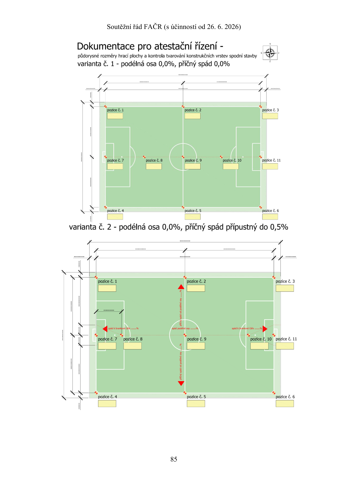

### Automatický OCR přepis obrazové stránky

> Pomůcka pro vyhledávání; může obsahovat chyby a nezachovává prostorové vztahy. Čísla a popisky ověř v obrázku nebo PDF.

```text
Dokumentace pro atestační řízení - i
půdorysné rozměry hrací plochy a kontrola tvarování konstrukčních vrstev spodní stavby 3 :
varianta č. 1 - podélná osa 0,0%, příčný spád 0,0% :
si ——... | l 0 LL
pozice č. 3
l
X f

N

varianta č. 2 - podélná osa 0,0%, příčný spád přípustný do 0,5%

pozice č 6
```

<a id="pdf-086"></a>

## PDF strana 86 / tištěná strana 86

[PDF, strana 86](sources/soutezni-rad-facr-2026-06-26.pdf#page=86)

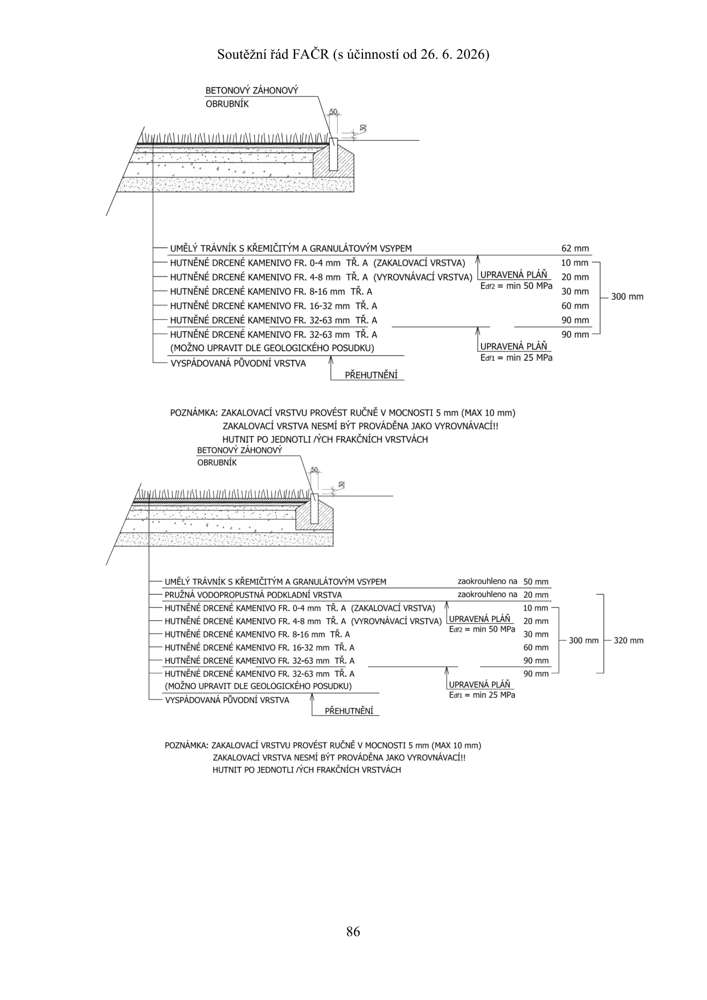

### Automatický OCR přepis obrazové stránky

> Pomůcka pro vyhledávání; může obsahovat chyby a nezachovává prostorové vztahy. Čísla a popisky ověř v obrázku nebo PDF.

```text
BETONOVÝ ZÁHONOVÝ
OBRUBNÍK
0
be)
u LAA =
/ [77000%7 a n : : AVG

— UMĚLÝ TRÁVNÍK S KŘEMIČITÝM A GRANULÁTOVÝM VSYPEM 62 mm
I— HUTNĚNÉ DRCENÉ KAMENIVO FR. 0-4 mm TŘ. A (ZAKALOVACÍ VRSTVA) 2, 10mm
-— HUTNĚNÉ DRCENÉ KAMENIVO FR. 4-8 mm TŘ. A (VYROVNÁVACÍ VRSTVA) LUPRAVENA PLAN © 20mm
I— HUTNĚNÉ DRCENÉ KAMENIVO FR. 8-16 mm TŘ. A Ear2 = min 50 MPa 29 m
— HUTNĚNÉ DRCENÉ KAMENIVO FR. 16-32 mm TŘ. A 60 mm
— HUTNĚNÉ DRCENÉ KAMENIVO FR. 32-63 mm TŘ. A 90 mm
(— HUTNĚNÉ DRCENÉ KAMENIVO FR. 32-63 mm TŘ. A 90 mm

(MOŽNO UPRAVIT DLE GEOLOGICKÉHO POSUDKU) UPRAVENÁ PLÁŇ
(O R 5 : Edf1 = min 25 MPa

VYSPÁDOVANÁ PŮVODNÍ VRSTVA

PŘEHUTNĚNÍ
POZNÁMKA: ZAKALOVACÍ VRSTVU PROVÉST RUČNĚ V MOCNOSTI 5 mm (MAX 10 mm)
ZAKALOVACÍ VRSTVA NESMÍ BÝT PROVÁDĚNA JAKO VYROVNÁVACÍ!!
HUTNIT PO JEDNOTLI ZÝCH FRAKČNÍCH VRSTVÁCH
BETONOVÝ ZÁHONOVÝ
OBRUBNÍK

(— UMĚLÝ TRÁVNÍK S KŘEMIČITÝM A GRANULÁTOVÝM VSYPEM zaokrouhleno na 50 mm
[— PRUŽNÁ VODOPROPUSTNÁ PODKLADNÍ VRSTVA zaokrouhleno na 20 mm
(— HUTNĚNÉ DRCENÉ KAMENIVO FR. 0-4 mm TŘ. A (ZAKALOVACÍ VRSTVA) 10mm
|— HUTNĚNÉ DRCENÉ KAMENIVO FR. 4-8 mm TŘ. A (VYROVNÁVACÍ VRSTVA) LUPRAVENÁ PLÁŇ © 20 mm
|— HUTNĚNÉ DRCENÉ KAMENIVO FR. 8-16 mm TŘ. A Ear2 = min 50 MPa 39 mm 300
(— HUTNĚNÉ DRCENÉ KAMENIVO FR. 16-32 mm TŘ. A 60 mm "m
— HUTNĚNÉ DRCENÉ KAMENIVO FR. 32-63 mm TŘ. A 90 mm
-— HUTNĚNÉ DRCENÉ KAMENIVO FR. 32-63 mm TŘ. A 90 mm

(MOŽNO UPRAVIT DLE GEOLOGICKÉHO POSUDKU)
— VYSPÁDOVANÁ PŮVODNÍ VRSTVA

PŘEHUTNĚNÍ

UPRAVENÁ PLÁŇ

Edf1 = min 25 MPa

POZNÁMKA: ZAKALOVACÍ VRSTVU PROVÉST RUČNĚ V MOCNOSTI 5 mm (MAX 10 mm)
ZAKALOVACÍ VRSTVA NESMÍ BÝT PROVÁDĚNA JAKO VYROVNÁVACÍ!!

HUTNIT PO JEDNOTLI /ÝCH FRAKČNÍCH VRSTVÁCH

86

300 mm

320 mm
```

<a id="pdf-087"></a>

## PDF strana 87 / tištěná strana 87

[PDF, strana 87](sources/soutezni-rad-facr-2026-06-26.pdf#page=87)

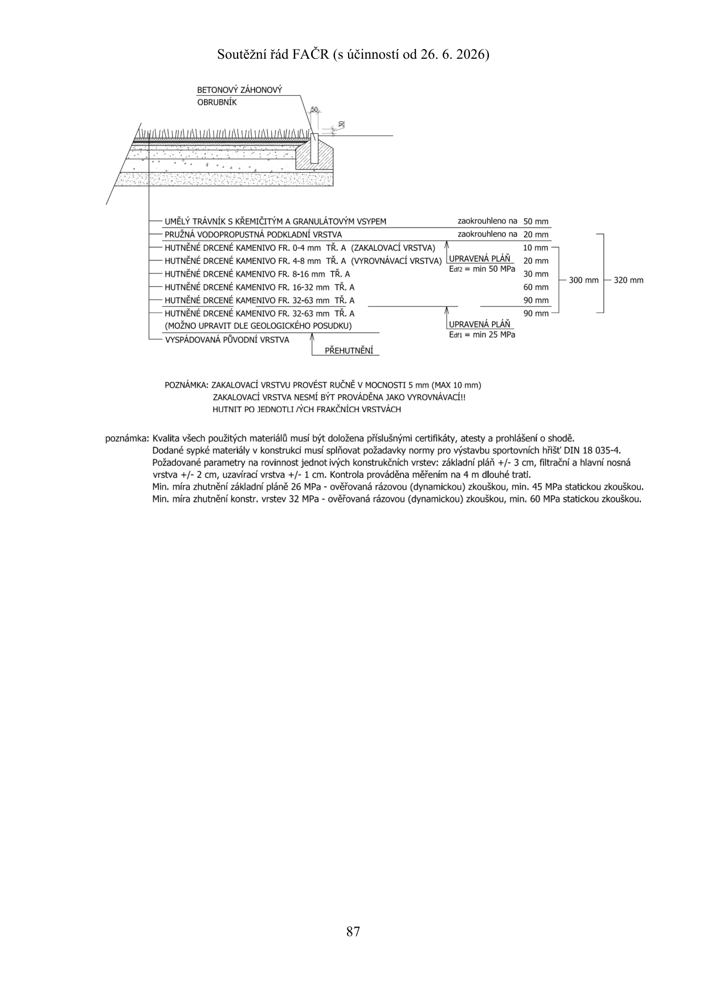

### Automatický OCR přepis obrazové stránky

> Pomůcka pro vyhledávání; může obsahovat chyby a nezachovává prostorové vztahy. Čísla a popisky ověř v obrázku nebo PDF.

```text
BETONOVÝ ZÁHONOVÝ
OBRUBNÍK

(— UMĚLÝ TRÁVNÍK S KŘEMIČITÝM A GRANULÁTOVÝM VSYPEM zaokrouhleno na 50 mm
[— PRUŽNÁ VODOPROPUSTNÁ PODKLADNÍ VRSTVA zaokrouhleno na 20 mm
(— HUTNĚNÉ DRCENÉ KAMENIVO FR. 0-4 mm TŘ. A (ZAKALOVACÍ VRSTVA) 10mm

|— HUTNĚNÉ DRCENÉ KAMENIVO FR. 4-8 mm TŘ. A (VYROVNÁVACÍ VRSTVA) LUPRAVENÁ PLÁŇ © 20mm
Edf2 = min 50 MPa

— HUTNĚNÉ DRCENÉ KAMENIVO FR. 8-16 mm TŘ. A 30 mm
vou , v 300 mm 320 mm
(— HUTNĚNÉ DRCENÉ KAMENIVO FR. 16-32 mm TŘ. A 60 mm
— HUTNĚNÉ DRCENÉ KAMENIVO FR. 32-63 mm TŘ. A 90 mm
-— HUTNĚNÉ DRCENÉ KAMENIVO FR. 32-63 mm TŘ. A 2, 90mm
(MOŽNO UPRAVIT DLE GEOLOGICKÉHO POSUDKU) (UPRAVENÁ PLÁN

Edf1 = min 25 MPa

— VYSPÁDOVANÁ PŮVODNÍ VRSTVA

PŘEHUTNĚNÍ

POZNÁMKA: ZAKALOVACÍ VRSTVU PROVÉST RUČNĚ V MOCNOSTI 5 mm (MAX 10 mm)
ZAKALOVACÍ VRSTVA NESMÍ BÝT PROVÁDĚNA JAKO VYROVNÁVACÍ!!
HUTNIT PO JEDNOTLI /ÝCH FRAKČNÍCH VRSTVÁCH

poznámka: Kvalita všech použitých materiálů musí být doložena příslušnými certifikáty, atesty a prohlášení o shodě.
Dodané sypké materiály v konstrukci musí splňovat požadavky normy pro výstavbu sportovních hřišť DIN 18 035-4.
Požadované parametry na rovinnost jednot ivých konstrukčních vrstev: základní pláň +/- 3 cm, filtrační a hlavní nosná
vrstva +/- 2 cm, uzavírací vrstva +/- 1 cm. Kontrola prováděna měřením na 4 m dlouhé trati.
Min. míra zhutnění základní pláně 26 MPa - ověřovaná rázovou (dynamickou) zkouškou, min. 45 MPa statickou zkouškou.
Min. míra zhutnění konstr. vrstev 32 MPa - ověřovaná rázovou (dynamickou) zkouškou, min. 60 MPa statickou zkouškou.
```
